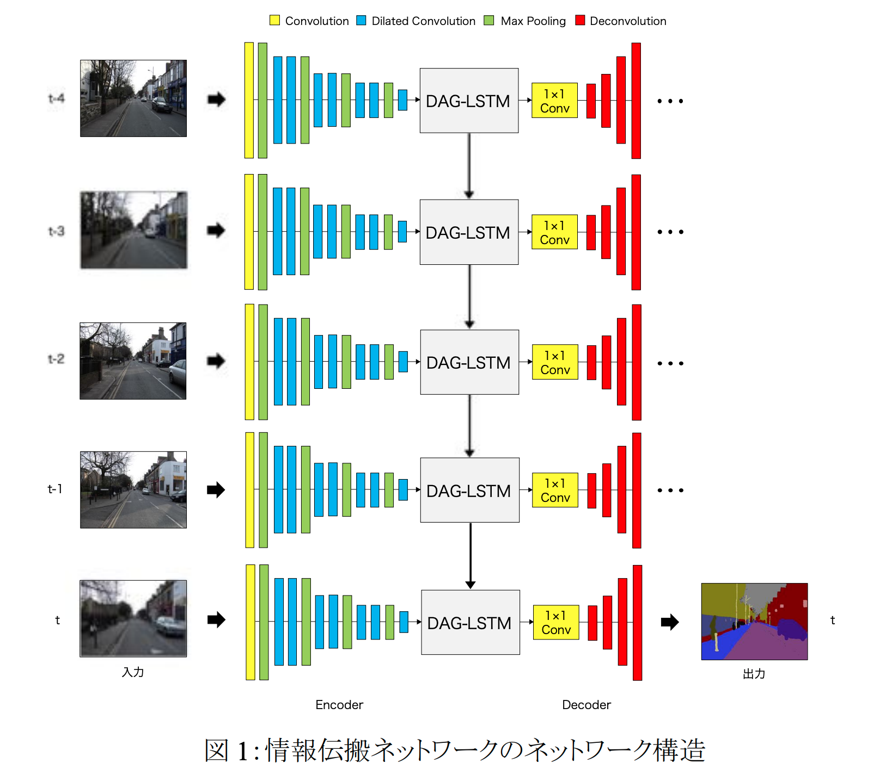
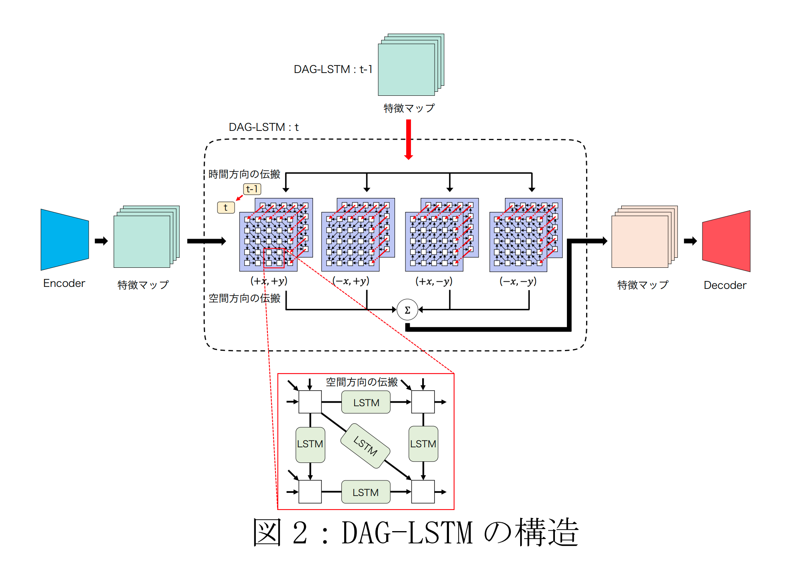
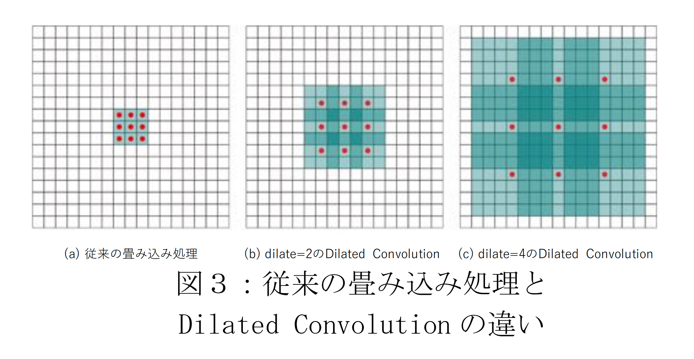
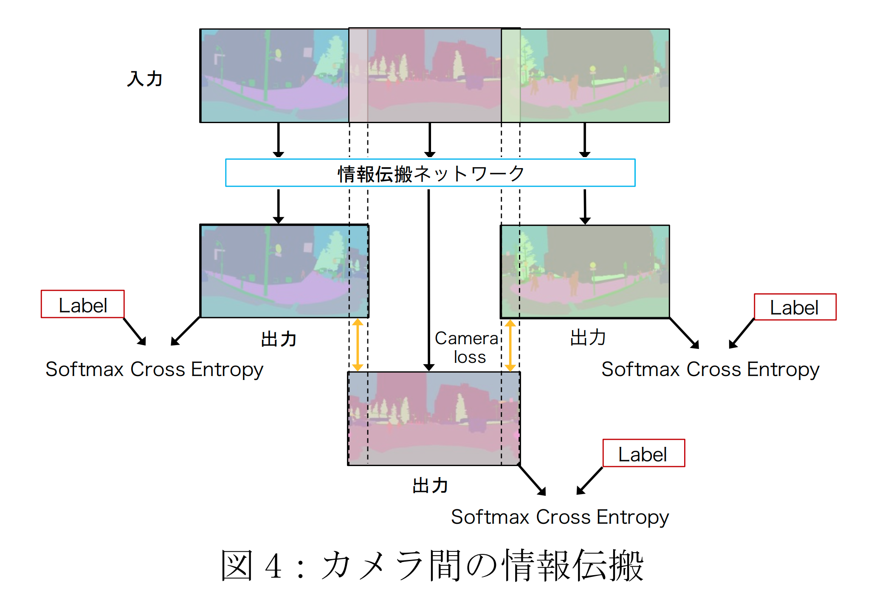
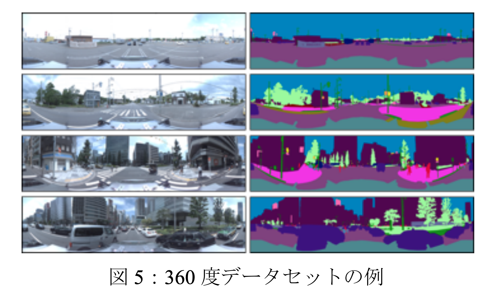
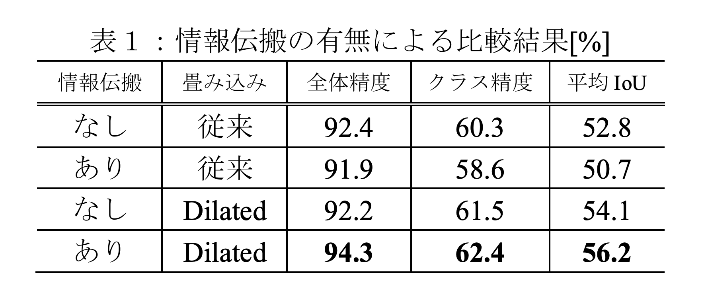
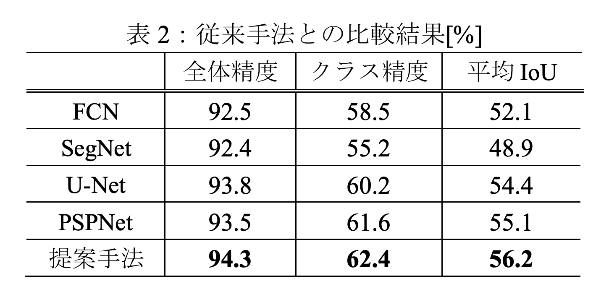
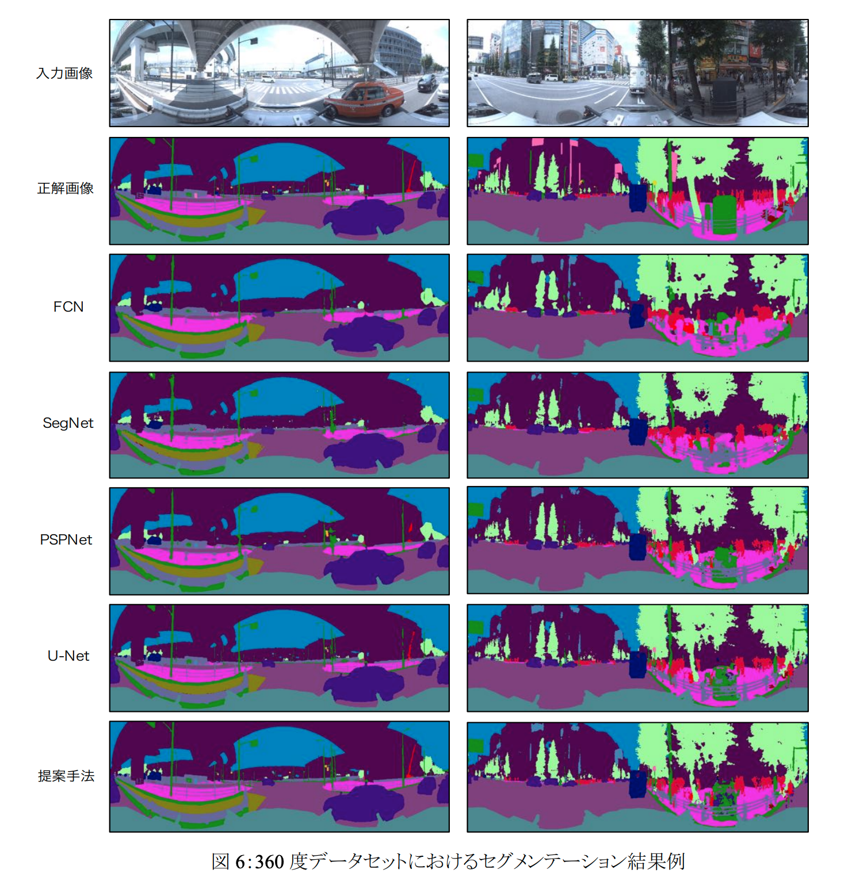
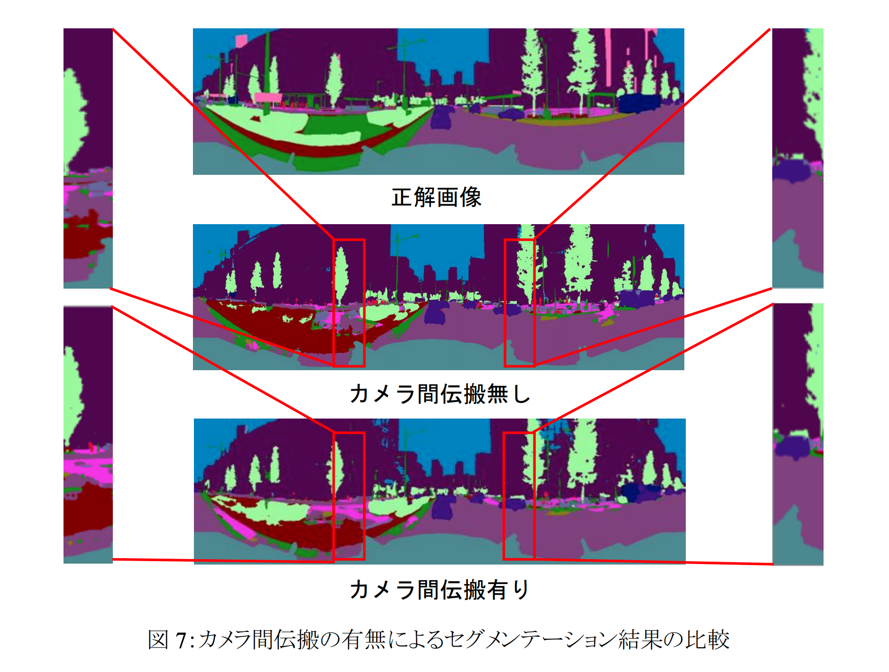
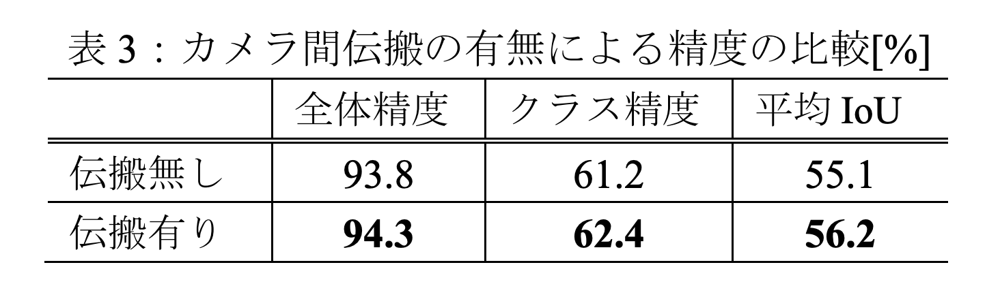

# [mprg](http://mprg.jp/data/MPRG/F_group/F20191205_goto.pdf) カメラ間の整合性を考慮した全周囲画像のセグメンテーション

- 著者
    - 後藤 圭汰 *1
    - 平川 翼 *1
    - 山下 隆義 *1
    - 藤吉 弘亘 *1
- 所属
    - 1: 中部大学

## どんなもの？

### 提案手法
左右、後方を含めた 360 度全周囲を対象とするセマンティックセグメンテーション手法を提案した。

- DAG-LSTM: 時間方向と空間方向に情報を伝搬させるネットワーク
- Dilated Convolution: 周囲の情報を広範囲に捉えることができる畳み込み処理

- カメラ間の情報伝達: 前後左右のカメラで撮影された画像を連結すると、各カメラの端部分でセグメンテーションの整合性が取れない

- Data Augmentation: 学習データを回転させたり、シフトさせたりして水増しする

## 先行研究と比べてどこがすごい？
### 提案手法
- LSTM と Dilated Convolution を組み合わせることによって、同一物体でもバリエーションが増加しセグメンテーションが困難になる問題が軽減されることを明らかにした。

## 技術や手法の肝は？
### 提案手法
RNN だと長期的な記憶ができないため LSTM を使用している。
Dilated Convolution が時間方向と空間方向の情報伝搬に良い働きをしている。

## どうやって有効だと検証した？

### 情報伝搬の有無による比較
時間情報及び空間情報の情報伝搬に加えて Dilated Convolution を使うことによりセグメンテーションの精度が向上する。

### 従来手法との比較結果
例にあげられている 4 つの従来手法よりもセグメンテーション精度が高いことがわかる。
道路や空と言った大きなクラスのセグメンテーションだけでなく、クレーン車や柵と言った小さな領域のクラスに対しても高精度なセグメンテーションができている。

### カメラ間伝搬の有無による比較
カメラ間の伝搬処理を導入することで、精度が向上する。

## 議論はある？
- 車載カメラのデータであれば、360 度でなくても精度が向上しそう。
- 360 度にすることでカメラの端部分で整合性が取れなくなったり、見え方が歪んだりするのであれば 360 度にするメリットがわからない（理解できない）
- 360 度画像と LiDAR の情報を組み合わせると周囲の情報がより正確に読み取れそう。

## 次に読むべきタイトルは？
- 画像と LiDAR の組み合わせで物体認識をしている研究
- 英語の論文で読みやすい物があれば
- 自動運転以外で技術が活用されている物
