# [\[arxiv\]](https://arxiv.org/abs/2002.05709) A Simple Framework for Contrastive Learning of Visual Representations

- 著者
    - Ting Chen *1
    - Simon Kornblith *1
    - Mohammad Norouzi *1
    - Geoffrey Hinton *1
- 所属
    - 1: Google Research, Brain Team

## どんなもの？

### SimCLR
- 視覚表現（画像特徴）を比較学習する（類似ペアを近くに非類似ペアを遠くに配置する特徴空間への写像を学習する）。
- データオーグメントの性質を活用して自己教師あり学習する（オーグメント適用前のデータが同じなら類似そうでないなら非類似とみなすことで、教師なしデータから教師データを疑似的に生成する）。
- データオーグメント・損失関数・訓練方法に関するベストプラクティスだけで（特殊なアーキテクチャやメモリバンクを用いずに）、従来より高品質な視覚表現を獲得する。

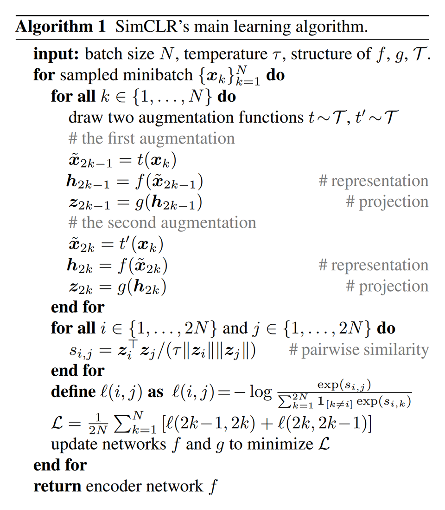

## 先行研究と比べてどこがすごい？
- ランダムクロップと色の歪みをセットにしたデータオーグメントが重要であることを発見した。
- 視覚表現と損失関数の間に非線形変換を導入することが重要であることを発見した。
- SimCLR で獲得した特徴抽出器の方が従来手法より性能が良いことを示した。

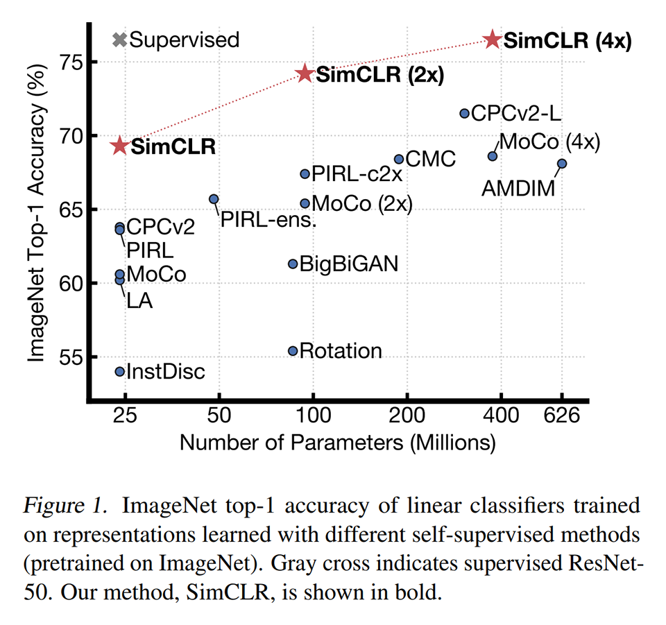

## 技術や手法の肝は？

### データオーグメントに関するベストプラクティス
- 比較学習のペアはどちらもデータオーグメントしたものにする。一方だけでは大幅に性能が低下する。比較学習のペアのどちらも同じ画像からランダムクロップすると、global-to-local 予測や local-to-neighbor 予測などを含むタスクになる。
- データオーグメントはランダムクロップと色の歪みだけも AutoAugment の性能を超える。ぼかしを加えると更によい。ランダムクロップだけでは悪い（同じ画像からクロップされた画像は色の分布が似ており色だけで識別できてしまうため、オーグメントで色の分布を壊す必要がある）。
- 教師あり学習時よりもデータオーグメントを強く適用する。

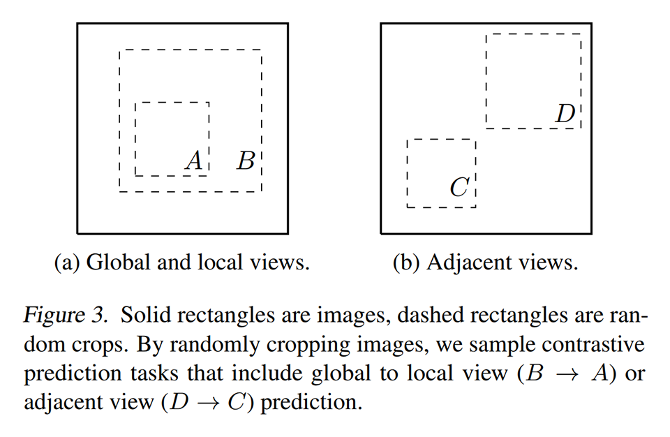
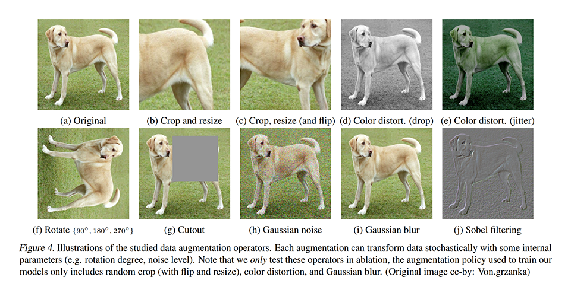
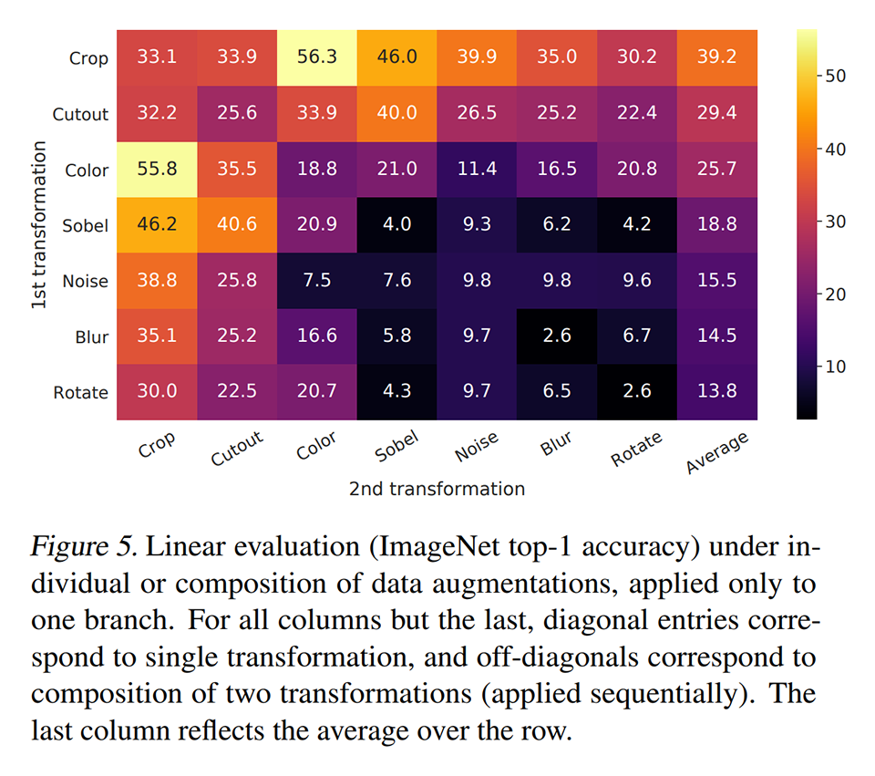
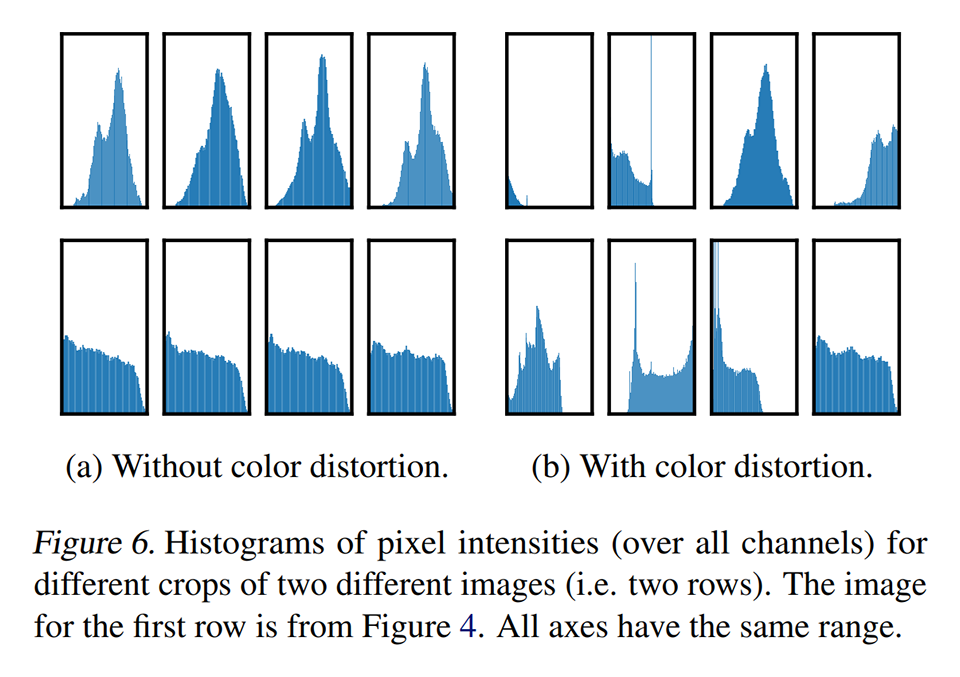
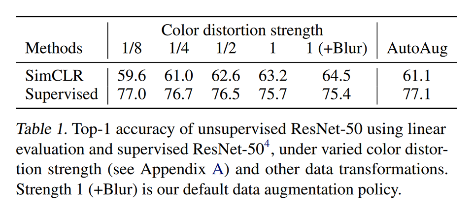

### 損失関数に関するベストプラクティス
- 損失関数は単なるクロスエントロピーでよい（バッチの中から類似ペアを選択する softmax と考える）。ただし、バッチサイズを大きくする（小さなバッチサイズで semi-hard negative mining するより良い）。
- 視覚表現と損失関数の間に、学習可能な非線形変換と L2 正規化（FC ⇒ ReLU ⇒ FC ⇒ L2-norm）を導入する。非線形変換の導入によって大幅に視覚表現の質が向上する。
- クロスエントロピーの温度パラメータは 0.1 くらいにする。

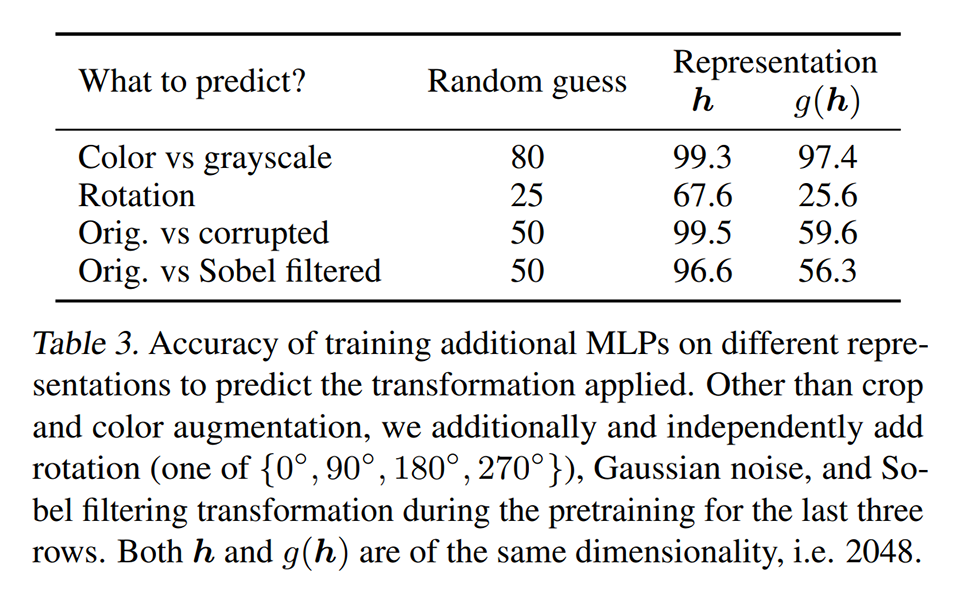
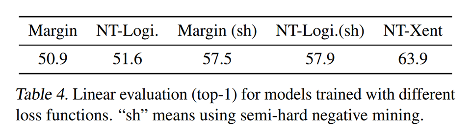
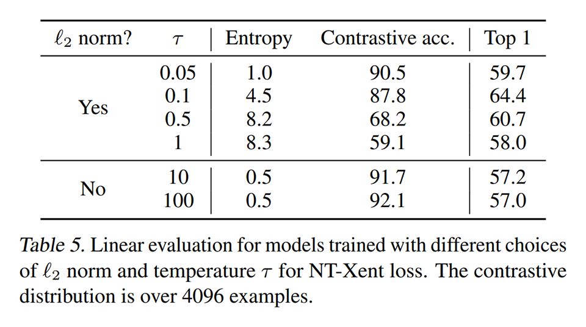

### 訓練のベストプラクティス
- 教師あり学習より時よりもバッチサイズと訓練ステップ数を大きくする。大きなバッチサイズでも安定して訓練できるようにするために LARS オプティマイザ（Layer-wise Adaptive Rate Scaling）を使う。

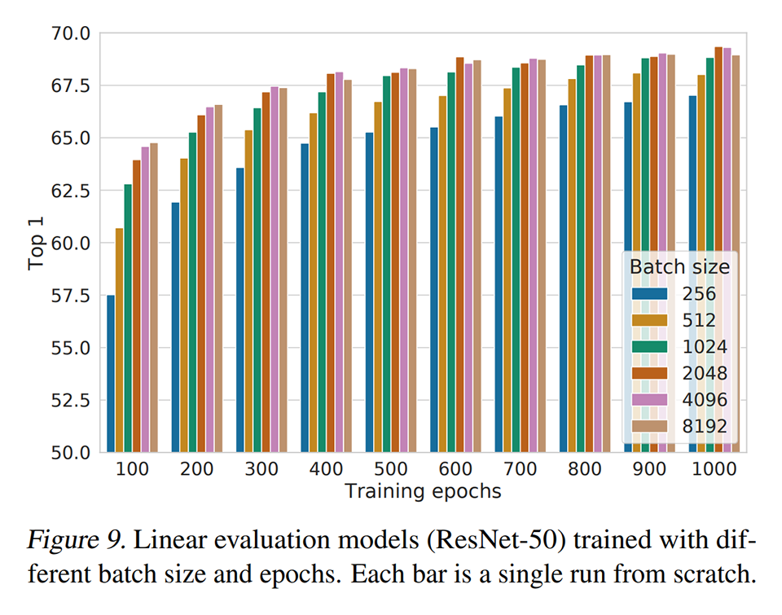

## どうやって有効だと検証した？

### 線形識別

### 半教師あり学習
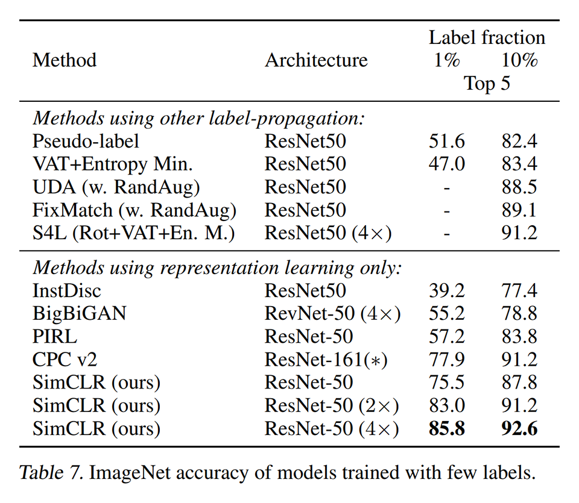

### 転移学習
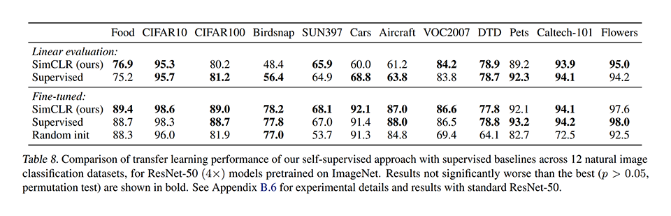

## 議論はある？
- 良い視覚表現の獲得のために従来の複雑な仕組（メモリバンクなど）は必要ない。
- シンプルな仕組が強力だと言うことは自己教師有り学習が過小評価されている可能性を示唆している。
- （私見）メモリ容量を節約するには MoCo の辞書キューはあった方がよいように思える。

## 次に読むべきタイトルは？
- [\[arxiv\]](https://arxiv.org/abs/1911.05722v2) Kaiming He, Haoqi Fan, Yuxin Wu, Saining Xie, Ross Girshick, "Momentum Contrast for Unsupervised Visual Representation Learning", arXiv, 2019.
