# Self-Distillation Amplifies Regularization in Hilbert Space
[https://arxiv.org/abs/2002.05715](https://arxiv.org/abs/2002.05715)
(まとめ @n-kats)

著者
* Hossein Mobahi
* Mehrdad Farajtabar
* Peter L. Bartlett
（Google Research と DeepMind）

# どんなもの？
蒸留すると何故か性能が上がる謎現象を理論的に扱った論文.

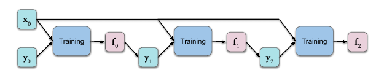

蒸留は、訓練済みのモデルの出力を教師にして訓練を行う方法。
大きなネットワークで訓練して、それを小さいネットワークに蒸留することを想定して登場した手法。
しかし、同じネットワークで蒸留（以下、自己蒸留）しても精度が上がる現象が報告されていた。

この論文では簡単な設定の下、理論的にこの説明を行った。

最適化問題の解の表示を線形代数で工夫する。データの数の分の大きさのある対称行列を対角化を利用する。
蒸留を行うときこの対角化が引き継がれる。

この結果、自己蒸留が次の回数以上意味がある（解が壊れない）という結論が出た。

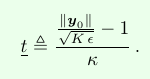

# 先行研究と比べてどこがすごい？
謎が解けた？

# 技術や手法の肝は？
＊タイトルにあるHilbert空間はまともに登場しない

## 問題設定
まず、次の最適化問題を考える。Lossが十分小さい状態で正則化を十分に小さくしようとする設定。

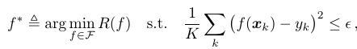

* R: 正則化項
* s.t.以降: 損失関数の値が十分小さいことを示す
* x_k: 入力
* y_k: x_kに対する教師
* K: データ数
* ε: 損失の許容値
* イコール三角: 定義の意味

正則化の部分は次の形とする。ただし、R\(f\)は非負で、0になるのはf=0のみ、uは対称。

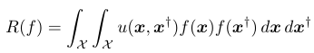

しかし、扱いづらいから、次のよく見る形で考える。

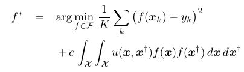

## 対角化
以下の線形作用素 L のグリーン関数 g を考える（Lの逆行列のようなもの）。

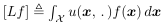

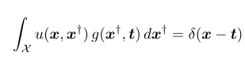

グリーン関数を使ってK×K行列（Kはデータの数）と各入力データをグリーン関数に部分的に適用したものを作る。

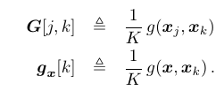

Gは正定値対称行列で、直行行列で対角化できる。

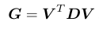

またこのとき、最適化の解が次のようになる。

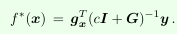

更に対角化すると次のようになる。

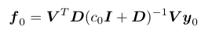

## 自己蒸留の効果
最適化の解の y の部分を関数の結果で置き換える。繰り返していくと次の式になる。Aは対角行列。

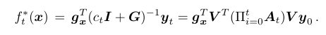

z_t = V * y_t とするとノルムに次の不等式が成り立つ。ただし、d_max, d_min は D の固有値の最大・最小。

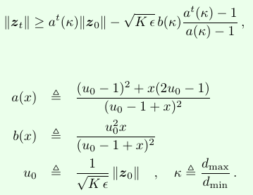

||z_t|| は減少していく。上の不等式の右辺が ||y_t|| が sqrt(Kε) より大きくなる場合を調べると、どこまで自己蒸留していいかが分かる。

# どうやって有効だと検証した？
* がんばって計算を追いかける
* グリーン関数のあたりを目をつぶる

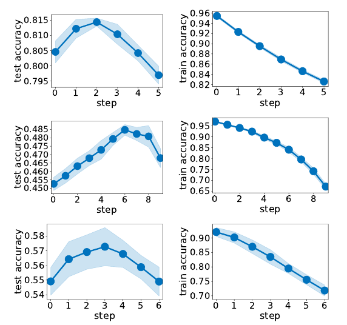

順に、
* Resnet50 + CIFAR-10
* Resnet50 + CIFAR-100
* VGG + CIFAR-100

# 議論はある？
他の正則化の場合は今後の研究で。

今回の議論はNTKによるNNの分析に似ている。NTKの他の議論から自己蒸留の話を進展させてくれるかも。

# 次に読むべき論文は？
* Neural tangent kernel: Convergence and generalization in neural networks  
  NTKの論文
* Noisy student  
  ImageNetのSoTA。蒸留みたいなことをしている
