# [\[arxiv\]](https://arxiv.org/abs/2002.05709) Unsupervised Learning of Depth, Optical Flow and Pose with Occlusion from 3D Geometry

- 著者
    - Guangming Wang *1
    - Chi Zhang *1
    - Hesheng Wang *1
    - Jingchuan Wang *1
    - Yong Wang *2
    - Xinlei Wang *3
- 所属
    - 1: Department of Automation, Shanghai Jiao Tong University
    - 2: Beijing Institute of Control Engineering
    - 3: DeepBlue Academy of Sciences

## どんなもの？
教師無なし Visual SLAM

## 先行研究と比べてどこがすごい？
- 完全教師なしなのに精度が高い（教師なしと言いながら、動体マスクの教師が必要となる Struct2Depth とは違う）。

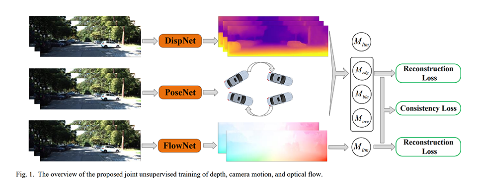

## 技術や手法の肝は？
凄く丁寧にオクルージョンを取り扱っている。
オクルージョンマスクという考え方を導入し、カメラ姿勢が変化しても見えている静止ピクセルだけを使って、復元損失を求めている。
復元損失の平均値よりも大きい損失をノイズ（移動ピクセル）と考えて除外し、静止ピクセルを求めている。

### 復元損失の求め方
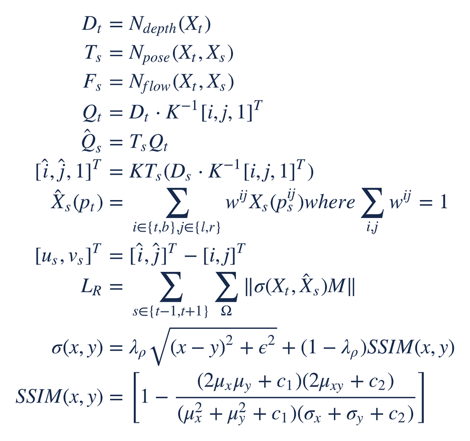

### オクルージョンマスクの考え方
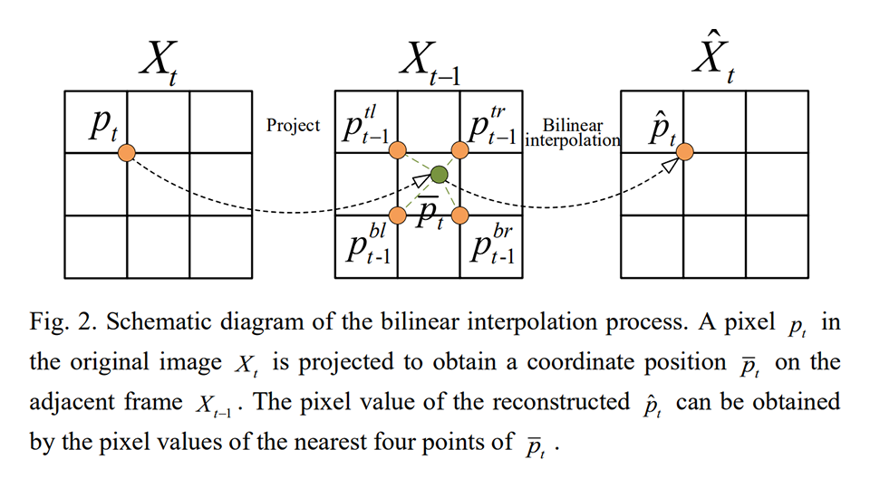
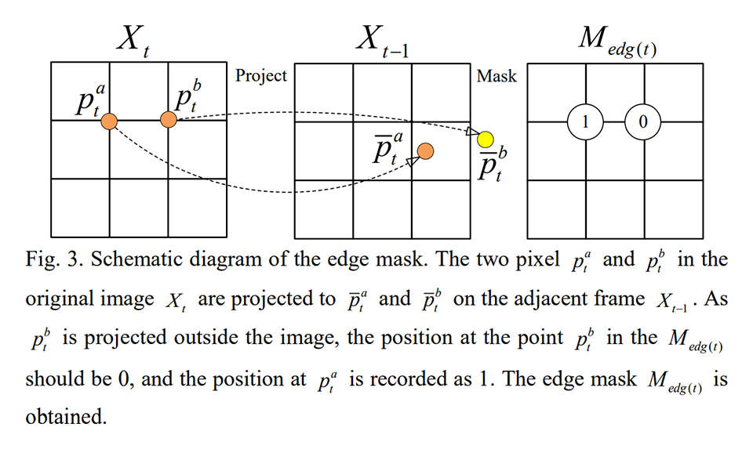
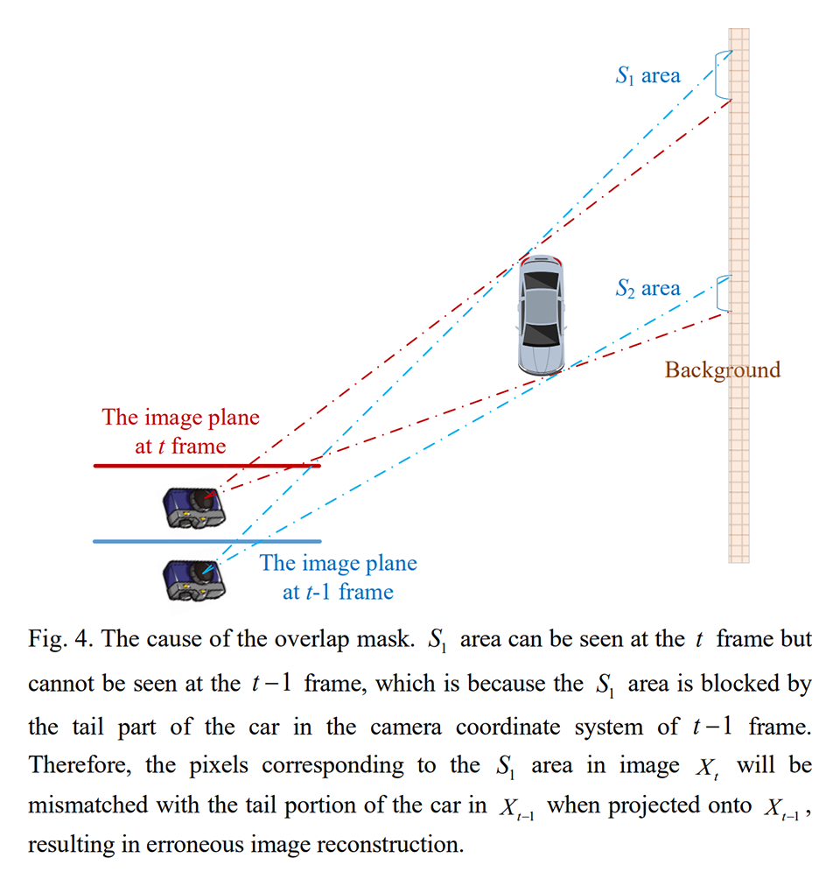
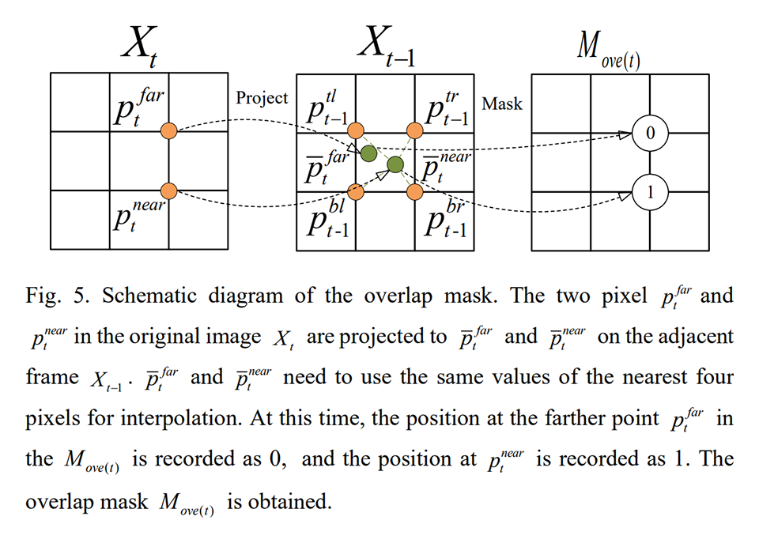
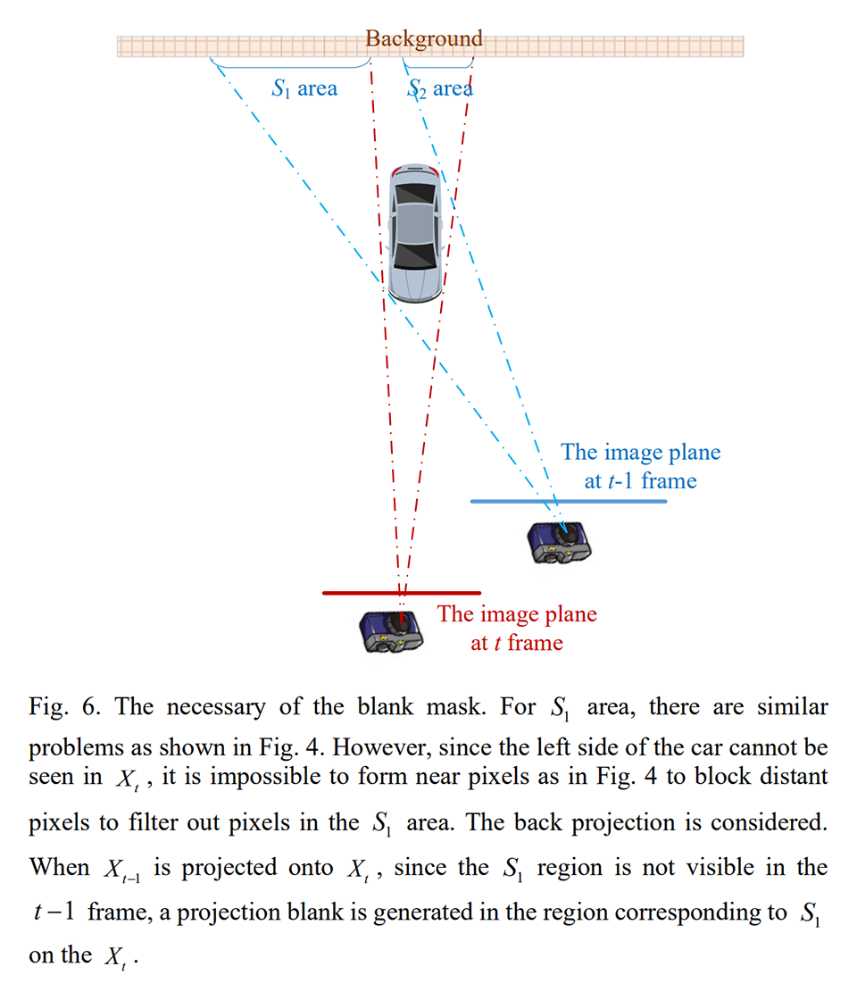
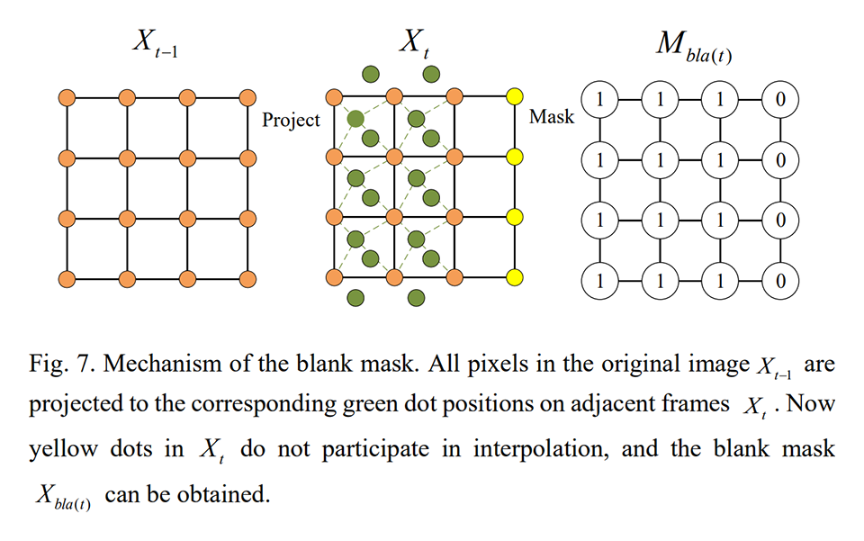
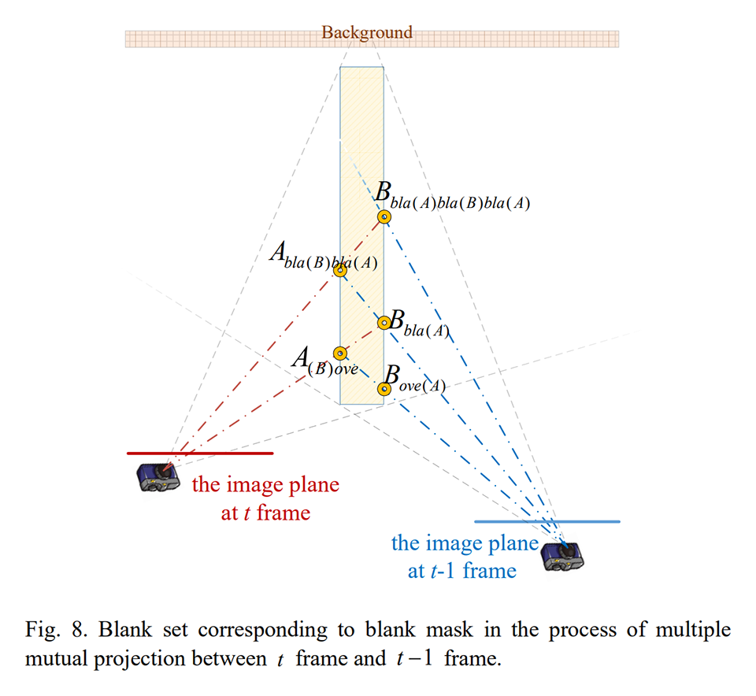

### 訓練方法
+ Cityscapes dataset を用いて Ndepth と Npose をスクラッチから学習する（RTX 2080 Ti, 20 時間, 40,000 ステップ）。
+ KITTI dataset を用いて Ndepth と Npose をファインチューニングする（RTX 2080 Ti, 70 時間, 149,850 ステップ）。
+ Ndepth と Npose で計算したオプティカルフローを教師として Nflow を学習する（RTX 2080 Ti, 90 時間, 190,000 ステップ）。恐らく、Ndepth と Npose も一緒にファインチューニングしている。

## どうやって有効だと検証した？

### 既存手法との比較
Cityscapes dataset（事前学習用）と KITTI dataset（ファインチューニング用）を使って訓練し、既存手法と比較した。

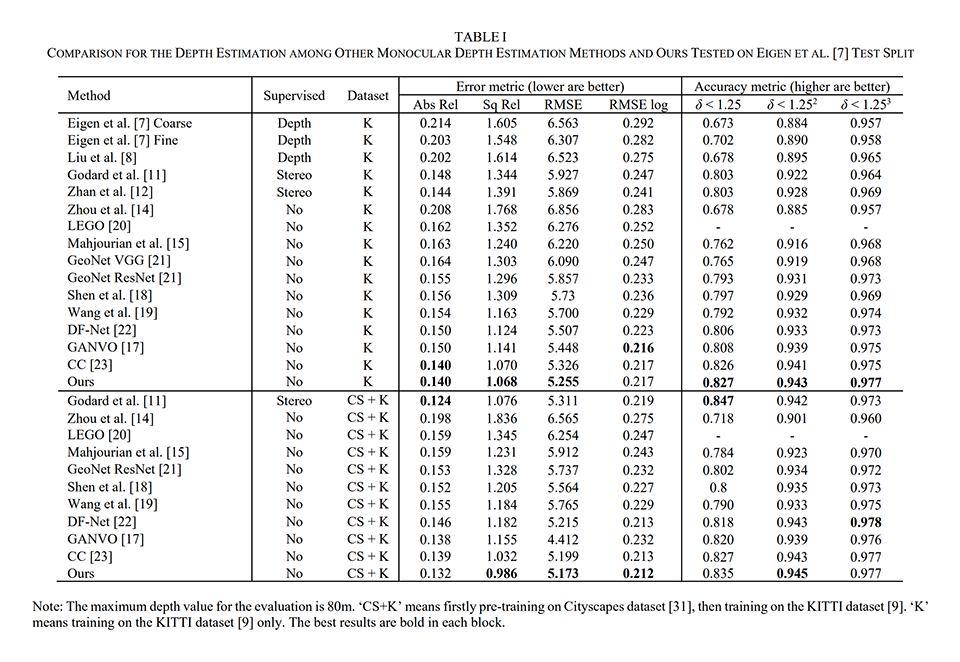
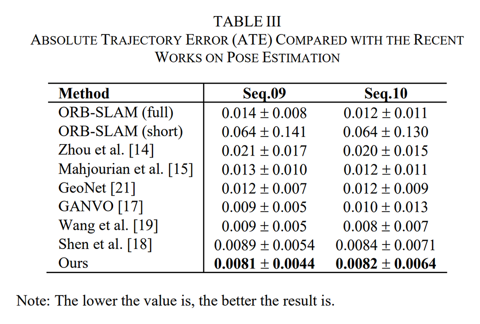
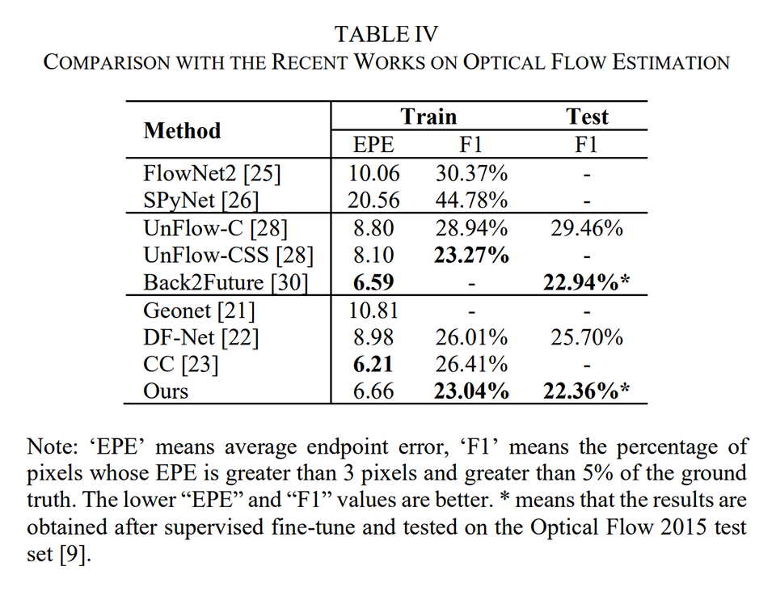
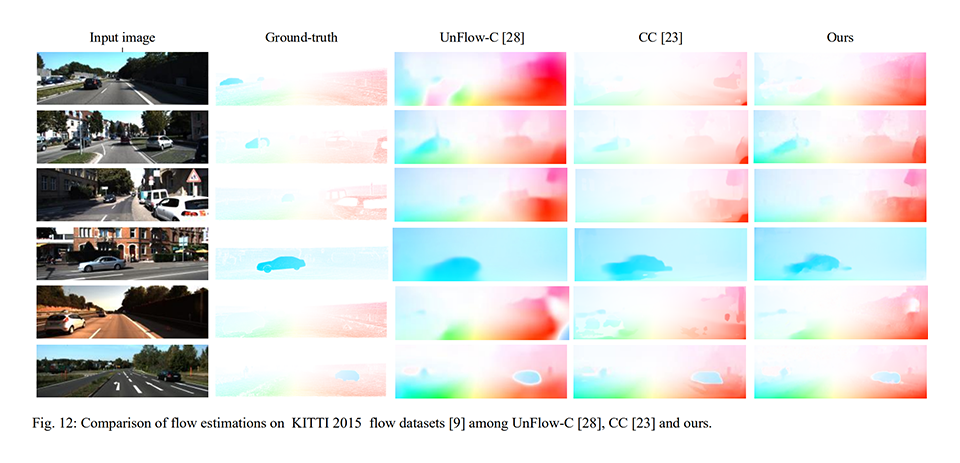

### 切除実験
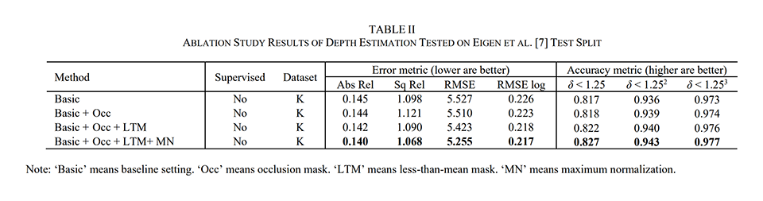
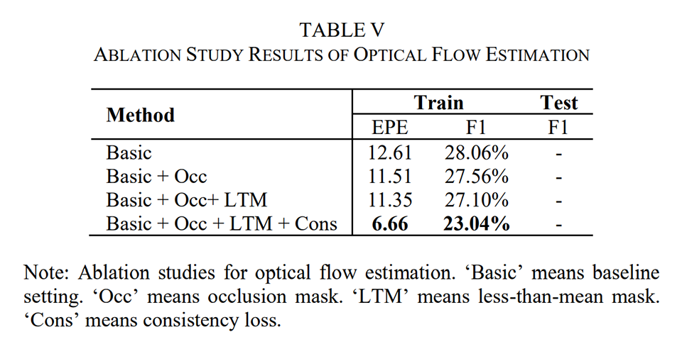
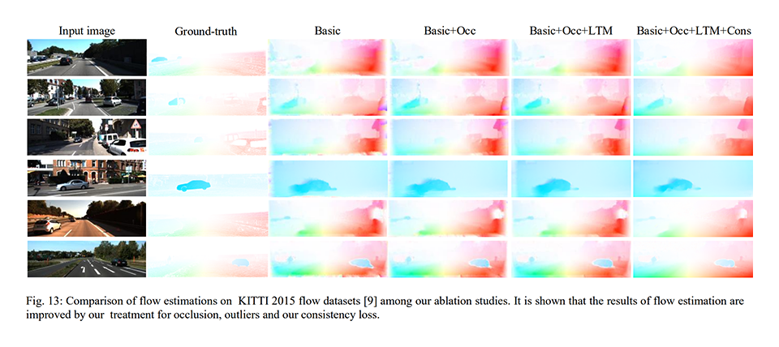

## 議論はある？
- 特になし

## 次に読むべきタイトルは？
