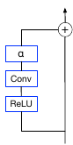
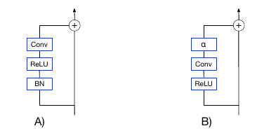
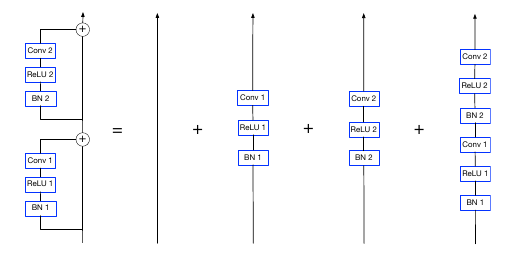
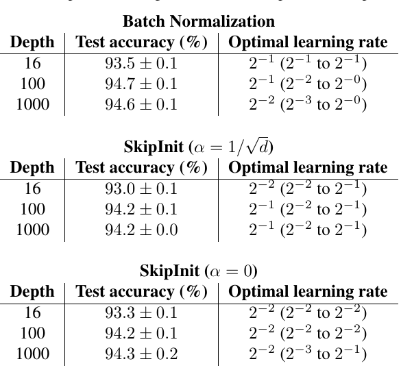
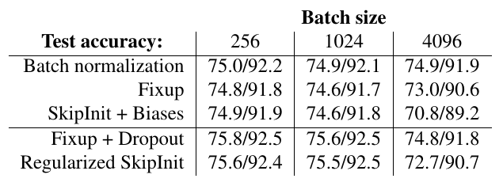

# Batch Normalization Biases Deep Residual Networks Towards Shallow Paths
[https://arxiv.org/abs/2002.10444](https://arxiv.org/abs/2002.10444)
(まとめ @n-kats)

著者
* Soham De
* Samuel L. Smith

（DeepMind）

# どんなもの？
BatchNormalization無しで訓練する方法としてSkipInitを提案

# 先行研究と比べてどこがすごい？
* BatchNormalizationは小さいバッチサイズで上手く機能しない
* Fixupは層の深さによって初期値のスケールをコントロールする手法（設定が面倒くさい）

SkipInitはFixupと同じモチベーションながら、設定が簡単

# 技術や手法の肝は？
図のようなResBlcokでresidual branchの最後にα倍する処理を入れるだけ（αは0で初期化がおすすめ）

## ResBlockと分散
ResBlockがd個あると経路の組み合わせが2^dあることになる。

例えば、2個の場合次の図のようになる。
 

平均の深さはd/2で、実質的な深さはこれと考えるべき。とは言え、もっと深いネットワークが使えている。
これは、途中の層の分散がいい感じになっているからと考えられている。例えば、skip pathとresidual branchの分散をそろえる方法がとられる（Heの初期化）。

noramlizationが無い場合、ResBlock毎に分散が倍になっていく。normalizationがあるとresidual branchの分散が1に固定され、深さのオーダーで分散の増加が収まる。
Fixupもresidual branchの分散をコントロールすることを狙っている。

## Fixupの手法の整理
Fixupでは次を実施する

1. 最終層やresidual blockの最終層の初期値を0にする
2. residual blcokの中の畳み込みはHeの初期化してd^{-1/(2m-2)}倍する
3. residual blcokの最後にスカラー倍する（初期値1）
4. 諸々の層の前でバイアスを足す（初期値0）

実は、1と2の片方があればいい。Fixupの手法を順に次のように解釈

1. 初期のResBlockはidentityにする
2. 1 / √d 以下の値をかける
3. 収束しやすいようにするテク
4. 必須

## Regularized SkipInit
おすすめセットは次
* SkipInit(0初期値)
* 畳み込みの後にバイアスを足す
* 最終層前でDropoutを使う（検討の余地あり）

L2正則化は不要ということも検証済み（ただし精度が少し落ちる）

# どうやって有効だと検証した？
wide resnetを変形して検証。

## SkipInitで深いネットワークが訓練できること

（CIFAR-10で評価）

## 亜種との比較
1で初期化するパターン、1/√2で固定するパターン、L2正則化を除くパターン

（CIFAR-10で評価）

## バッチサイズを大きくする

（ImageNetで評価）

# 議論はある？
BatchNormalizationの効果は、

1. とても深いResNetが訓練できる
2. 大きなバッチサイズでの訓練を可能にする
3. 正規化の効果がある

1は浅いパス（identityを多く通るパス）が効果的に働いている。これはSkipInitで簡単に実現できる。

2の効果はSkipInitでは実現できず課題。3の効果は別の方法で実現できるから重要じゃない。

# 次に読むべき論文は？
* [Fixup](https://arxiv.org/abs/1901.09321)
* [ReZero](https://arxiv.org/abs/2003.04887)
* [FRN](https://arxiv.org/abs/1911.09737)
