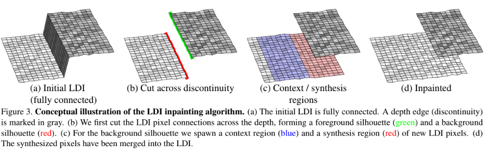

3D Photography using Context-aware Layered Depth Inpainting
===

[https://drive.google.com/file/d/17ki_YAL1k5CaHHP3pIBFWvw-ztF4CCPP/view](https://drive.google.com/file/d/17ki_YAL1k5CaHHP3pIBFWvw-ztF4CCPP/view)

- 著者
  - Meng-Li Shih *1 *2
  - Shih-Yang Su *1
  - Johannes Kopf *3
  - Jia-Bin Huang *1
- 所属
  1. Virginia Tech
  2. National Tsing Hua University
  3. Facebook

---

## どんなもの？

+ 1枚のRGB-D画像をもとに、前景によって隠れている背景を高品質に補完しながら、3D画像(LDI: Layered Depth Image)を生成する手法
+ 生成されたLDIは、標準的なグラフィックエンジンを利用して、小さな計算量でレンダリングすることが出来る

## 先行研究と比べて何がすごい？

+ 従来と比較し、より自然な見た目でオクルージョンが発生している部分を補完出来る

  

+ 1枚のRGB-D画像のみを使用するため、適用範囲が広い(CNNでDepthを推定することで、RGB画像にも適用可能)

  

+ オクルージョンが発生している部分の補完を行う際、色情報だけでなく、Depth情報の補完も行う

---

## 技術や手法の肝は？

+ 3D画像表現として、[Layerd Depth Image](https://grail.cs.washington.edu/wp-content/uploads/2015/08/Shade98.pdf)を利用する

    + Layered Depth Image

        + スパースなRGB-D画像の表現方法

            + 各ピクセルは、隣接する4ピクセル(左、右、上、下)のポインタと、色、深度の情報を持つ

            + 深度が連続していない場合は、対応する方向のポインタを持たない

                (平面や曲面にあるピクセルは上下左右4方向のポインタを持つが、前景と背景の境界にあるピクセルは、特定の方向のポインタを持たない)

    + スパースであるため、メモリやストレージの節約に効果的な表現

    + メッシュ表現に変換可能であり、メッシュ表現にしてしまえば、一般的なグラフィックエンジンでレンダリング出来るため汎用性が高い

    + 奥行き情報として、予めレイヤー数を決め打ちする必要がないため、複雑な深度情報を持つシーンにも対応可能

    

+ オクルージョン部分の補完を行う際、画像全体ではなく、深度の境界部分の情報のみをソースにする
    
    

    

    

+ オクルージョン部分の補完を行う際、深度と画像の色情報に一貫性が保たれるよう、３ステージの補完を行う
    
    

## どうやって有効だと検証した？

- 同一の画像に対するFacebook 3D Photoの出力と提案手法の出力を定性的に比較
  

- MPIベースの手法との定性的な比較

  - RealEstate10K(動画とカメラ姿勢がセットになったデータセット)を利用
  - MPIベースの手法と提案手法のそれぞれで、0秒目のフレームから10秒目のフレームを生成
  - 生成された10秒目のフレームと実際の10秒目のフレームから、SSIM(類似度), PSNR(劣化度), LPIPSを算出・比較

  

- 切除実験

---

## 議論はある？

+ 特になし

---

## 次に読むべき論文は？

+ 特になし
