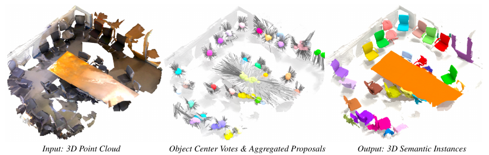
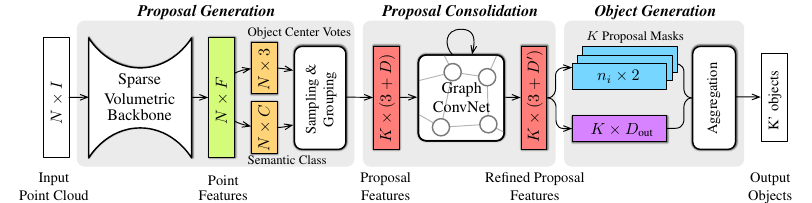
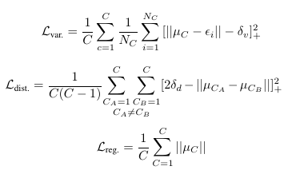
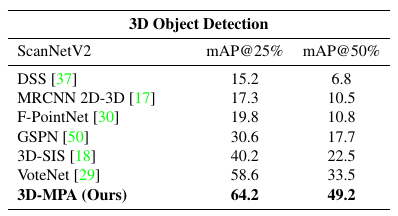
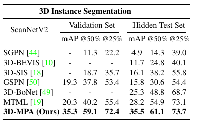
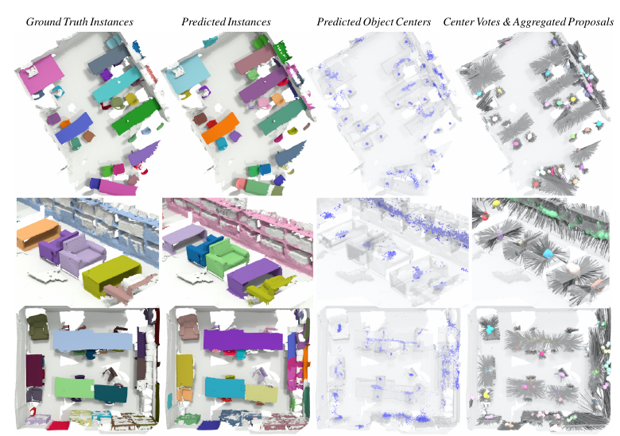
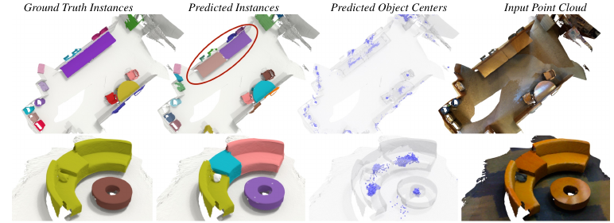
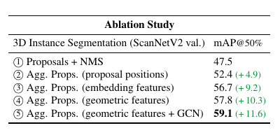

# 3D-MPA: Multi Proposal Aggregation for 3D Semantic Instance Segmentation
[https://arxiv.org/abs/2003.13867](https://arxiv.org/abs/2003.13867)
(まとめ @n-kats)

著者
* Francis Engelmann
* Martin Bokeloh
* Alireza Fathi
* Bastian Leibe
* Matthias Nießner
Google（アーヘン工科大学のインターン生）＋ミュンヘン工科大学の人たち

# どんなもの？
3次元点群版のインスタンスセグメンテーションで、大幅に精度改善できた手法。

* 点に対応する物の中心を予測する
* 画像でするようなルールベースのNMSはせず、学習ベースの統合を行う
* GCN等を利用

# 先行研究と比べてどこがすごい？
## 先行研究
* 画像の場合、Mask-RCNNだが、3次元点群になるとすぐに使えない
* proposal-freeな手法（アンカー等を使わない）の先行研究がある（discriminative loss）
* discriminative loss を使った3Dへの応用が既になされている

## 先行研究との差
feature map（3Dでこう呼んでいいか不明）をオブジェクトに分ける部分に工夫。

先行研究では
* 特徴ベクトルをクラスタリング（組み合わせが多くて辛い）
* 3Dのbounding boxを回帰で求める
* 3Dのbounding boxの中心を回帰で求める

この手法では、bounding boxは使わず、クラスタリングの効率化をするような方法を取っている。
単にクラスタリングするだけでなく、オブジェクトのマスクを生成する。

# 技術や手法の肝は？
## メタアーキテクチャ

* 点群を入力（座標・色等の属性が各点に）
* 1つ目のブロック（Proposal Generation）
  * Sparse Volumetric networkで特徴ベクトル化する
  * そこから、各点で物体の中心座標・クラスを認識
  * グループ化
* 2つ目のブロック（Proposal Consolidation）
  * GCNでグループの特徴ベクトルを修正
* 3つ目のブロック（Object Generation）
  * 各ブロックでマスクを作成
  * ブロックの統合

## 損失関数
* 1つ目のブロック
  * L_cent.pt: 中心座標回帰
  * L_sem.pt: クラス
* 3つ目のブロック
  * L_obj: 物体かどうか
  * L_sem: クラス
  * L_agg: 統合用の損失
  * L_mask: それぞれの物体のマスク

L_aggは、2パターン考えている
* 幾何的な量ベース: 中心と半径の誤差のsmooth l1（こっちの方が1%くらい良い）
* 特徴量埋め込みベース: discriminative loss

## グループ化
もとの点群からランダムにサンプリングする。およそ、1,000,000から500までランダムに減らす。
それで十分にFarthest Point Samplingよりも効果的。

## 訓練環境
TitanXp1台で実験（メモリ12GB、バッチサイズ4、15万ステップ）。データ数は少ないので、適当に切り出して使う。

# どうやって有効だと検証した？
ScanNetV2・S3DISデータセットで検証（大幅改善）

## ScanNetV2
屋内データ。教師1201シーン評価312シーン

### スコア

### 例

### 失敗例

分け方が教師と違ってダメになっているが、実際の分け目で分かれているため許していいような結果。

## S3DIS
屋内データ。6つの広いエリアの教師

## 手法の比較

上から
* 旧手法風
* 各点で認識した中心を利用
* グループで認識した中心を利用（特徴量埋め込みベース）
* グループで認識した中心を利用（幾何的な量ベース）
* 2ブロック目を入れた場合

# 議論はある？
グループにしてから認識する部分が精度改善に効いている（私見「2-stageの物体検出に似ている」）

単純な3Dの検出の話題もあるけど、トラッキング等の課題もある。

## 私見
ランダムサンプリングでグループを作るあたりも面白いアイデア

# 次に読むべき論文は？
* 1ブロック目のネットワークについて
  * [4D Spatio-Temporal ConvNets](https://arxiv.org/abs/1904.08755)
  * [3D Semantic Segmentation with Submanifold Sparse Convolutional Networks](https://arxiv.org/abs/1711.10275)

