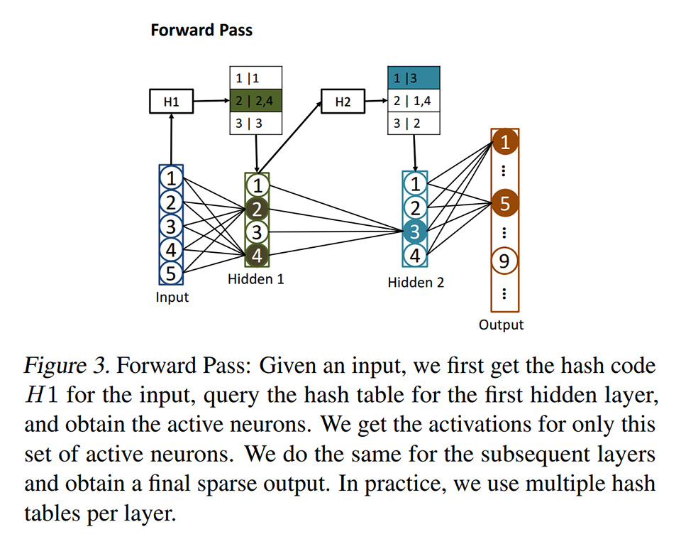
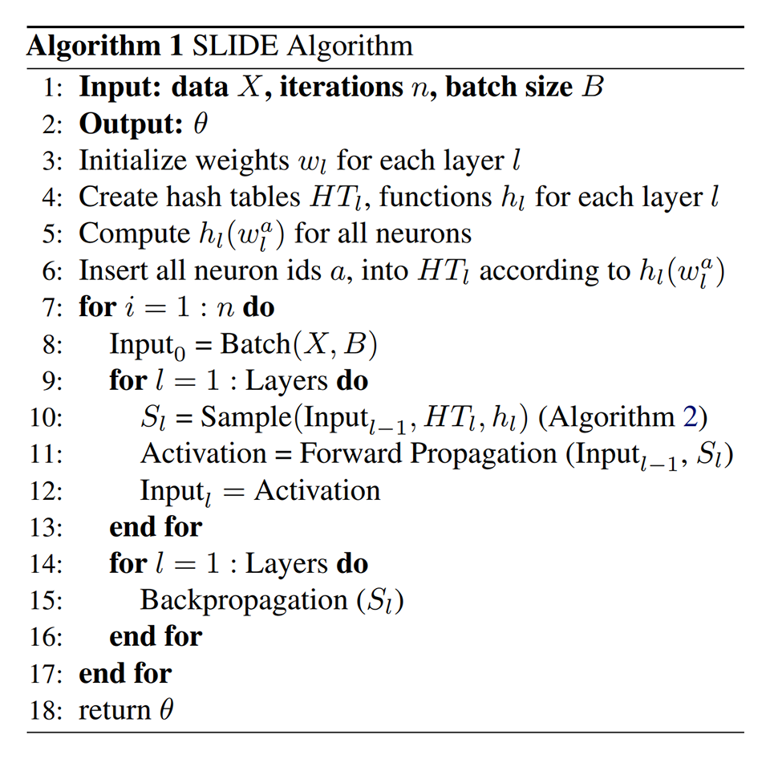
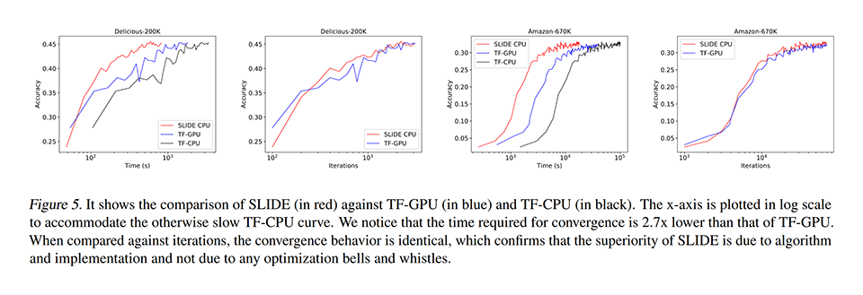
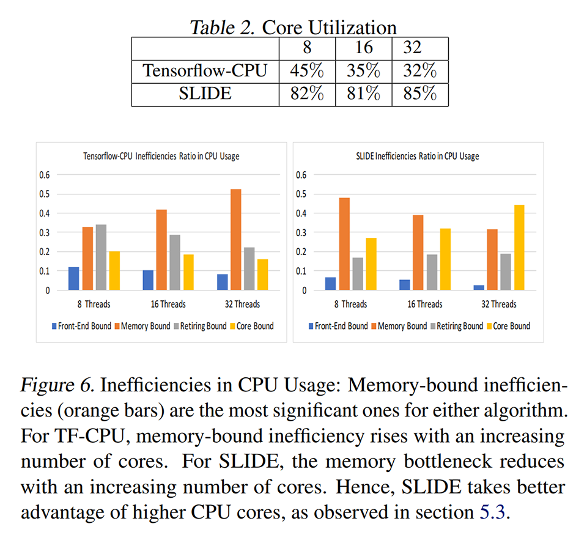
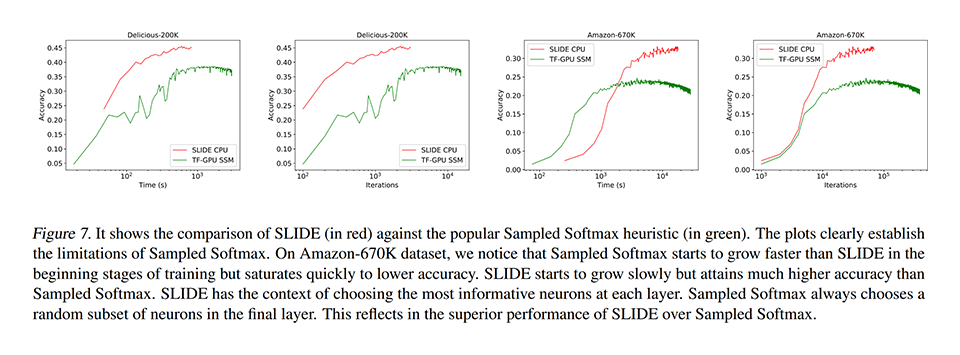
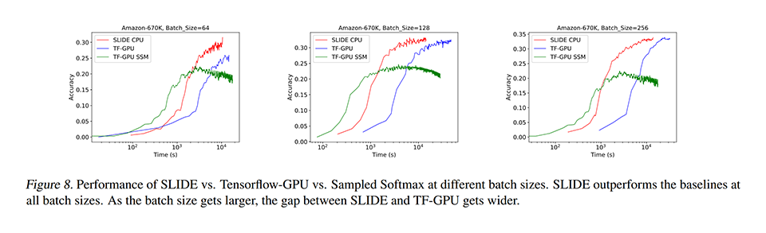
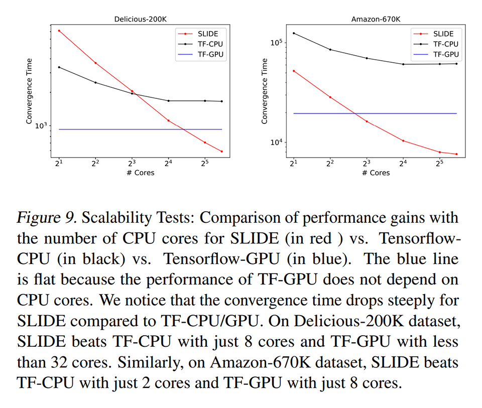
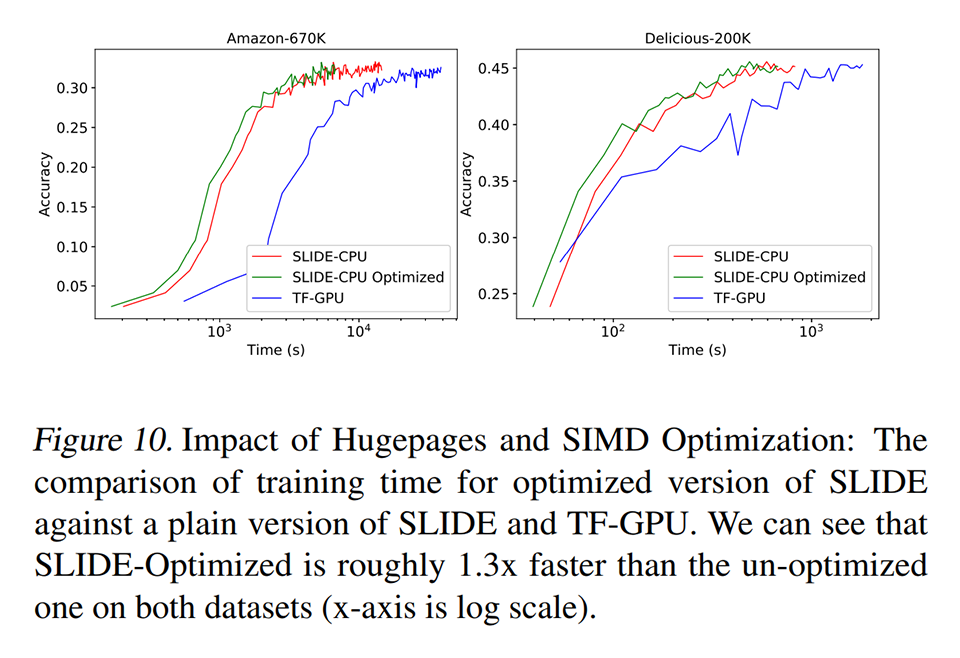

# [\[arxiv\]](https://arxiv.org/abs/1903.03129v2) SLIDE : IN DEFENSE OF SMART ALGORITHMS OVER HARDWARE ACCELERATION FOR LARGE-SCALE DEEP LEARNING SYSTEMS

- 著者
    - Beidi Chen *1
    - Tharun Medini *1
    - James Farwell *2
    - Sameh Gobriel *2
    - Charlie Tai *2
    - Anshumali Shrivastava *1
- 所属
    - 1: Rice University
    - 2: Intel Corporation

## どんなもの？
### SLIDE (Sub-LInear Deep learning Engine)
ニューラルネットワークの学習と推論を高速化する確率的近似計算手法

## 先行研究と比べてどこがすごい？
SLIDE on CPU は従来計算手法より速い（Tensorflow on GPU の 3.5 倍、Tensorflow on CPU の 10 倍）。しかも同等以上の精度を達成している。
似たような価格・消費電力のハードウェアを使って比較している。

- CPU: Intel Xeon E5-2699A v4 (22-core/44-thread, 2.40GHz) × 2
- GPU: NVIDIA V100 Volta 32GB GPU

## 技術や手法の肝は？
### LSH を用いた適応的 DropOut

## どうやって有効だと検証した？
凄くスパースなデータを含むデータセット（効果を測定するのに適したもの）を使って比較した。

### 素朴な計算手法 on GPU との性能の比較

### Tensorflow on CPU との CPU 使用率の比較

### Sampled Softmax on GPU との性能の比較
Sampled Softmax は DropOut で生き残ったニューロンだけでスパースな内積計算（出力層ではスパースな Softmax）する手法である。

### バッチサイズに対する頑健性の比較
SLIDE はバッチサイズが小さくても精度が悪くならない。

### コア数ごとの計算時間の比較
SLIDE は並列分散性に優れている。

### Hugepages and SIMD Optimization の効果の比較
Hugepages Package を使ってメモリ配置を整え、SIMD 命令 (FMA, AVX, AVX2, SSE4.1, SSE4.2) を駆使すると 1.3 倍くらい高速化できる。この論文の本質的な部分ではない。

## 議論はある？
- SLIDE は並行分散性に優れた手法なので、分散環境用のアルゴリズムを作るといいかもしれない。

## 次に読むべきタイトルは？
- Blanc, G. and Rendle, S., "Adaptive sampled softmax with kernel based sampling", ICML, 2018.
