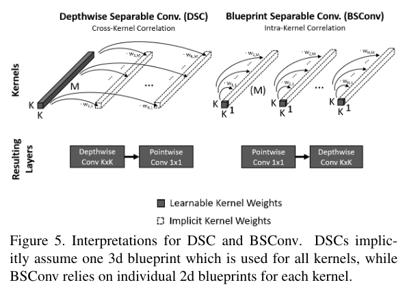
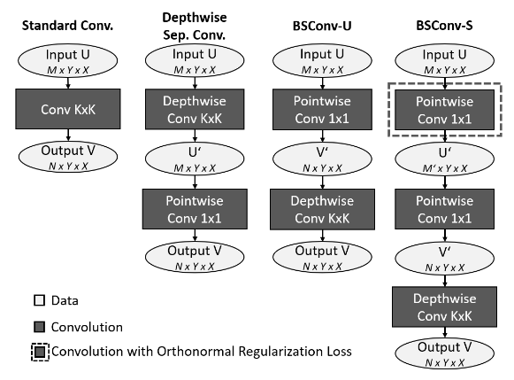
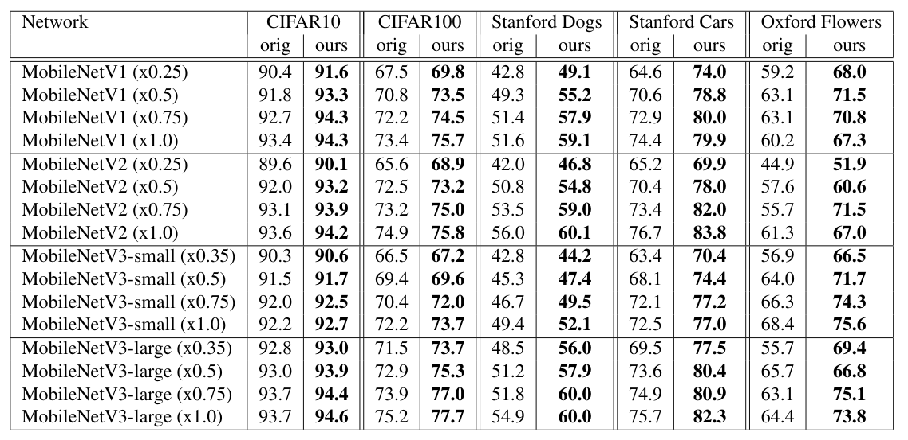
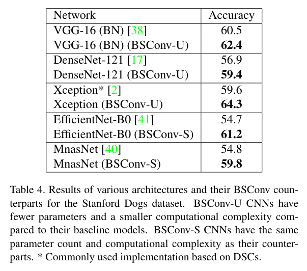

Rethinking Depthwise Separable Convolutions: How Intra-Kernel Correlations Lead to Improved MobileNets
===

Daniel Haase, Manuel Amthor

https://arxiv.org/abs/2003.13549v2
Accepted by CVPR 2020

@cohama

## どんなもの?

- Depthwise Separable Convolution (DSConv) に似た軽量な Blueprint Separable Convolution (BSConv) を提案
- 普通は Depthwise → Pointwise の順だが逆にするといいらしい (normalization と activation はなしにしたほうがよいらしい)
- DSConv をもつネットワークを BSConv に置き換えるだけで ImageNet の分類で最大10%弱の精度向上
  - といっても ResNet10 とかの話なのでだいぶ盛っている

## 先行研究と比べて何がすごい？

- DSConv よりも強い (とくに軽量モデル)
- Separable Depthwise Conv の意味を考えた

## 技術や手法の肝は

- 普通の畳込みのカーネルをよく観察すると深さ方向に似た重みになることが多い。
  - 代表となる重み+そのスカラー倍だけで表現できるのでは

- これはまず pointwise に畳み込んだあとに depthwise に畳み込むのと同じ
  - BSConv は深さ方向のカーネルの相関を使っている (intra-kernal correration)
  - DSConv は異なるフィルタ間の相関を使っている (cross-kernal correration)
- さらに最初の pointwise を低ランク近似するバージョンを考える。これは最初に pointwise を2回繰り返すのと同じ。

## どうやって有効だと検証した？

## 議論はある?

- 分類以外のタスクではどうだろう

## 次に読むべき論文
- [MobileNet v2](https://arxiv.org/abs/1801.04381)
