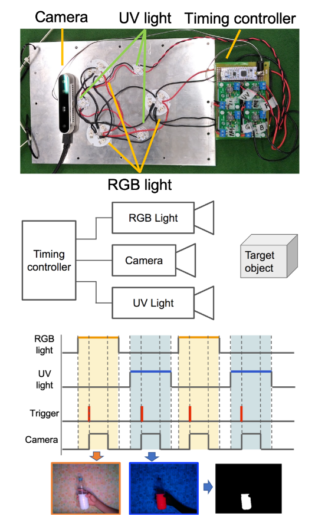
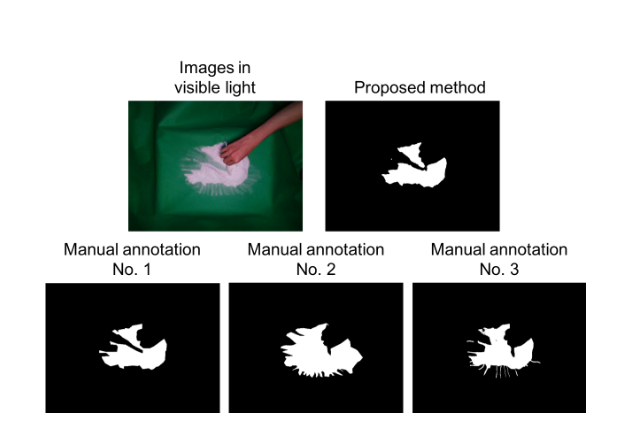
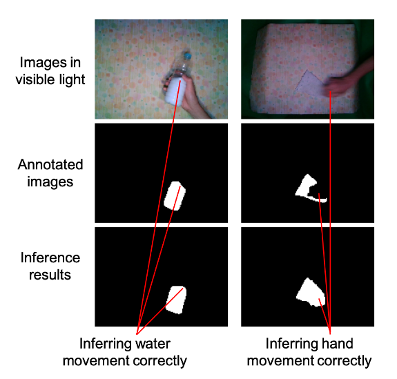
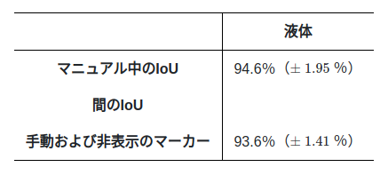
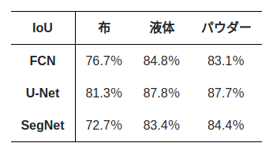

# # Invisible Marker:Automatic Annotation for Object Manipulation
[https://www.arxiv-vanity.com/papers/1909.12493/]
(まとめ @usakotail)

著者
* Kuniyuki Takahashi
* Kenta Yonekura

（PFN）

# どんなもの？
アノテーションが難しい物体に対する自動アノテーション方法として、不可視マーカーを使った方法を提案

# 先行研究と比べてどこがすごい？
先行研究には以下のような問題があった
* ホットサーモグラフィを用いたオブジェクトの温度をつかった自動アノテーション：複数のオブジェクトで同じ色になってしまう場合があると使えないという問題がある
* 拡張現実（AR）マーカーを使った方法：複数のオブジェクトを区別することは可能だがオブジェクトの見た目が変わってしまうという問題がある
* シミュレーションアプローチ：大きなデータセットを人工的に作成できるが、変形可能なオブジェクトなど、シミュレーションが難しいオブジェクトのデータセットの品質が低くなってしまうという問題がある

複数のオブジェクトにも適用出来る、
実際のオブジェクトに非表示のマーカーを付与する為、オブジェクトの外観が変化することがない
などこれらの問題を解消している

また、変形可能なオブジェクトなど手動アノテーションに膨大な時間とコストを必要とするオブジェクトに対しても特に効果的

# 技術や手法の肝は？
不可視マーカーとは可視光では不可視だが、暗闇の中で紫外線を当てると可視になるマーカー(ペイントするもの)
可視光と不可視光を高速で交互に切り替えながら画像をキャプチャすることで、不可視マーカーでペイントされたオブジェクトのアノテーションデータを迅速かつ安価に作成することができる
## 不可視マーカー

不可視マーカーは、可視光の外部の波長の状態で光を放射し、通常の可視光では光を放射しない透明なものであればどのようなものでも使用できる
この研究では、入手が簡単な蛍光塗料を使用している。蛍光塗料で塗装されたオブジェクトは、紫外線の下で発光する
また、赤、緑、青の色を混合することでさまざまな色の蛍光塗料を作成できるため、複数のオブジェクトに対してアノテーションが可能

# どうやって有効だと検証した？
実際にデータ作成→実験を行った

以下のもので構成された画像とそのアノテーションを自動生成できるシステムを開発してデータを作成した
* 対象物の画像を撮影するカメラパーツ
* 対象物への照明出力を制御する照明部
* 撮影タイミングや光量変化を制御する制御部

布としてハンカチ、液体として水、粉末として重曹にアノテーションを行った

## 実験
FCN、U-Net、SegNetを使用、
可視光の画像を入力として、提案された方法によるアノテーションデータを出力としてトレーニング

## 手動アノテーションと比較しての誤差
手動でアノテーションすると細かい部分は個人差が顕著に現れ、特に粉末など境界が不明瞭な場合に個人差が大きくなりる
提案手法では、光の強度に対する蛍光塗料の量を調整することによってアノテーションを付けるしきい値を制御でき、注釈付きの画像に対してUV光でキャプチャされた画像のしきい値を調整できるため、明確にできる

また、対象物が液体の場合などオブジェクトの動きが早い場合、可視光の画像とアノテーションデータにギャップが生じるが、これは大規模なデータセットで訓練すれば個人差の範疇に吸収されることがわかった

## コスト

手動アノテーションでは1枚当たり$ 1.12掛かるのに対して、提案手法では1枚当たり$ 0.0014で済む
提案手法では初期費用としてUVライト・蛍光塗料などが必要だが、数千~数万のアノテーションを行うことで無視できる数値になる。
また、対象物に塗装する時間も大量のデータセットを作成することで無視できるレベルになる

# 議論はある？

この方法で衣服の折りたたみ、料理などのロボットタスクの範囲を広げることができるのでは…?
(手法については特に議論は無かった…)

# 次に読むべき論文は？
?
