# Generating Diverse High-Fidelity Images with VQ-VAE-2
https://arxiv.org/pdf/1906.00446.pdf

著者
- Ali Razavi
- Aaron van den Oord
- Oriol Vinyals
(DeepMindの人たち)

## どんなもの？
- 離散的な潜在変数空間を用いる
- 階層化された特徴マップを用いて鮮明な画像を生成

## 先行研究と比べてどこがすごい？
- VAEなのに当時sotaのBigGanよりもFIDなどの評価指標において優れている
- 1024x1024などの高解像度の画像も生成可能
- ganよりも多様性に優れ、mode collapseの問題もない

## 技術や手法の肝は？
### 潜在変数のベクトル量子化
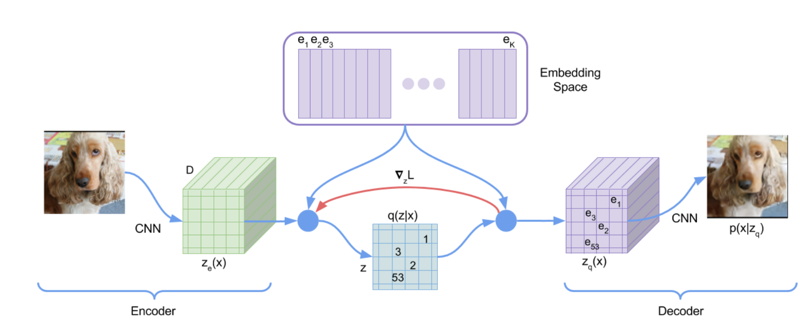
VQ-VAEは次のような流れで学習する
- エンコーダが入力画像をW * H * Dにエンコードする
- 各ピクセルにおいて、最も近いD次元ベクトルをEmbedding Spaceから選んで、そのベクトルのインデックスを値とする潜在変数を作る
- デコードする時はその潜在変数から対応するベクトルを特徴マップを復元し、元の画像の解像度まで拡大して畳み込む
- 入力画像と出力画像で平均二乗誤差等を誤差関数として、エンコーダー、デコーダー、Embedding Spaceのベクトルを更新する

### モデル構造

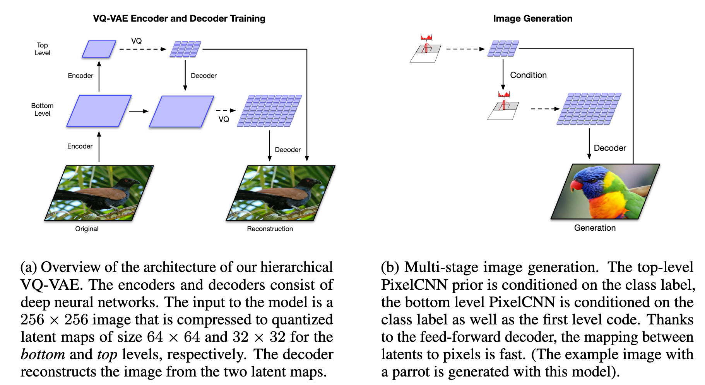
#### エンコーダ
- 画像の全体的な特徴を持つ32 x 32の特徴マップ(TopLevel)と、詳細な情報を持つ64 x 64の特徴マップ(BottomLevel)を持つ

#### デコーダ
- 画像を生成する際は、潜在変数の生成にニューラルネットを用いる(PixelCNN)
- エンコーダと同様にTopLevelとBottomLevelでそれぞれ潜在変数を生成するが、BottomLevelの潜在変数はTopLevelの潜在変数で特徴付けられる

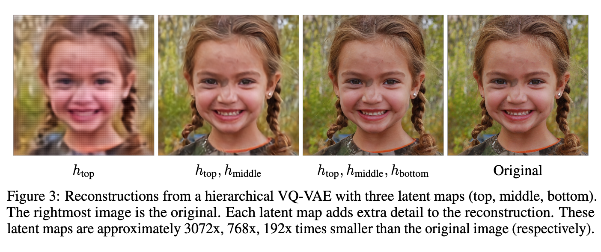
### 学習
#### STEP1
誤差関数は以下のように定義される。
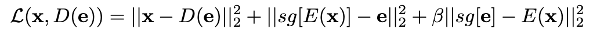

sg: stop gradient、引数に勾配が流れるのをストップする
beta: ハイパーパラメータ

この誤差関数を用いてパラメータを更新する

#### STEP2
PixelCNNを潜在変数に近い値を出力するように訓練する

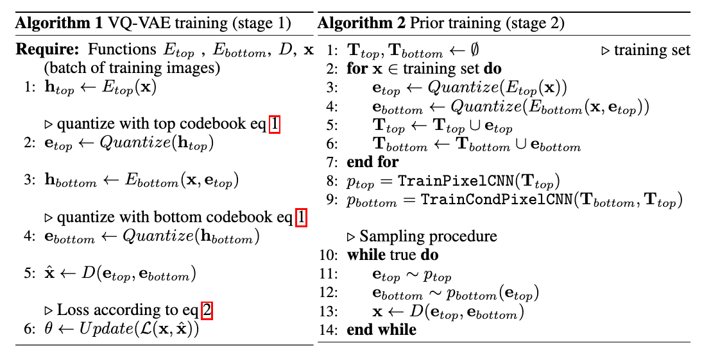

## どうやって有効だと証明した？
### 出力画像の比較
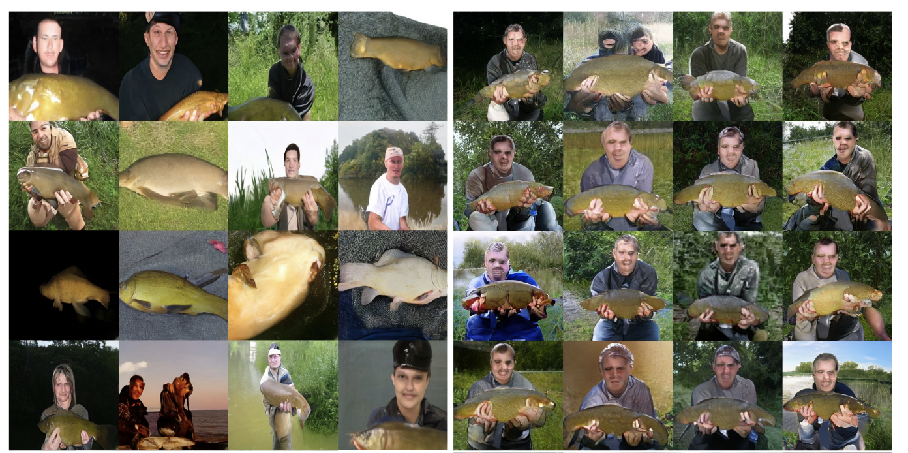
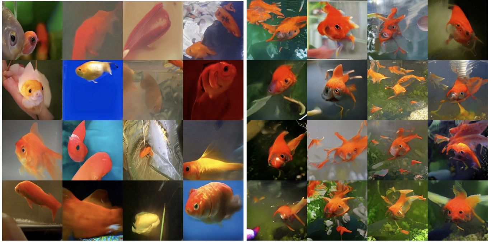
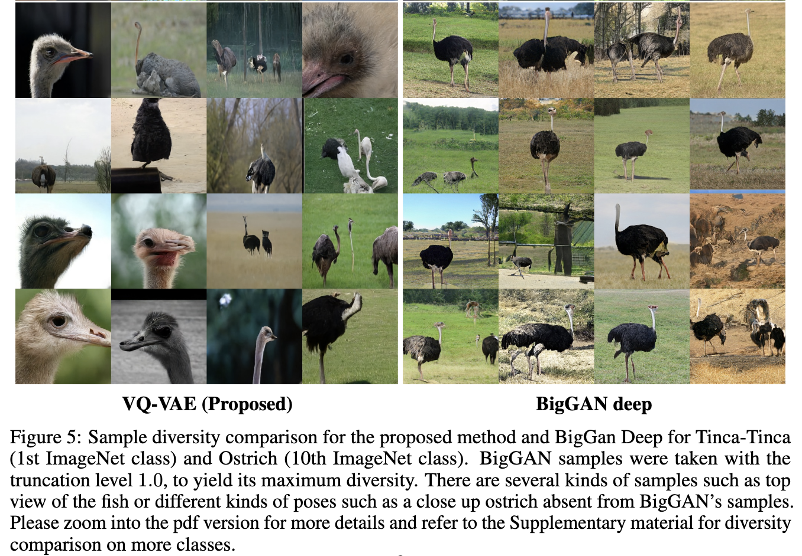

### 高解像度の顔画像生成

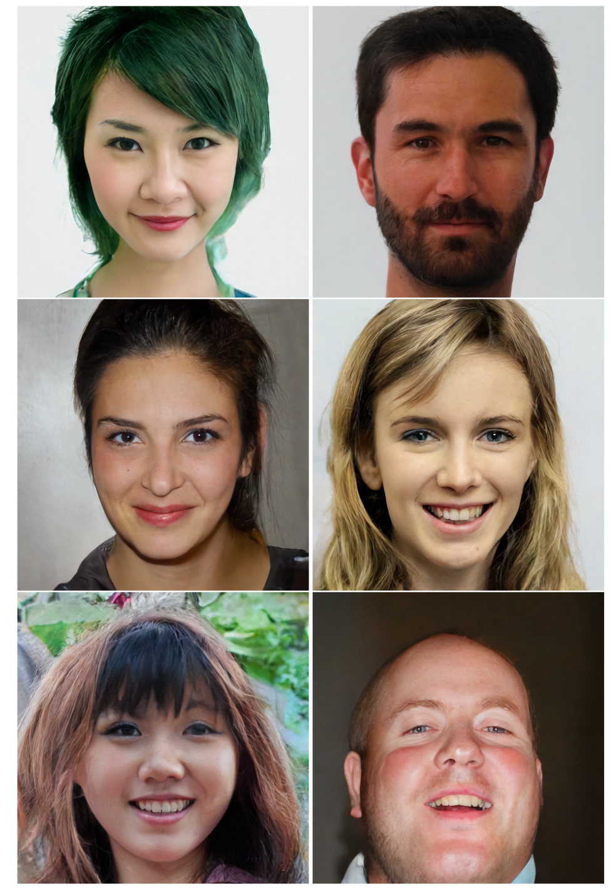

### 評価指標
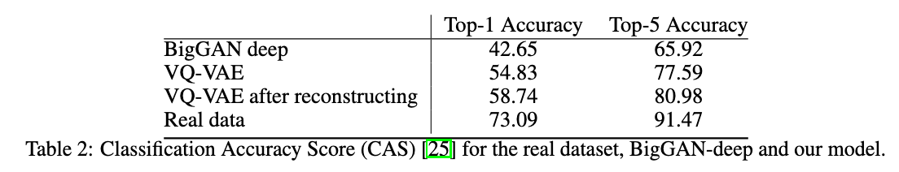

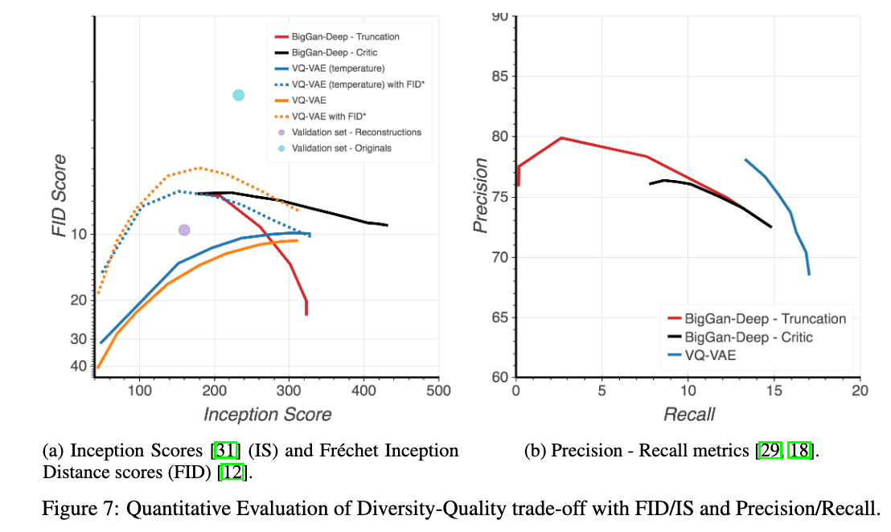

## 次に読むべき論文
[PixelCNN](https://arxiv.org/abs/1601.06759)
