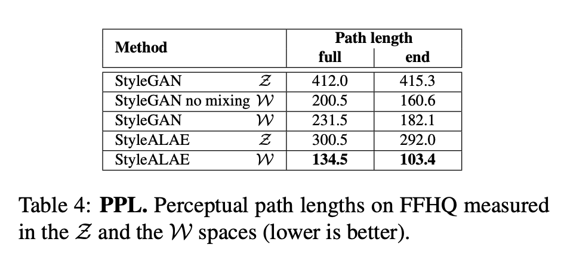
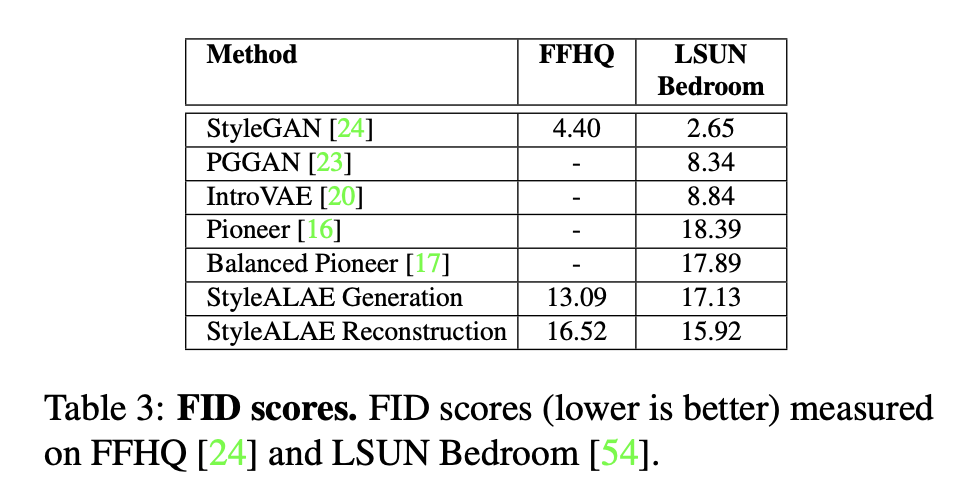
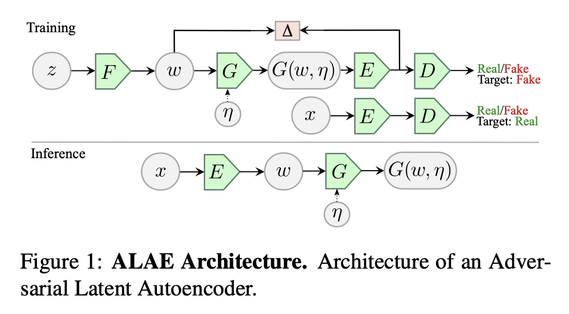
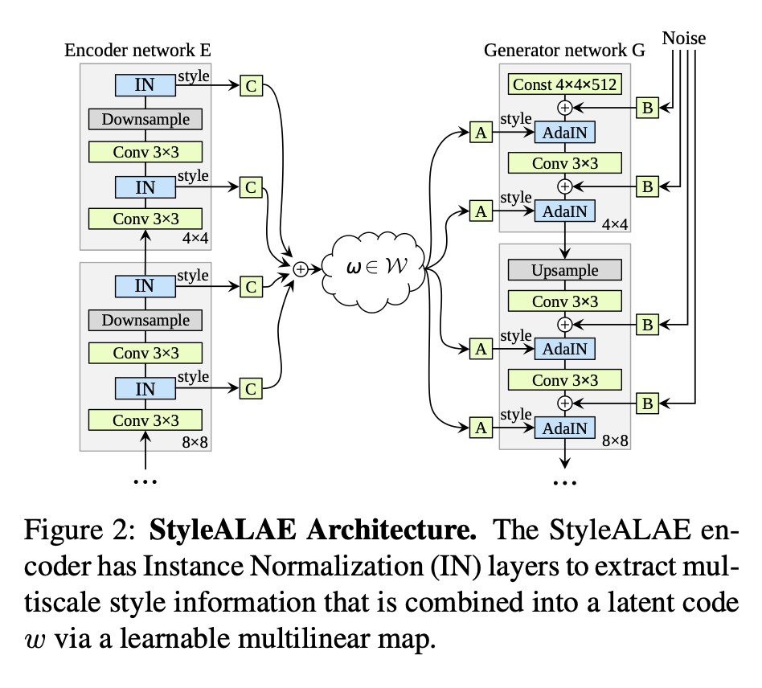

Adversarial Latent Autoencoders
===

2020/04 Stanislav Pidhorskyi, Donald Adjeroh, Gianfranco Doretto (West Virginia Univercity)

https://arxiv.org/abs/2004.04467

---

## どんなもの？

- GANにAutoencoderを組み込んだもの。

## 先行研究と比べて何がすごい？
- 潜在変数空間を学習するネットワークを用意する。
- 従来のGANよりも潜在変数空間のもつれを解くことに成功した。
- StyleGANに組み込んだStyleALAEは、より柔軟に画像の特徴を操作できるようになった。

---

## どうやって有効だと検証した？
- いくつかの評価指標を計測
    - Perceptual path lengths(PPL)がStyleGANと比べて非常に小さい

    

    - FIDはStyleGANより悪い(訓練時間がStyleGANより短いと主張)

- 実際に画像を生成して実演した
    - 画像のある特徴のみを連続に動かす様子

    
    

---

## 技術や手法の肝は？

### GeneratorとDiscriminatorにエンコーダを組み込む

- F, E: Encoder
- G: Generator
- D: Discriminator
- 従来のGANとは異なり、DはEによるエンコードの値を見て本物か偽物かを判別する。
- 生成画像と本物の画像の分布が一致させるのに加え、Fの分布とEの分布が一致するように学習する。
- 以下の式を最適化する。

- Deltaはl2-normなど

### GeneratorにStyleGANを採用する(StyleALAE)

- ALAEのEとGを上記のネットワークで置き換える。
- 中間潜在変数wを、

と計算する。Ciは学習可能なパラメータ、yiはエンコーダのi番目のレイヤーの出力。
- StyleGANと同様にwを用いてAdaINして特徴を注入する。

---

## 議論はある？
- 特徴操作はどこをいじっているのか明記されていなかった

## 次に読むべき論文は？
[AdversarialFeatureLearning](https://arxiv.org/abs/1605.09782)
