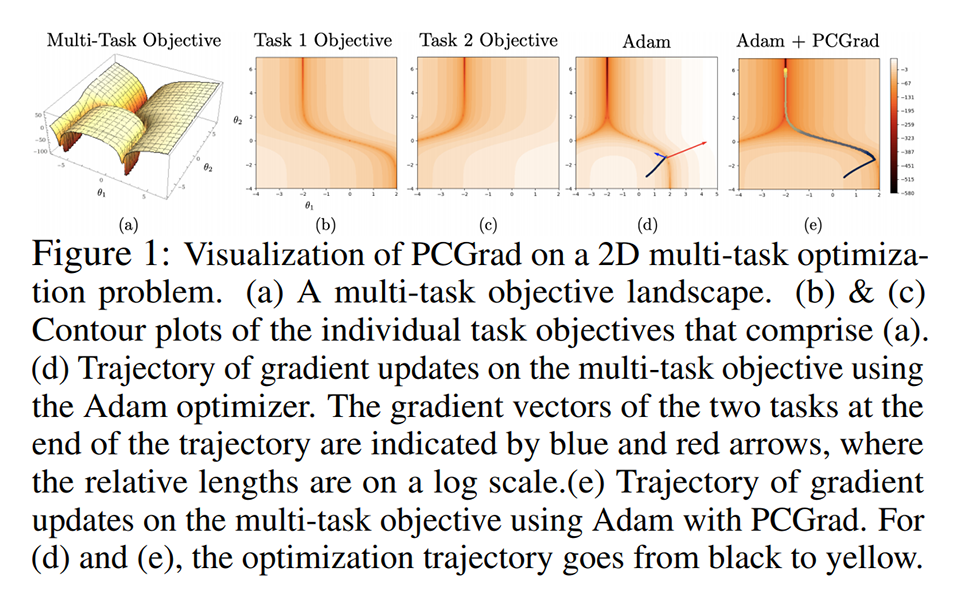
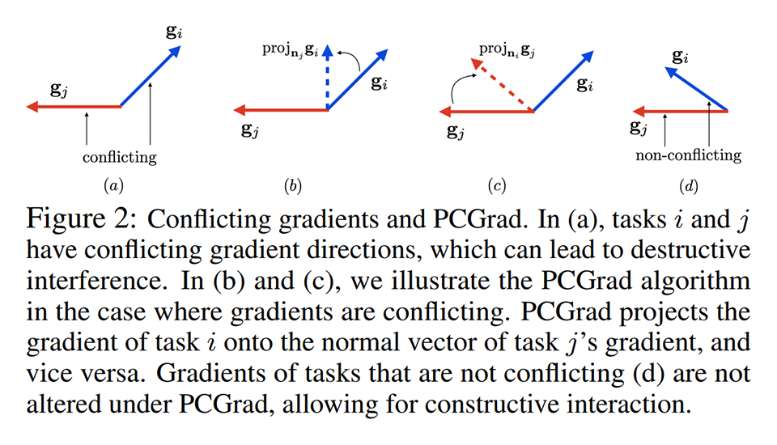
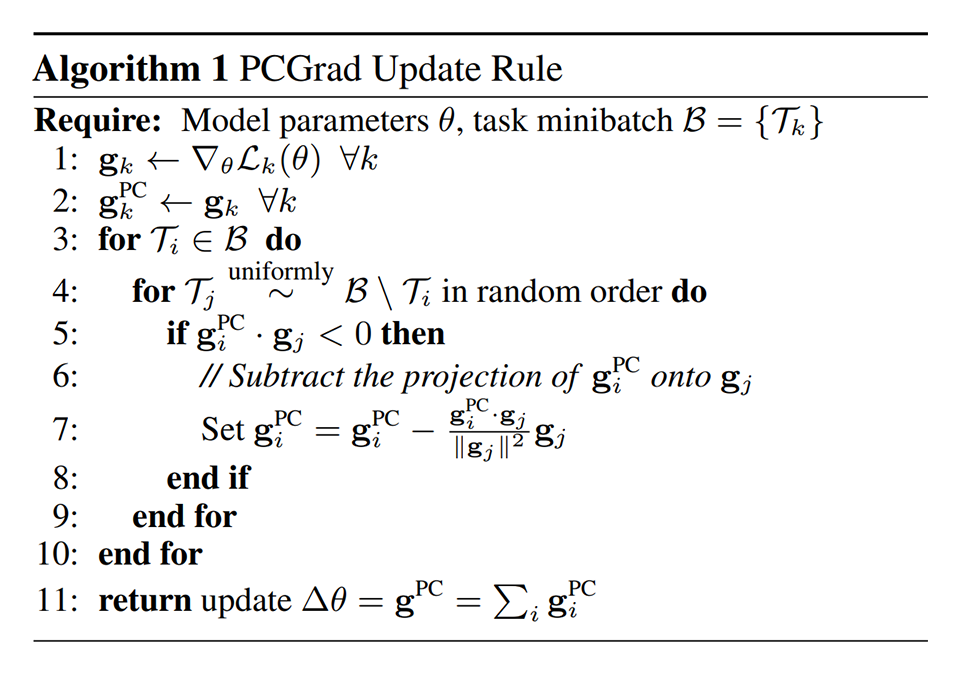
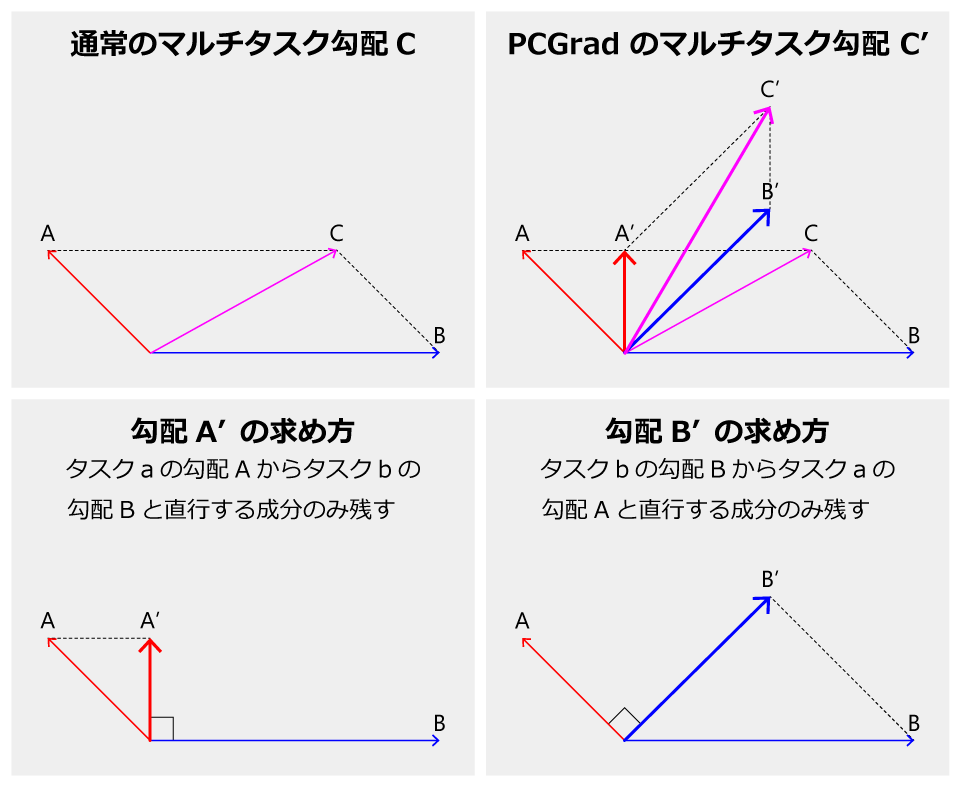
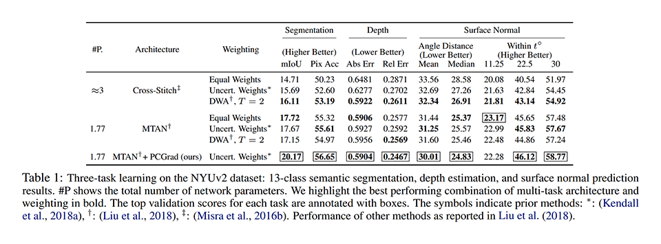
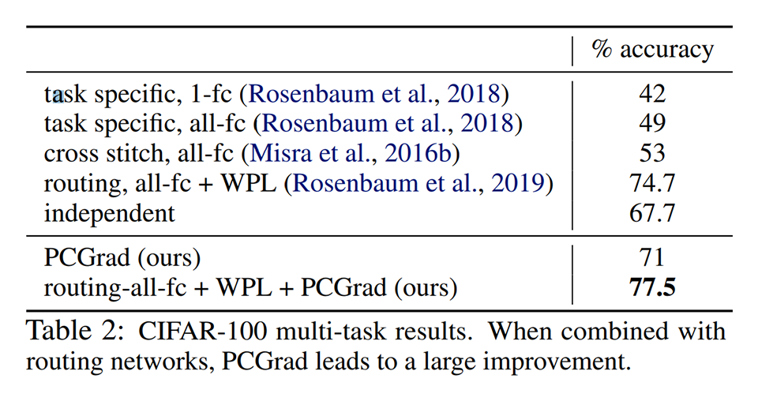
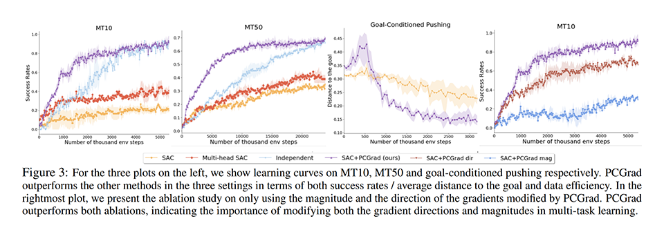
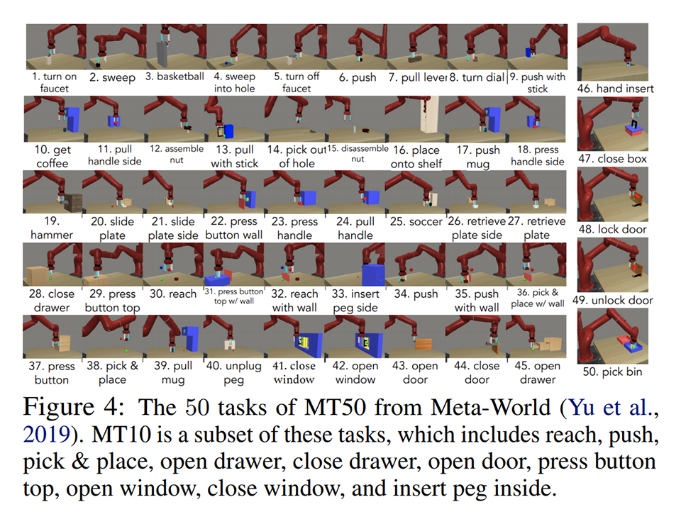
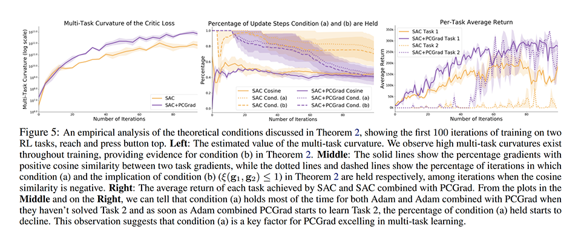
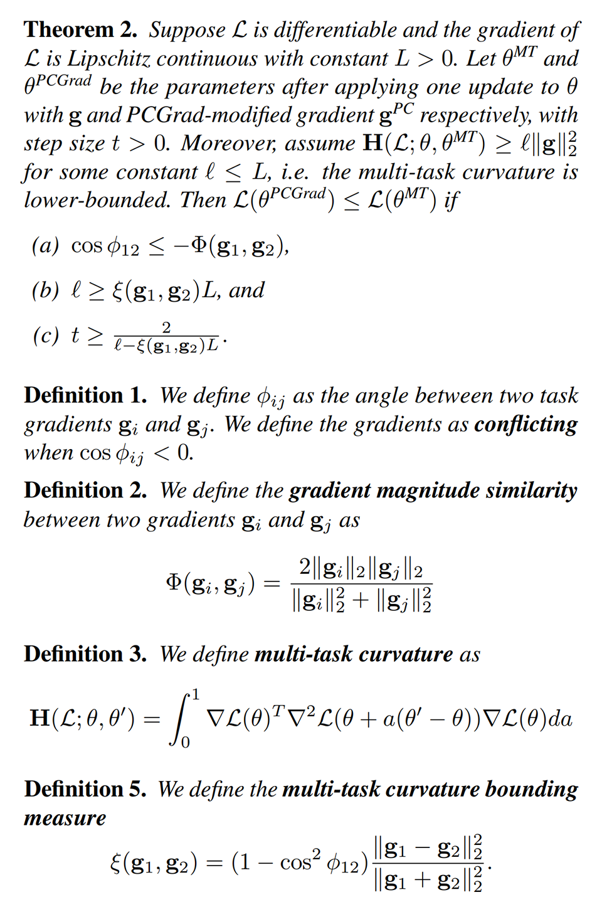

# [\[arxiv\]](https://arxiv.org/abs/2001.06782v2) Gradient Surgery for Multi-Task Learning

- 著者
    - Tianhe Yu *1
    - Saurabh Kumar *1
    - Abhishek Gupta *2
    - Sergey Levine *2
    - Karol Hausman *3
    - Chelsea Finn *1
- 所属
    - 1: Stanford University
    - 2: UC Berkeley
    - 3: Robotics at Google

## どんなもの？
### PCGrad (Projecting Conflicting Gradients)
マルチタスク学習において、タスク間で勾配が干渉する（まったく別の方向へ調整がかかる）場合（図１）に、これを回避するよう（図２）に勾配を修正すること（アルゴリズム１）で、性能と収束性を高める。

## 先行研究と比べてどこがすごい？
- タスク間の勾配の干渉に注目した。
- 画像認識タスクと強化学習タスクにおいて性能を大きく改善した。
- 収束性と特定条件での収束の速さを理論的・実験的に証明した。

## 技術や手法の肝は？
タスク間で勾配が干渉する（タスク間の勾配のなす角 ＞ 90°）場合に、他方の勾配と直行する成分だけを残す（打ち消す成分は無視する）ようにした。

- タスク間で勾配が干渉しない場合
    - これまで通り
- タスク間で勾配が干渉する場合
    - マルチタスク勾配が長くなる
    - 勾配が短いタスクが勾配が長いタスクより優遇される

## どうやって有効だと検証した？

### 既存手法との性能比較 / 画像認識 / NYUv2
segmentation・depth・surface normal の３つを推定するタスクのためのデータセットを用いた。

### 既存手法との性能比較 / 画像認識 / multi-task CIFAR-100
20 個の荒い粒度のラベルで CIFAR-100 のデータセットを分割し、20 タスクとした。

### 既存手法との性能比較 / 強化学習 / MT10 & MT50
Meta-World benchmark（ロボットアームのための様々な動作の獲得を目的とした強化学習環境）の MT10（動作の種類: 10）と MT50（動作の種類: 50）を用いた。

- [Meta-World](https://meta-world.github.io/)

### 学習過程の観察 / 強化学習
収束の速さを保証する条件（定理２）を満たす状況がよく発生していることを実験により明らかにした。
定理２

## 議論はある？
- 提案手法のような勾配操作の考え方は２プレイヤーゲームにおける安定性やマルチエージェント最適化に有効かもしれない。

- 私見
    - 著者は、勾配の干渉が悪で、それを回避したから性能が改善した、と主張しているが、あまり正しい主張ではないように思える（レビューでも指摘されていて、それが理由で reject されている）。
    - 勾配の干渉の回避が効いているというよりも、タスクごとの勾配のスケール（学習率）の調整が効いていると、解釈した方が、実態を正しく説明できるように思える。
- PCGrad のソースコードが公開されているが、Shuffle が効いてなさそうなので、使う際は注意が必要である。
    - [GitHub](https://github.com/tianheyu927/PCGrad)

## 次に読むべきタイトルは？
- [\[arxiv\]](https://arxiv.org/abs/1910.10897) Tianhe Yu, Deirdre Quillen, Zhanpeng He, Ryan Julian, Karol Hausman, Chelsea Finn, Sergey Levine, "Meta-World: A Benchmark and Evaluation for Multi-Task and Meta Reinforcement Learning", CoRL, 2019.
