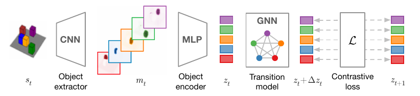
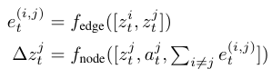
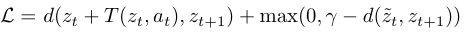
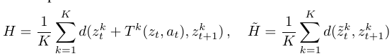
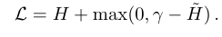
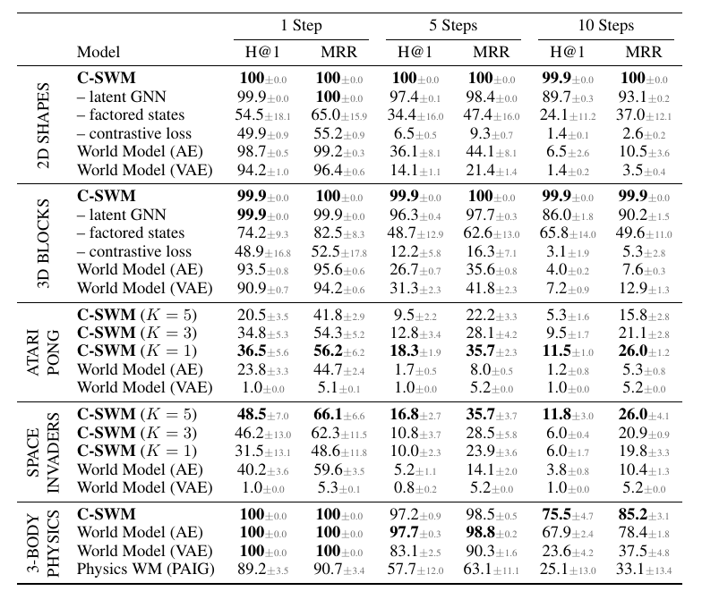

# Contrastive Learning of Structured World Models
[https://arxiv.org/abs/1911.12247](https://arxiv.org/abs/1911.12247)
(まとめ @n-kats)

著者
* Thomas Kipf
* Elise van der Pol
* Max Welling

ICLR2020で口頭発表
(https://iclr.cc/virtual_2020/poster_H1gax6VtDB.html)

Kipf先生はGCNの作者。アムステルダム大学のメンバー。

# どんなもの？
## 目標
世界の構造理解の研究。
物とその関係・階層構造をもとに人は世界を理解している（人は物を押したらどうなるかとかがわかっている）。
しかし、生の感覚情報からアルゴリズムでこれを取り出すのはチャレンジング。

## やっていること
目標に向け、C-SWM（contrastively-trained structured world model）を提案。

画像からものを取り出し、それらの関係をグラフ系ニューラルネットで認識

# 先行研究と比べてどこがすごい？
## よくあるもの
* 教師を作って訓練
* 再構成が正しくできるように訓練
教師を作るのは大変。再構成は小さな重要なものに注目できない（ゲームの弾）・どうでもいい背景を無駄に処理している

再構成の代わりにcontrastive learningの方法を採用したのがこの手法の特徴の一つ

## 比較手法
### world model
オートエンコーダを用いた手法。VAEで状態表現を行い、MLPでアクション後の状態を予想するモデル。

### PAIG
エンコーダーデコーダー方式の手法。特徴ベクトルから再構成するときにちゃんとした物理量を使うため、Atariには使えない。
この手法もICLR2020に採用されている。

## 評価
ranking metrics（H@1とMRR）で上記2つのモデルに比べ大幅に性能改善

# 技術や手法の肝は？
## データ
次の三つ組みを訓練データとする
* 状態 s_t
* アクション a_t
* アクション後の状態 s_{t+1}

ただし、アクションが定数の場合もある

## メタアーキテクチャ
* encoder: 状態 s_t を潜在表現 z_t へ変換するモデル
* transition model: 潜在表現 z_t とアクション a_t から潜在表現 z_{t+1} を予測するモデル

### encoder
* 入力（画像）
* Object extractor -> K個のマスク（Kはオブジェクトの数）
* Object encoder -> 特徴ベクトル

### transition model
* 入力（K個の特徴ベクトル＋アクション）
* GNN
* 出力（アクション後の特徴ベクトル）

## ネットワーク
### encoder
CNNでチャンネル数Kの層を作って、それぞれをマスクと解釈。マスクをフラットにしてMLPに適用。

### transition model
K個の特徴ベクトルとそれぞれのアクションの組 \(z^k_t, a^k_t\) をノードの特徴ベクトルとしてGNNの入力とする。

GNNは次の構造にする。

## 損失関数
### contrastive learning
2つのものを入力して、それらが関係があるか無いかを判定するモデル。表現学習で用いられる。

* 教師を潜在表現に変換してえられる z_t, a_t, z_{t+1} では予測と教師があうように訓練。
* ランダムにとった状態を潜在表現に変換した \tilde{z}_t は z_{t+1} とをγ程度まで引き離す訓練。

### multi-object contrastive loss
上記のcontrastive lossを複数のものに拡張。

# どうやって有効だと検証した？
ranking metricを利用して
* 2D shapes
* 3D shapes
* Atari Pong
* Space Invaders
* 3-Body physics
を評価

## 評価指標
### Hits at Rank k\(H@k\)
教師の潜在表現の中で、予測した潜在表現からk番目以内に近いところに教師の潜在表現がある場合正解とする。全体でこれを評価して正解率を算出。

### Mean Reciprocal Rank\(MRR\)
rankの逆数の平均（rankは潜在表現で予想から教師が何番目か？）

## 評価値

表の N Steps は、予想を繰り返す回数。他手法はステップを進めるにつれて精度が落ちている。

# 議論はある？
## オブジェクトが曖昧
雑にKチャンネルを作っているが、その順番に意味が薄い（非自明なアクションがある場合でもその程度）

## ランダム要素がない
評価に使ったデータはすべて状態遷移が一意的に決まっている世界。

# 次に読むべき論文は？
* [COBRA](https://arxiv.org/abs/1905.09275)  
  再構成系で優れていると記述があった
* [PAIG](https://arxiv.org/abs/1905.11169)
