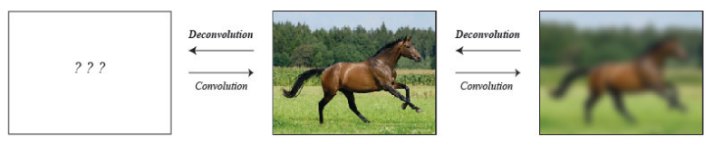
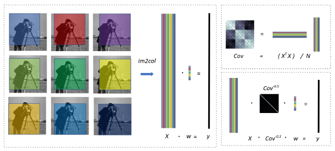
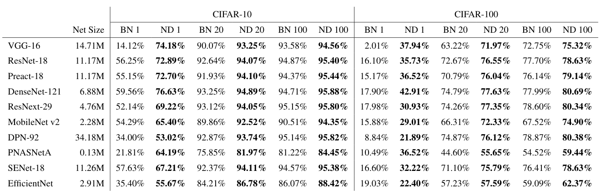
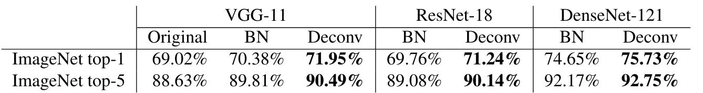
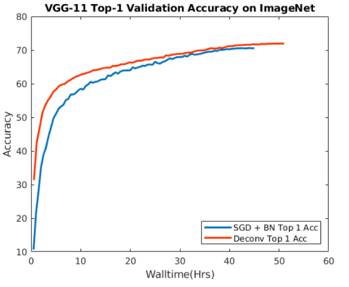

Network Deconvolution
===

Chengxi Ye, Matthew Evanusa, Hua He, Anton Mitrokhin, Tom Goldstein, James A. Yorke, Cornelia Fermüller, Yiannis Aloimonos

https://arxiv.org/abs/1905.11926v4
Accepted by ICLR 2020

@cohama

## どんなもの

- 入力のチャネル方向、空間方向の相関を減らすための Network Deconvolution というオペレーションを提案
  - Convolution の逆操作
  - Transpose Convolution の方の Deconvolution とは異なる。Convolution の逆の操作という意味でこちらのほうがふさわしい命名だという主張
- Batch Normalization の置き換えが可能。BN よりも収束が早く高精度
  - CIFAR-10/100、MNIST、ImageNet、CityScape
  - いろいろなモデルで効果あり

## 先行研究と比べて何がすごい？

- BN よりも強い
  - BN 小バッチサイズやリカレントに弱いが Network Deconv はそうではない。
- Channel 間の相関をケアする手法もいくつかある。でもピクセル間の相関までケアしている手法はない
  - また、それらは畳み込みのオペレーションの性質を加味していない

## 技術や手法の肝は

- 畳み込みのオペレーションは実際には入力画像を lowering (im2col) で巨大な行列に変換してから行列の掛け算として実行される。
  - `(H, W, C)` の大きさの画像を `(k, k)` のフィルタで畳み込む場合 `(H*W, C*k*k)` の行列になる
  - 
  - lowering した行列の共分散行列をとる (Cov)
  - Cov^-0.5 を計算し、それを入力にかけると良い。入力の相関がなくなる
- Cov^-0.5 の計算は反復法みたいなのでやる
- ネットワークの深い層ではチャネル数が大きいのでグループ (各サイズ: B) に分けてその範囲で Cov を計算する
- さらに、Cov の計算のときに S だけ縮小させてから計算することで計算量を減らせる。(H/S, W/S)
- k=1、B=1 だと BatchNormaliztion と同じになる (本当?)

- 

## どうやって有効だと検証した？

## 議論はある?

- 結局なぜ収束が早くなるのかはよく分からなかった。
  - それっぽい記述が合ったけど自分の勉強不足とか読む時間とか
- 推論時は Conv^-0.5 を (おそらく移動平均などで) 固定化するらしい。なぜそれでいいのか

## 次に読むべき論文
- [Optimizing neural networks with Kronecker-factored ap-proximate curvature](http://arxiv.org/abs/1503.05671)
- [On the importance ofconsistency in training deep neural networks.](http://arxiv.org/abs/1708.00631)
