# YOLOv4: Optimal Speed and Accuracy of Object Detection
[https://arxiv.org/abs/2004.10934](https://arxiv.org/abs/2004.10934)
[https://blog.seishin55.com/entry/2020/05/16/183132](https://blog.seishin55.com/entry/2020/05/16/183132)
（まとめ @usako_tail）

著者
* Alexey Bochkovskiy∗  
* Chien-Yao Wang∗  
* Institute of Information Science Academia Sinica, Taiwan  
* Hong-Yuan Mark Liao  
* Institute of Information Science Academia Sinica, Taiwan

YOLOv3の著者とは別の人

# どんなもの？
従来のGPUを使ってもリアルタイムに高い精度で検出することができる手法

* 1080 Tiまたは2080 Ti GPUでも高速で精度の高い検出が可能
* 最新のBag-of-Freebies・Bag-of-Specialsのオブジェクト検出方法の影響を検証
* CBN・PAN・SAMなどの最先端のメソッドを1つののGPUで使えるようにした

# 先行研究と比べてどこがすごい？
## 先行研究
* EfficientDet
* M2Det
	* neckを採用しているものが近い

## 先行研究との差

* 同等のパフォーマンスを持つEfficientDetの2倍の速度
* YOLOv3のAPとFPSをそれぞれ10％と12％向上

# 技術や手法の肝は？
※既存の手法を複数比較して一番よいものを選択したという記述が多い

## ネットワーク
クロスGPUバッチ正規化（CGBNまたはSyncBN）や高価なGPUは使用しない
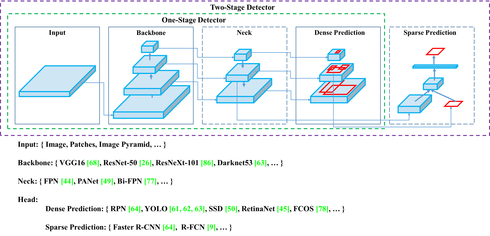
### CSPDarknet53（backbone）
* 既存手法 [https://arxiv.org/abs/2004.10934](https://arxiv.org/abs/2004.10934)
* YOLOv3で使用されたDarknet53にCSPnetを加えたもの
* 以下を満たすネットワークとして選択
	* 高い入力ネットワークサイズ（解像度）: 複数の小さいサイズのオブジェクトを検出するため
	* より多くの層 : 増加した入力ネットワークのサイズをカバーするために、より高い受容野のために
	* より多くのパラメーター : 1つの画像で異なるサイズの複数のオブジェクトを検出するモデルの容量を増やす
##### CSPnet
* 既存手法 [https://arxiv.org/abs/1911.11929](https://arxiv.org/abs/1911.11929)
*ネットワークの最初と最後から特徴マップを統合するもの
### SPP（neck）
* 既存手法 [https://arxiv.org/abs/1406.4729](https://arxiv.org/abs/1406.4729)
* 畳み込み層からの特徴マップを それぞれ 16x16, 4x4, 1x1 のウィンドウでmaxプーリング
* 結果をreshapeして固定長の出力にして全結合層へ渡す
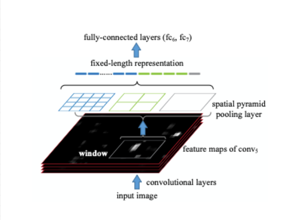
参考:[http://owatank.hatenablog.com/entry/2017/08/29/182549](http://owatank.hatenablog.com/entry/2017/08/29/182549)
### PANet（neck）
* 既存手法 [https://arxiv.org/abs/1803.01534](https://arxiv.org/abs/1803.01534)
* YOLOv3でいうFPNの代わり
* FPNをベースとした抽出器に入力に近い層→遠い層へ接続を追加（緑・赤の点線）
* それぞれのスケールに適した重み付けを行なってプーリング
* YOLOv4では層の合わせ方を変更
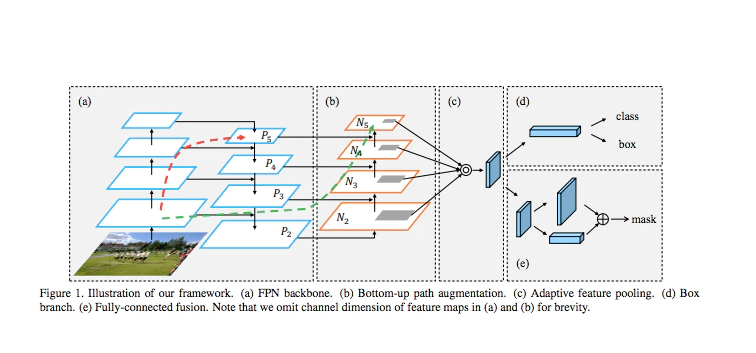
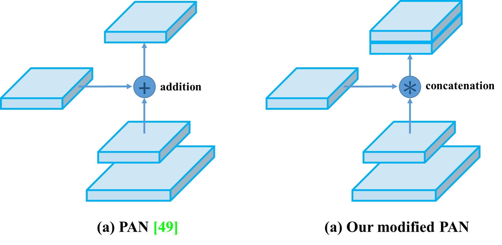
参考:[https://qiita.com/chobaken/items/c15298fdc08be9a034a2](https://qiita.com/chobaken/items/c15298fdc08be9a034a2)
### YOLOv3のHead（アンカーベース）
* 既存手法

参考:[https://www.slideshare.net/YujiKobayashi7/foss4g-2018-tokyo](https://www.slideshare.net/YujiKobayashi7/foss4g-2018-tokyo)

## 活性化関数
### Mish activation
* 既存手法 [https://arxiv.org/abs/1908.08681](https://arxiv.org/abs/1908.08681)
* ReLUっぽいやつ
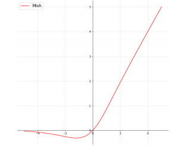
## 正規化 
### クロスミニバッチ正規化（CmBN）
* 既存手法のCBNを改良したもの [https://arxiv.org/abs/2002.05712](https://arxiv.org/abs/2002.05712)
* 直近複数回のネットワークの重みの変化を使って正規化する
* 異なるbatch間では単純に比較することが難しいため、テイラー多項式に基づいてネットワークの重みの変化を補正する
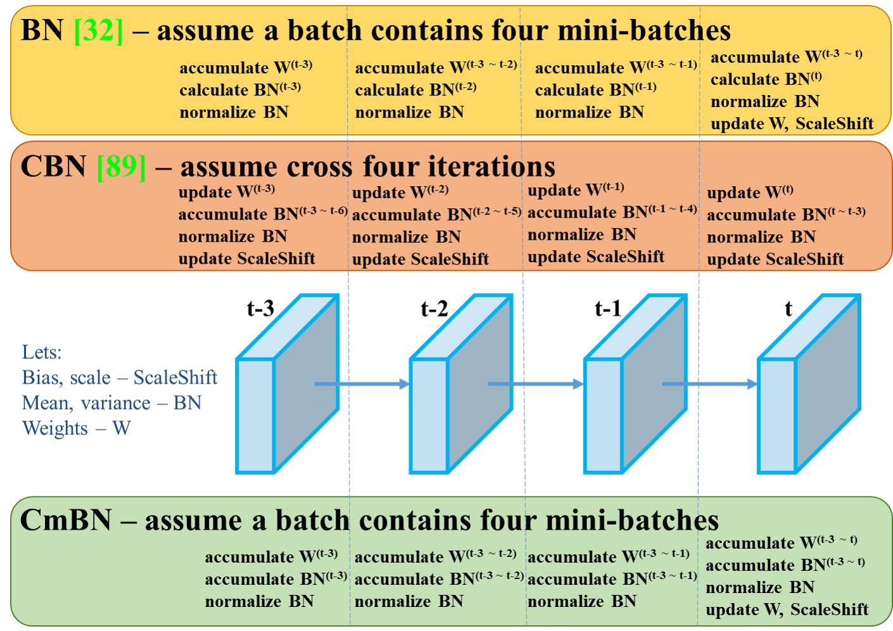
## 正則化
###  DropBlock正則化 
* 既存手法 [https://arxiv.org/abs/1810.12890](https://arxiv.org/abs/1810.12890)
* 隣り合う画素は相関が強いので通常のDropoutでは効果が薄い
* 画像中の矩形型にDropしてしまうことで汎化性能が上がる
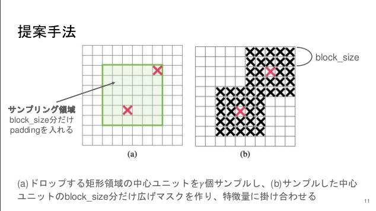
参考:[https://www.slideshare.net/DeepLearningJP2016/dldropblock-a-regularization-method-for-convolutional-networks](https://www.slideshare.net/DeepLearningJP2016/dldropblock-a-regularization-method-for-convolutional-networks)
## loss
### CIoU-loss・DIoU-NMS
* 既存手法 [https://arxiv.org/abs/1911.08287](https://arxiv.org/abs/1911.08287)
* 今までの手法だと各点ごとにtrainとpredのMSE誤差を取っていたので、各点がバラバラに最適化されてしまう
* IoUを使ってlossを出すというもの
## オーグメンテーション
### モザイク
* 新手法
* 4つの訓練画像を混合
* ミニバッチサイズを小さくしても大丈夫になった
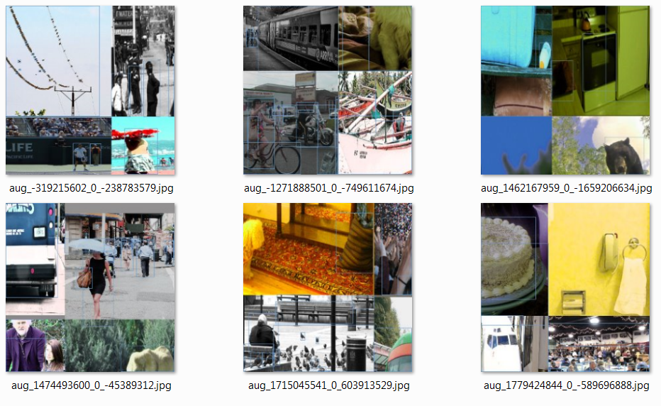
### CutMix
* 既存の手法 [https://arxiv.org/abs/1905.04899](https://arxiv.org/abs/1905.04899)
* 2つの訓練画像を混合
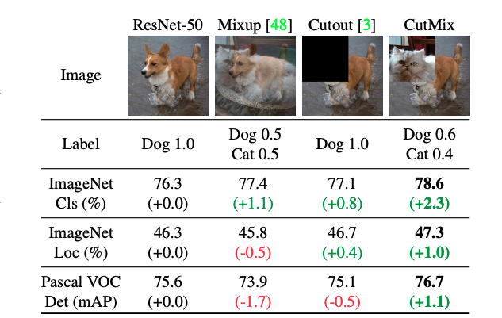
### 自己敵対的トレーニング（SAT）
* 新手法
* まず物体がないものとして誤差逆伝播させて、ネットワークの代わりに画像を更新させる（物体がないとされる画像を生成）
* 次にその画像を使って普通に訓練を行う

## その他
* クラスラベルスムージング
	* robustさを高めるために、soft labelを使って学習を行った
* Cross-stage partial connections（CSP）
* Multi-input weighted residual connections（MiWRC）
* Eliminate grid sensitivity
* 単一のグラウンドトゥルースに複数のアンカーを使用
* Cosine annealing scheduler [https://arxiv.org/abs/1608.03983/](https://arxiv.org/abs/1608.03983) 
	*SGDR: Stochastic Gradient Descent with Warm Restartsを使用 [SGDR: Stochastic Gradient Descent with Warm Restarts](https://arxiv.org/abs/1608.03983)
* ハイパーパラメータ最適化
	* Genetic algorithmを使ってハイパーパラメータ最適化を行った
* ランダムトレーニング形状
# どうやって有効だと検証した？
MS COCOデータセットで検証
以下のGPUを使ってそれぞれの速度を検証
* GTX Titan X ・Tesla M40 (Maxwell)
* TitanX・Titan Xp・GTX 1080 Ti・Tesla P100 GPU (Pascal)
* Titan Volta・Tesla V100 (volta)

## 結果
※青背景はFPS 30以上のリアルタイム検出器
※tensorRT不使用・batchsize:1
### Maxwell

### Pascal
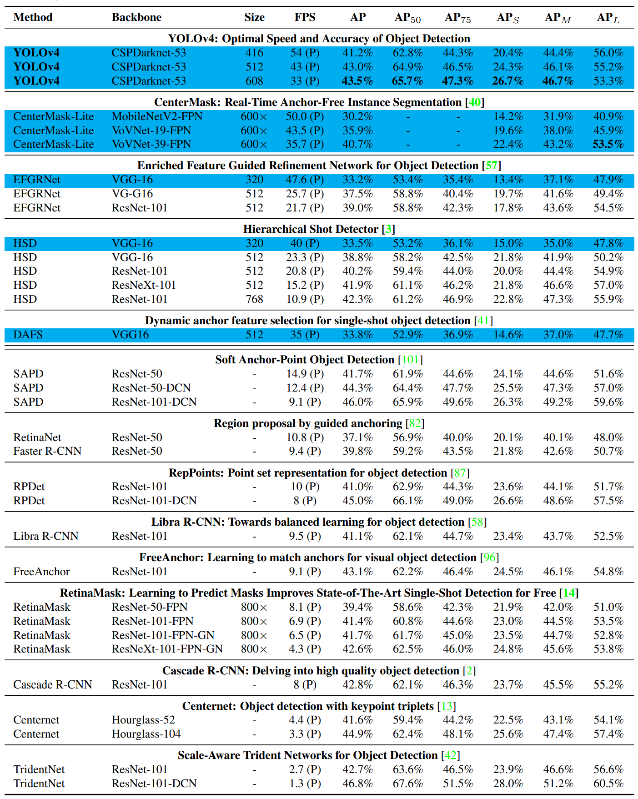
### volta
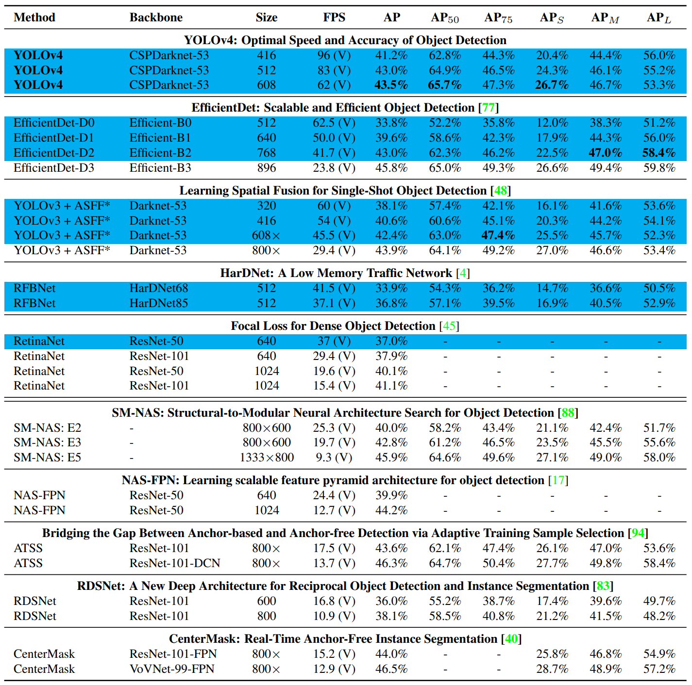

YOLOv3と比較すると(Maxwell)ちょっとだけ早くなって(35→38)10%程度の精度向上(31.0->41.2)
EfficientDetと比較すると(volta)速度は1.3倍遅くなって(62.5→83)10%程度の精度向上(33.8→43.0)
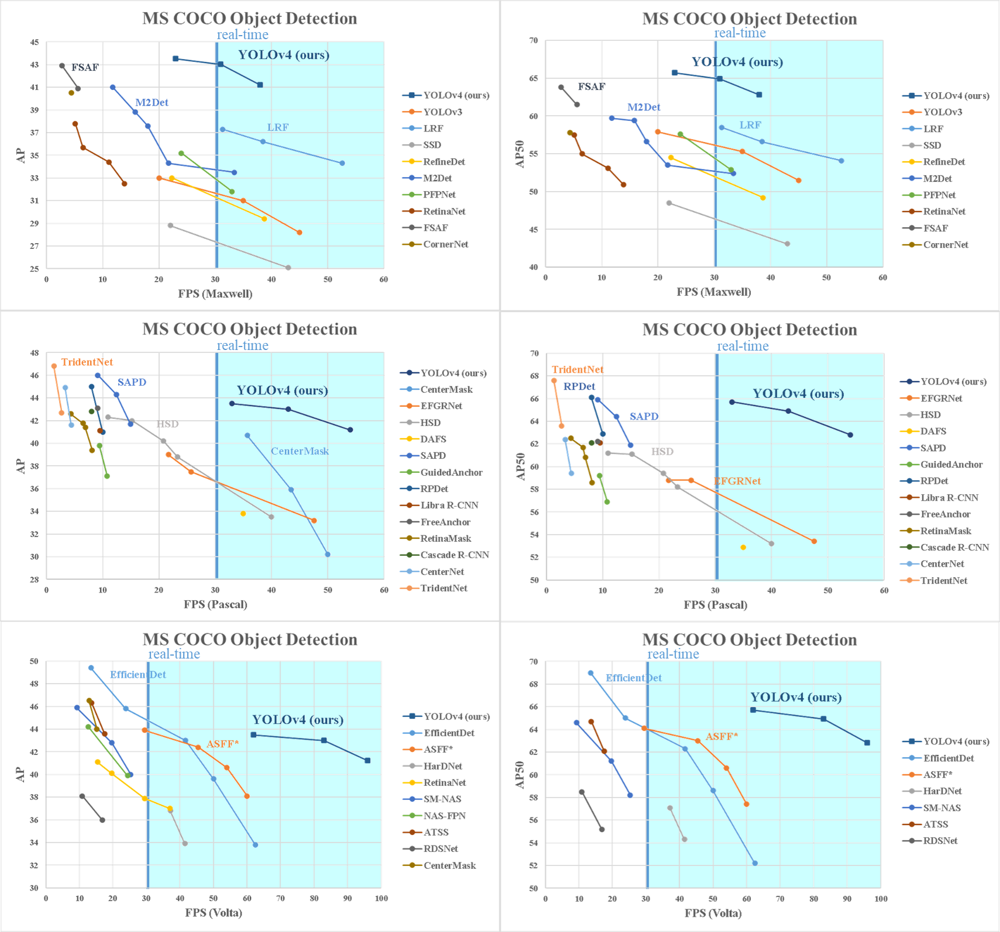
同じ精度であれば速度マシマシ

# 議論はある？
実際にはマシンを変えるとリアルタイムではなくなることがある問題がgithubのリポジトリ上では議論されている
特にJetson AGX Xavierなどでは9fps程度なのでリアルタイムは難しい
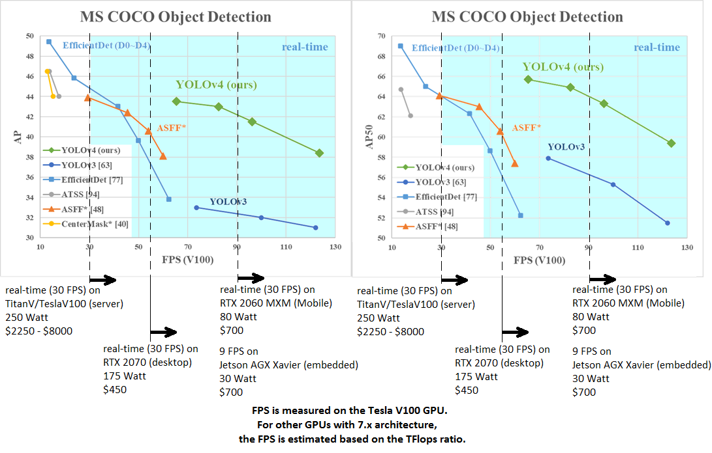

# 次に読むべき論文は？
* 採用されていた既存手法の論文
	* [CSPDarknet53](https://arxiv.org/abs/2004.10934)
	* [CSPnet](https://arxiv.org/abs/1911.11929)
	* [SPP](https://arxiv.org/abs/1406.4729)
	* [PANet](https://arxiv.org/abs/1803.01534.)
	* [Mish activation](https://arxiv.org/abs/1908.08681)
	* [クロスミニバッチ正規化（CmBN）](https://arxiv.org/abs/2002.05712)
	* [DropBlock正則化](https://arxiv.org/abs/1810.12890)
	* [CIoU-loss・DIoU-NMS](https://arxiv.org/abs/1911.08287)
	* [CutMix](https://arxiv.org/abs/1905.04899)
	* [Cosine annealing scheduler](https://arxiv.org/abs/1608.03983)

