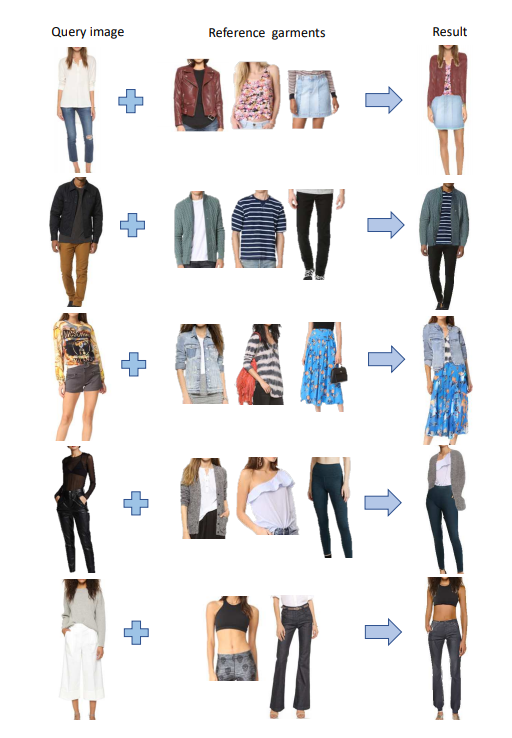
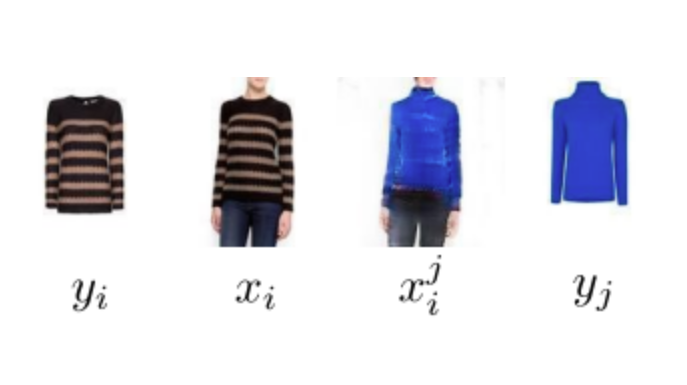
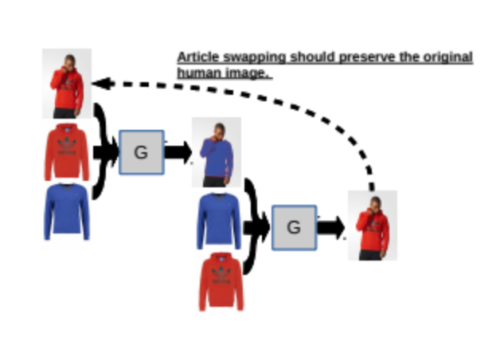
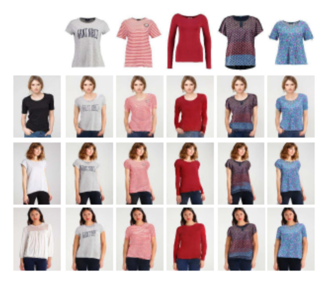
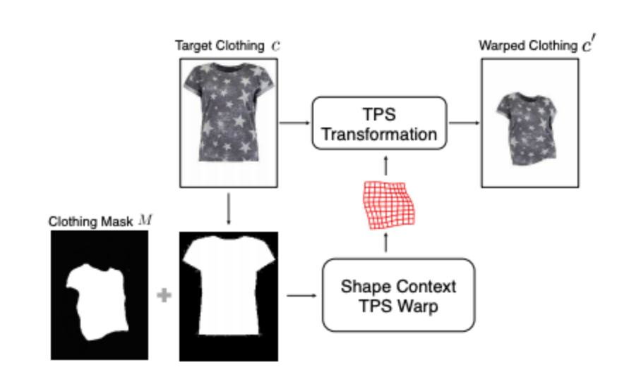
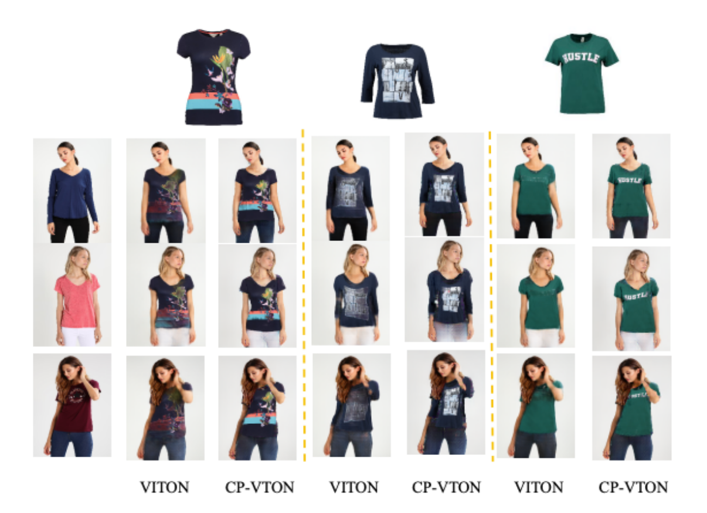
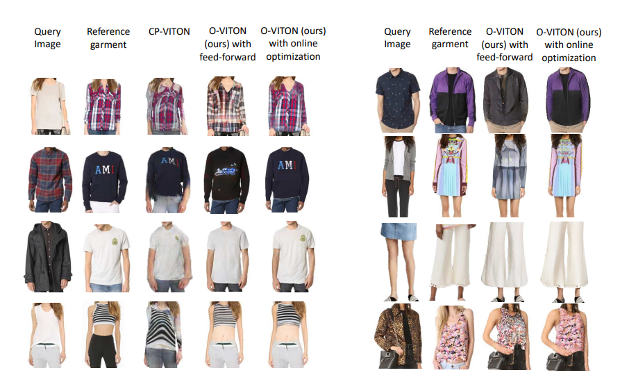
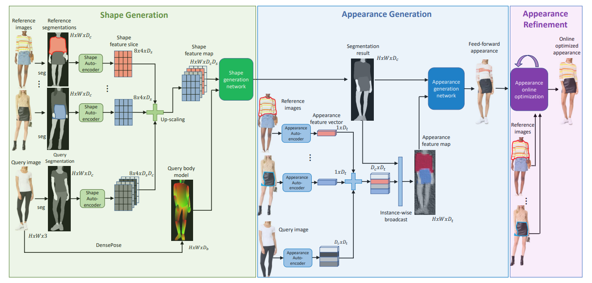
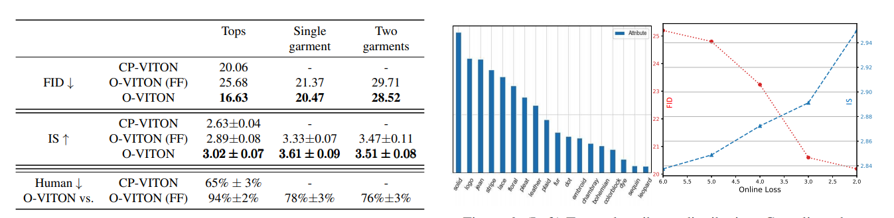
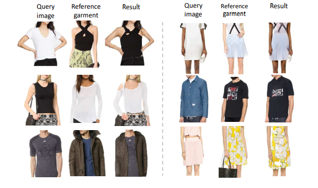

# Image Based Virtual Try-on Network from Unpaired Data
[https://blog.seishin55.com/entry/2020/06/13/182624](https://blog.seishin55.com/entry/2020/06/13/182624)
[http://openaccess.thecvf.com/content_CVPR_2020/papers/Neuberger_Image_Based_Virtual_Try-On_Network_From_Unpaired_Data_CVPR_2020_paper.pdf](http://openaccess.thecvf.com/content_CVPR_2020/papers/Neuberger_Image_Based_Virtual_Try-On_Network_From_Unpaired_Data_CVPR_2020_paper.pdf)
（まとめ @usako_tail）

著者
* Assaf Neuberger
* Eran Borenstein
* Bar Hilleli
* Eduard Oks
* Sharon Alpert

amazon Lab の人達

# どんなもの？
人の画像と服の画像から、仮想試着を行う手法

* カタログ画像と、それを着ているモデルの画像のデータセットで学習するので安価
* 複数の服をまとめて合成することができる

# 先行研究と比べてどこがすごい？
## 先行研究
* CAGAN
[https://arxiv.org/abs/1709.04695](https://arxiv.org/abs/1709.04695)
着ている服と着せたい服を入替えるというシンプルな手法(先の服を着た人 = 元の服を着た人 - 元の服 + 先の服)
模様があると上手くいかない

* VITON
[https://arxiv.org/abs/1711.08447](https://arxiv.org/abs/1711.08447)
着せたい服を着た状態に変形させてから合体させる手法

* CP-VTON
[https://arxiv.org/abs/1807.07688](https://arxiv.org/abs/1807.07688)
VITONでは複雑な模様になるとうまくいかない問題を変形部分をパラメータを使った変形に改良した手法
仮想試着のベンチマークとしてよく使われる

## 先行研究との差

* 細かい模様の精度もアップ
* 変形機構なしに上手く行くようになった

# 技術や手法の肝は？

## Shape Generation (形状フェーズ)
1. 着せ替えの対象の人物 (Query image)と、着せ替えたい服が含まれる画像 (Reference Images)を用意して、体のパーツ・服のパーツ毎のセグメンテーションを行う(今回の学習とは別途)
2. セグメンテーションでH×W×Dc(縦×横×クラス数)のont-hotな出力を得た後、着せ替えの対象の人物の各クラスのチャンネル数を1->Dsに変更してH×W×DcDsにする
3. 着せ替えの対象の人物の着せ替えたいクラスと、着せ替えたい服のクラスを入替えた後、up scaleしてShape feature mapを作る
4.  別途着せ替えの対象の人物のDense Poseと呼ばれるモデルに対するQuery Imageのの出力値を合わせてGAN (LSGAN)とPerceptual Lossを使って学習を行う
5. 学習の出力として着せ替え後のセグメンテーションのマップを出力する

## Appearance Generation (見た目の特徴フェーズ)
1. 着せ替えの対象の人物 (Query image)と、着せ替えたい服が含まれる画像 (Reference Images)から、各クラスDt次元になる特徴を抽出して、Shape Generationで出力されるセグメンテーションのマップの入替えることで、H×W×DtのAppearance feature mapとする(セグメンテーションの1クラス分を各服の模様部分と入れ替える)
2. 作成したAppearance feature mapとShape Generationの出力を入力にしてAppearance generation networkの入力として学習(学習方法はShape Generationと同じ)
3. 学習の出力として着せ替え後に想定される画像を出力する

## Appearance Refinement (見た目の最適化フェーズ)
1. オンライン最適化(推論する部分で学習のときにやるのと同様のステップを一定ステップ行う)を行う
学習データにないような服に対しても対応するために行う

# どうやって有効だと検証した？
定量的指標と人間の主観的知覚研究の両方で検証した

##  定量的指標

以下の３つの指標で比較
* フレシェットインセプション距離(FID)
* Inception Score (IS)
*  O-VITONとCP-VITONのヒト評価試験

オンライン最適化を行うことで結果がよくなるということも検証していた

## 結果

※ with feed-forward: Appearance Refinementなし
※ with online optimization: Appearance Refinementあり

# 議論はある？
失敗事例として頻繁に行われないポーズ、独特のシルエットを持つ衣服、複雑で反復性のないテクスチャーを持つ衣服などを挙げていた
オンライン最適化のステップで改良出来ないかという旨を書かれていた

# 次に読むべき論文は？
???

