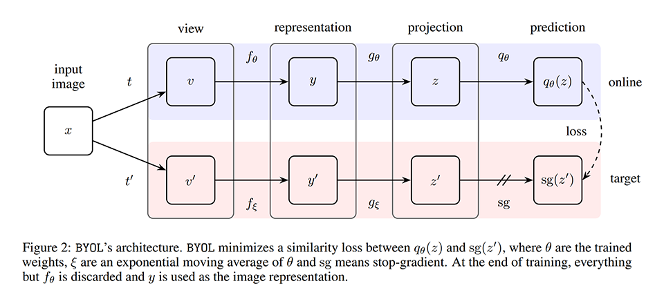
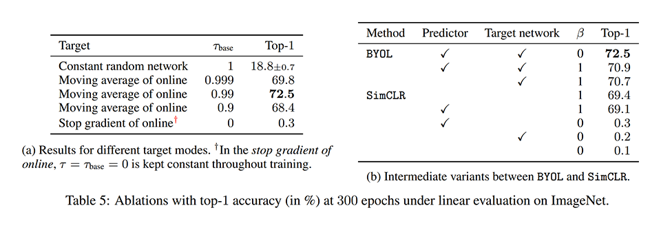
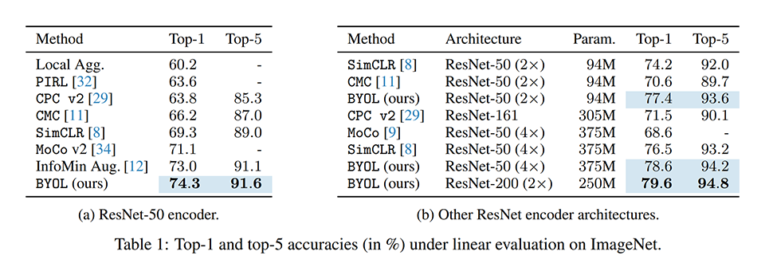
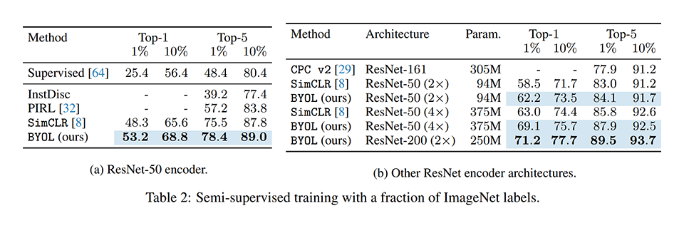
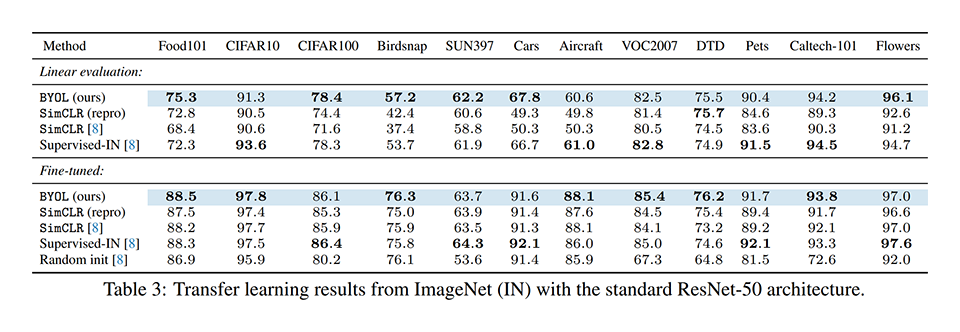
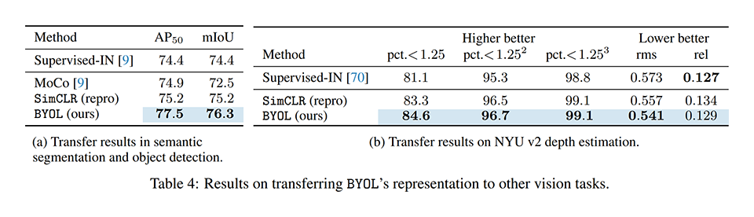

# [\[arxiv\]](https://arxiv.org/abs/2006.07733v1) Bootstrap Your Own Latent A New Approach to Self-Supervised Learning

- 著者
    - Jean-Bastien Grill ∗1
    - Florian Strub ∗1
    - Florent Altché ∗1
    - Corentin Tallec ∗1
    - Pierre H. Richemond ∗1 *2
    - Elena Buchatskaya *1
    - Carl Doersch *1
    - Bernardo Avila Pires *1
    - Zhaohan Daniel Guo *1
    - Mohammad Gheshlaghi Azar *1
    - Bilal Piot *1
    - Koray Kavukcuoglu *1
    - Rémi Munos *1
    - Michal Valko *1
- 所属
    - 1: DeepMind
    - 2: Imperial College

## どんなもの？
### BYOL (Bootstrap Your Own Latent)
自己教師あり対比学習を用いて画像の特徴抽出器を獲得する手法 (self-supervised contrasive learning of visual representations) である。
同種の最新手法である MoCo と SimCLR を組み合わせ、タスクの種類を変更した手法と言える。

- MoCo から受け継いだもの: Momemtum Encoder ※ Batch as Queue は受け継いでいない。
- SimCLR から受け継いだもの: Random Crop and Color Distortion, Projection Head, LARS optimizer
- タスクの種類: 類似ペアと非類似ペアの識別 ⇒ 類似ペアの距離の最小化

### 素朴な Self-Supervised Contrasive Learning
データオーグメンテーションにまつわる背景知識（同じデータから生成されるデータは類似、異なるデータから生成されるデータは非類似）を用いて類似ペアと非類似ペアを生成する。
ペアのそれぞれを Encoder（特徴抽出器）で特徴ベクト化し、特徴ベクトルのペアが類似しているかどうかを学習させることで、データオーグメンテーションに不変な特徴抽出器を獲得する。

### MoCo (Momentum Contrast for Unsupervised Visual Representation Learning)
良い特徴抽出器を得るためにはバッチサイズを非常に大きくする必要がある（ペアの量が増えるとデータの位置関係が正確に求まりやすくなるためだと考えられる）。しかし、バッチが大きくなると計算量が非常に大きくなる。
そこで、MoCo はバッチを固定長のキュー (Batch as Queue) とみなし、イテレーションごとにキューに追加されるデータに関する部分だけ計算対象とすることで、計算量を抑える。
計算対象を抑えるには、過去に追加されたデータから求めた特徴ベクトルを保持し、計算対象外とする必要がある。
保持されている特徴ベクトルは古いパラメータの Encoder で求められたものであるため、新しいパラメータの Encoder で求められたものとは上手く比較できない。
そこで、MoCo は保持する特徴ベクトルを Momentum Encoder（Encoder のパラメータを指数平滑移動平均したもの）で特徴ベクトル化する。
Momentum Encoder は Encoder と比べてゆっくり変化するため、キュー内の特徴ベクトルの位置関係が維持されやすく、安定した比較が可能となる。

### SimCLR (A Simple Framework for Contrastive Learning of Visual Representations)
Self-Supervised Contrasive Learning で良い特徴抽出器が得られない原因がデータオーグメンテーションにあること（random crop と color distortion を同時に適用しなければならないこと）を突き止めた。
random crop だけでは色の分布から、color distortion だけでは形状から、類似ペアであることが簡単に見破れるが、同時に適用すると簡単には見破れない。
特徴抽出器の学習中はデータオーグメンテーションを強めに適用すると良いこと、Projection Head（Encoder と損失関数の間にかませる非線形変換） を導入すると良いことを発見した。
Self-Supervised Contrasive Learning へこれらのテクニックを導入するだけで（特別難しいことをしなくても） SOTA の性能を達成できることを示した。
ただし、大きなバッチへのケアはないので富豪的な計算資源と LARS optimizer（大きなバッチでも性能が悪くなりにくい最適化アルゴリズム）を用いている。

## 先行研究と比べてどこがすごい？
- 類似ペアのみから良い特徴抽出器が獲得できることを示した。
- Momentum Encoder に学習を安定化させる効果があることを発見した。
- シンプルな手法で既存手法を上回る性能を達成した。

## 技術や手法の肝は？
次の２つの選択により BYOL の性能は MoCo や SimCLR よりも良くなった。

- タスクの種類の変更（類似ペアと非類似ペアの識別 ⇒ 類似ペアの距離の最小化）により類似ペアだけで学習するようにした。非類似ペアをまぜて学習すると性能が悪くなることが分かった。
- MoCo から Momentum Encoder だけを受け継いだ。もともとはキューに格納された非類似ペアの特徴ベクトルの安定化のために考案されたが、特徴空間を安定化し、性能を改善する効果があることが分かった。非類似ペアを扱わないので Batch as Quuee は不要になったが、Momentum Encoder だけでも効果があるので採用した。

## どうやって有効だと検証した？

### 線形識別器を学習するタスク on ImageNet
事前に学習した特徴抽出器を用いて得られた特徴ベクトルを線形識別器を学習し、性能を比較した。

### 半教師あり学習タスク on ImageNet
利用するラベルの量を変化させて半教師あり学習を行い、性能を比較した。

### 転移学習タスク on ImageNet
各種タスク（分類・分割・検出・深度推定）に転移学習し、性能を比較した。
タスクとして比較した。

## 議論はある？
- 自己教師あり手法と教師あり学習との間のギャップのほとんどを埋めることができた。
- BYOL を他の分野（オーディオ，ビデオ，テキスト，…）へ一般化するには、各分野のデータオーグメンテーションの設計が必要となる。
- この設計を自動化することが、BYOL を他の分野へ一般化する次のステップとなる。

## 次に読むべきタイトルは？
- [\[arxiv\]](https://arxiv.org/abs/1911.05722v3) Kaiming He, Haoqi Fan, Yuxin Wu, Saining Xie, Ross Girshick, "Momentum Contrast for Unsupervised Visual Representation Learning", CVPR, 2020.
- [\[arxiv\]](https://arxiv.org/abs/2002.05709) Ting Chen, Simon Kornblith, Mohammad Norouzi, Geoffrey Hinton, "A Simple Framework for Contrastive Learning of Visual Representations", arxiv, 2020.
- [\[arxiv\]](https://arxiv.org/abs/2005.04966v2) Junnan Li, Pan Zhou, Caiming Xiong, Richard Socher, Steven C.H. Hoi, "Prototypical Contrastive Learning of Unsupervised Representations", arxiv, 2020.
