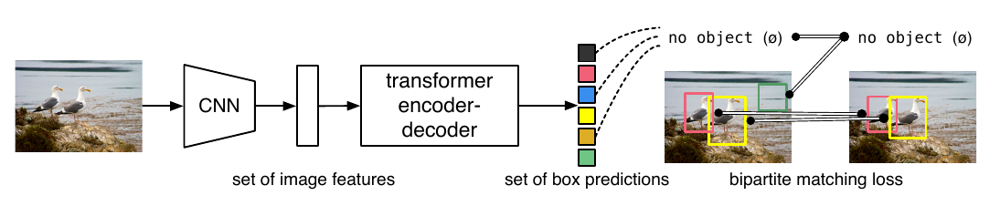
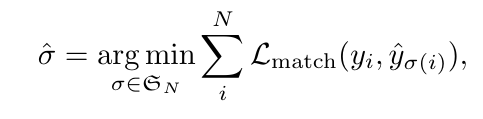
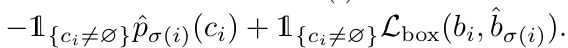
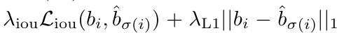
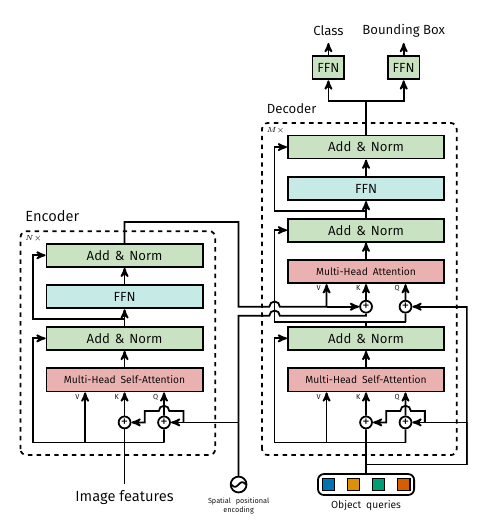
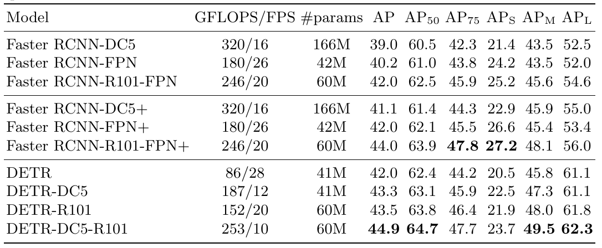
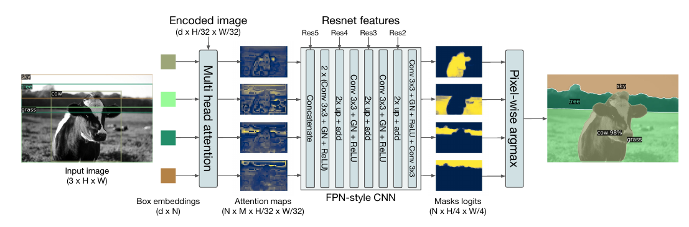

# End-to-End Object Detection with Transformers
[https://arxiv.org/abs/2005.12872](https://arxiv.org/abs/2005.12872)
(まとめ @n-kats)

著者
* Nicolas Carion
* Francisco Massa
* Gabriel Synnaeve
* Nicolas Usunier
* Alexander Kirillov
* Sergey Zagoruyko

Facebook AI

# どんなもの？
物体検出で feature pyramid などを作るのではなく、transformer を適用する手法（DETR）を提案。

クエリに対して検出した物体の一覧を出力する構造。そのため、それ以外にも様々な出力（segmentationなど）が可能。

画像認識のパラダイムシフトが起きる可能性がありそうで紹介。

# 先行研究と比べてどこがすごい？
物体検出に新しいアプローチを提案。よくある物体検出の方法と比べて次の意味でシンプル。

* NMSが不要
* 手動で設計したアンカー（だいたいこれくらいの大きさを検出するみたいな大きさ）が不要（そのためのタスクへの理解が不要）
* Faster R-CNN と同程度には賢い
* 検出以外にも応用可能
* backboneやtransformerのコードで数百行、DETRの部分が50行くらいでかけるくらいで簡単？

# 技術や手法の肝は？
本質的には次が重要
* （シングルパスの）ネットワークで物体の集合を出力
* BBox の集合についての set prediction loss で訓練

## メタアーキテクチャ

ネットワークは N 個の物体の分類と枠の座標を出力。N は一枚の画像内の物体の数より十分に大きくする（「no object」の意味のクラスを用意する）。

## Set Prediction loss
### 教師と認識結果の対応付け
* y_i: 教師。N 個になるように no object 埋める
* c_i: 教師のクラス
* b_i: 教師の枠座標
* \\hat{y}_i: ネットワークの出力
* \\hat{p}_i(c_j): 出力の確信度成分
* \\hat{b}_i: 出力の枠座標

とする。対応付けは次の式で決める（ハンガリアンアルゴリズムを利用）

（S_nは置換の集合。argminをとるので、この式は、対応付けのコストが最小のものを選ぶという意味）

対応付けのコスト L_match は次の式で与える（L_iouはgeneralized IoU loss）

### Hungarian loss

ただし、no object の場合の重みを小さくするような工夫をしたりする。

## ネットワーク

具体的なポイントは
* multi-head self-attention
* positional encodings

object query を N 個用意（アンカーの代わりの役割をする）

もっと細かいテク
* auxiliary decoding loss（decoderの途中から同じ認識をする分岐を生やして訓練）
* transformerはAdamでdropoutありで訓練するとよい
# どうやって有効だと検証した？
## COCO2017

faster R-CNNと同程度。

## panoptic segmentation
普通のセグメンテーションとインスタンスセグメンテーションを合わせたようなタスク。

セグメンテーション用のデコーダーを追加する（queryにBBoxを入れる）

# 議論はある？
小さい物体の検出に相性がいい？他にも新しいタスクができるかも？とはいえ、検出の進歩も数年かかっているから...
## 私見
slot数固定方式が気になる（Nの値）。とはいえ、アンカー方式は N の値がめちゃくちゃ大きくする方式でしかないから、気にしなくていいかも。

無視領域みたいなのはどうするといいのかな？マッチングの部分を丁寧にやればいいのかな？

今後こんな研究がありそう
* トラッキングに応用
* いろんなタスクで訓練したpretrainモデル: BERTが自然言語処理で実現した事項
* atariの強化学習タスクへの応用

# 次に読むべき論文は？
自然言語処理の発展の歴史みたいなのを見ると新しい応用が妄想すると楽しい？
* Attention is all you need
* BERT
