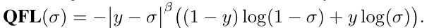
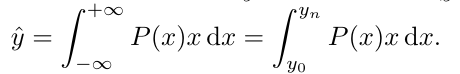
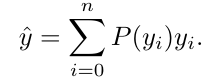
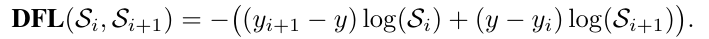
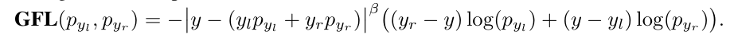
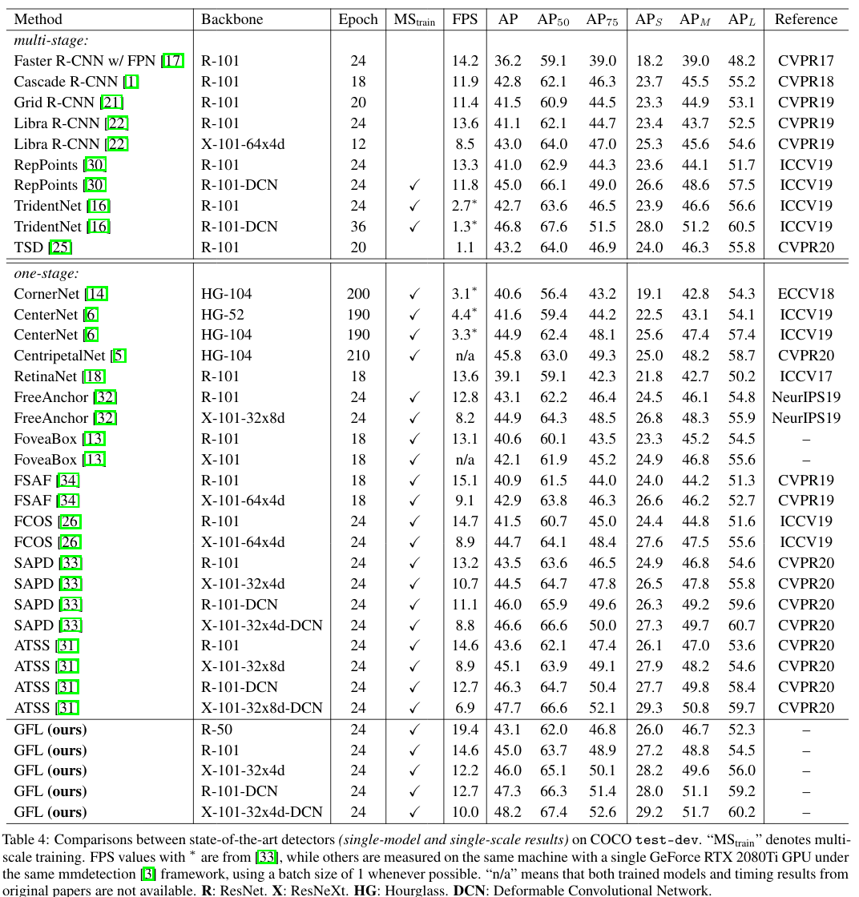

Generalized Focal Loss: Learning Qualified and Distributed Bounding Boxes for Dense Object Detection
===

Xiang Li, Wenhai Wang, Lijun Wu, Shuo Chen, Xiaolin Hu, Jun Li, Jinhui Tang, Jian Yang

https://arxiv.org/abs/2006.04388v1

@cohama

## どんなもの

- Focal Loss を一般化した Generalized Focal Loss を提案
- 物体らしさに加えて IoU のスコアを同時に推定する際に用いる Qualified Focal Loss (QFL)
- Noisy な枠の教師を確率分布 (ガウス分布に限らない自由な分布) を学習するための Distribution Focal Loss (DFL)
- ATSS (すごい RetinaNet みたいなやつ) の Loss を QFL と DFL を導入するだけで mAP + 1.0%
 - 速度低下は無視できるレベル

## 先行研究と比べて何がすごい？

- centerness や IoU score を同時に学習する手法をより洗練している
- 枠の教師のズレの不確かさについても対処できる

## 技術や手法の肝は

- 物体検出において、中心ぽさ (centerness FCOS) や IoU など、Localization のスコアも同時に推定すると最終的な検出の精度があがることが知られている
   - ただし、単純にブランチを分けて訓練するだけでは効果が限定的。
   - NMS を行う際のスコアとして物体らしさと centerness/IoU をかけ合わせたものを用いるが、これらは独立して学習させているので物体らしさは低いにもかかわらず IoU スコアが高いというような検出が行われてしまう。
   - 物体らしさと centerness/IoU スコアを Joint (掛け算?) したものを訓練することを考える。これは positive な教師を one-hot ではなく 0.9 などのような [0, 1] の連続値を取るような教師にするということ。
    - このような連続値を取るような物体らしさを学習するために、Focal Loss を拡張。これが QFL
    - 
- 枠の教師について、通常の物体検出ではデルタ関数のような確率分布 (つまり、ある値にだけピークがある) を仮定している
  - ガウス分布を仮定する方法もあるが、それでも強い仮定であり、現実の不確かさに対応するにはまだ不十分
  - もっと自由な確率分布に従うとして考える。予測したい座標の値 `y` はある分布 `P(x)` と `x` の積の積分で表現する
    - 
    - コンピュータで積分を扱うために適当に N 個の点に離散化して足し算に変形して近似
    - 
    - なお、`P(x)` は NN 的には N Channel の出力をもつ Softmax で実装すれば OK。実際の y は上記で計算する。
  - とはいえ、学習時に自由過ぎる分布を学習するのは難しいので、損失の計算は教師の y に近い2点 `y_i+1` と `y_i` だけで計算する。このとき、DFL を以下のように定義する
    - 
- 普通の Focal Loss および QFL と DFL は以下のような一般化した Focal Loss (GFL) の特殊化したものとみなせる
  - 

## どうやって有効だと検証した？
### QFL の精度向上

### DFL の精度向上

### SOTA との比較

## 議論はある?

- 枠の座標が取りうる値が確率分布として出てくるのは面白い
- N をどこまで取るかは問題によって変わる気がする。そのへんのコントロールは難しくないか
  - ある程度は事前に決められそうだが

## 次に読むべき論文
- [Bridging the Gap Between Anchor-based and Anchor-free Detection via Adaptive Training Sample Selection](https://arxiv.org/abs/1912.02424)
  - 比較のベースとなっている手法
- [FCOS: Fully Convolutional One-Stage Object Detection](https://arxiv.org/abs/1904.01355v3)
  - centerness を同時に推定する手法
- [IoU-aware Single-stage Object Detector for Accurate Localization](https://arxiv.org/abs/1912.05992)
  - IoU score を同時に推定する手法
- [Bounding Box Regression with Uncertainty for Accurate Object Detection](https://arxiv.org/abs/1809.08545)
  - 枠の不確かさについてガウス分布を仮定
