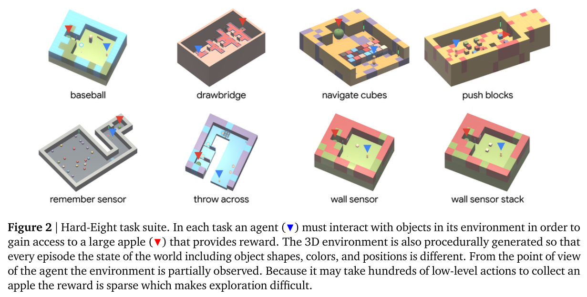
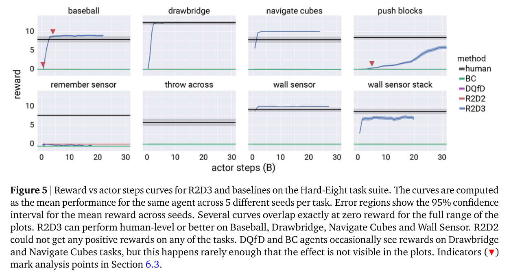

Making Efficient Use ofDemonstrations to Solve Hard Exploration Problems  
===

Caglar Gulcehre*,1, Tom Le Paine*,1, Bobak Shahriari1, Misha Denil1, Matt Hoffman1, Hubert Soyer1, Richard Tanburn1, Steven Kapturowski1,  
Neil Rabinowitz1, Duncan Williams1, Gabriel Barth-Maron1, Ziyu Wang1, Nando de Freitas1 and Worlds Team1  
*Equal contributions, 1DeepMind, London

[https://arxiv.org/pdf/1909.01387.pdf](https://arxiv.org/pdf/1909.01387.pdf)  

---

## どんなもの？

* R2D2を応用した手法。  
* DQfDというデモプレイを元に学習をさせる教師あり強化学習的な手法がある。これをR2D2と複合した。
* デモプレイを元にリカレントなネットワークを学習させる。同時にリプレイ軌跡を時系列に学習に学習させて、デモとAgentの時系列軌跡の差を小さくしていく。  
* デモというある種の教師データを用いることで、Agentの探索のみでは最適解が探し難いような環境での探索を、デモからの学習で補う。

R2D2：Recurrent Replay Distributed DQN  
DQfD：Deep Q-Network for Demonstration  
BC：Behavioral cloning

   

---

## 先行研究と比べて何がすごい？  

* R2D2をベースにデモとAgentの探索を合わせて学習することで、スパースな報酬に対応するモデルを提案した。  
* Hard-Eight Task Suiteと呼ぶ、8種の評価用タスクを新たに提案した。  

* 先行研究での課題  
  1. スパースな報酬環境  
  2. 環境の観測が部分的(一人称視点のように全体が俯瞰できない)である場合の学習  
  3. モデル等の事前知識による作りこみの必要性  
  4. 初期状態に依存するタスク  

これらにアプローチするための手法と評価方法の提案。  

---

## どうやって有効だと検証した？  

* Hard-Eight Task Suiteを用いてR2D3、R2D2+BC、DQfDと比較。  
  
  

* 提案したHard-Eight Task Suiteでは、R2D3以外はタスクを完了できなかった。  
  
  

---

## 技術や手法の肝は？

* R2D2  
  R2D2のリカレントなReplay Memoryを利用することで、報酬が得られない間の行動を時系列で学習させる。  
  このリカレントなネットワークを学習させるために、デモプレイを教師データとして与えることで、学習が進むようにしている。  

* demo-ratio  
  demo-ratioと呼ぶパラメータによりデモを使用する場合とAgentの探索を使用する場合の割合を決める。

* Hard-Eight Task Suite  
  1. Baseball  
  2. Drawbridge  
  3. Navigate Cubes  
  4. Push Blocks  
  5. Remember Sensor  
  6. Remember Sensor  
  7. Wall Sensor  
  8. Wall Sensor Stack  
   

---

## 議論はある？

* 報酬が得られない間の行動を、ある程度事前にさせておくことでスパースな報酬環境に対応することが狙いでるが、過学習が起きると汎化できない。  

所感：探索だけで解を見つけるのが難しい問題に対して、事前知識をデモの学習により与えるということだが、事前知識に頼りすぎても良い結果が得られないということのようです。結局、どのようにバランスをとるのか？という問題は解決していない。

---

## 次に読むべき論文は？

* [Deep Q-learning from Demonstrations https://arxiv.org/abs/1704.03732](https://arxiv.org/abs/1704.03732)  

