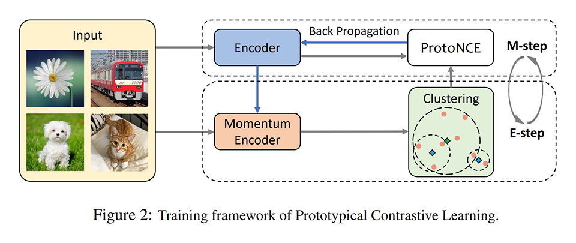
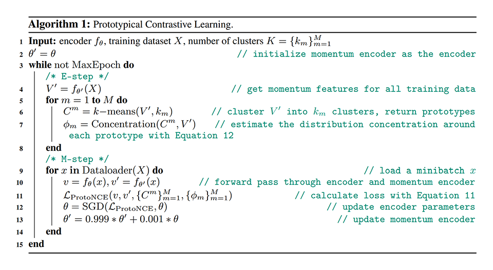
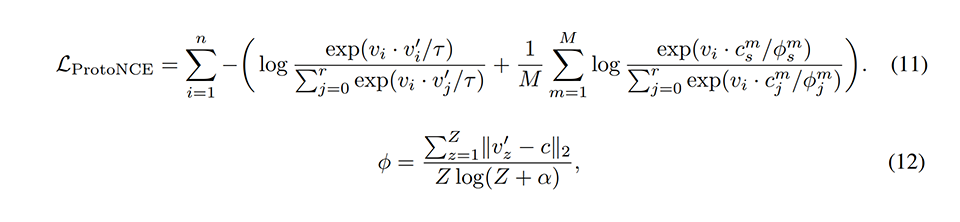
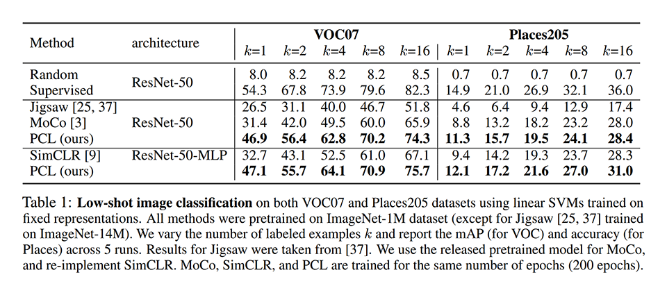
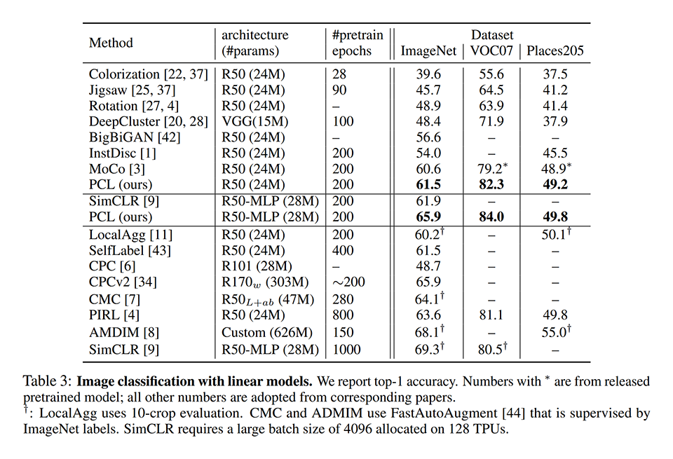
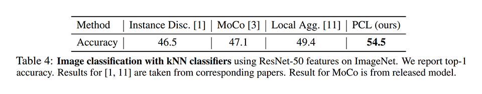
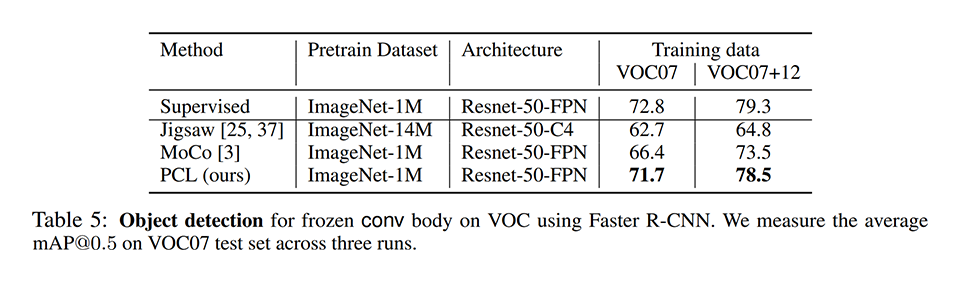
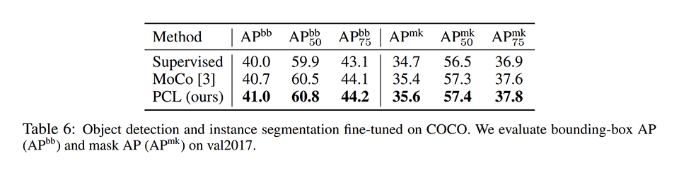

# [\[arxiv\]](https://arxiv.org/abs/2005.04966v2) Prototypical Contrastive Learning of Unsupervised Representations

- 著者
    - Junnan Li *1
    - Pan Zhou *1
    - Caiming Xiong *1
    - Richard Socher *1
    - Steven C.H. Hoi *1
- 所属
    - 1: Salesforce Research

## どんなもの？
### PCL (Prototypical Contrastive Learning)
自己教師あり対比学習を用いて画像の特徴抽出器を獲得する手法 (self-supervised contrasive learning of visual representations) である。
同種の最新手法である MoCo にクラスタの概念を導入したものと言える。

## 先行研究と比べてどこがすごい？
- 既存手法を大きく上回る性能を達成した。
- （私見）様々なタスクに応用できそうな正則化手法である。

## 技術や手法の肝は？
次の３つの選択により特徴抽出器の性能を大きく改善した。

- 各データに対応する特徴ベクトルを、各データが属するクラスタのクラスタ中心に近づけることで、よりデータの構造を反映した特徴抽出器が得られる。
- ProtoNCE の温度パラメータをクラスタの密度で定めることで、クラスタがバランスされ、結果としてよい特徴抽出器が得られる。
- 複数の観点でクラスタリングすると学習が安定する。

## どうやって有効だと検証した？

### 線形識別タスク（学習データ量：少） on VOC07 / Places205
ImageNet-1M で事前に教師なし学習した特徴抽出器を用いて画像に対応する特徴ベクトルを求め、特徴ベクトルから画像のカテゴリを予測する線形 SVM を学習し、性能を求めた。学習に用いるカテゴリごとの画像を変化させ、既存手法と比較した。

### 半教師あり学習タスク on ImageNet
ImageNet で事前に教師なし学習した特徴抽出器をバックボーンとする DNN をファインチューンし、性能を求めた。ファインチューンに用いる教師ありデータの量を変化させ、既存手法と比較した。

### 線形識別タスク on ImageNet / VOC07 / Places205
事前に学習した特徴抽出器の重みを固定したものをバックボーンとする DNN をファインチューンし、性能を求め、既存手法と比較した。

### KNN による識別タスク on ImageNet
事前に学習した特徴抽出器を用いて画像に対応する特徴ベクトルを求め、特徴ベクトルから画像のカテゴリを予測する KNN を学習し、性能を求め、既存手法と比較した。

### 物体検出タスク on VOC07 / VOC07+12
事前に学習した特徴抽出器の重みを固定したものをバックボーンとする Faster R-CNN をファインチューンし、性能を求め、既存手法と比較した。

### 物体検出タスク・領域分割タスク on COCO
事前に学習した特徴抽出器をバックボーンとする Mask R-CNN をファインチューンし、性能を求め、既存手法と比較した。

## 議論はある？
- 対称学習にクラスタの概念を導入し、既存手法を大きく上回る性能を達成した。
- 提案手法を用いることでウェブ上にある膨大な教師なしデータから高性能な特徴抽出器を作成でき、これを用いれば少量の教師ありデータで高性能なモデルを作成できる。結果として、教師データ作成コストを削減できる。更に、学習済みモデルも提供すればファインチューンに必要な計算コストも削減できる。
- （私見）識別タスクでは従来手法を大きく上回る結果がでているが、物体検出タスクや領域分割タスクではそれほど大きく上回っていないのは何故なのか気になる。

## 次に読むべきタイトルは？
- [\[arxiv\]](https://arxiv.org/abs/1911.05722v3) Kaiming He, Haoqi Fan, Yuxin Wu, Saining Xie, Ross Girshick, "Momentum Contrast for Unsupervised Visual Representation Learning", CVPR, 2020.
- [\[arxiv\]](https://arxiv.org/abs/2002.05709) Ting Chen, Simon Kornblith, Mohammad Norouzi, Geoffrey Hinton, "A Simple Framework for Contrastive Learning of Visual Representations", arxiv, 2020.
