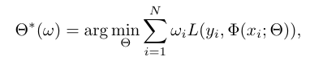
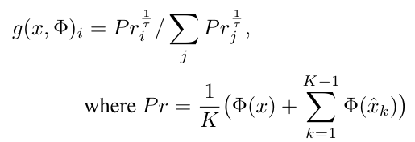
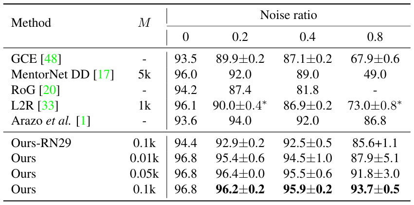
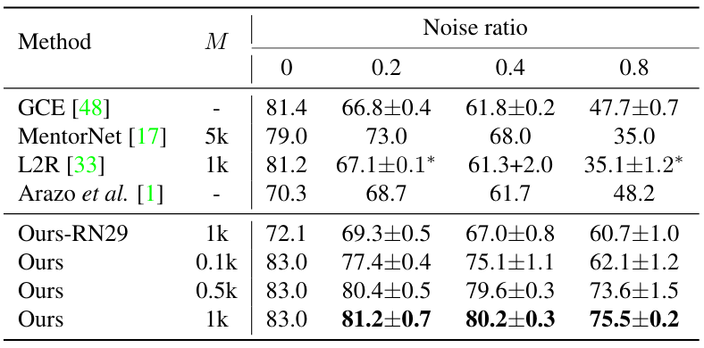

Distilling Effective Supervision from Severe Label Noise
===

Zizhao Zhang, Han Zhang, Sercan Ö. Arık, Honglak Lee, Tomas Pfister
(Google Cloud AI, Google Brain)

[paper](https://openaccess.thecvf.com/content_CVPR_2020/papers/Zhang_Distilling_Effective_Supervision_From_Severe_Label_Noise_CVPR_2020_paper.pdf)

CPVR2020 accepted

@cohama

## どんなもの?

- ラベルにノイズがある場合の画像分類の SOTA を大きく更新
  - 1クラス10枚の信頼できるデータ、それ以外はある確率で間違ったラベルのデータで学習するという問題設定
  - ラベルノイズ 20% の CIFAR-100 でほぼ教師ありと同程度の精度 (81.2%)
  - ラベルノイズ 90% の CIFAR-100 で acc 64.8% これは半教師よりもまだ高い値
- ノイズのあるデータセット Food101N、Clothing1M、WebVision でも ほぼ SOTA
- この手法の一部を使って半教師あり学習にしても SOTA
  - 1クラス10枚 (計100枚) の画像で CIFAR-10 の acc 94.5%

## 技術や手法の肝は？

- 既存の L2R (meta learning based re-weighting) を拡張
  - 
  - ω は各データ点に対する重み
  - 信頼できるデータに対する損失が小さくなるように ω を学習する (メタ学習)
    - NN の重みはノイズがあるかもしれないデータに対する損失で学習する
- 疑似ラベル
  - 
  - K 個のオーグメントされたデータの推論結果を平均化したものの温度付き softmax (先鋭化) して各クラスの確率を得る
    - ここまでは半教師ありの SOTA の MixMatch と同じ
  - 種々のオーグメントにより推論結果がばらつかないような正則化をする。
    - オーグメントなしの画像の結果の確率分布とオーグメントした画像の確率分布の KL-divergence を損失に加える
    - オーグメントは AutoAugment
- 疑似ラベルとノイズラベルの混合
  - 疑似ラベルを使うのかノイズラベルを使うのかをパラメータ λ で決める
    - λ は学習可能なパラメータ。メタ学習により決定
  - 実際の NN の訓練ではそのステップ内で決定された λ を 0 または 1 にする。
  - 
- MixUp
  - 信頼できるデータをそのまま使うと過学習してしまう。信頼できるデータは常に Mixup した形で訓練に使う

## どうやって有効だと検証した？

## 先行研究と比べて何がすごい？

- 従来手法はより少ないデータしか使わない半教師あり手法に負けていた。
  - 本手法は半教師ありを上回る性能
- ノイズデータに対する認識で SOTA
  - 人工的にノイズを入れたものだけでなく、元からノイズの多いデータセットでもほぼ SOTA
- KL を使うだけで半教師ありの精度も向上。これもほぼ SOTA

## 議論はある?

- 人工的に作ったノイズだからすごくうまく行っている？
  - ノイズありデータセットでもちゃんと成果を出している
  - 伸び幅は控えめ
- AutoAugment 使うのはだめでは？
  - RandAugment でも同じくらい精度出るらしい

## 次に読むべき論文

- Learning to Reweight Examples for Robust Deep Learning (https://arxiv.org/abs/1803.09050)
- MixMatch: A Holistic Approach to Semi-Supervised Learning (https://arxiv.org/abs/1905.02249v1)
