# Transformers are RNNs: Fast Autoregressive Transformers with Linear Attention
[https://arxiv.org/abs/2006.16236](https://arxiv.org/abs/2006.16236)
(まとめ @n-kats)

著者
* Angelos Katharopoulos
* Apoorv Vyas
* Nikolaos Pappas
* François Fleuret

Idiap Research Institue等（スイス）

# どんなもの？
transformerの計算量を通常O\(n^2\)からO\(n\)にした論文（nは入力の長さ）

transformerを頭から順に処理するRNNの形に変形

曰く、4000倍速くなった

# 先行研究と比べてどこがすごい？
先行研究の計算量
* オリジナル: O\(n^2\)
* sparse transformer\(Childら、2019\): O\(n \\sqrt n \)
* Reformer\(Kitaevら、2020\): O\(n \\sqrt n \)

sparse transformerはattention行列のsparse factorizationで計算量を落とす。ReformerはLSH\(locality sensitive hashing\)を利用。

linear transformerはattentionの計算方法を見直し、掛け算の順序を工夫して高速化。

# 技術や手法の肝は？
ポイントは
* softmaxの削除
* 計算順を(QK)VからQ(KV)に変更
* attentionの見る範囲は前の部分だけにする（先を見ない）
* recompute gradが有効

## オリジナルのtransoformer
オリジナルのattentionのやり方
* x: shape [N, F] 入力
* W_Q: shape [F, D] 入力をqueryに変換する行列
* W_K: shape [F, D] 入力をkeyに変換する行列
* W_V: shape [F, M] 入力をvalueに変換する行列

softmaxの中身はNxNの行列で各行でsoftmaxを適用（queryとkeyを比較して、各単語に対して文全体でどこに注目するかを出す）。注目度に応じてvalueを引っ張ってくる。

## softmaxの除去
オリジナルを少し抽象化すると

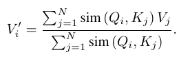

softmaxの場合は sim\(q, k\) = exp\(q・k / √D\) で掛け算が先になる。これを sim\(q, k\) = φ\(q\)・φ\(k\)に変更。

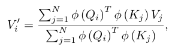

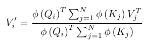

この計算変更でqueryとkeyを比較するより先に辞書\(keyとvalue\)を計算する形になって、NxNの行列が出現しなくなる。
\(A: LxM行列, B:MxN行列のときABの計算にLMN回の掛け算が必要。計算結果がNxN行列のところははL=Nな場合\)

φの部分はelu+1など

## attention範囲の制限
attentionで見る範囲をその単語以前に制限する。式にするとシグマの上についている文字がNからiに変更するだけ

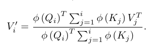

これをすることでRNN化できる。

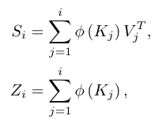

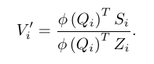

新しい単語毎にS_iとZ_iの差分を更新すればいい。

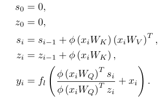

勾配計算でも同様のことが可能。訓練時にattention周りの計算結果を記録せず、勾配計算の時に再計算してメモリを効率的に使える\(recompute grad\)

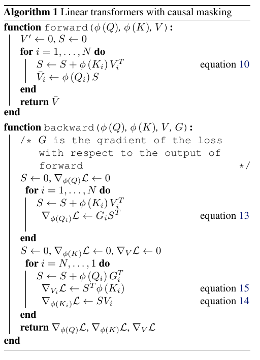

# どうやって有効だと検証した？
次の観点で評価
* 計算コスト
* メモリ使用量
* 収束速度
* 処理速度
* 個別のタスク
  * 画像生成\(MNIST, CIFAR10\)
  * 音声認識\(WSJ\)

比較相手は
* softmax: オリジナル
* lsh-X: Reformer

## 計算時間、メモリ効率
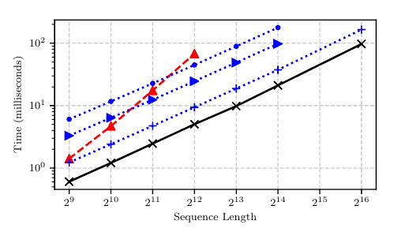

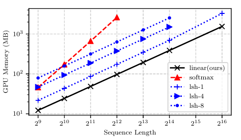

せっかくO\(N\)にしたが、Reformerでも何倍か遅い程度の違いしかない。オリジナルは傾きが違う

## 収束速度
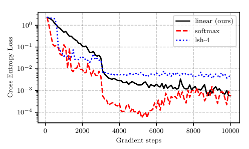

sequence duplication taskで比較。オリジナルが先に下がっていて、微妙な表だけど、計算速度の効率化とかも考えると実時間ベースではもっと差がある？

## 処理速度
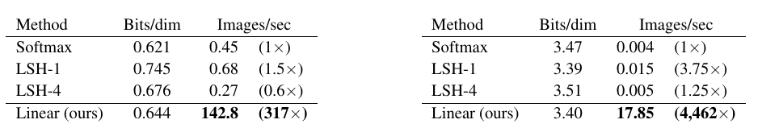

速くなりすぎて初歩的なバグをしていないか疑いたくなるレベル（MNISTやCIFAR10の生成の処理時間）

## 画像生成
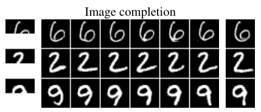

画像上半分を切って残りを生成。画像はflatにして左上から順に系列に変換。

## 音声認識

# 議論はある？
次のようなfurture workがありそう
* RNNなりtransformerで情報を貯めておく仕組みについて考え直す
* linear attentionの特徴マップの作り方を探索

## 私見
あんまり本格的な実験がしていなくて実験の章は微妙。画像を左上から順に時系列にするのはあれだけど、先に辞書を作るスタイルだけ持ってきてもいいかも

# 次に読むべき論文は？
* sparse transformer
* Reformer
