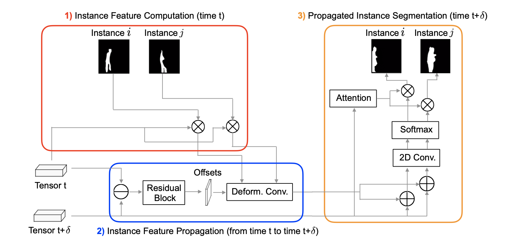
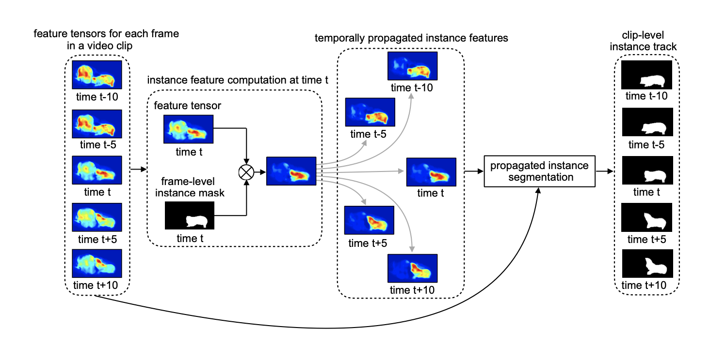
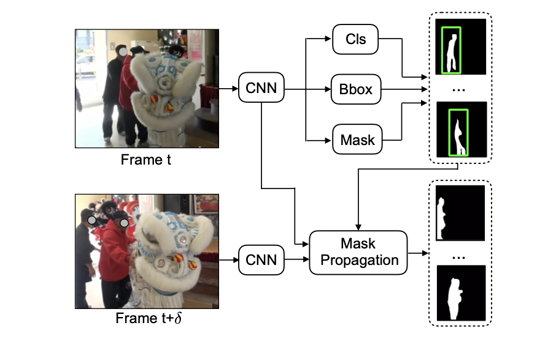
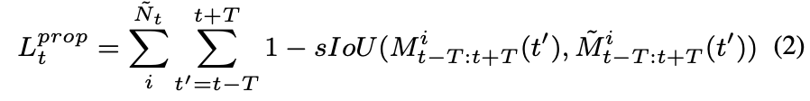
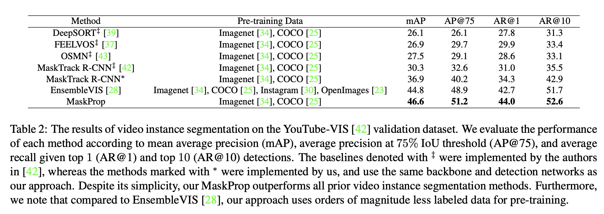
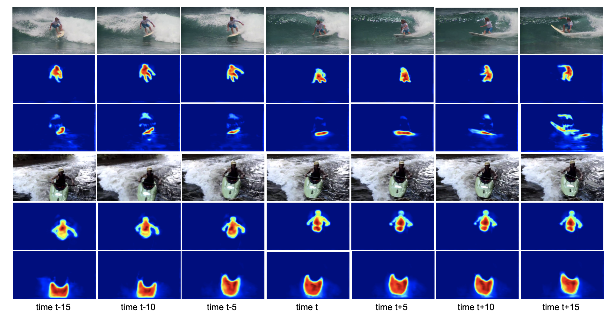
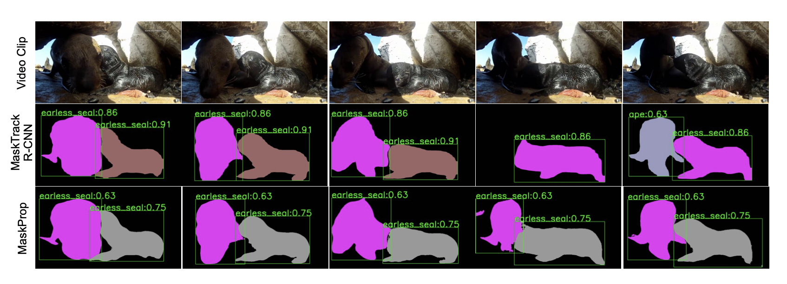
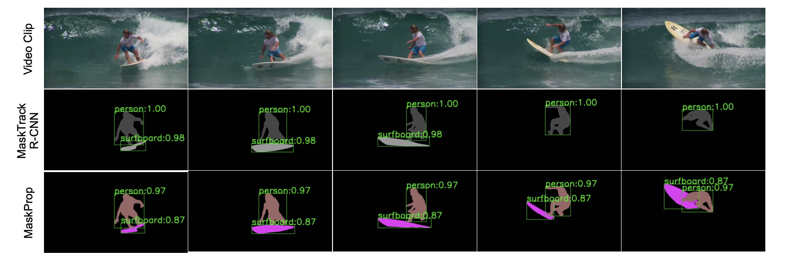

Classifying, Segmenting, and Tracking Object Instances in Video with Mask Propagation
===

2019/12 Gedas Bertasius, Lorenzo Torresani (Facebook AI)

https://arxiv.org/pdf/1912.04573.pdf

---

## どんなもの？
- 映像中のオブジェクトのセグメンテーションを行う

## 先行研究と比べて何がすごい？
- 分割された連続する複数フレーム単位（クリップ）で予測を行う。
- end-to-endで学習できる。

## 技術や手法の肝は？

### モデル構造

- 映像のある時刻tのフレームと、その前後Tフレームを１つのクリップとして扱うものとする。
- 全体像としては、時刻tのフレームに対してはMask R-CNNでmaskを予測し、t + d (-T <= d <= T)に対してはMask Propagationに予測させる。
- 最後に全ての予測クリップをうまく連結すれば、動画全体の予測が出来上がる。

### 予測クリップを連結
- 中心の時刻がtのクリップと、中心の時刻がt'を連結したいが、これらのクリップがTフレーム分重複しているとする。
- 重複している2つのフレーム内で同一のオブジェクトであることをどうやって識別するか？
    - 直前のクリップに含まれる全オブジェクトとのsIoUのフレーム平均を計算する
    - その最大値がある閾値以上であれば、その直前のフレームのオブジェクトと同じIDを割り振って、閾値以下であれば新しいIDを割り振る

### 学習

- Mask R-CNNで用いられた誤差関数に加えて、上記のmask propに関する誤差関数を加えて学習する。

## どうやって有効だと検証した？
### 従来手法と精度比較
- YouTube-VISというデータセットに対して予測を行なった。
- MaskTrack R-CNN は end-to-end で学習可能だが、精度が低い
- Ensemble VIS は ICCV2019 Winner 、bbox, maskなど各予測ごとに別々のモデルを学習させる必要がある。

### 可視化
- MaskPropでの予測結果

- 従来手法との比較

