# PointNet: Deep Learning on Point Sets for 3D Classification and Segmentation
[https://arxiv.org/abs/1612.00593](https://arxiv.org/abs/1612.00593)

[https://qiita.com/arutema47/items/cda262c61baa953a97e9](https://qiita.com/arutema47/items/cda262c61baa953a97e9)

[https://qiita.com/KYoshiyama/items/802506ec397559725a1c](https://qiita.com/KYoshiyama/items/802506ec397559725a1c)

[https://www.slideshare.net/FujimotoKeisuke/point-net](https://www.slideshare.net/FujimotoKeisuke/point-net)

[https://www.slideshare.net/naoyachiba18/metastudy](https://www.slideshare.net/naoyachiba18/metastudy)

（まとめ @usako_tail）

著者
* Charles R. Qi
* Hao Su
* Kaichun MoLeonidas
*  J. Guibas

スタンフォード大の人たち

# 点群データの特徴
## 点が順不同
* 点群の点に順序がない
* 入れ替わったとしても同じ物体を示す

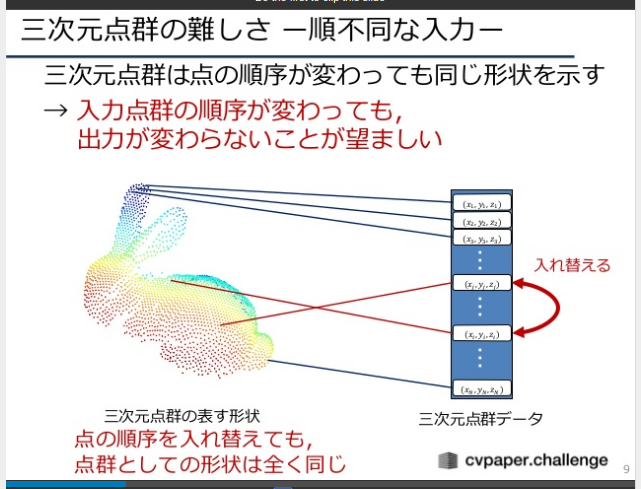

## データ上の隣接点
* 順序がない=隣同士の点に意味がない

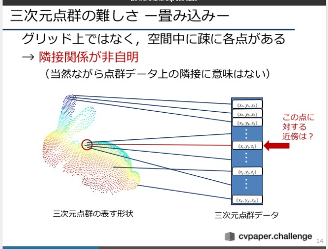

## 物体の姿勢が変化する
* 姿勢が変化しても同じ物体である

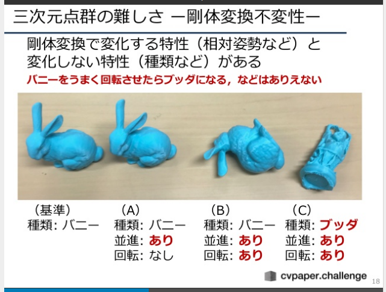

# 点群機械学習での重要点

## 順不変性
* 点群の順序が変わった状態で入力されても同じ結果を返さなければいけない

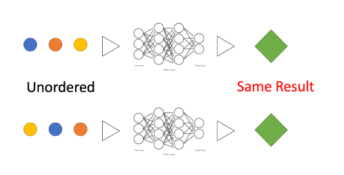

## 移動不変性 
* 並行移動、回転等を掛けた状態で入力されても同じ結果を返さなければいけない

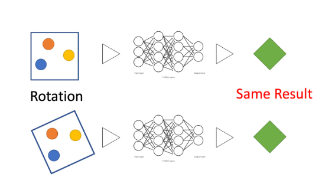

##  局所性
* 空間的に近い点は何かしら密接な関連性があるが、遠い点同士はあまり関連性がない
	* この特徴は点群特有ではなくて画像も持っているもの	
	* 画像であれば畳み込みすることで近い特徴をとりこんでいる

# PointNet
## どんなもの?
* 点の順序や向きの動きに強い
* 応用範囲が広い
	* 分類、セグメンテーション、点の特徴抽出

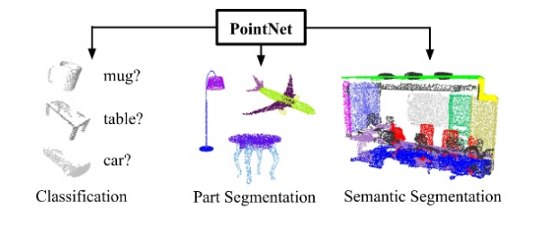

# 技術や手法の肝は？
## 構成

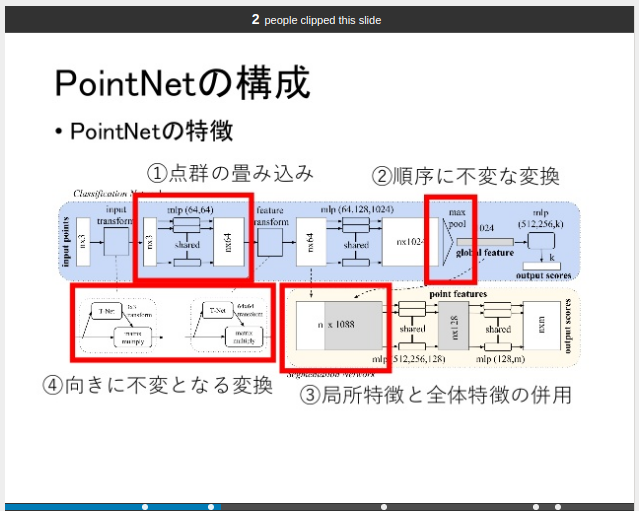

## 特徴
### maxpooling
* 点に対する特徴量抽出後、maxpoolingで全体特徴量を得る
* 入力要素の内、最大の要素を出力とする関数なので、どういう順序で入力しても同じ決結果を得られる=順不変性を得られる！

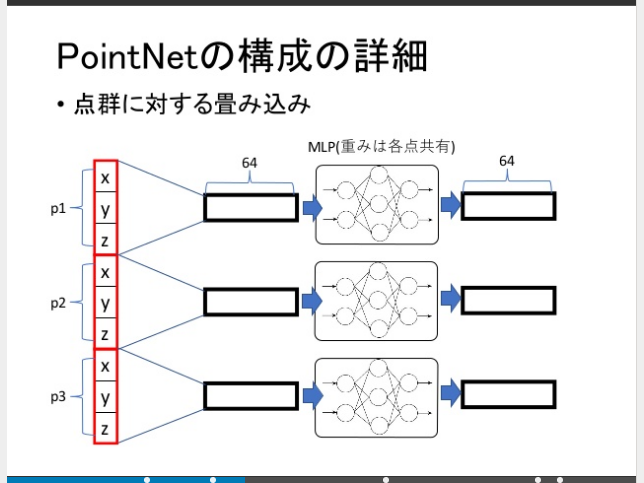

### 点の特徴量と全体の特徴量を合体
* そのまま合体させる

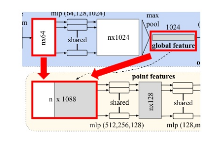

### アフィン変換(T-Net)
* 入力点群を平行・回転移動し、移動不変性を近似的に得ている

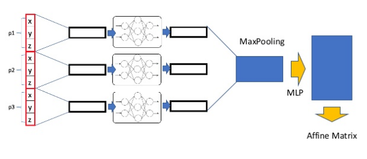

# どうやって有効だと検証した？

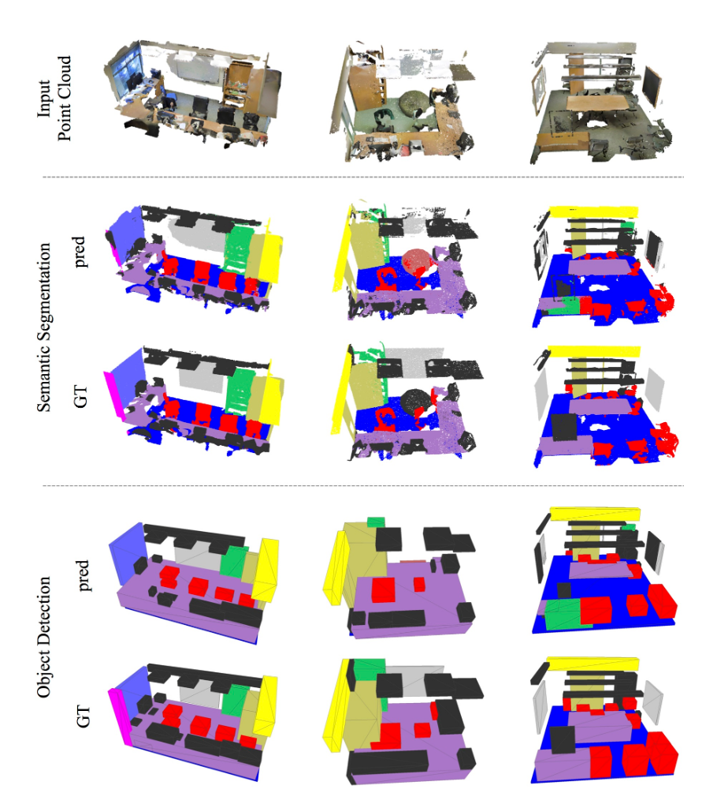

# 議論はある？

* 厳密には移動普遍性は獲得できていない…
	* 2つの点の距離などを使う必要がある
	* 2つの点を平行移動させたり、回転移動させたりしても、その距離は一定なので

SchNetやHIP-NNという論文で提案されている

[https://papers.nips.cc/paper/6700-schnet-a-continuous-filter-convolutional-neural-network-for-modeling-quantum-interactions](https://papers.nips.cc/paper/6700-schnet-a-continuous-filter-convolutional-neural-network-for-modeling-quantum-interactions)

[https://aip.scitation.org/doi/abs/10.1063/1.5011181](https://aip.scitation.org/doi/abs/10.1063/1.5011181)

* 点群の畳み込みが提案されていない…
	* 近傍点群の情報を取り込めない→後から出た論文で色々提案されている

PointNet++など

[https://arxiv.org/abs/1706.02413](https://arxiv.org/abs/1706.02413)

# 次に読むべき論文は？

#### PointNet++
Pointnetの進化版

[https://arxiv.org/abs/1706.02413](https://arxiv.org/abs/1706.02413)

