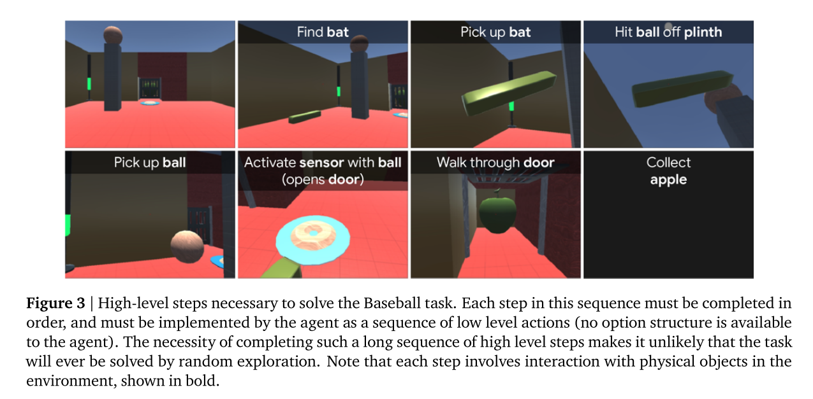

Making Efficient Use ofDemonstrations to Solve Hard Exploration Problems  
===

Caglar Gulcehre*,1, Tom Le Paine*,1, Bobak Shahriari1, Misha Denil1, Matt Hoffman1, Hubert Soyer1, Richard Tanburn1, Steven Kapturowski1,  
Neil Rabinowitz1, Duncan Williams1, Gabriel Barth-Maron1, Ziyu Wang1, Nando de Freitas1 and Worlds Team1  
*Equal contributions, 1DeepMind, London

[https://arxiv.org/pdf/1909.01387.pdf](https://arxiv.org/pdf/1909.01387.pdf)  

---

## どんなもの？

* R2D2を応用した手法。  
* デモプレイを元にリカレントなネットワークを学習させる。同時にリプレイ軌跡を時系列に学習に学習させて、デモとAgentの時系列軌跡の差を小さくしていく。  
* デモというある種の教師データを用いることで、Agentの探索のみでは最適解が探し難いような環境での探索を、デモからの学習で補う。

BC：Behavioral cloning
　　模倣学習の一種 デモを教師として学習させる。

DQfD：Deep Q-Network for Demonstration  
　　Q学習においてリプレイバッファに与えるデータとして、オペレータのデモデータと観測データの両方を用いる。

R2D2：Recurrent Replay Distributed DQN  
　　Q学習においてリプレイバッファにLSTMを用いることで良い性能を出した。

R2D3：Recurrent Replay Distributed DQN for Demonstration  
　　R2D2の学習時に、リプレイバッファに与えるデータとして、オペレータのデモデータと観測データの両方を用いる。

   

---

## 先行研究と比べて何がすごい？  

* R2D2をベースにデモとAgentの探索を合わせて学習することで、スパースな報酬に対応するモデルを提案した。 
* BCとDQfdというどちらもデモプレイを元に学習を行う手法と比較を行い、 
* Hard-Eight Task Suiteと呼ぶ、8種の評価用タスクを新たに提案した。  

* 先行研究での課題  
  1. スパースな報酬環境  
  2. 環境の観測が部分的(一人称視点のように全体が俯瞰できない)である場合の学習  
  3. モデル等の事前知識による作りこみの必要性  
  4. 初期状態に依存するタスク  

これらにアプローチするための手法と評価方法の提案。  

---

## どうやって有効だと検証した？  

* Hard-Eight Task Suiteを用いてR2D3、R2D2、DQfDと比較。  
  
  

比較として  
R2D3 vs R2D2 ： によるデモの有無による違い。  
R2D3 vs DQfD ： によるRNN有無による違い。  

* 提案したHard-Eight Task Suiteでは、R2D3以外はタスクを完了できなかった。  
  → R2D2 vs で考えると、デモによる学習は有用である。  
  → DQfD vs で考えると、RNNがあることが有用である。  
  
　R2D3では、8種中6種のタスクで、人のパフォーマンスを超えた。

---

## 技術や手法の肝は？

* R2D2  
  R2D2のリカレントなReplay Memoryを利用することで、報酬が得られない間の行動を時系列で学習させる。  
  このリカレントなネットワークを学習させるために、デモプレイを教師データとして与えることで、学習が進むようにしている。  
  これにより、BCのような単純な模倣学習では、オーバーフィットしてしまい多様なタスクに対応できず、ランダムな探索では学習が進まないようなスパースな報酬の環境にも対応できるような手法を提案した。  

* demo-ratio  
  demo-ratioと呼ぶパラメータによりデモを使用する場合とAgentの探索を使用する場合の割合を決める。

* Hard-Eight Task Suite  
  
 特徴
　基本、タスク完了で大きなリンゴを獲得すると報酬が得られる。小さなリンゴを複数獲得するというパターンもあり報酬のスパース度合いが異なる。
  1. Baseball  
     Agentが棒でキーになる物体をたたくとドアが開いて、リンゴを獲得すると報酬が得られる。
  2. Drawbridge  
   　Agentが跳ね橋でつながった迷路を探索する、キーになるオブジェクトに触れると跳ね橋が動作する。
   　途中リンゴがあり、多くのリンゴを獲得するパスを探索する。
  3. Navigate Cubes  
  　 部屋の反対側の壁にリンゴがあり、部屋の中にある移動可能なブロックを移動して、リンゴを獲得すると報酬が得られる。
  4. Push Blocks  
   　部屋にあるセンサとオブジェクトが配置されており、同じ色のセンサとオブジェクトを合わせるとリンゴが獲得できる。
  5. Remember Sensor  
   　廊下にあるセンサの色を記憶して、同じ色のブロックをセンサの場所に移動させるとリンゴが得られる。
   　複数あるセンサの色と場所を記憶して、合わせるという点がポイント
  6. Throw Across  
   　U字型の部屋の反対側にリンゴがあり、U字の底には扉がある。周辺にあるオブジェクトを移動させると扉が開いてリンゴが得られる。
  7. Wall Sensor  
   　壁にあるセンサと対応するオブジェクトを組み合わせると、扉が開きリンゴが得られる。
  8. Wall Sensor Stack  
   　Wall Sensorと似ているが、オブジェクトが2つありオブジェクトを積み上げないとセンサが動作させられない。
   　

---

## 議論はある？

* 報酬が得られない間の行動を、ある程度事前にさせておくことでスパースな報酬環境に対応することが狙いでるが、過学習が起きると汎化できない。  
*  demo-ratioは、小さいほうが良い結果が得られるとのこと。

---

## 次に読むべき論文は？

* [Agent57: Outperforming the Atari Human Benchmark https://arxiv.org/abs/2003.13350](https://arxiv.org/abs/2003.13350)  

