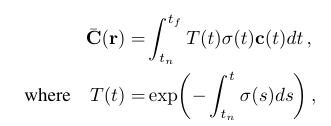
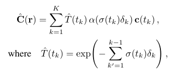
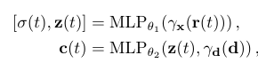
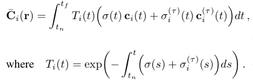
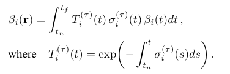
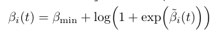
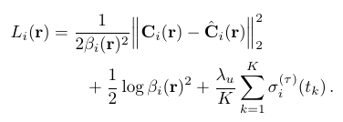
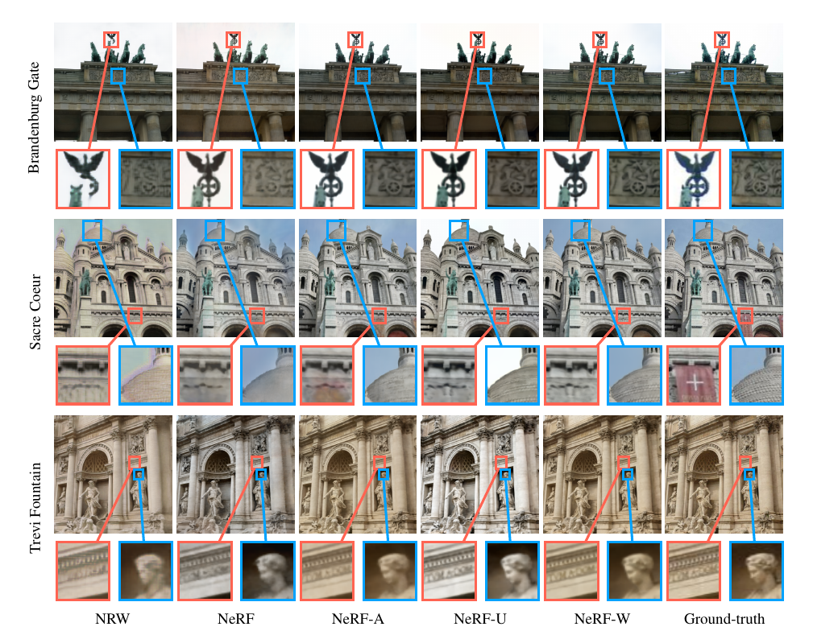
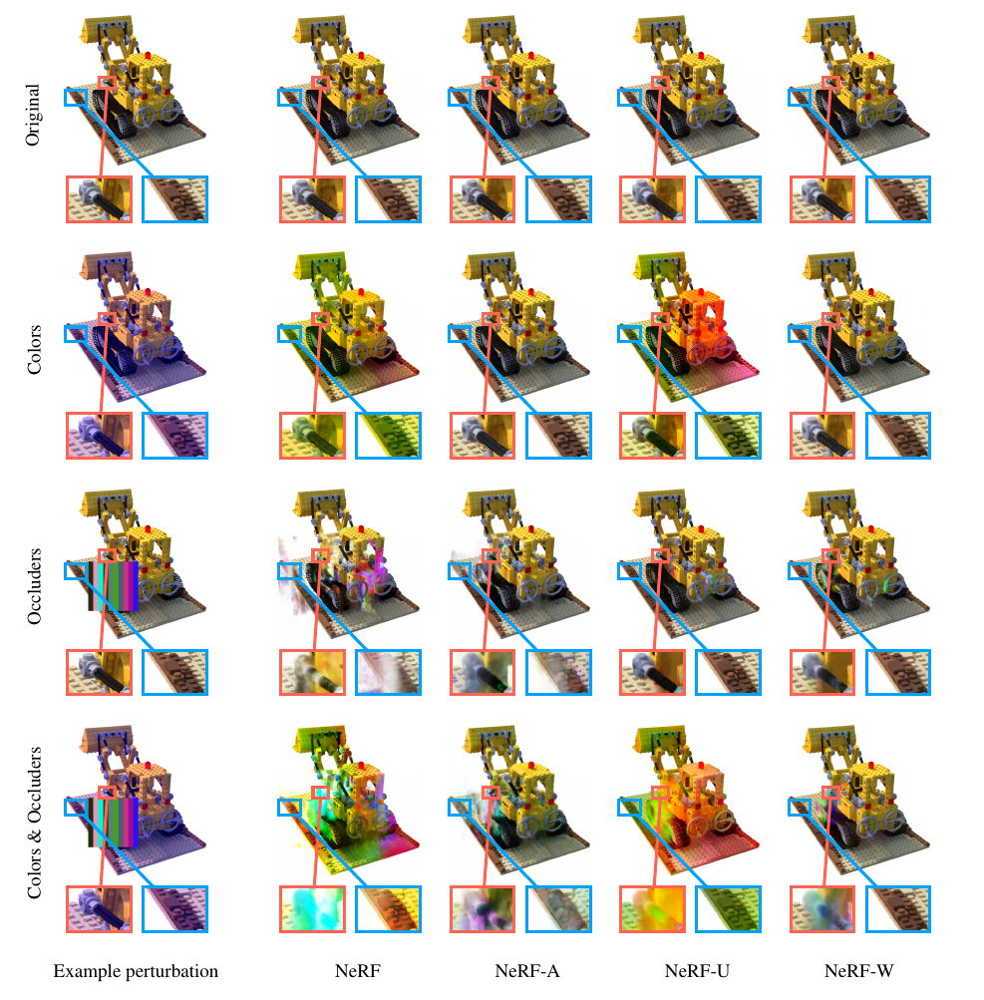
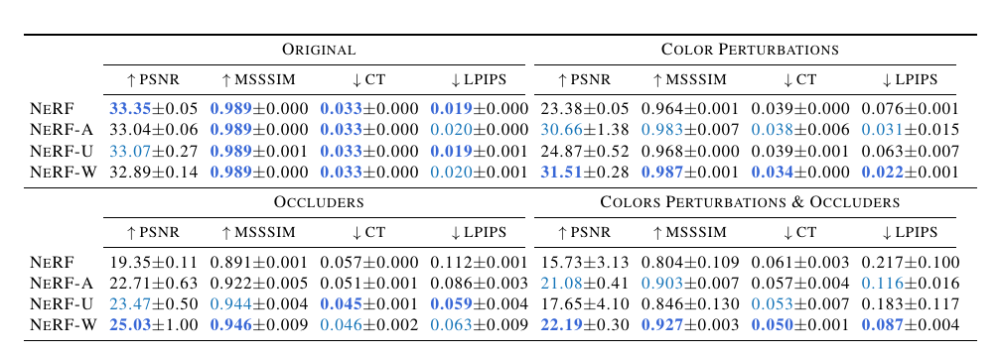

# NeRF in the Wild: Neural Radiance Fields for Unconstrained Photo Collections
[https://arxiv.org/abs/2008.02268](https://arxiv.org/abs/2008.02268)
(まとめ @n-kats)

著者
* Ricardo Martin-Brualla
* Noha Radwan
* Mehdi S. M. Sajjadi
* Jonathan T. Barron
* Alexey Dosovitskiy
* Daniel Duckworth

Google Research のメンバー

# どんなもの？
3次元表現手法 NeRF の新バージョン。
色んな角度から撮影した画像を使って、元の立体構造を再現する手法。

公式の紹介サイト: [https://nerf-w.github.io/](https://nerf-w.github.io/)

「ある地点からこの方向を見たら何色か」という意味の関数をニューラルネットで作る（1つの立体物に1組のネットワークが用いる）。

# 先行研究と比べてどこがすごい？
先行研究の NeRF は同じカメラで色んな角度から撮影する設定だった。NeRF-W はネットに落ちているような画像から実現することを目指した（wはwildの意）。

ネット画像の問題は次の通り

* 障害物がある（建物の周りの観光客等）
* 撮影時刻が異なる
* カメラが異なる（カメラの歪み等。ただしこれは上手く行っていない）

# 技術や手法の肝は？
基本的には NeRF と似た構造。wild な設定のために次の対策が必要。

* photometric variation（カメラの差・時刻の差・撮影設定の差）
* Transient objects（周辺の動くもの）

## NeRF
neural radiance fields（radiance = 放射輝度）の略。

### CG の手法
視点 o, 方向 d のときの色をニューラルネットで計算する。距離 t の座標を r(t) = o + td とし、r(t) での密度 σ(t) と色 c(t) を半直線上で集計する。

集計方法は、積分で書くと次の式になる。「手前の密度が高いと隠れている」という意味で T(t) の重みをつけて積分する。

直接積分できないから、次の式で近似する。

ただし、α(x) = 1 - exp(-x)、δ_k = t_{k+1} - t_k。

### ニューラルネットで算出する項目

2つのネットワーク（MLP）を使う。

* 座標（r(t)）→ （positional encoding）→ （ニューラルネット）→ 密度 σ(t), その地点の特徴量 z(t)
* 特徴量 z(t)、方向 d → （方向を positional encoding）→ （ニューラルネット）→  色 c(t)

### NeRF の訓練
1. 同じカメラで撮影した画像をたくさん用意（I_i, i = 1,...,N）
2. structure-from-motion でどの位置からどの向きで撮影したかを算出（o_i と d_i の計算）
3. NeRF のモデルを2つ（coarseとfine）を用意する
4. 訓練点のサンプリング
* coarse モデル用はランダムに
* fine モデル用は、 coarse モデルから計算した密度を使って、密度の高いところから多くサンプリングするようにする
5. 色の差の2乗誤差を損失関数にして両モデルを訓練

## 全体像

赤色のあたりまでが NeRF と同じ。 l^(a)_i や青い部分が NeRF-W の新機能。

## カメラ・撮影時刻の差のケア
画像毎に特徴ベクトルにエンコードして、ネットワークに組み込む（全体像の l^(a)_i の部分）。訓練中でこれを更新する。

（doc2vec で文章を特徴ベクトルにエンコードして word2vec のネットワークに組み込むのと同じ手法）

## 障害物のケア
画像毎の障害物の密度・色をメインの立体物と別に計算する（σ^(τ), c^(τ) の部分）。
更に、色のブレ具合を標準偏差で表現し、ネットワークから出力する（全体像の β の部分）。

障害物込みの色の計算式は、次の式になる。

積分の式では、Tの計算のexpの内部の積分でも密度を足していることに注意（単純に足しているわけではない）。

標準偏差のβも密度の重みをつけて積分する。

画像毎の特徴ベクトル（障害物用, l^(τ)_i）と位置毎の特徴ベクトル（z(t)）を入力にしてこれらを計算するMLPを用いる（全体像の青の部分）。

## 損失関数
標準偏差のβは次の式で丸めた後、損失関数で用いる。

訓練時は NeRF と同様に coarse モデルも用いる。ただし、coarse モデルは NeRF のままとする。

# どうやって有効だと検証した？
* phototourism dataset
* lego dataset

を用いて検証。

SfM には COLMAP を利用。
phototourism datasetで8GPUで2日、lego datasetで4GPUで8時間みたいなスケールで訓練。

評価指標は、

* PSNR
* MS-SSIM
* LPIPS
* CT(Census Transform)

カメラ・撮影時間のケアだけしたバージョンNeRF-Aや障害物のケアだけしたバージョンNeRF-Uと比較

## phototourism dataset

## lego dataset

legoの方は、同じ形で色をAfine変換したり、障害物があるようにしたりするデータを使う。

# 議論はある？
NeRF-W は複雑な屋外環境の3D再構成をネット画像から実現した。複数の画像での共通部分とそれ以外の部分とに分けることができた。

しかし、レアな角度やカメラの歪みの影響が弱点として残っている。

# 次に読むべき論文は？
* COLMAP・・・SfMで使われた手法
* NRW・・・比較に登場した手法
* 各種評価値
