# PhraseClick: Toward Achieving FlexibleInteractive Segmentation by Phrase and Click
[http://www.ecva.net/papers/eccv_2020/papers_ECCV/papers/123480426.pdf]
(まとめ @strshp)

著者
- Henghui Ding
- Scott Cohen
- Brian Price
- Xudong Jiang
(Nanyang Technological University, Adobe)

# どんなもの？
クリックとフレーズの2つの入力を元に、インタラクティブセグメンテーションを行うモデル

## インタラクティブセグメンテーション
イメージ: https://www.youtube.com/watch?v=Ff0NqQDLJFA
- ユーザーからの入力を元に、画像中の前景と背景を半自動的に塗り分けるタスク
- 入力回数を増やすことで、推論の精度を高めることが出来る (手法にもよる)
- 入力としては、クリックやストローク、バウンディングボックスなどを用いる
- 最近だと、フレーズを入力として、インタラクティブセグメンテーションを行うモデルもある

# 先行研究と比べてどこがすごい？
ユーザーからの入力として、クリックとフレーズの２つを採用することで、より少ない入力で正確なセグメンテーションが可能になった

## 先行研究の弱点
入力方法によって生じる曖昧さによって、ユーザーの入力すべき回数が多くなってしまっている

クリックによるインタラクティブセグメンテーション:
- オブジェクト全体をセグメンテーションするべきなのか、一部をセグメンテーションするべきなのかは、１回のクリックからは分からず、曖昧
- 正確な入力を必要とするが、スマートフォンなどでは、対象領域が指で隠れてしまったりなど、デバイスによっては正確な入力が困難

フレーズによるインタラクティブセグメンテーション:
- 大まかな位置情報はフレーズに含めることが出来るが、細かな位置までは指定できない
- 言葉ではどうしても表現しにくい部分などがある
- 最初に入力した後、結果のリファインメントを行うことが出来ない

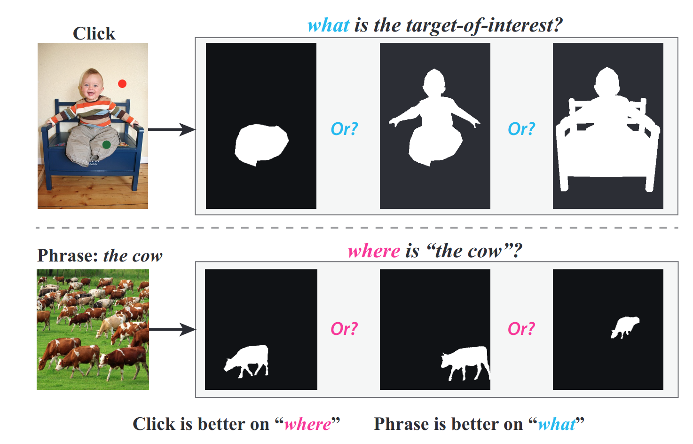

# 技術や手法の肝は？
クリックとフレーズの融合にアテンション機構を使う
## ネットワーク構造
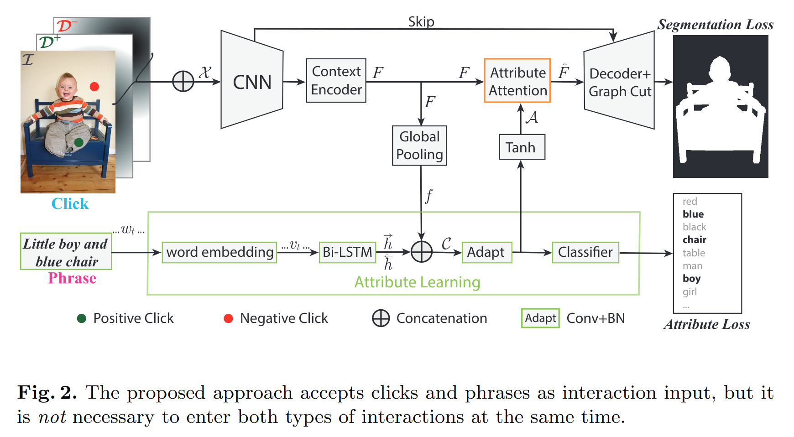

### クリックの入力
著者らの前手法と同一
- Negativeな選択点とPositiveな選択点を入力として受け取る
- 入力画像と同じサイズの配列をNegativeとPositiveに対してそれぞれ用意
- それぞれの配列の各ピクセルの中身は、その位置から、最も近い選択点へのユークリッド距離
- 下の画像のように、元の画像に結合して、5チャネルの画像として入力

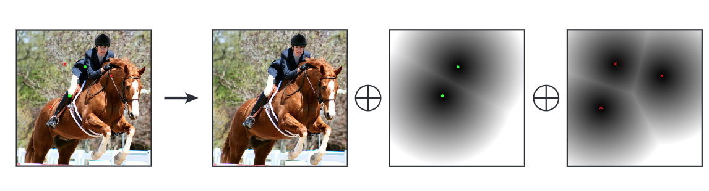

### フレーズの入力と、画像との融合
- CNNの出力を平均プーリングすることで、特徴ベクトルを得る
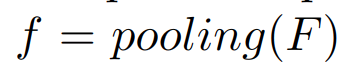

- word2vec と bidirectional LSTMを利用して、特徴ベクトルを抽出
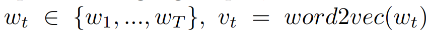
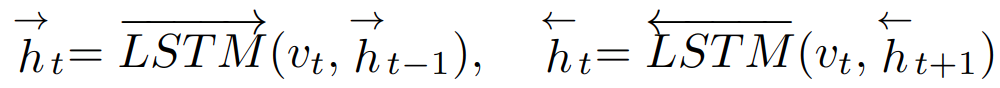

- 画像から得られたベクトルと、フレーズから得られた2つのベクトルを結合
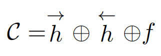

- 画像のチャネル数と、特徴ベクトルの次元数が一致するように、ネットワークにかけたあと(Dense?)、tanhに通して[-1, 1]に正規化
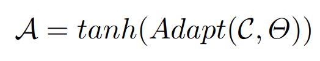

- 元のネットワークに次のように足し合わせる。βは学習可能なパラメータ
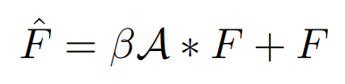
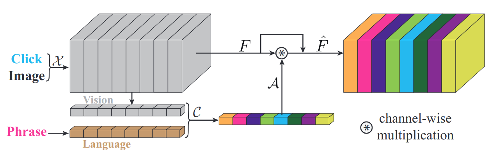

## 損失関数
バイナリークロスエントロピー
- tはセグメンテーションの教師 sはセグメンテーションの推論結果σはシグモイド関数
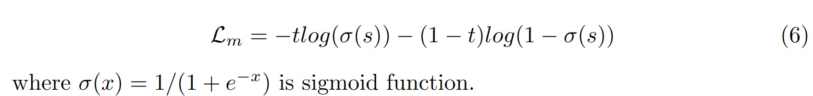

アトリビュートロス
- 視覚的な特徴と、フレーズの特徴をより効率的に学習するための損失
- Cの後にヘッドをつけて、入力フレーズに幾つかの属性が存在するかどうか(青、椅子、男の子、...)の二値を推定
- p_i ∈ {0, 1}: モデルの推定結果, a_i ∈ {0, 1}: 教師データ w_i ∈ R: 各属性のバランシングを行う重み
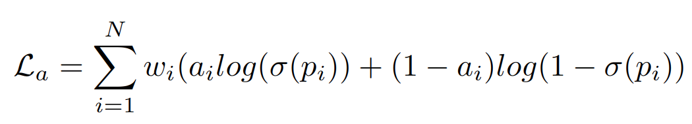

全体の損失
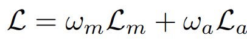

## 学習
1. RefCOCO(インスタンスセグメンテーションとキャプション)を使って、セグメンテーションと属性推定を学習
2. PASCAL VOCデータセット(インスタンスセグメンテーションとラベル)を使って、セグメンテーションと属性推定を学習

### ユーザーのクリックのシミュレーション
Positiveなクリックのシュミレーション
- アノテーション対象のオブジェクトが存在する範囲Oから、任意にN_pos個の点をサンプリング

Negativeなクリックのシュミレーション
- Negativeな点は、人によって置く位置が違うことが想定されるので、次の３つの方策を組み合わせてサンプリング
1. Positiveなオブジェクトの境界から、距離 d が 0 < d <d_max の間の点をランダムにサンプリング
2. NegativeなオブジェクトO_iからそれぞれN_neg_i点ランダムにサンプリング
3. Positiveなオブジェクトの境界から、距離 d が 0 < d <d_max の間の点を各点

# どうやって有効だと検証した？
## 切除実験
- クリックのみの場合は、3クリックで77.93%
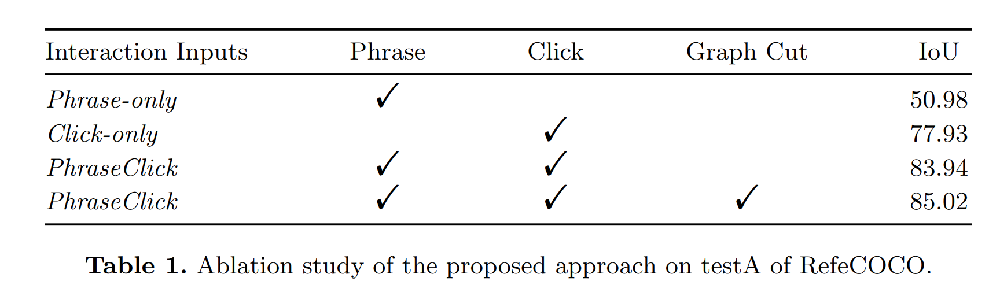

### フレーズのみ有効にして実験
- フレーズの内容がセグメンテーション結果に反映されている
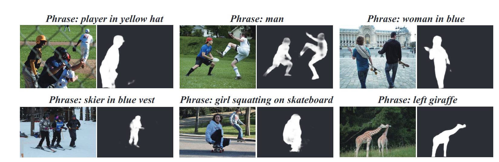

### クリックのみと、フレーズ+クリックの比較
- 横軸はユーザーの入力数 1回目はピンクと緑、どちらもクリックからスタート
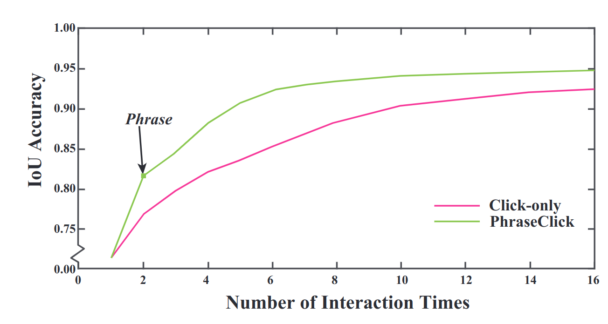

## 他手法との入力回数の比較
- 出力結果と正解のIoUが閾値を超えるまでに、ユーザーが入力(クリック、フレーズ)を行った回数
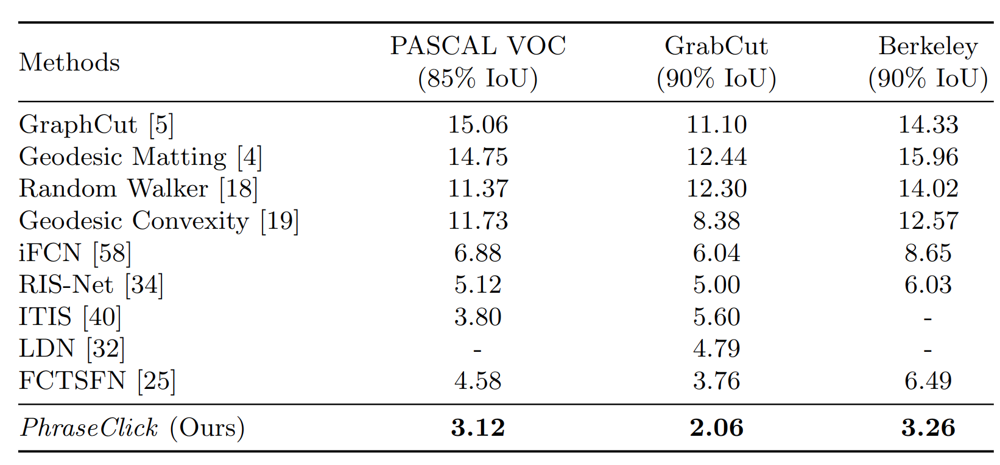

## ユーザーのテスト
- IoUが85%に到達するまでに、ユーザーが必要とした入力回数 50枚の画像の平均値
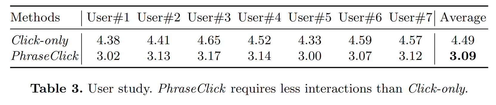

## フレキシブル
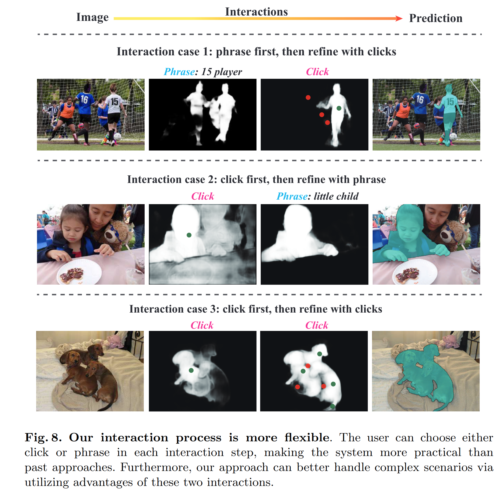

# 議論はある？
- フレーズの入力の方がクリックより手間が掛かりそう

# 次に読むべき論文は？
