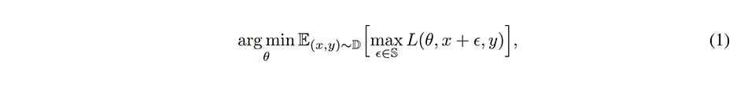
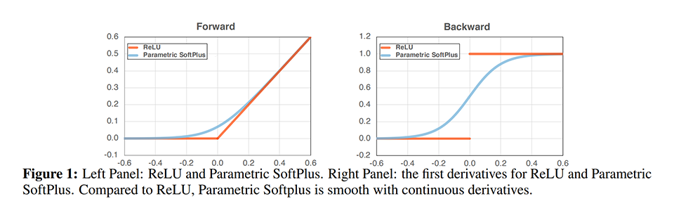
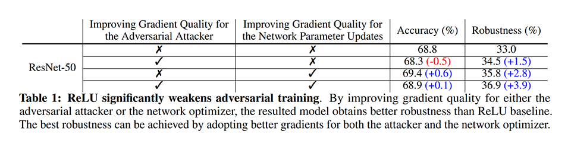
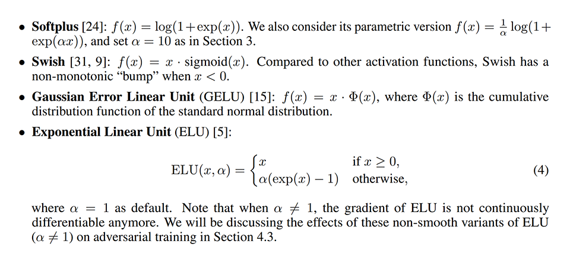
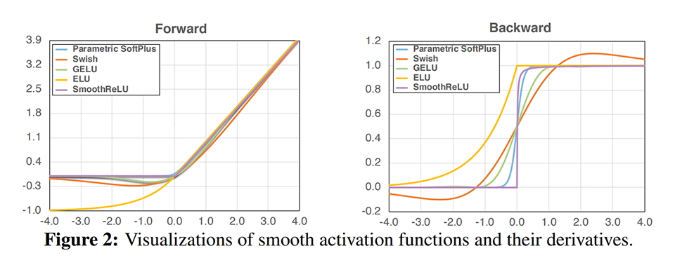
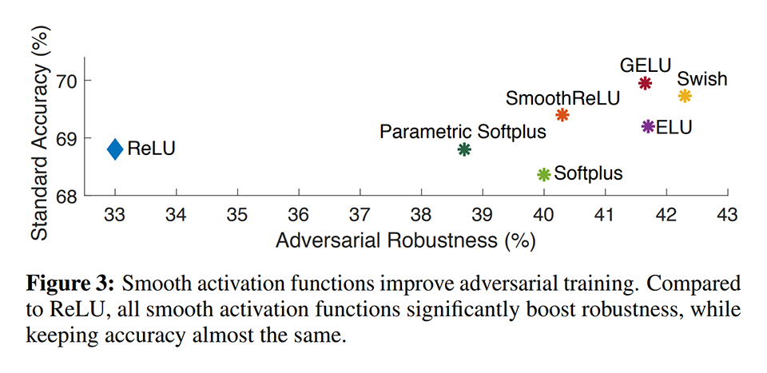
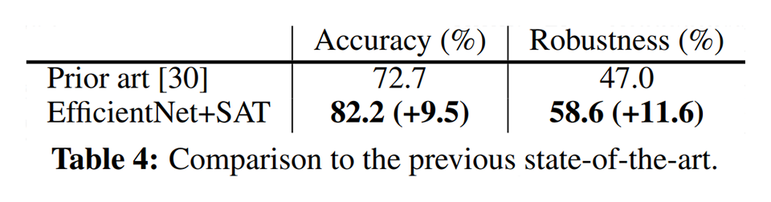

# [\[arxiv\]](https://arxiv.org/abs/2006.14536v1) Smooth Adversarial Training

- 著者
    - Cihang Xie *1 *2
    - Mingxing Tan *1
    - Boqing Gong *1
    - Alan Yuille *2
    - Quoc V. Le *1
- 所属
    - 1: Google
    - 2: Johns Hopkins University

## どんなもの？
### SAT (Smmoth Adversarial Training)
- 滑らかな活性化関数（Swish など）を用いた Adversarial Training

## 先行研究と比べてどこがすごい？
- Adversarial Training が上手くいかない原因が ReLU（滑らかでない勾配）にあることを突き止めた。
- 「精度と敵対的頑健性はトレードオフの関係にあり、追加の計算コストを支払わない限り同時に高めることはできない」と信じれれてきたが、間違いであることを示した。
- SAT を EfficientNet-L1 へ適用することで、精度を約 9.5%%、敵対的頑健性を 11.6% も改善した。

## 技術や手法の肝は？
- Adversarial Training を行うときは、滑らかな活性化関数（Swish など）を用いること

## どうやって有効だと検証した？

### ReLU が Adversarial Training を弱体化する様子の観察
次の式で表される Adversarial Training は、苦手な事例を生成する攻撃サイド（式の内側の max）と、苦手な事例に適合しようとする学習サイド（式の外側の argmin）に分けられる。バックプロパゲーション時にそれぞれのサイドを構成する ReLU を Parametric Softplus（ReLU を滑らかに近似したもの）へ置き換えてそれぞれのサイドの勾配の質を改善することで、精度がどのように変化するかを観察した。実験は、ResNet-50 を ImageNet で学習評価して行った。

攻撃サイドの勾配の質を改善すると、敵対的頑健性が改善し、精度が悪化した（従来から信じれれているトレードオフを確認できた）。より苦手な事例が生成されるようになったためだと考えられる。
学習サイドの勾配の質を改善すると、敵対的頑健性と精度の両方が改善した。事例により上手く適合できるようになったためだと考えられる。

学習イテレーションをより長くしても、この傾向は変わらなかった。つまり、学習イテレーションを長くすることでは達成できない質的な違いが、学習サイドの勾配の質の改善にあると言える。

#### Adversarial Training

#### Parametric Softplus

#### 実験結果

### 活性化関数の比較
活性化関数を入れ替えて SAT を行い、精度の変化を観察した。攻撃サイド・学習サイド・フォワードプロパゲーションとバックプロパゲーションの全てで指定された同じ活性化関数を用いる（前の実験のようにバックプロパゲーション時だけ置き換えたりはしない）。実験は、ResNet-50 を ImageNet で学習評価して行った。

単純な Softplus を除く、他の全てで精度が敵対的頑健性が改善された。Swish が最も敵対的頑健性が高い。
前の実験よりも Parametric Softplus の敵対的頑健性が更に改善されている。フォワードプロパゲーションにおいても滑らかな活性化関数を用いたためだと考えられる。

#### 各種活性化関数

#### 実験結果

### EfficientNet-L1 への適用
EfficientNet-L1 へ SAT を適用し、適用前後で精度の変化を観察した。実験は ImageNet で学習評価して行った。

精度と敵対的頑健性の両方を大幅に改善できた。

## 議論はある？
- SAT を EfficientNet-L1 へ適用することで、精度を約 9.5%%、敵対的頑健性を 11.6% も改善した。
- その他は特に書かれていない。

### 私見
- すぐに試せるのでやってみたい。
- 最近の Depth を学習するタスクでも ReLU ではなく滑らかな活性化関数を使って精度改善している例があるので、本質的に効果がありそうに思える。
- Adversarial Training に追加のコストを払わずに精度と敵対的頑健性を高められると言っているが、滑らかな活性化関数は fp32 を要求しそうなので mixed precision と相性が悪そうなので、その分は計算コストが悪化しそうに思える。

## 次に読むべきタイトルは？

### PGD Attacker
- [\[arxiv\]](https://arxiv.org/abs/1706.06083v4) A. Madry, A. Makelov, L. Schmidt, D. Tsipras, A. Vladu, "Towards deep learning models resistant to adversarial attacks", ICLR, 2018.
