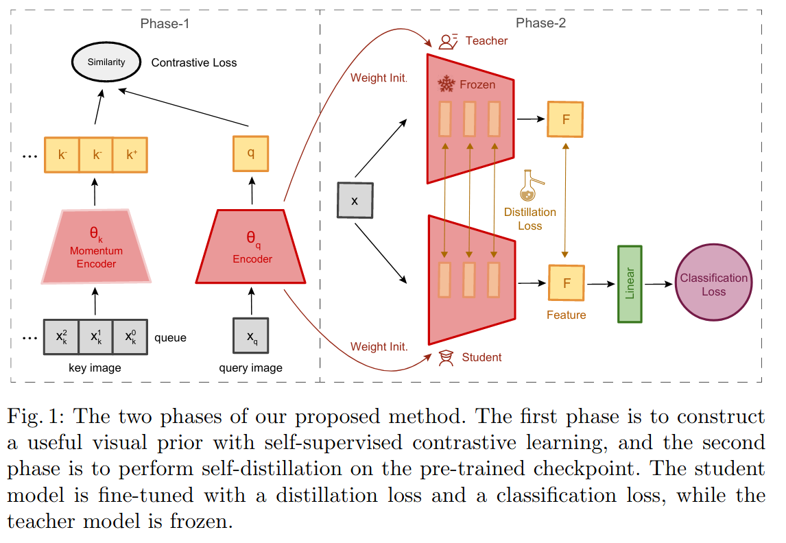
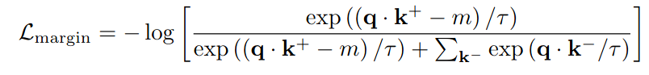
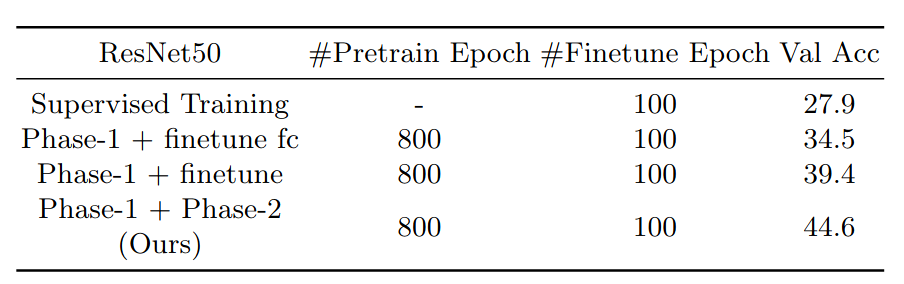
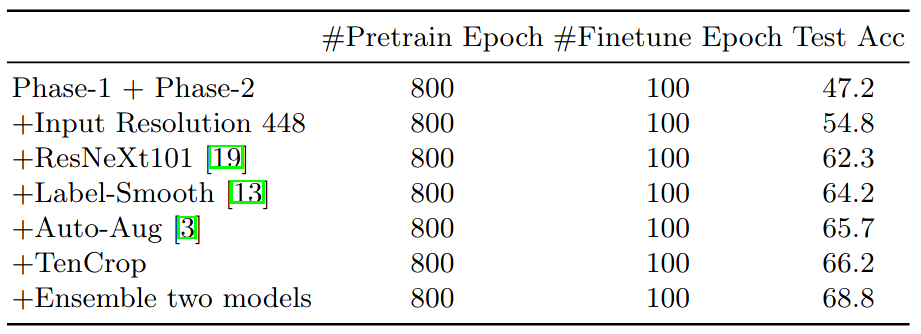

Distilling Visual Priors fromSelf-Supervised Learning
===

Bingchen Zhao, Xin Wen

DeepBlue Technology (Shanghai) Co., Ltd

https://arxiv.org/abs/2008.00261

ECCV2020 Visual Inductive Priors for Data-Efficient Computer Vision

@cohama

## どんなもの?

- 少ないデータセットでより高い精度を目指す手法
- ECCV の VIPrior Challenge で2位
  - 問題設定は1クラスあたり50枚に絞った ImageNet のサブセット

## 先行研究と比べて何がすごい？

- Contrastive Learning と Self-Distillation (自己蒸留) を組み合わせた手法を提案
  - データ数が少ない場合過学習が起きやすくなるが、Self Supervised Learning により得られる高い表現力の特徴を正則化に使うことでそれを防ぐ

## 技術や手法の肝は？

- 2-stage な手法
- 

1. MoCo v2 で Contrastive Learning を行う
  - MoCo では負事例のサンプル数が精度に直結するらしい。そもそも全体のデータ量が少ないような設定だとうまくいかない。そのためマージン付きの Loss を導入
  - 
2. MoCo で得られた Encoder を教師モデルとして生徒モデルに蒸留を行う

## どうやって有効だと検証した？

resnet50 を
1. 単に教師あり学習させた場合
2. MoCo + FC 層のみ FineTune
3. MoCo + 全体 FineTune
4. MoCo + 蒸留

## 議論はある?

- ECCV での Challenge での設定だが、それ以外のデータに対しても有効なのかどうかが気になる

## 次に読むべき論文

- Improved baselines with momentum con-trastive learning (https://arxiv.org/abs/2003.04297)
  - MoCo v2
- A Comprehensive Overhaul of Feature Distillation (https://arxiv.org/abs/1904.01866)
  - 使われている蒸留の手法
