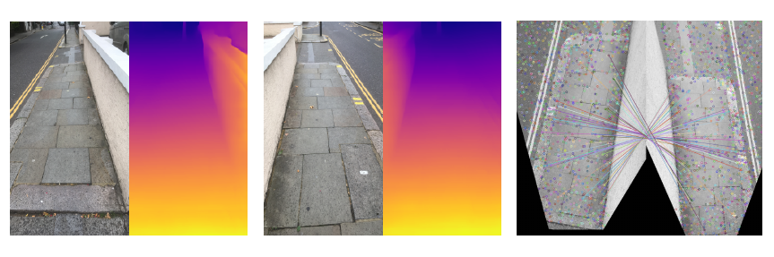
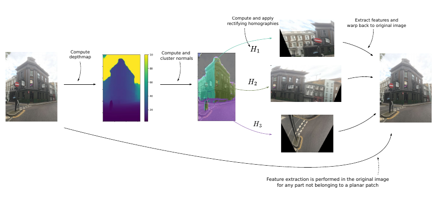
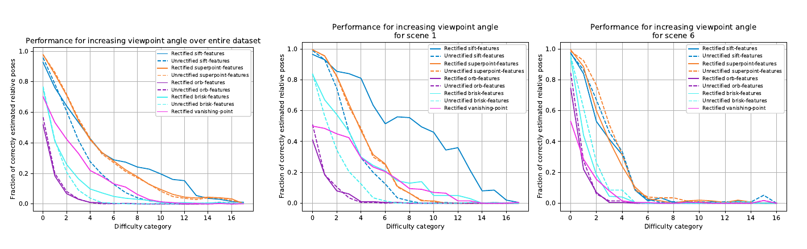
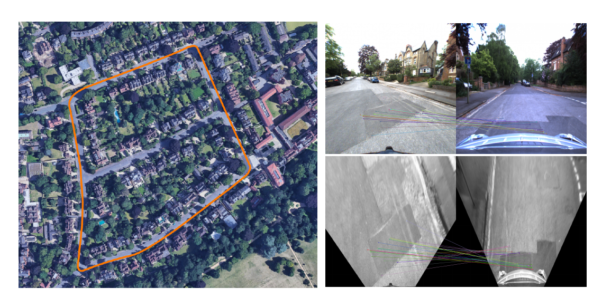

# Single-Image Depth Prediction Makes Feature Matching Easier
[https://arxiv.org/abs/2008.09497](https://arxiv.org/abs/2008.09497)
(まとめ @n-kats)

著者
* Carl Toft
* Daniyar Turmukhambetov
* Torsten Sattler
* Fredrik Kahl
* Gabriel Brostow

2人目と5人目はNianticの人

# どんなもの？
CNNベースのdepth（距離）推定を用いて、SIFT等の特徴点抽出の性能を改善したもの

ECCV2020

# 先行研究と比べてどこがすごい？
従来の特徴点抽出では、角度や距離で見た目が変わり、対応付けが上手く行かない課題があった。

depth推定を介して立体的に画像を把握し、対象を正面から見た見た目に変換してから特徴点を抽出する。
これによって、特徴点のマッチングが改善し、例えば逆向きから撮影した場合でも対応をつけることができた。

同じ道を逆向きで撮影。

# 技術や手法の肝は？
## 全体像

* 画像からdepth推定
* 画像の各ピクセルに対応する3次元座標を算出
* 各ピクセルの法ベクトルを算出（その点を含む面に垂直なベクトル）
* 法ベクトルをクラスタリング（3つのクラスタにすると上手く行ったらしい）
* 各クラスタ毎にホモグラフィー変換して正面画像を作成
* 正面画像から特徴点を抽出

## depth推定
MonoDepth2 というdepth推定ネットワークを採用。ヨーロッパ・アメリカでステレオカメラで撮影した画像を教師に利用。
更に、MegaDepth（同じランドマークの画像をsfmで距離推定して作られたデータ）とMatterport（3つのカメラと3つのdepthカメラを用いて作ったデータセット）も教師に。

入力画像を 512x256 にして同じサイズのdepth mapを算出。

depth推定は、スケールの曖昧さがあるが、法ベクトルを出すために使うため、問題無い

## 法ベクトルのクラスタリング
depthから各ピクセルの3次元座標を算出。各ピクセルで5x5の近傍のピクセルの3次元座標を見て、その25個の点を平面マッチングして法ベクトルを出す。

クラスタリングは単にk-meansを用いる。
このときクラスタの数は3にして、クラスタの中心ベクトルが互いに直交するようにすると上手くいくらしい（マンハッタンワールド仮説・・・人工物は直交するもので構成されている）。

## 正面画像作成
各クラスタに対応する画像の部分をそのクラスタの中心（の法ベクトル）を使ってホモグラフィー変換する。
ただし、あまりにも法ベクトルの角度がきつい（カメラからその点へのベクトルと法ベクトルの角度が80度以上）の場合対象外とする。

# どうやって有効だと検証した？
HPatchesというデータセットがよく使われるデータがあるが、これは平面にペインティングしていることが多く、depth推定に失敗するケースが多かった。

代わりに8種類のシーンのデータを用意した。同じ場所で10度くらいずつごとに画像を撮影等（トータルで180度程度まで）。

破線が通常、実線が本手法。

## 反対向き
OxfordRobotCarデータセットを利用

SLAMで一周してきたときに対応付けすることが期待できる

# 議論はある？
* 遮蔽物（歩行者等）が多いと法ベクトルのクラスタリングが上手く効かない
* 遠すぎるものは流石に難しい

# 次に読むべき論文は？
* MonoDepth2
