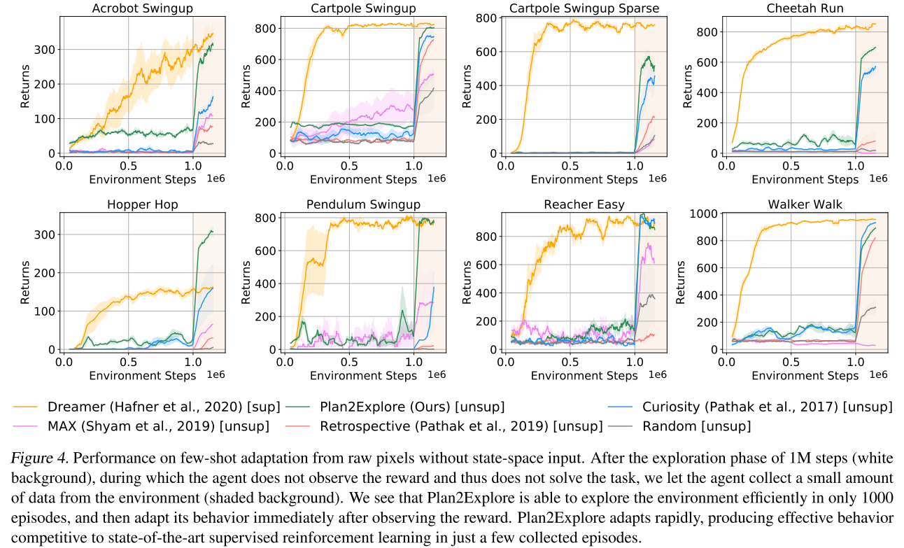
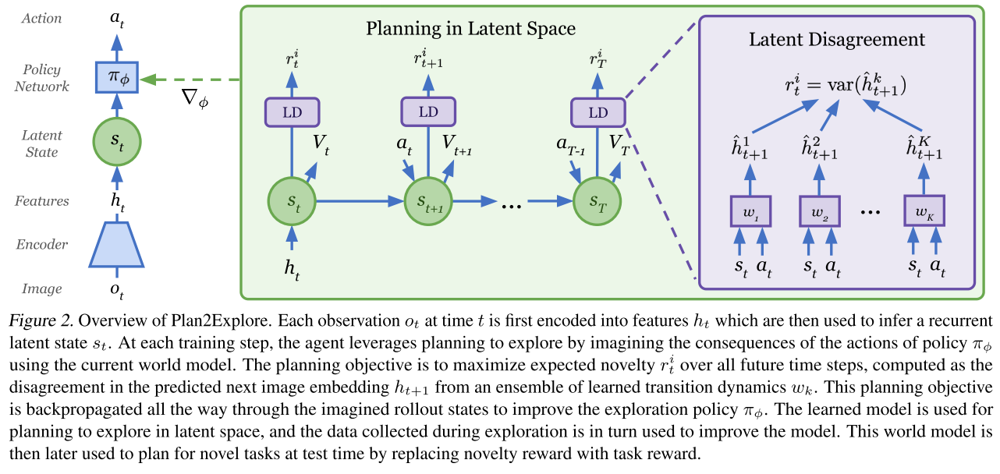
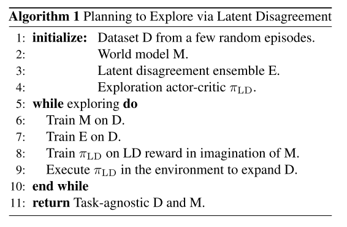
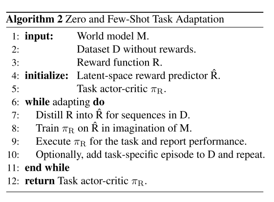

Planning to Explore via Self-Supervised World Models  
===

Ramanan Sekar 1 * Oleh Rybkin 1 * Kostas Daniilidis 1 Pieter Abbeel 2 Danijar Hafner 3 4 Deepak Pathak 5 6  

[https://arxiv.org/pdf/2005.05960.pdf](https://arxiv.org/pdf/2005.05960.pdf)  

---

## どんなもの？

* モデルフリーの強化学習。  
* 学習時に外部からの報酬を与えない。エンコーダで学習した潜在変数から内部的に報酬を生成する。  

---

## 先行研究と比べて何がすごい？  

* モデルフリーで、報酬なしでイメージから学習を行う。  
* 少ない試行で、新しいタスクに適用できる。  

---

## どうやって有効だと検証した？  

* タスクとして「DeepMind Control Suite」を用いて評価  
  
* 比較対象として「Dreamer」「Plan2Explore」「Curiosity」「MAX」「Retrospective」で比較。  

Dreamer       ：潜在表現を用いて時系列の予測をさせる手法。過去のリプレイデータにより潜在表現を学習。  
Plan2Explore  ：提案手法  
Curiosity     ：類似の自己教師学習で、内部報酬を用いる手法。  
MAX           ：Model-based Active Exploration モデルベースの内部報酬を用いる手法 (要確認)  
Retrospective ：類似の内部報酬を用いる手法 報酬は学習したモデルとの誤差 (要確認)  

---

## 技術や手法の肝は？  

* Planning in Latent Space  
 学習したWorldModelにより、内部報酬を生成する。  
 Planning in Latent Spaceにより生成した、内部報酬を用いてポリシーを学習させる。  

* Latent Disagreement  
  学習した複数のモデルをアンサンブルして、モデルの出力の分散を求める。  
　分散が大きくなる=不確定要素が大きい 状態が探索されるような報酬としている。  
   

* 学習方法  
　タスクによらない潜在表現とLatent Disagreementを学習させるフェーズとタスクに適用させるための学習フェーズの2つからなる。  
　探索による潜在表現とポリシーの学習を行う。  
   
　潜在表現とポリシーを固定して、価値関数を学習させながらタスクを実行する。  
   
　ここで言うZero-shotとFew-shotは、Zero-shotの場合はAlgorithm1実行後にタスクを実行する。(タスク固有の学習は行っていないという意味でZero？)  
　Few-shotの場合は、一定ステップ(1M Step)報酬を与えない状態で、タスクを実行して学習を行った後に、報酬ありでタスクを実行する。  

---

## 議論はある？

* 教師なしで教師ありと同程度の結果が出た。  
* よりスケーラブルなWorld Modelを構築できるようにしたい。  

---

## 次に読むべき論文は？

* [Model-Based Active Exploration https://arxiv.org/abs/1810.12162](https://arxiv.org/abs/1810.12162)  
* [Curiosity-driven exploration by self-supervised prediction https://arxiv.org/abs/1705.05363](https://arxiv.org/abs/1705.05363)  

