# Learning Lane Graph Representations for Motion Forecasting
[https://arxiv.org/abs/2007.13732](https://arxiv.org/abs/2007.13732)
(まとめ @n-kats)

著者
* Ming Liang
* Bin Yang
* Rui Hu
* Yun Chen
* Renjie Liao
* Song Feng
* Raquel Urtasun

Uber ATG（Advanced Technologies Group）やトロント大学のメンバー。

# どんなもの？
道路上の車両の運動を予測するモデルの研究。自動運転等への応用を想定。

道路情報をグラフで入力し、LaneGCNと呼ぶ手法で道路と車両の位置情報を混ぜて予測を行う手法。

グラフ系NNは、グラフと言っても完全グラフを扱っていたり、分子のように一部の分野で活躍しているイメージだった。道路に応用するのを見るのが初めてだったので今回紹介。

# 先行研究と比べてどこがすごい？
既存手法は道路情報をラスター形式（グリッドの各点に情報を載せたdenseな表現）を使っていたが、本手法では直接地図情報を与える方式をとっている。
これによって、直接、交通ルール（道路の進行方向や横レーンの情報）が使えて良い予測ができた。

# 技術や手法の肝は？
## 高精度地図
高精度地図（High Definition map）を入力に使う。この論文では次の情報からなる。

* 頂点: 各レーンの中心線上のセグメント
* 辺: 4種類の辺を考える
  * predecessor: 進行方向の後ろへの辺
  * successor: 進行方向の先への辺
  * left neighbour: 左隣
  * right neighbour: 右隣

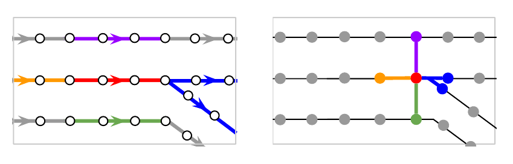

## 全体像
### 入力
軌跡情報を[M, 3, T]（M: 車両の数, 3: ⊿x,⊿y,mask（入力の有無）, T: 入力の最大の長さ）等の形でデータを所持する。

### メタアーキテクチャ
* ActorNet: 軌跡（shape: [M, 3, 20]）→ 軌跡の特徴マップ（shape: [M, 128, 20]）（T=20）
* MapNet: 地図情報（shape: [N, 4]）→ 地図の特徴マップ（shape: [N, 128]）
* A2L: 軌跡の特徴マップを地図情報に混ぜるネットワーク
* L2L: A2Lの後で情報を整理するネットワーク
* L2A: L2Lの出力を軌跡情報に混ぜるネットワーク
* A2A: L2Aの後で情報を整理するネットワーク
* Header: A2Aの出力（shape: [M, 128]）→予測した軌跡（shape: [M, K, 30, 2]）と確信度（shape: [M, K]）（Kは予測する軌跡のパターン数）

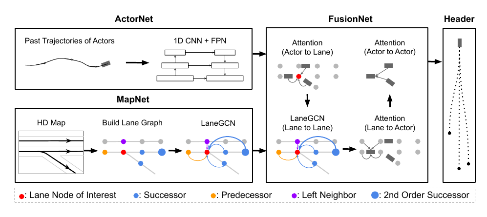

## LaneGCN
### NodeFeature

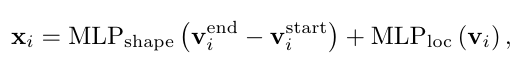

* x_i: 頂点（レーン中のセグメント）の特徴ベクトル
* v_i^{start}: セグメントの始点
* v_i^{end}: セグメントの終点

### LaneConv

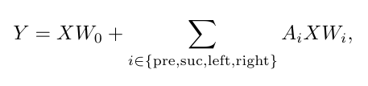

* X: x_i を並べた行列
* A_i: 隣接行列
* W_i: 重み

レーンの関係性ごとに別々で重みを周辺情報を収集する。

### DilatedLaneConv

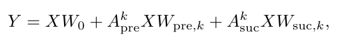

進行方向はより遠い部分を見たい。隣接行列をk乗してLaneConvする。

### LaneGCN

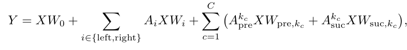

LaneConv と DilatedLaneConv を混ぜた形。

## FusionNet
A2L, L2L, L2A, A2A で地図情報と軌跡情報を混ぜる。

混ぜるときは次のように、セグメントの位置と物体の位置の差と特徴量を入力する。⊿_{i,j}は位置の差からMLPをした結果。

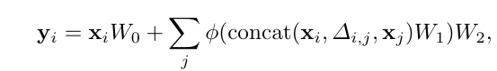

## 学習
分類と回帰に分かれる。

K個の予測をするため分類にはmax-margin lossを使う。

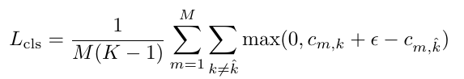

\hat{k}: 予測が最も合っている場合のindex（予測の最終ステップを見る）

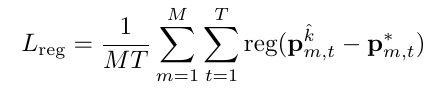

\hat{k}の場合だけ回帰の訓練をする。regはsmooth l1。

## ネットワーク詳細

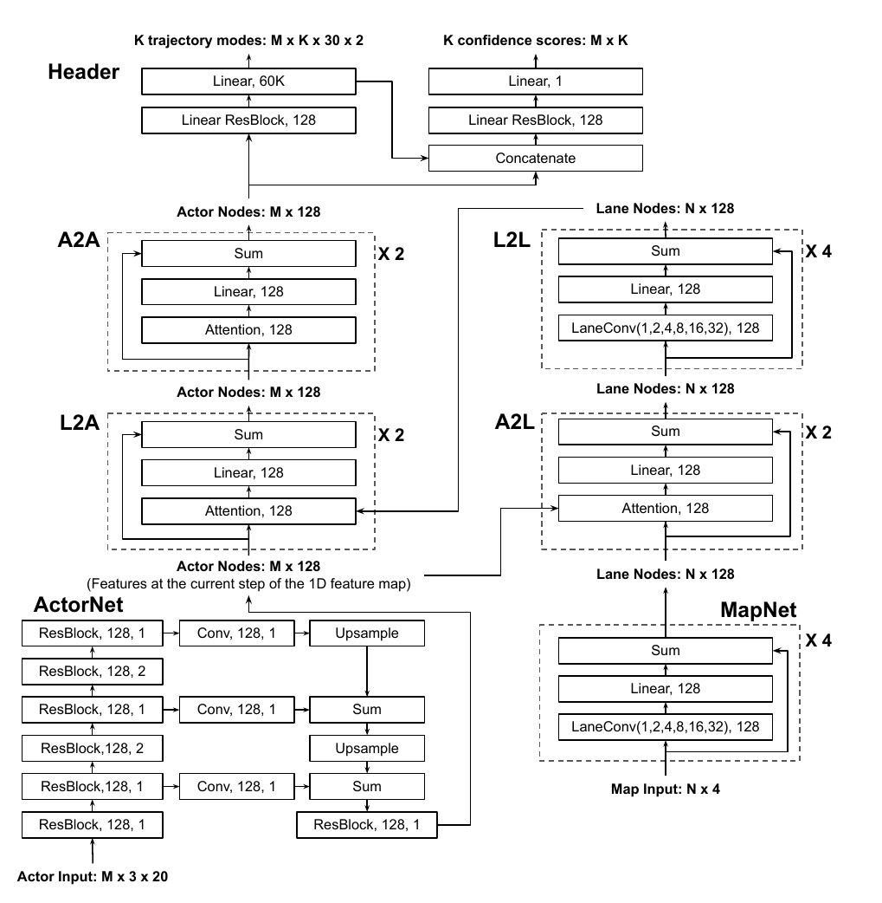

# どうやって有効だと検証した？
## Argoverse
ピッツバーグとマイアミのデータ。3万シナリオ（10HZ）。2秒間の動きから3秒後の未来を予測するタスク。訓練205942、バリデーション39472、テスト78143シナリオ。

## 定量評価
以下の評価値を用いる。

* ADE（average displacement error）: 予測3秒間のl2距離の平均
* FDE（final displacement error）: 最終時刻でのl2距離
* minADE: K個の予測のADEの最小値
* minFDE: K個の予測のFDEの最小値
* MR: 最終時刻の誤差が2メートルより大きい割合

## 定性評価

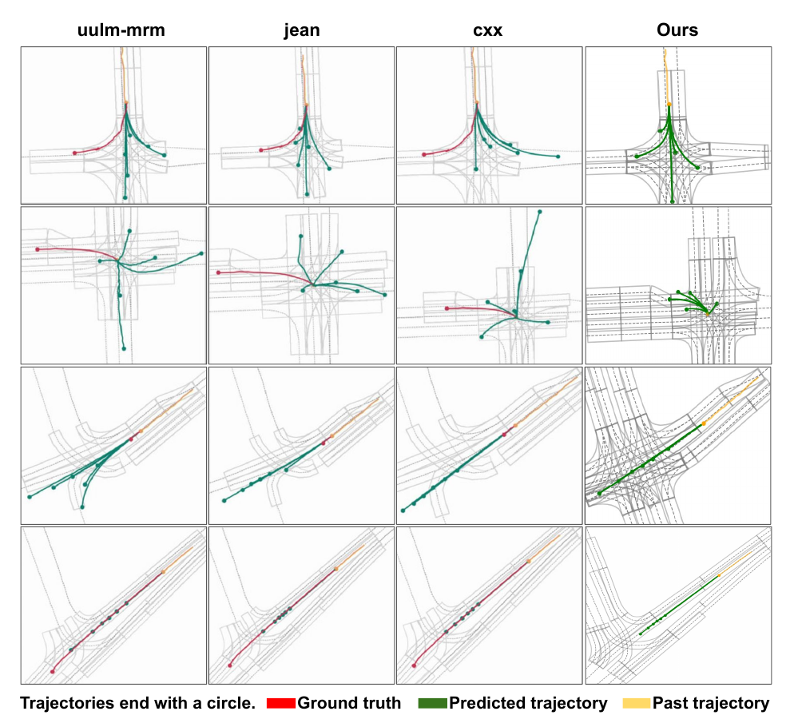

他手法が道路外に飛び出していて、本手法がそういう状況を上手く対策できていると言える。
交差点内部の予想も、他手法は滅茶苦茶だが、本手法は予測がある程度絞られている。

# 議論はある？
## 私見
複雑な交差点や起伏のある道などがどれだけ上手く行っているのか気になる。車以外の場合の手法があるかも気になる。今回は道路を扱っているが、同じように地図情報をグラフで持っておいて強化学習等をするような展開も可能かもしれない（サッカー等のように走るパターンに制限があるスポーツとか）。

# 次に読むべき論文は？
* [Trajectron++](https://arxiv.org/abs/2001.03093) 人の動きの予想関係の手法らしい
