# [\[arxiv\]](https://arxiv.org/abs/1905.02693v4) 3D Packing for Self-Supervised Monocular Depth Estimation

- 著者
    - Vitor Guizilini *1
    - Rares Ambrus *1
    - Sudeep Pillai *1
    - Allan Raventos *1
    - Adrien Gaidon *1
- 所属
    - 1: Toyota Research Institute

## どんなもの？
### PackNet
Monodepth2（単眼カメラ映像とカメラ内部パラメータから深度とカメラ移動を推定するモデルを自己教師あり学習する手法）に次の改善を加えた手法である。
- 活性した特徴の位置情報が失われない encoder-decoder アーキテクチャの導入 ⇒ 復元画像や深度画像の鮮明化
- 速度情報の正則化への活用（※オプション） ⇒ 深度スケールの絶対化

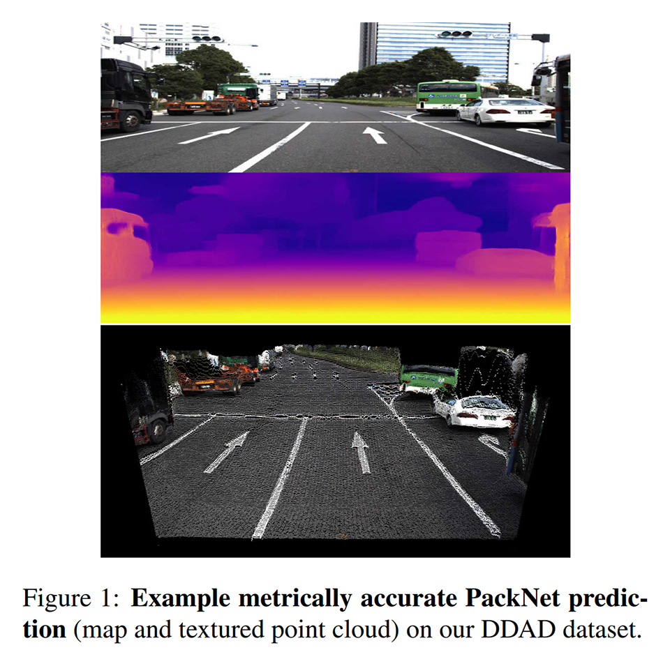
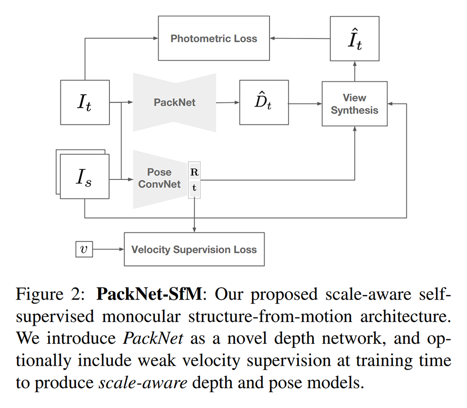

PackNet は depth estimator を改良し、Lpose（※オプション）を追加したものと言える。

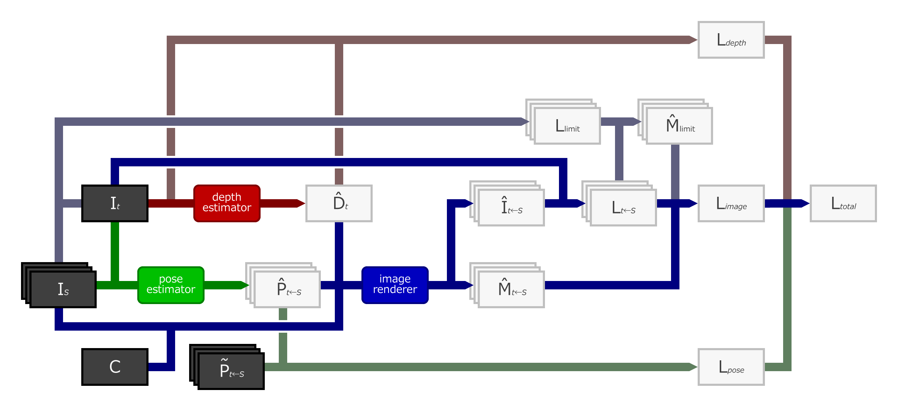

### DDAD (Dense Depth for Automated Driving)
より挑戦的で正確な深度評価に使える新しい都市走行データセットである。世界中を走り回る自動運転車の LiDAR から生成されたより長距離（200m）で高密度な深度の真値が含まれる。

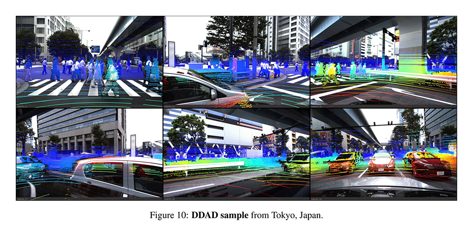
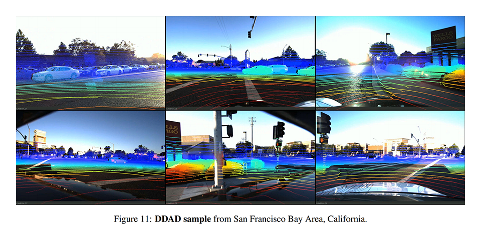
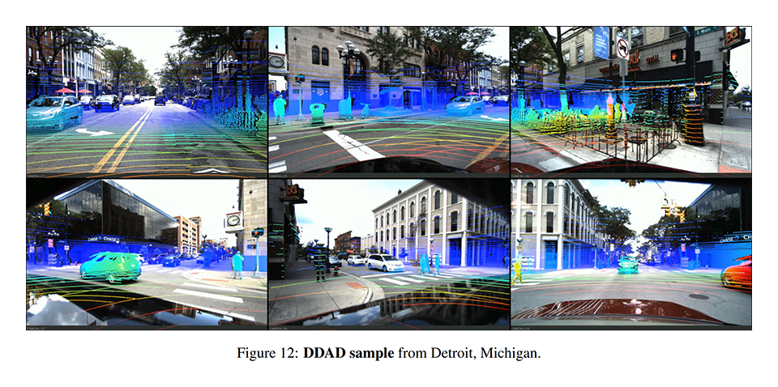

### 資料
- [解説動画](https://www.youtube.com/watch?v=b62iDkLgGSI)
- [ソースコード](https://github.com/TRI-ML/packnet-sfm)
- [データセット](https://github.com/TRI-ML/DDAD)

## 先行研究と比べてどこがすごい？
- ボケた画像を復元する原因が max pooing or strided convolution にあることを実験により突き止めたこと
- 手軽に収集できる（映像と一緒に収集することが多い）速度情報を活用した簡単な正則化で深度スケールを絶対化できることを示したこと
- 長距離で高密度な深度の真値付きのデータセットを公開したこと

## 技術や手法の肝は？
### PackNet
- max pooling / strided convolution ⇒ packing
- bilinear upsampling ⇒ unpacking
- batchnormalization ⇒ group normalization
- ReLU ⇒ ELU

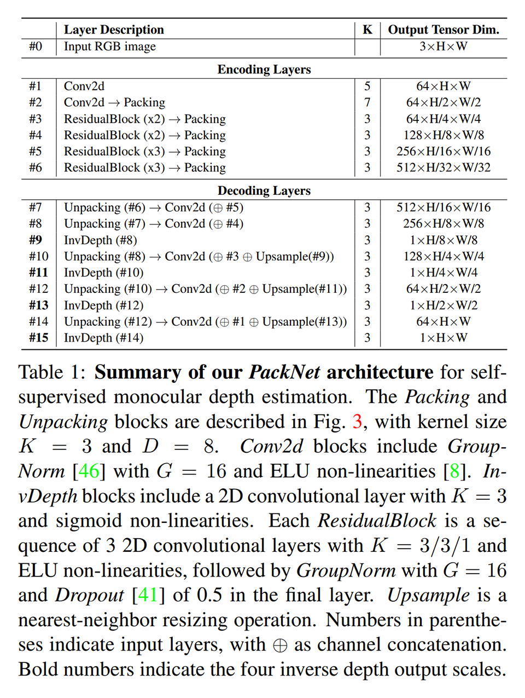

### packing / unpacking
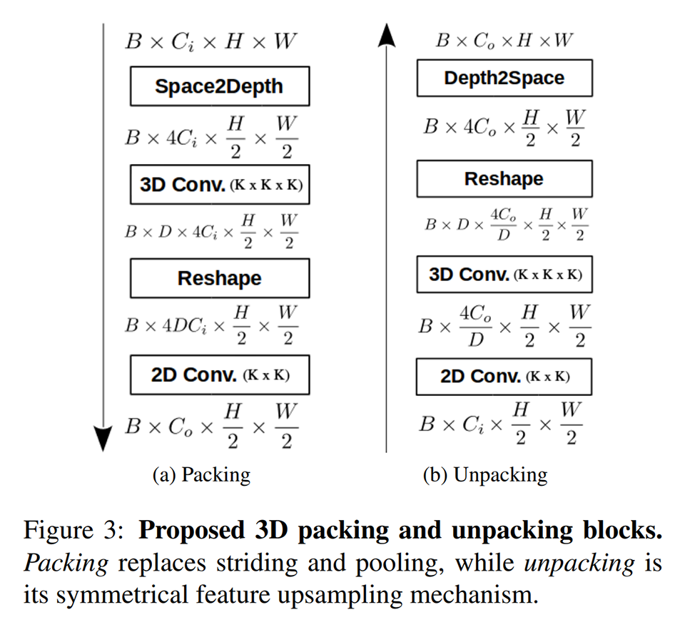

### space2depth / depth2space

## どうやって有効だと検証した？

### 復元画像の比較
max pooling / bilinear upsampling を用いると復元画像がボケるが、packing / unpacking を用いるとボケない。

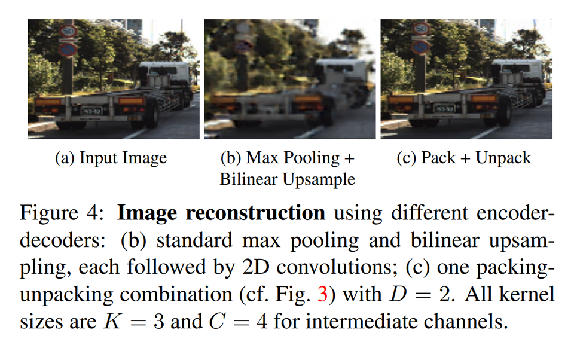

### 深度に関する精度の比較 on DDAD
monodepth2 と PackNet を DDAD で学習・評価し、それらの精度を比較した。遠方になるほど精度差が大きくなる。
monodepth2 は ImageNet を用いた事前学習を行っているが、PackNet には及ばなかった。

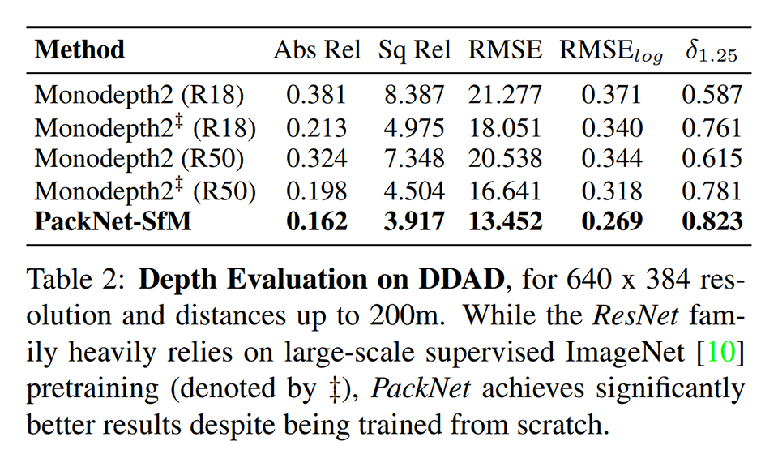
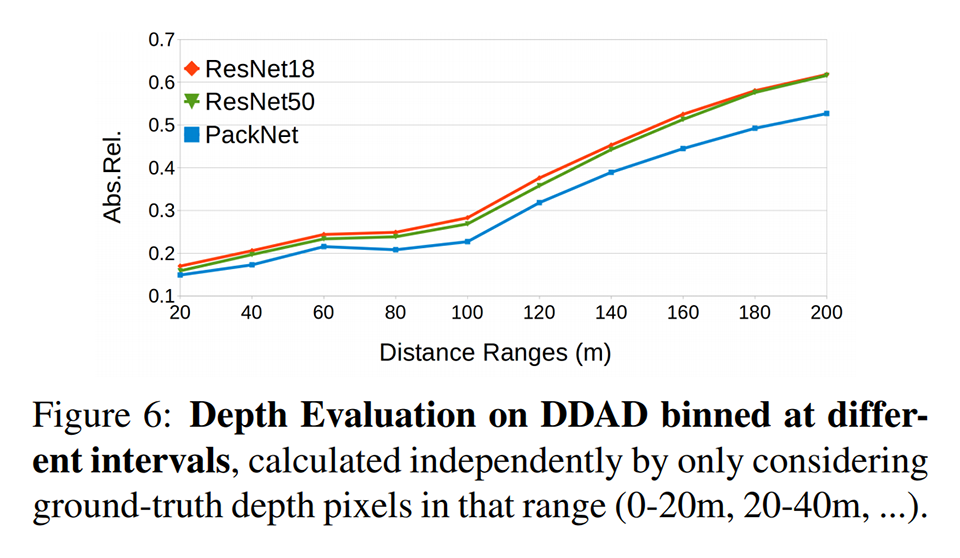

### 深度に関する精度の比較 on KITTI
Original の評価方法では差が分かりづらいが、おおむね PackNet が他の手法を上回っている。Improved の評価方法でははっきりと PackNet が良いことが分かる（深度を教師あり学習する手法に匹敵している）。

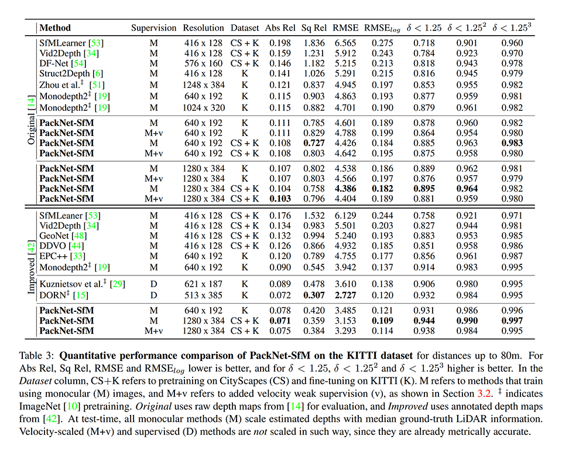

### 深度画像の比較 on KITTI
PackNet は他の手法よりも鮮明な深度画像を生成している。PackNet の精度が良い理由は、鮮明な深度にあり、それは復元画像の鮮明さに由来している。

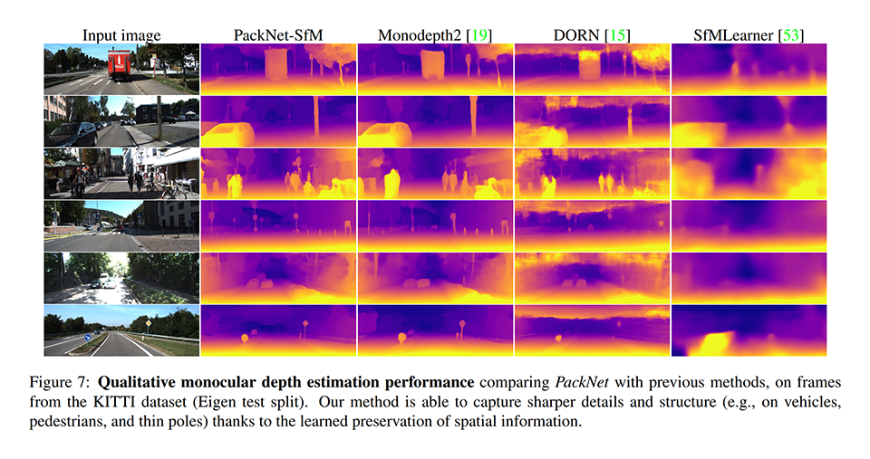

### パラメータ数ごとの深度に関する精度の比較 on KITTI
他の手法はパラメータ数が大きくなると精度の改善幅が小さくなってゆくが、PackNet はそうではない（まだまだ伸びしろがあるように見える）。

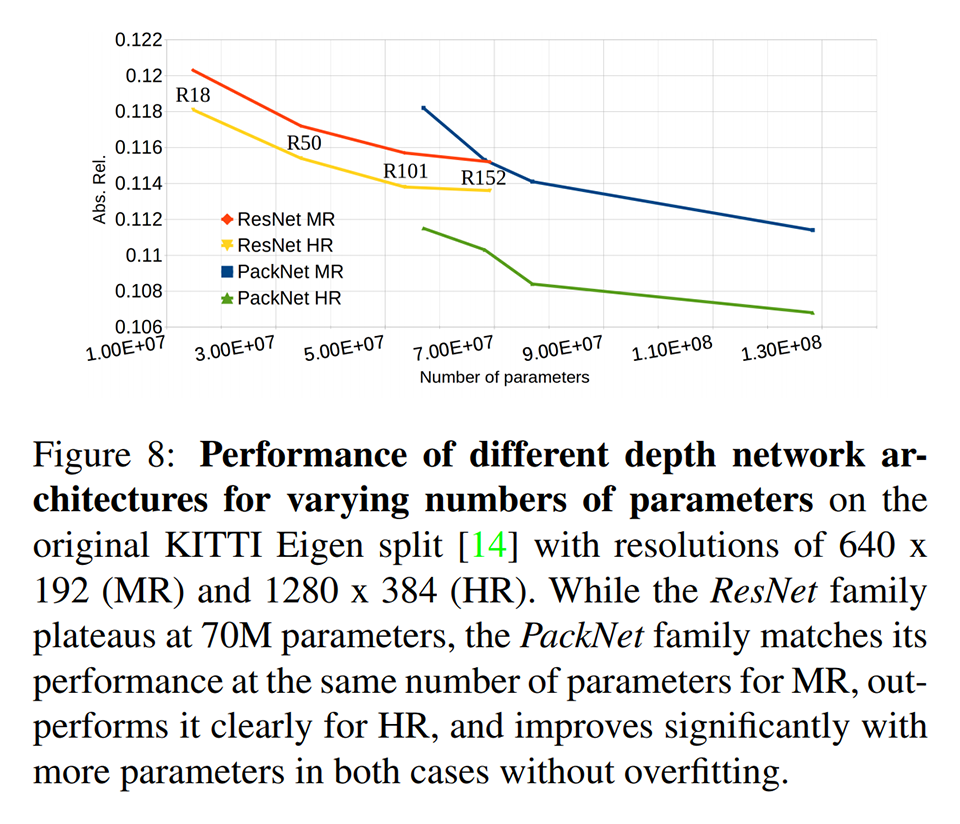

### PackNet のアーキテクチャ探索
PackNet の 3D convolution の出力チャネル数を変化させ、精度の変化を観察した。出力チャネル数を増やすと精度が改善してゆく。
packing / unpacking をなくしたり、3D convolution をなくすと、monodepth2 と同程度の精度になってしまう。packing / unpacking、3D convolution が肝である。

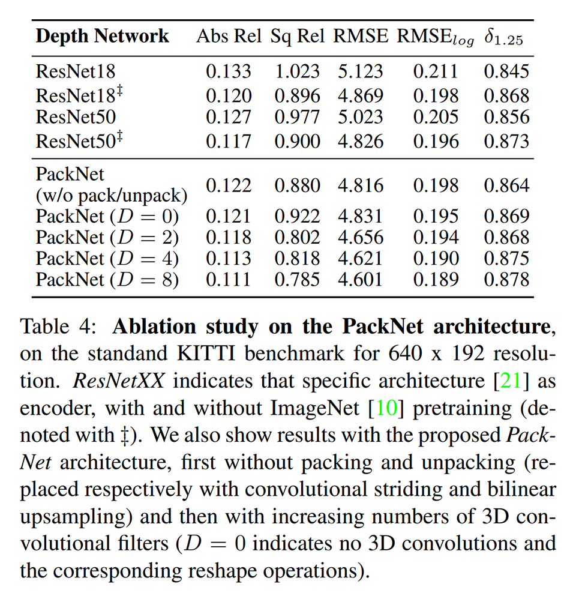

### 汎化精度の比較
PackNet と monodepth2 を KITTI と CityScapes で学習し、NuSences で評価した。PackNet は明らかに汎化精度が高い。

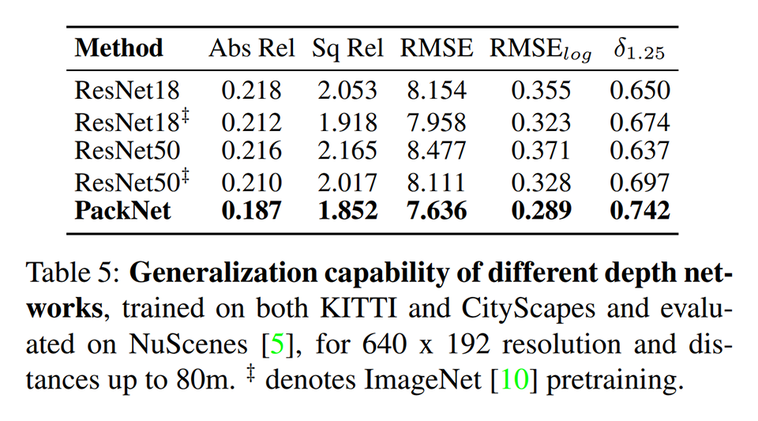

## 議論はある？
- PackNet（自己教師あり学習型の単眼深度推定のためのアーキテクチャ）を提案した。
- packing / unpacking は、対称的で細部の情報を保存でき、高解像度の視覚情報の圧縮方法・伸長方法を学習できる。

### 私見
- KITTI は規模も小さく、かなり攻略されているので、最新手法を比較するには不十分だったが、DDAD がこの問題を緩和してくれたことは、貢献として大きい。
- 論文中では 3D convolution が効いている風な主張があるが疑わしい。チャネル空間をスライドして畳み込む意味がよく分からない（パラメータは節約できるが、意味的には不自然である）。3D convolution を 2D convolution にしても同等の精度が出せるような気がする（パラメータ数が多くなるが、意味的に自然になる）。
- 特に言及されていないが、ELU も効いているような気がする。回帰問題を解く場合に、ReLU など滑らかではないモデルを用いると良くない（汎化精度や敵対的頑健性が低下する）。これを ELU でケアしたことが効いているのかもしれない。

## 次に読むべきタイトルは？

### monodepth2
- [\[arxiv\]](https://arxiv.org/abs/1806.01260) C. Godard, O. M. Aodha, M. Firman, G. J. Brostow, "Digging into self-supervised monocular depth prediction", ICCV, 2019.
