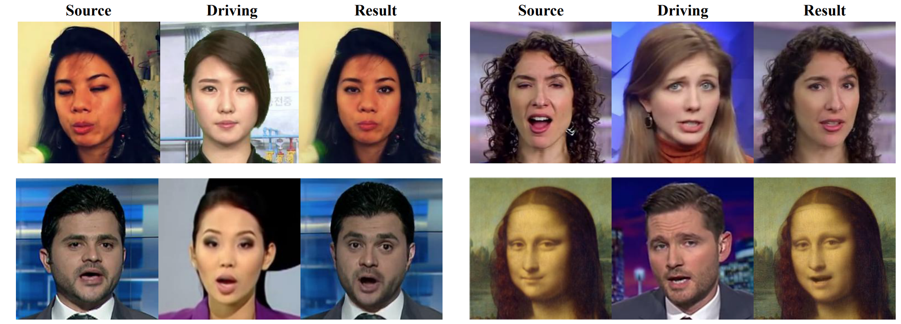
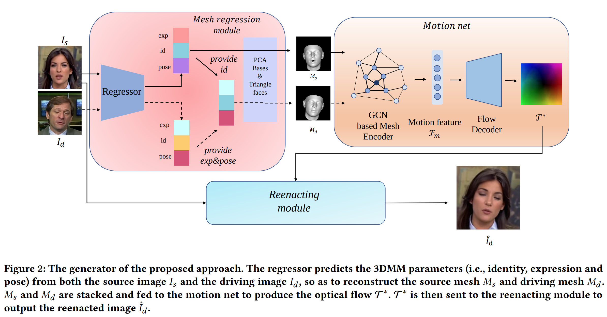
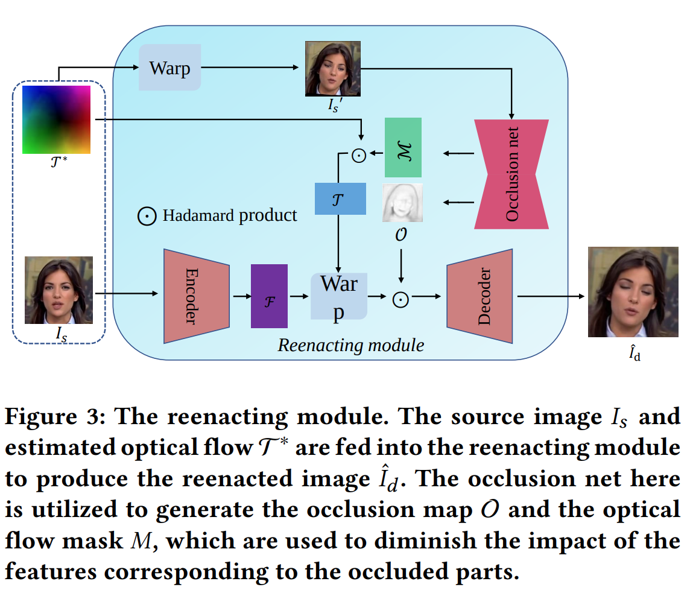
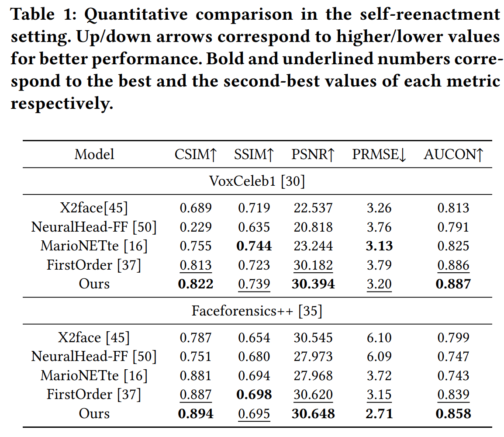
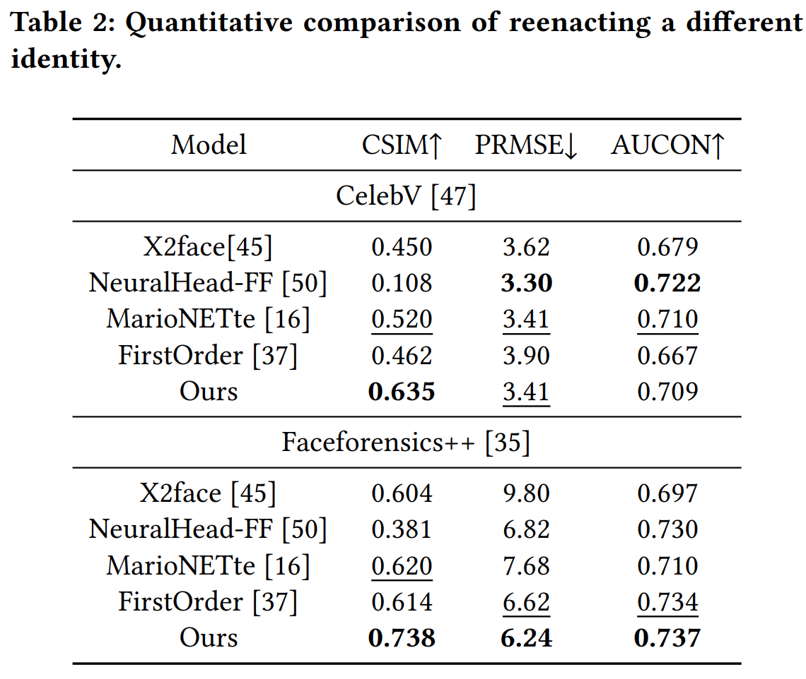

# Mesh Guided One-shot Face Reenactment Using Graph Convolutional Networks
[https://arxiv.org/pdf/2008.07783.pdf](https://arxiv.org/pdf/2008.07783.pdf)
(まとめ @strshp)

著者
- Guangming Yao
- Yi Yuan
- Tianjia Shao
- Kun Zhou
(NetEase Fuxi AI Lab, State Kye Lab of CAD&CG, Zhejiang University)

## どんなもの？

- ターゲット画像の表情をソース画像に適用するモデル
- [同じタスクを解く別手法(MarioNETte)のデモ](https://www.youtube.com/watch?v=Y6HE1DtdJHg)

## 先行研究の弱点
- GANベースの手法では、生成される画像のクオリティは高いものの、学習には同一人物の画像が大量に必要だった。別の人物に適用する場合には、再学習が必要だった
- 顔のキーポイントを利用してソース画像からターゲット画像へのOpticalFlowを求め、それを元にソース画像を変形する方法も提案されていたが、
ソース画像とターゲット画像で顔の形が違うため、ソース画像の顔が上手く保持されないという難点があった
- 顔のキーポイントは疎であるため、表情の細かい部分の情報が抜け落ちてしまっている。そのため、生成された画像はターゲット画像の表情を完全には再現できない
- 最新の研究では、LandmarkTransformer(?)を使ったFew-shotの手法が提案され、上記の手法の問題点に対処したが、まだ品質が完全とは言えなかった

## 先行研究と比べて何がすごい？
- 学習に使っていない画像に対しても適用可能
- 先行研究で提案された手法よりも、定量的にも定性的にも高品質な結果が得られる

## 技術や手法の肝は？
### 概要
- 処理の途中で扱う顔の表情や頭部の姿勢情報を「キーポイント」ではなく「メッシュ」として保持することで、生成画像のクオリティを高めた
- ソース画像の変形に用いるOpticalFlowをメッシュを使って生成したり、オクルージョンを意識してめちゃくちゃ丁寧に生成

### モデル
- モデルは Generator と Discriminator からなる
  - Discriminator は WGAN-GPのものを利用する
  - Generator が本手法の肝
  
#### MeshRegressionModule
- ソース画像とターゲット画像に対するメッシュを生成するモジュール
  - 既存モデル(3DMM regressor)を使って、画像から表情(exp)、見た目(id)、頭部姿勢(pose)をエンコードしたベクトルを抽出
  - 抽出したベクトルから、既存モデル(?)を使ってメッシュ(頂点ベクトルと隣接行列)を生成
  - ソース画像とターゲット画像それぞれに対して上記の処理を行うことで各画像に対してメッシュ(M_s, M_t)を生成
    - このとき、ターゲット画像のIDをソース画像のIDに置き換えることで、ターゲット画像の顔の形状を無視できると主張
  
#### MotionNet
- 2つのメッシュ間から、2画像間のピクセルの移動を表すOpticalFlowを生成するモジュール
  - GCNを使って(M_s, M_t)から2画像間の動きをエンコードしたベクトル(F_m: Motion Feature)を生成
  - 残差構造を利用したデコーダーネットワークで、F_mからOpticalFlow(Γ*)を生成

#### Reenacting Module
- OpticalFlowとソース画像を元に、ソース画像にターゲット画像の表情と頭部姿勢を適用した画像を生成するモジュール

  - エンコーダーを利用して、ソース画像I_sから画像中の特徴Fを抽出しておく
  - OpticalFlow Γ* をソース画像 I_s に適用し、雑な出力結果I_s'をまず作成
  - Occlusion Netを用いて、I_s'から Occlusion Map と OpticalFlow Mak を生成
  - OpticalFlow Maskを利用してOptical Flow Γ* をマスキングし、それを用いてFを変形
  - Occlusion Map と 変形した F を掛け合わせたものを Decoderに入力し、最終的な出力を得る

#### 学習
- MeshRegressionModule は　MotionNet と Reenacting Module とは別に学習
  - FaceWarehouse, WFLW, AFLW の3つの顔画像のデータセットを使って学習
- MotionNet と Reenacting Module の学習には自己教師あり学習を適用
  - I_s と I_d に同じ画像を入力して学習させる
  - 推論時は I_s と I_d は異なる画像にできる

#### 損失関数
- 

## どうやって有効だと検証した？
### 定性評価
- 同様のタスクに対する既存手法を同じ画像に適用し、視覚的に性能を評価

### 定量評価
#### 入力画像の再構成の評価
- ソース画像とターゲット画像に同一の画像を与え(入力画像の再構成)、入力画像と出力画像の一致度を評価
- 評価指標
  - 画像上の見た目を評価: ピクセル間の類似度を図る指標(SSIM, PSNR)
  - ソース画像の見た目が保持されているかを評価: 顔認識モデルを使って中秋出した画像上の人物の Identity ベクトルのコサイン類似度(CSIM)
  - ターゲット画像の表情や頭部姿勢が保持されているかを評価: PRMSE, AUCON

#### ソース画像とターゲット画像が違う場合の評価
- ソース画像とモデルの出力が違った見た目になるため、ただ単に画像の類似度を評価するSSIMとPSNRは利用できない

## 議論はある？
- 特になし

## 次に読むべき論文は？
[Graph Neural Networks](https://arxiv.org/pdf/1812.08434.pdf)
[Regressing Robust and Discriminative 3D Morphable Models](https://openaccess.thecvf.com/content_cvpr_2017/papers/Tran_Regressing_Robust_and_CVPR_2017_paper.pdf)
