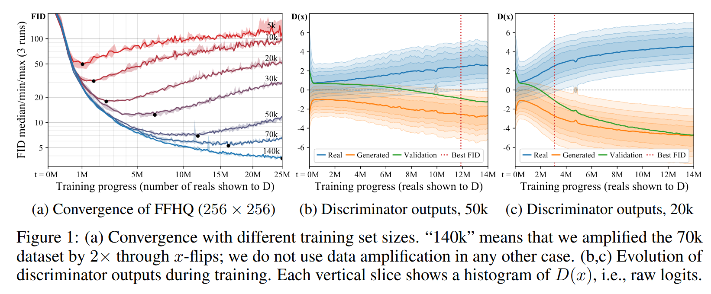
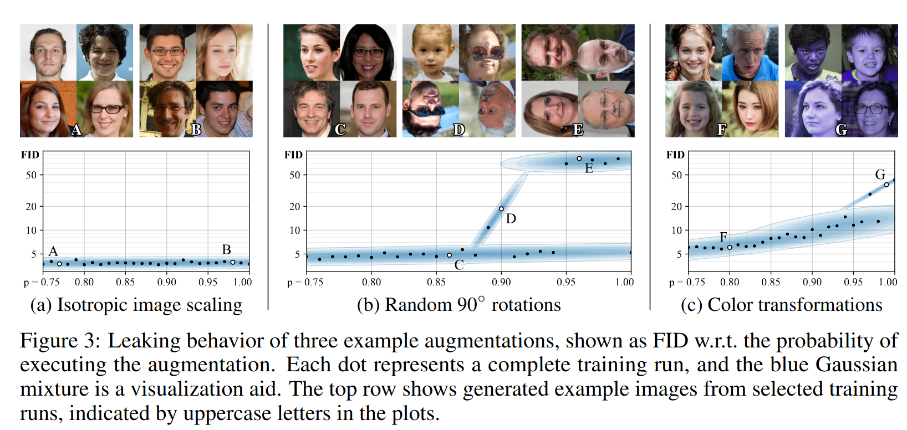
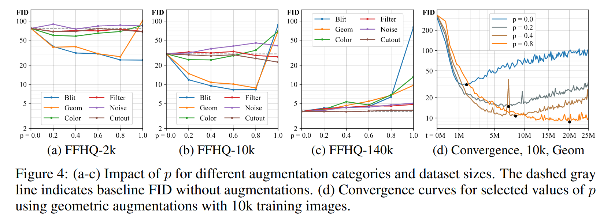
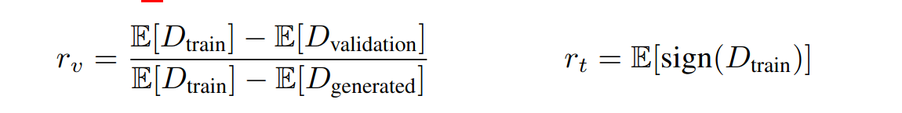
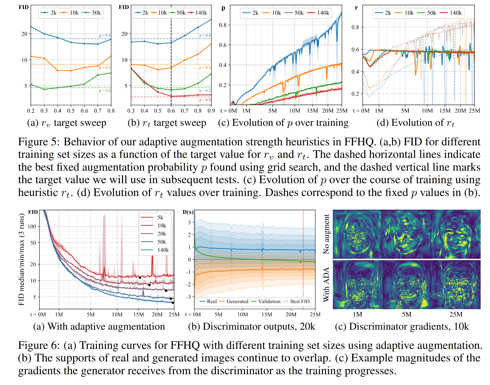
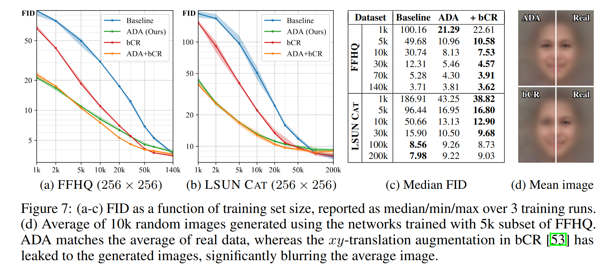
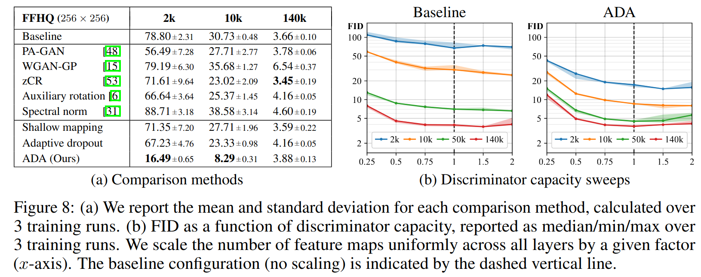
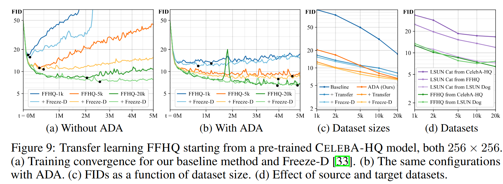
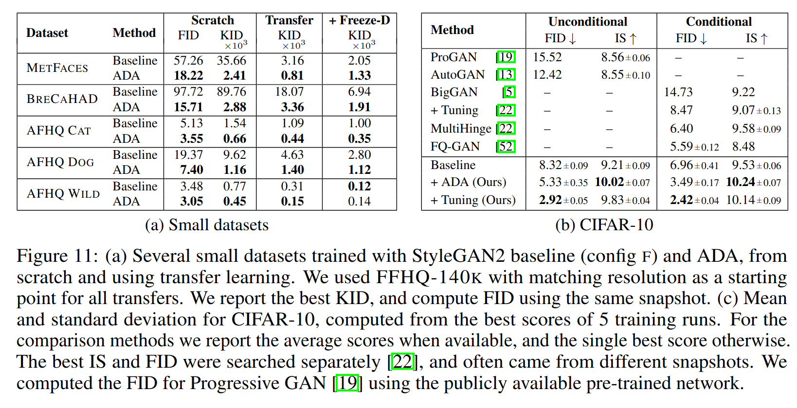

Training Generative Adversarial Networks with Limited Data
===

2020/06

Tero Karras, Miika Aittala, Janne Hellsten, Samuli Laine, Timo Aila (NVIDIA)

Jaakko Lehtinen (NVIDIA, Aalto University)

https://arxiv.org/abs/2006.06676

---

## どんなもの？
- GANの学習時にデータが少ないと、Discriminatorが過学習してしまう
- 上記の減少を防ぐ手法としてadaptive discriminator augmentation (ADA)を提案
- Discriminatorの入力となる画像に対してオーグメントを行う
- オーグメントを適用する確率は訓練中に動的に変化する

## 先行研究と比べて何がすごい？
- 一般にGANの学習には膨大なデータが必要とされていたが、それが改善された

## 技術や手法の肝は？
### Discriminatorの過学習について

- GANの学習を続けていくと、Dの過学習が始まり、同じタイミングでFIDの改善も止まる
- この現象は訓練データが少ないとより顕著に現れる
- 過学習が始まると、検証用の本物の画像に対しても生成画像だと判断するようになる

### 過学習の改善
- 過学習を抑えるために、一般によくデータオーグメンテーションが行われる
- GANの学習においては、オーグメント後の画像をGにも見せてしまうと、Gはオーグメント済みの画像を生成してしまう
- そのため、Dに与える画像のみにオーグメントする必要がある
- 従来手法にもDのみにオーグメント画像を見せることで性能改善を図るものがあったが（bCR）、それでもGがオーグメント後の画像を生成する現象が確認された
- 本論文中ではこの現象をGにオーグメントがリークしたと呼ぶ

### リークしないオーグメント方法の提案
#### オーグメントする割合を制御してリークを防ぐ

- オーグメントをする確率*p*に注目した
- 例えば全画像に対して0, 90, 180, 270から一様に回転のオーグメントをかけると、Gは元の位置がどれなのかが学習できないので、回転後の画像を生成するようになってしまう
- しかし、ある確率*p* < 1で上記のオーグメントを行えば、0度回転の画像を見る機会が増えるため、Gは0度回転の画像を出力することが多くなる
- 回転のオーグメントの場合、*p* < 0.85ならば、訓練後のGは必ず正しい位置の画像を生成するようになった
- 同様にカラーシフトのオーグメントでも、*p* < 0.8ならば、Gは正しい色の画像を生成した

#### よく効くオーグメントの探索

- 効くオーグメントを調べた
- pixel blitting, geometric transformations, color transforms, image-space filtering, additive noise, cutoutをそれぞれ適用して、FIDを図った
- pixel blitting, geometricm transformations, color transformsが良かった

#### Adative discriminator augmentation
- オーグメントをかける確率を操作すればリークがなくなり、性能が良くなることが分かったが、訓練中にこの確率を調整したほうがより良くなるのではないかと考えた
- この確率を操作する指標を2つ提案した

- この*r*をハイパーパラメータとして、実験中この値が一定になるように*p*の値を変動させた
- *E*はNバッチごとの平均で、本論文中の実験ではN=4
- 各バッチは64枚

- グリッドサーチで見つけた値で*p*を固定した場合よりも、*r* = 0.6を維持するように*p*を変動させたほうがFIDの値が良くなることが分かった
- 2kのときは*p*が高い値になり、*r*の値を維持するためにはオーグメントの強さが十分じゃないことを示している
- *p*を固定すると、最初はオーグメントが強すぎで、終盤は弱すぎということがわかった
- 検証画像に対してDの値がいい感じになった
- ADAありの場合、訓練が進んだ後でも勾配が詳細であることがわかった

## どうやって有効だと証明した
### スクラッチのとき

- ADAありとADAなしでFIDの値を測った
- FFHQとLSUN CATデータセットを用いた
- 従来手法のbCRだけだと、Gにオーグメントがリークしていることが分かった
- Dのパラメータを減らすと結果は悪くなることがわかった

### 転移学習のとき

- Dの最大解像度の層の重みを固定して学習するFreeze-Dという方法で転移学習した
- GANの転移学習の場合は、類似度よりも多様性のほうが重要だと分かった

### データセットのサイズが小さいとき

- METFACES(1336), BRECAHAD(162), AFHQ(5k)と、CIFAR-10（各クラス5000枚、10クラス）に対して学習した
