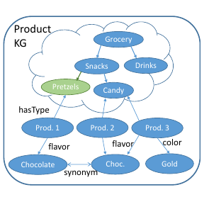
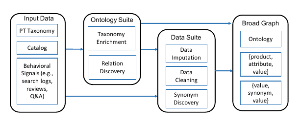
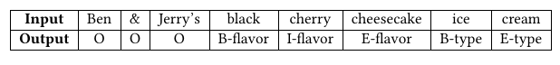
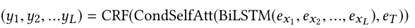
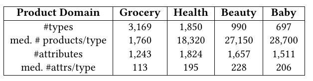
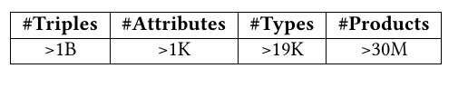

# AutoKnow: Self-Driving Knowledge Collection for Products of Thousands of Types
[https://arxiv.org/abs/2006.13473](https://arxiv.org/abs/2006.13473)
(まとめ @n-kats)

著者
* Xin Luna Dong
* Xiang He
* Andrey Kan
* Xian Li
* Yan Liang
* Jun Ma
* Yifan Ethan Xu
* Chenwei Zhang
* Tong Zhao
* Gabriel Blanco Saldana
* Saurabh Deshpande
* Alexandre Michetti Manduca
* Jay Ren
* Surender Pal Singh
* Fan Xiao
* Haw-Shiuan Chang
* Giannis Karamanolakis
* Yuning Mao
* Yaqing Wang
* Christos Faloutsos
* Andrew McCallum
* Jiawei Han

主にアマゾンのメンバー

# どんなもの？
商品の種類を自動で分類する研究。
商品の種類（1.1万種）の関係（親子関係・類似関係）や商品の購入に関わりが深い属性を見つける。
これを自動でスケールする方法で消費者の行動も加味して実現した。

# 先行研究と比べてどこがすごい？
* end-to-end で知識を収集するモデル
* アマゾンでの購買活動の膨大な情報を利用
* 種類が多くても大丈夫
* GNN, トランスフォーマー, multi-task等を駆使
* 結果、オントロジーが2.9倍に拡大し、精度改善

# 技術や手法の肝は？
## 言葉
* ontology 対象と対象間の関係を用いた知識表現の方法
* Knowledge Graph（KG）知識グラフ
* taxonomy 分類法

### broad graph

商品種と属性をリンクする二部グラフをbroad graphと呼ぶ
（商品種と属性値が頂点で、属性の種類が辺）。

### taxonomy
商品種間の包含関係を表すグラフ（木）。コーヒーとドリンクの関係等。

### catalog
* taxonomy
* 属性のリスト
* 商品のリスト
* 商品と属性値のリスト
をまとめてproduct catalog と呼ぶ

### その他
* 商品説明（タイトルや説明文等）
* ログ（利用者の）

## 問題設定
* C = (_T_, A, P): catalog
* _T_ = (T, H): taxonomy
* T: 商品種のリスト
* H: 階層構造
* A: 属性種のリスト
* P = [(ID, [type, ...], [(attr, value), ...])]: 商品の情報
* L: ログ

catalog情報を更新する。
つまり、CとLを入力して、_T_の更新（新しい商品種を追加、階層構造を修正）と商品情報の更新（新しい商品種や属性を登録）。

## メタアーキテクチャ

大きく2パートに分かれる（ontology suiteとdata suite）。

ontology suite では、
* taxonomyの更新（新しい商品種の検出、階層構造の更新）
* 商品種毎の属性の評価（購入に関与するか）
を認識。

data suite では、
* 新しい属性値推定（商品説明等を利用）
* 既存情報の異常箇所を新しい属性値を使って検出・削除
* 属性値を見て、同一商品の検出

## ontology suite
### 商品種の検出
商品のタイトル等から抽出。タイトル内の単語をB,I,O,Eに分け（begin, inside, outside, end）、商品種にあたる部分を検出（OpenTagを利用）。

### 階層構造の更新
旧商品種と新商品種の間で親子関係にあるかの2値分類を行う。グラフ系（種類・商品・クエリを頂点、co-view・クエリから購入にいたったか・商品やクエリに種類が書かれているか、の関係を辺）のニューラルネットを利用。

親子関係が正しく検出できたかをF値で評価（Edge-F1とAncestor-F1の2種類）

### 商品の属性の評価
重要な属性は、売り手も買い手も頻繁にキーワードを書くことに注目。
* 商品がその属性を持つかどうか（分類）
* その属性がどれだけ重要か（回帰）

の2つのモデルをRandom Forestで実現。属性の重要度は買い手のキーワードとしてよく出るかを判断にする（バーコードみたいなのは売り手が頻繁に入力するけど、買い手はコメントしない）

教師は、人手で作成。（MTurkを使うときは多数決したり平均をとったり）

## data suite
### 属性値推定
商品のタイトルの単語だけでなく、商品種もベクトル化してconditional self attentionで混ぜ込むことで、商品種も推定に活用する。

### 異常検出
香りの属性なのに、大きさが入っていたりする場合があるのを対策。単語、どの入力か（商品説明かタイトルか等）、位置をベクトル化し、合算。トランスフォーマーを使って、文全体をベクトル化し、異常か否かの2値分類をする。

### 同一判定
まず、同時に見られる商品を同じ可能性があると思って選ぶ。その候補の中から、同一かどうかの2値分類をする。
そのときの特徴量は、edit distance、MT-DNNのスコア、特殊な単語かの情報を用いる。

# どうやって有効だと検証した？
アマゾンの食品・健康・美容・ベビーのジャンルを選び（難しい部類）

本手法でtaxonomyのサイズが2.9倍（6.7K→19K（複数ジャンルで出現した分を考慮すると11K））

# 議論はある？
* taxonomyの構造を木で表現しない方がいいのでは？
* ノイジーなデータが精度を下げていて、そういうのを削除して訓練したい（特にベビーがひどい）
* 画像や商品公式サイトの内容も取り込みたい

# 次に読むべき論文は？
* "Building a large-scale, accurate and fresh knowledge graph"（KDDでのチュートリアル）
