# Training Generative Adversarial Networks by Solving Ordinary Differential Equations
[https://arxiv.org/abs/2010.15040](https://arxiv.org/abs/2010.15040)
(まとめ @n-kats)

著者
* hongli Qin
* Yan Wu
* Jost Tobias Springenberg
* Andrew Brock
* Jeff Donahue
* Timothy P. Lillicrap
* Pushmeet Kohli

DeepMindの人たち

# どんなもの？
GAN学習方法を見直し、大幅にGANを改善した。

通常の機械学習では素朴な最適化（オイラー法 θ -= lr * grad）だった。
これを高次の手法（ここではRunge-Kutta）を使ったり、GANの学習にあった正則化項を追加したりして精度改善した。

論文ではCIFAR-10やImageNetで訓練し評価をしている（高解像度のデータは扱っていない）。

# 先行研究と比べてどこがすごい？
「これまでGANの訓練に苦労していたのは、最適化の手順で何も考えずに行っている離散化が良くないためだ」という予想のもと、Runge-Kuttaを利用。

正則化の工夫を加え、 *Adamのようなadaptiveな最適化を使わず* *Spectral Normalizationのような関数空間の制限をせず* により良い成果を得た。

# 技術や手法の肝は？
## おさらい（GAN）
GANは生成モデルで、generatorとdiscriminatorの二つのネットワークからなる。
* G: generator。（画像等を）生成する
* D: discriminator。（画像等が）generatorが生成したものかデータセットに含まれるかを判定する
* φ: Gのパラメータ
* θ: Dのパラメータ

学習に使う目的関数の基本的は次の式で与えられる。

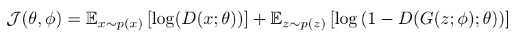

Gはこれを小さくするように、Dはこれを大きくするように訓練する。

FID（生成結果の分布が妥当かを評価）とIS（識別可能なものを生成するかを評価）を用いて評価される。

## 問題設定の整理
GANはモデルが複数あって、それぞれ用に損失関数があるモデルといえる。

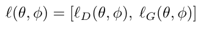

通常の訓練は、次の最適化を行う。

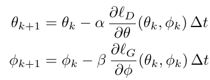

ただし、αΔtやβΔtが学習率に相当。わざわざΔtを持ち出したのは、GANの訓練が次の常微分方程式（ODE）を離散化したことを強調している。

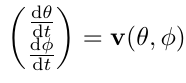

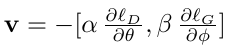

常微分方程式のままなら、なんらかの条件を満たせばGANの最適解（Nash均衡）の近くならそこへ収束するはず。

うまくいかないのはここの離散化が微妙という仮説をもとに考える。

## ODE-GAN
### ODEStep
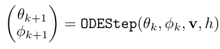

ODEStepはオイラー法、RK2、RK4を検討。RK4は通常より2倍程度1ステップの訓練が必要になる。

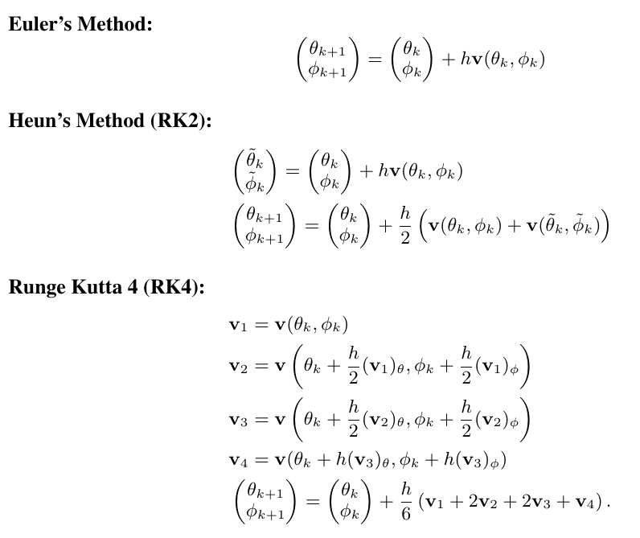

### gradient regularisation
Gのパラメータφの勾配が小さくなるようにθを最適化する。

RK4と組み合わせる場合等、勾配を複数回計算するが、正則化は1回で十分効果がある。

これをすると数値積分の誤差をいい感じに抑える効果がある。

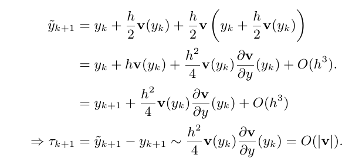

### 疑似コード

# どうやって有効だと検証した？
コードは [https://github.com/deepmind/deepmind-research/tree/master/ode_gan](https://github.com/deepmind/deepmind-research/tree/master/ode_gan) に公開されている。

## 実験1(Mixture of Gaussian)
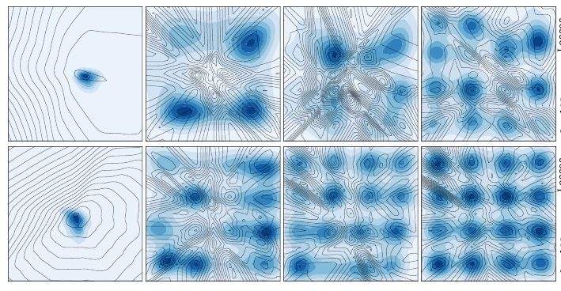

人工データ（平面内の点）をもとに生成。
上がオイラー法、下が本手法。下は格子状に（左が訓練初期、右に進むにつれ訓練が進む）

この実験で、RKだけを使ってgradient regularisationをしなかった場合も訓練がうまくいかなかった。

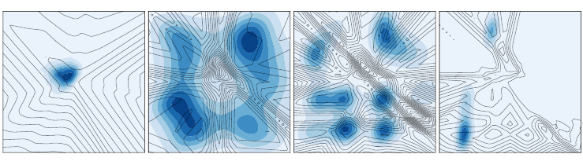

## 実験2(CIFAR-10, Imagenet)
実験1でRKとgradient regularisationの組合わせがポイントと分かった。しかし、データがシンプルすぎたので、CIFAR-10でより詳しい実験をした。

## vs オイラー法
RKとオイラー法の比較をしたところ、大幅に差がでることが分かった。

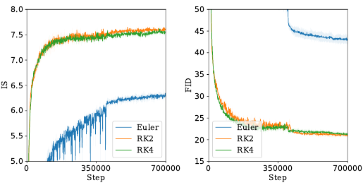

### gradient regularisation の効果
正則化項の係数をいくつか変えて訓練した。
結果、正則化が効果が出るようにある程度大きい値をとる必要があることが分かった。

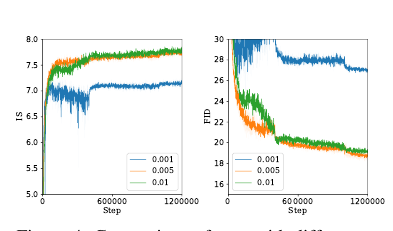

## vs Adam
Adamを使う使わないで損失の値の傾向が大きく変わった。

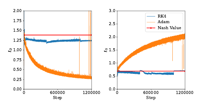

ナッシュ均衡での損失の値（log 4 や log 2）の付近の値をGとDでバランスよくとっている。

## vs SNGAN

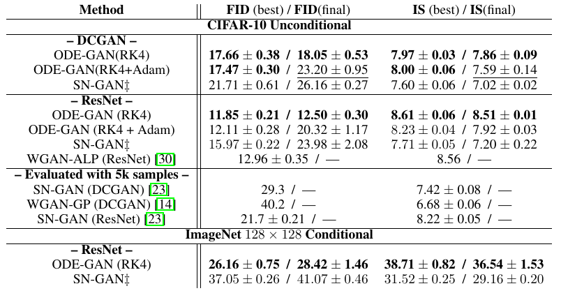

全体的にODE-GANが優れている。単にそれだけでなく、最終ステップのスコアと訓練途中のベストな値とで差が小さいこともわかる。実際、SNGANでは過学習のような挙動になっているが、ODE-GANだとそういう傾向がみられない。

# 議論はある？
高次の近似でGANの訓練が安定して訓練できるようになった（他の安定化の手法に頼らずに）。この研究から、GANが潜在的に不安定なのではなく、最適化の離散化が悪さをしていることが言える。
この研究で、GANの学習が専門家でなくても簡単にできるようになるのでは？と期待を書いている。

## 私見
コードをみたらjaxで書かれている。2回微分みたいな計算や、RKのように勾配を一時的に記録したりするのはjaxがかなり書きやすそうだった（ただし、計算が得意な人向け）。
DeepMindの人たちがjaxのエコシステムを発展させていて、そろそろ、触っておくといいだろうなって最近思っています。([https://bit.ly/2VH4YVu](https://bit.ly/2VH4YVu))

# 次に読むべき論文は？
議論のところで、ここら辺の研究の方向にこの研究を発展させたいということを書いていたので、ここらへんを読むとよさそう
* A solvable high-dimensional model of gan.
* On solving minimax optimization locally: A follow-the-ridge approach
* Convergence of learning dynamics in stackelberg games
* cGANs with projection discriminator
