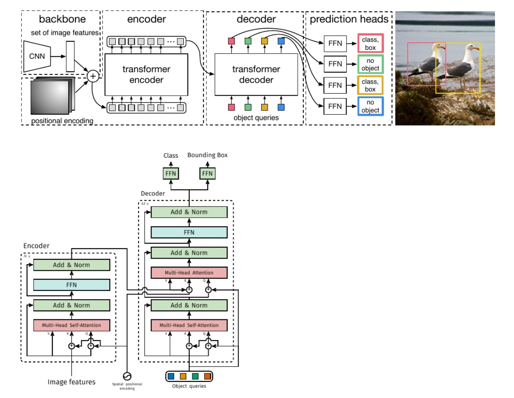
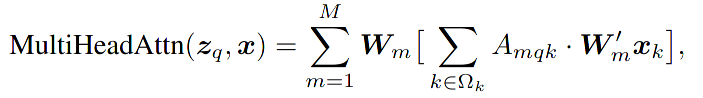
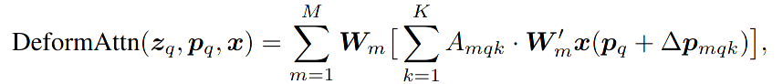
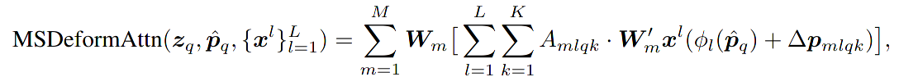
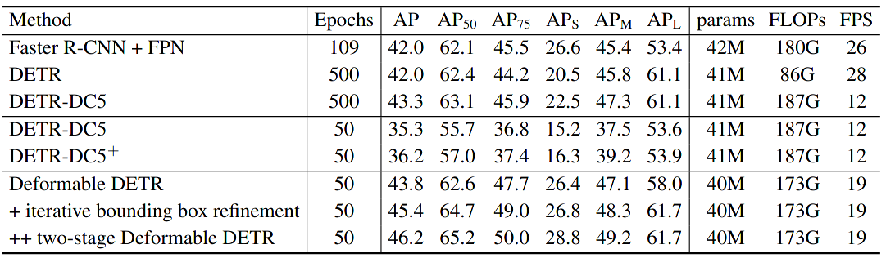
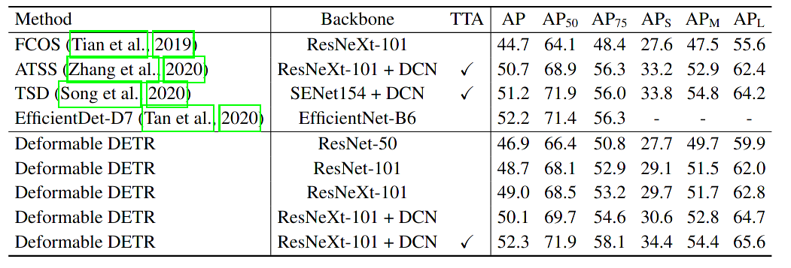

Deformable DETR: Deformable Transformers for End-to-End Object Detection
===
Xizhou Zhu, Weijie Su, Lewei Lu, Bin Li, Xiaogang Wang, Jifeng Dai

https://arxiv.org/abs/2010.04159

@cohama

## どんなもの?

- Transformer を使った物体検出 DETR を改良
- 精度向上、処理速度向上に加え収束も早い

## 先行研究と比べて何がすごい？

- Transformer を使った物体検出はアンカーの設計や NMS が不要になるなど多くの利点がある
- 一方で収束が遅い (Faster R-CNN の10〜20倍遅い)、特に小さいオブジェクトの認識精度が低いという問題点があった。
- この論文では Deformable Convolution のアイデアを Transformer (Multi Head Attention) に応用することによりこれらの問題を改善

## 技術や手法の肝は？

### Deformable Attention

従来の DETR と構造的には同じ

ここの Multi Head Attention を Deformable Attention に変える。ただし、Decoder の Self-Attention の部分は従来のまま。

#### 通常の Multi Head Attention。

- `A` Attention Weights (Key と Query の内積的なやつ)
- `x` Feature map の情報
- `M` ヘッドの数
- `Wm`, `W'm` 学習可能なパラメータ

#### Deformable Attention

- `⊿p` オフセット。この分の離れた点の値をフィーチャーマップからバイリニア補間で持ってくる
- `K` 近傍のピクセル何点参照するかのハイパーパラメータ。この論文の実験では K=4 くらいで設定
- `A` Attention Weights (さっきの A とはサイズが違う)
- `x` Feature map の情報
- `M` ヘッドの数

要は、object query の近傍 K 個だけのピクセルから Attention を計算する

最終的には L 個のフィーチャーピラミッドの情報も混ぜる。

`K=L=1` で W'm が単位行列だと Deformable Convolution (の畳み込みの直前) とみなせる。

フィーチャーピラミッドは SSD ライクな構造。Attention で情報を混ぜるので FPN や PANet のように解像度の異なるフィーチャーマップを混ぜる必要がない。

### その他のテクニック

#### Iterative Bounding Box Refinement

#### Two-Stage Deformable DETR

適当に Object query を選ぶのではなく two-stage 系の検出のように Resion Proposal を生成してそれを Decoder に食わせる

## どうやって有効だと検証した？

## 議論はある?

## 次に読むべき論文

- DETR: Transformer を使った物体検出のオリジナル。 (https://arxiv.org/abs/2005.12872)
- Deformable Convolution (https://arxiv.org/abs/1703.06211)
