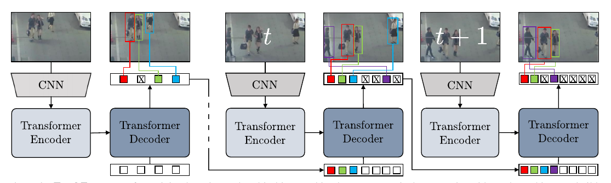
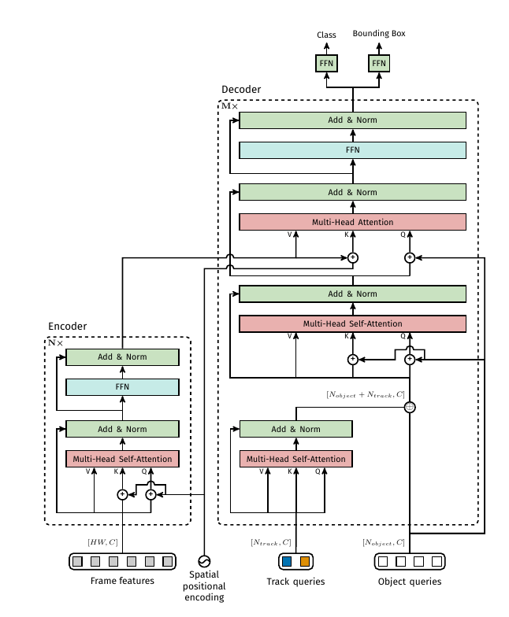
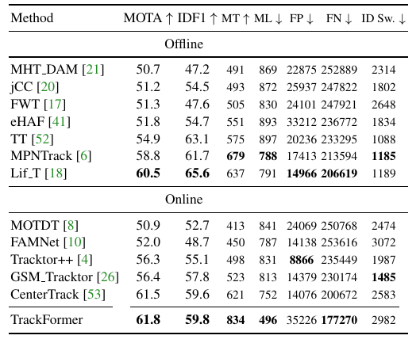
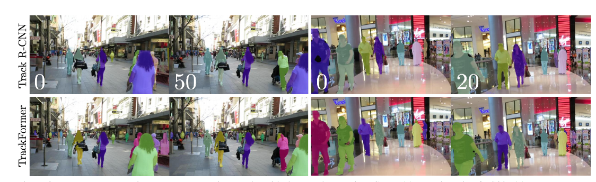

# TrackFormer: Multi-Object Tracking with Transformers
[https://arxiv.org/abs/2101.02702](https://arxiv.org/abs/2101.02702)
(まとめ @n-kats)

著者
* Tim Meinhardt
* Alexander Kirillov
* Laura Leal-Taixe
* Christoph Feichtenhofer

FAIRとミュンヘン大学のメンバー

# どんなもの？
画像認識にトランスフォーマーを使う流行の一つ。この論文では検出＋トラッキングを行うTrackFormerを提案。著者のKirillov氏はDETRの著者でもある。

過去の研究会で関係するもの
* [DETR](https://github.com/mlnagoya/surveys/blob/master/20200618_reports/detr_2005.12872.md)
* [Deformable DETR](https://github.com/mlnagoya/surveys/blob/master/20201217_reports/deformable_detr.md)

# 先行研究と比べてどこがすごい？
DETRでは検出やパノプティックセグメンテーションを扱っていた。これらは、一つの画像で認識を行うものだった。本手法ではトラッキングのような時系列の認識ができるようになった。

DETRの魅力（アーキテクチャがシンプル。アンカーとか考えなくていい）を持ちつつ、トラッキングの認識のためのクエリーの使い方も上手く、性能もSOTA相当（CenterTrackよりちょっといい）。

# 技術や手法の肝は？
## おさらい（DETR）

簡単のため、検出の場合について。

1. 入力（画像）
2. 特徴抽出（backbone）
3. 位置情報付与（positional encoding）
4. エンコーダー
5. デコーダー（クエリー複数を入れると対応した結果を出す）
6. 分類やBBoxの認識

デコーダーに入力するオブジェクトクエリーは学習で獲得（気持ちとしては「ここら辺にあるものは何ですか」みたいな意味のクエリー）。

デコーダー内のアテンション機構のおかげで（損失関数の工夫もあり）、NMSの後処理をせずとも重複して検出しないように学習する。

ここでは、特徴抽出したあと、クエリーを複数入れて認識を行う手法と理解すればTrackFormerの理解に十分のはず。

## メタアーキテクチャ

最初のフレームはDETRと同じ。次のフレームから追跡が始まる。
Nフレーム目の認識結果からトラッキングクエリーを作成し、N+1のクエリーに用いる（もちろんオブジェクトクエリーもある）。色がついたクエリーがトラッキングクエリー。

## 自己回帰によるトラッキングクエリー
トラッキングクエリーはデコーダーの出力を使う。

デコーダーはこういう構造。

デコーダーから出てきた後に出力を出す層（FFN）がついて認識を行う。このFFNの手前（デコーダーの出力）をトラッキングクエリーに使う。

トラッキングクエリーからBBoxや分類の認識ができるため、物体を説明するのに十分によい特徴を持っていると期待できる。（こういうクエリーを自分で認識しているため自己回帰）

# どうやって有効だと検証した？
MOT17とMOTS20で評価。

## 訓練
### MOT17の場合

1. COCOで訓練したDETRを用意し
2. CrowdHumanデータセットで人検出の強化（CenterTrack準拠）
3. MOT17

2と3で合計3日V100で回す。

### MOTS20の場合
MOTS20はインスタンスセグメンテーションも同時に行う。
これは、DETRの枠組みだと、それようのデコーダーを用意するだけ。

1. MOT17で訓練したTrackFormerにセグメンテーション用のデコーダーを追加
2. COCOの人を含むデータだけで追加部分を訓練
3. MOTS20のデータで全体を訓練

## 結果
### MOT17

### MOTS20

## 例

# 議論はある？
トラッキング手法に tracking-by-attention と呼ぶべき新しいパラダイムを提案した。
これによって、特別なマッチングやグラフ最適化や動作や見た目のモデルを使うことなくトラッキングができるようになった。

## 私見
DETRを読んだときに、トラッキングもそのうちされるだろうと思っていたが、それがきた。今後も既存の課題をトランスフォーマーで解く研究が進むと予想されて楽しみ。
トランスフォーマーだと、複雑な問題をクエリーとデコーダーでコントロールできて、高度な認識方法や効率的な方法が実現される可能性がある。

TrackFormerについては、訓練が複雑。MOTS20までするのにステップが多すぎる...。どういう問題を解くかという点以外にも、訓練の効率化の研究にも期待したい。

# 次に読むべき論文は？
* [TransTrack: Multiple-Object Tracking with Transformer](https://arxiv.org/abs/2012.15460)  
  同じようにトランスフォーマーベースのトラッキング。タイトルの一致度がやばい。TrackFormerの方がすっきりしているように見える。
* [Line Segment Detection Using Transformers without Edges](https://arxiv.org/abs/2101.01909)  
  トランスフォーマーで線分を検出する話。アンカーの時代が終わろうとしている感じがひしひしとする。
