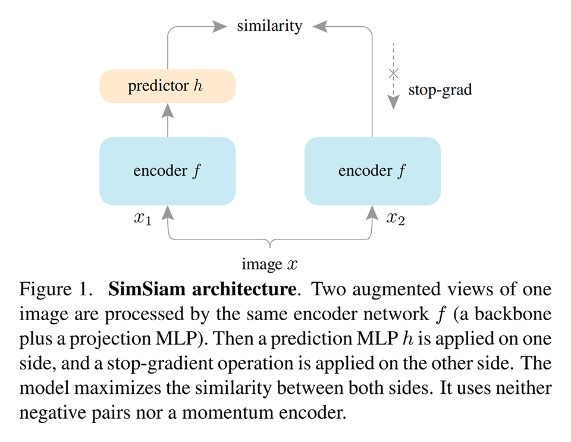
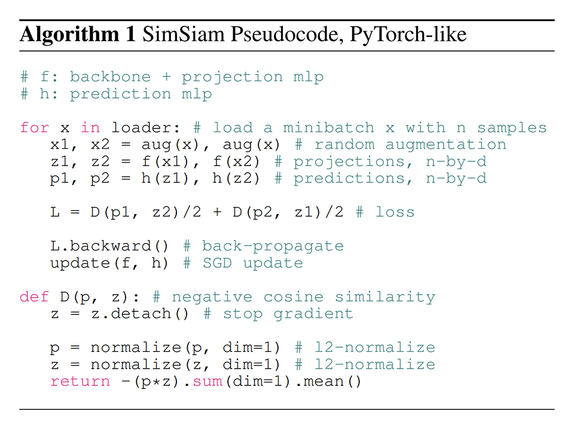
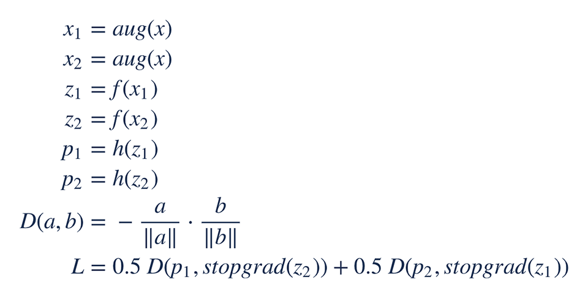
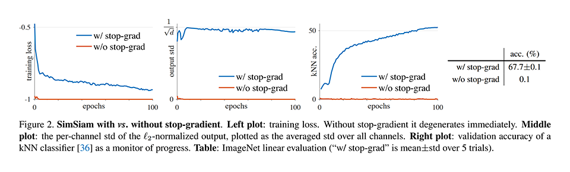
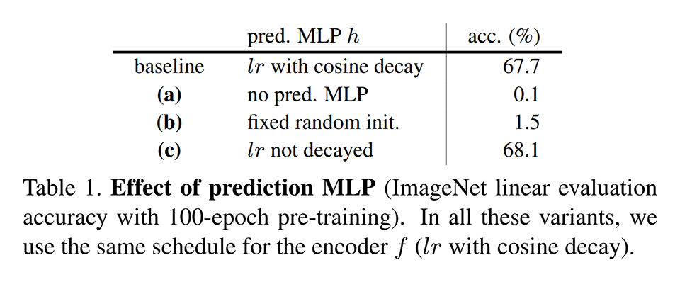
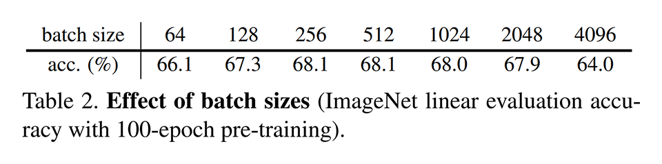
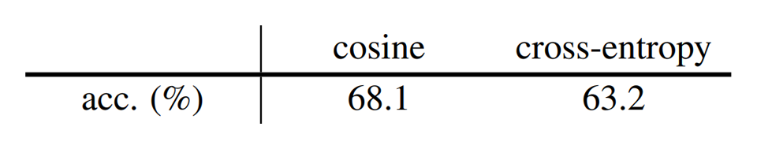
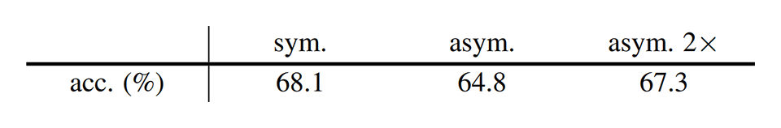
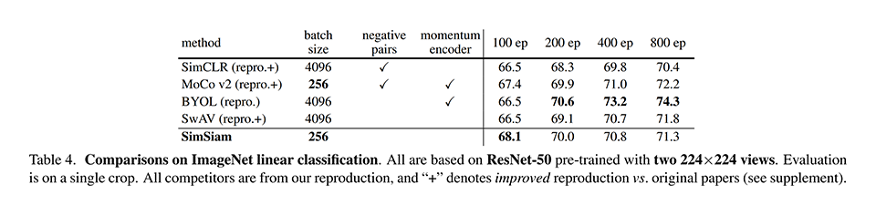
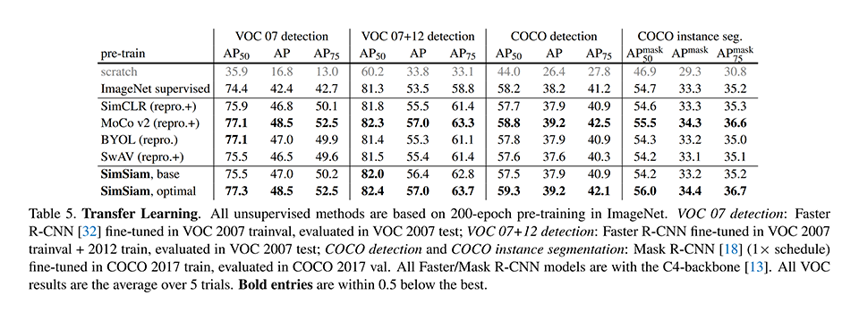

# [\[arxiv\]](https://arxiv.org/abs/2011.10566v1) Exploring Simple Siamese Representation Learning

- 著者
    - Xinlei Chen *1
    - Kaiming He *1
- 所属
    - 1: Facebook AI Research (FAIR)

## どんなもの？
### SimSiam
巨大なバッチを必要としないシンプルな自己教師あり対比学習（Contrastive Learning）手法である。

## 先行研究と比べてどこがすごい？
次の手法を使わないシンプルな Siamese Network で意味のある表現を学習できる（SOTA 手法と同等の精度を達成できる）ことを明らかにした。
- negative sample pairs
- large batches
- momentum encoders

## 技術や手法の肝は？
### SimSiam
prediction MLP と stop gradient を同時に導入することで、巨大なバッチを必要としないシンプルな自己教師あり対比学習が実現できた。

- stop gradient: 勾配計算時にはカッコ内の計算式を考慮しない関数 stopgrad
- prediction MLP: 特徴量 z1 と z2 を直接比較することを避けるため、一方に適用する非線形変換 h

## どうやって有効だと検証した？

### stop gradient の影響の確認
stop gradient を使わないと全く学習できない。

### prediction MLP の影響の確認
prediction MLP を使わないと全く学習できない。

### batch size の影響の確認
幅広いバッチサイズで学習できる。ただし、大きなバッチサイズでは精度が低下する。大きなバッチサイズをケアする手法（LARS など）を使っていないからだと考えることができる。

### batch normalization の影響の確認
batch normalization を使わないと大幅に精度が低下する。
prediction MLP の中間層には batch normalization を入れなくてもよいが、入れた方が少し良い。
prediction MLP の出力層に batch normalization 入れると学習が安定しない。

- batch normalization が本質的に重要と言える状況ではないと書いてあった。
- （私見）BYOL では negative sample pairs を使わなくても学習できていた。batch normalization のおかげだという分析結果があるので、それと同じことかもしれない。

### 損失関数の影響の確認（類似度の比較）
cross entropy より cosine 類似度の方がよい。

### 損失関数の影響の確認（対称性の有無の比較）
損失関数は対称性がある方がよい。

- （私見）情報をたくさん引き出した方が得だということだろう。

### 既存手法との比較 / 線形識別
線形識別の文脈では BYOL には及ばないが、他の既存手法には勝っている。

### 既存手法との比較 / 転移学習
転移学習の文脈では既存手法のもっともよい手法と同等程度の精度が出せる。

## 議論はある？
- とくになし

### 私見
- EM アルゴリズムみたいなことを stop gradient を使って上手く実現している点が面白い。
- Contrastive Learning を用いた自己教師あり学習については、だいたいこれで決まりかなという感じなので積極的に使っていきたい。

## 次に読むべきタイトルは？

### SwAV
[\[arxiv\]](https://arxiv.org/abs/2006.09882) M. Caron, I. Misra, J. Mairal, P. Goyal, P. Bojanowski, A. Joulin, "Unsupervised learning of visual features by contrasting cluster assignments", arxiv, 2020.
