# PCT: Point Cloud Transformer
[https://arxiv.org/abs/2012.09688](https://arxiv.org/abs/2012.09688)

(まとめ @n-kats)

著者
* Meng-Hao Guo
* Jun-Xiong Cai
* Zheng-Ning Liu
* Tai-Jiang Mu
* Ralph R. Martin
* Shi-Min Hu

主に清華大学のメンバー

# どんなもの？
画像認識にトランスフォーマーを使うパターンが流行っているが、その流れを汲んで、点群にトランスフォーマーを使うパターン。
提案手法の **PCT** は、点群の分類 / part segmentaion / normal estimation（法ベクトル認識）でSOTAを達成。

とはいえ、DETRみたいなトランスフォーマーの使い方（オブジェクトクエリを使う等）ではなく、画像分類の **ViT** の影響を受けている。

トランスフォーマーを使ったと言っても大したことはしていない。むしろ、ついでに提案している **offset-attention** に新規性がある。

# 先行研究と比べてどこがすごい？
特定の設定でトランスフォーマーを点群に用いる例は存在した（[https://arxiv.org/abs/1905.03304](https://arxiv.org/abs/1905.03304)）。この論文はその一般的になる。

また、点群特有の事情を考慮してカスタマイズを加えている。

# 技術や手法の肝は？
## トランスフォーマー
self-attentionを使って他の位置と情報のやりとりをして認識する手法。
Query, Key, Valueの3つの層を作って、Queryに相関が強いKeyに対応するValueを集める形。

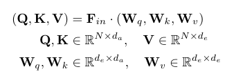

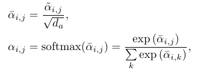

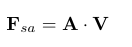

## メタアーキテクチャ
PCTのフレームワークは以下の形。

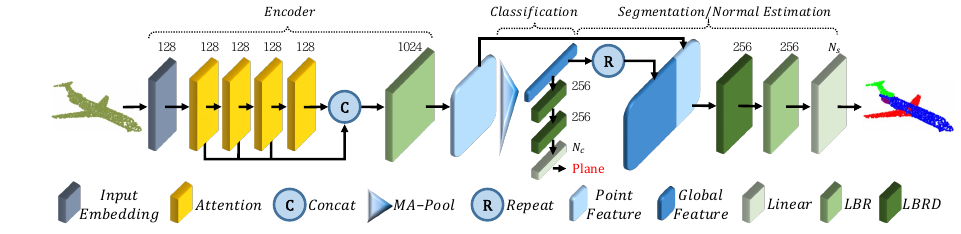

* 入力: 点群（shape: [N, 3]）
* input embedding: 入力（単なる座標）を各点の特徴に変換する
* encoder: input embedding し、更に、attentionを使って各点の高度な特徴量を計算する
* 認識: 全体の認識（分類）と各点の認識（セグメンテーション）を行う

図中のLBRはlinear+bn+relu、LBRDはlinear+bn+relu+drop_out、Rはglobal poolingしたものを各点の特徴ベクトルに結合する処理。

Attentionやinput embeddingの部分で選択肢がある。

## input embedding
point embedding と neighbor embeddingの2種類を考えている

### point embedding
各点でLBRを2回（チャンネル数はどちらも128）実施するだけ。

自然言語や画像の場合、positional encodingが使われるが、この手法では点群の位置をそのまま使う。

### neighbor embedding
単純な方法だと、1点だけで完結する部分と全体との相関を見る部分との両極端な分かれ方になっている。
点群の場合、近くの点の情報が重要なので、input embeddingの段階で近くの点の情報を使うようにする。
（アイデアはpointnetからpointnet++に進化したあたりの話に近い）

k-NNを使って、SG（sampling and grouping）を行う。
1. fathest point samplingで点を目的の数だけサンプリングする（すでに選ばれたものから遠いものを順に選んでいくアルゴリズム）。
2. 選ばれた点pの周辺k個の点qの特徴量を集めてくる
3. F(q) を F~(q) = F(q) - F(p), F(p) のように分解する。
4. LBRをそれぞれの周辺点で行い、最後に周辺点の中でpoolingする。

式にすると、

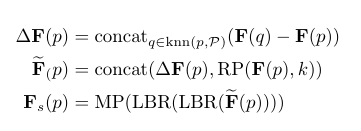

neighbor embedding はLBR2回SG2回で構成される。

認識する内容が分類だけなら、SGで点の数を減らせる(論文では512点と256点にそれぞれで減らしている)が、セグメンテーション等の各点での認識をする場合はそれをしない（サンプリングで点を減らさない）

## offset-attention

Attentionの層はresblock風に足し合わせるのが普通がだ、少し工夫する。

普通

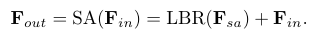

offset attention

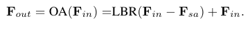

点群を扱う場合、ラプラシアン行列（次数を対角線に並べた行列 - 隣接行列）を使うことがある。これを近似する形。

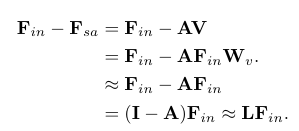

attention部分の重み（A）の計算も少し加工する。

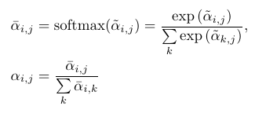

# どうやって有効だと検証した？
データセット:
* ModelNet40
* ShapeNet

モデル:
* NPCT（offset-attention無し、neighbor embedding無し）
* SPCT（offset-attentionあり、neighbor embedding無し）
* PCT（offset-attentionあり、neighbor embeddingあり）

## ModelNet40

40種の物体を扱うCADデータ。データ量は、12,311。
分類と法ベクトル推定のタスク。

### 分類精度

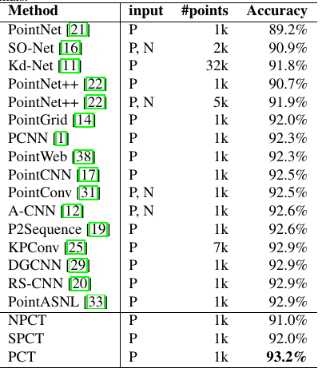

P,Nは点と法ベクトルを入力にする設定

### 法ベクトル推定精度

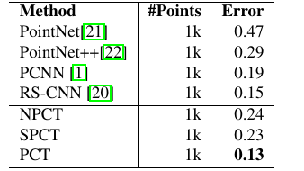

neighbor embeddingの効果が大きく出ている。

## ShapeNet
16,880個のデータ量のデータセット。
セグメンテーションのタスク。

### 精度
pIoU（part average IoU）とそれぞれのクラスの精度

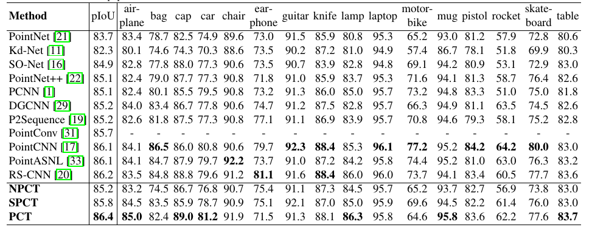

PCTも優れているが、PointCNN、PointASNL、RS-CNNあたりも良い。

結果をみてもPointNetが微妙なのはあるが、細かい部分でちょっとずつ良くなっている。

### スピード

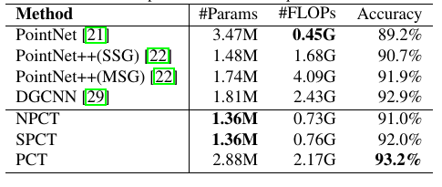

DGCNNが1080tiで20FPS程度（他の論文）らしいので、FLOPsを信じるとPCTもその程度。

# 議論はある？
Transoformerはでかいデータセットで活躍していることが多いが、今回扱ったデータは小さく、それでどうなるかはfuture work。他の応用（生成や補間など）も試したいとのこと。

## 私見
DETRやViTの前知識があって読んだから、そういう感じのものかと思ったけど、見た目はかなり違う。

まだタスクからして検出のようなやや複雑な問題では無いので、DETRのような形でないのは頷ける。
ViTに似ていて、ViTが16x16のパッチを切り出す処理をしているから、それを点群でやっていることを期待していたが、neighbor embeddingがそれに相当する（登場が後の方ですぐにそれだと分からなかった・・・）。

# 次に読むべき論文は？
* [Spectral Networks and Locally Connected Networks on Graphs](https://arxiv.org/abs/1312.6203)  
  ラプラシアンがどうのこうのって部分がそこまで理解できなかったので確認したい
