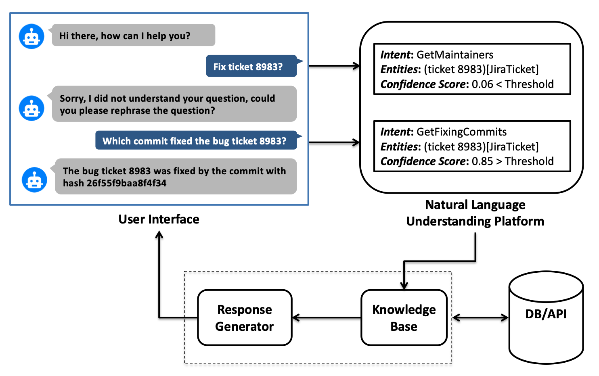
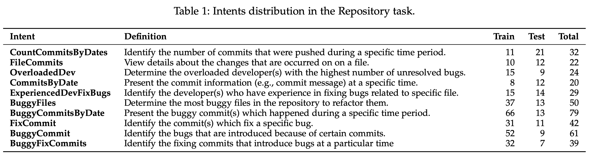
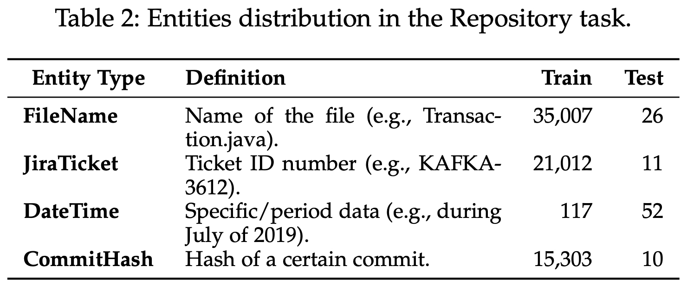
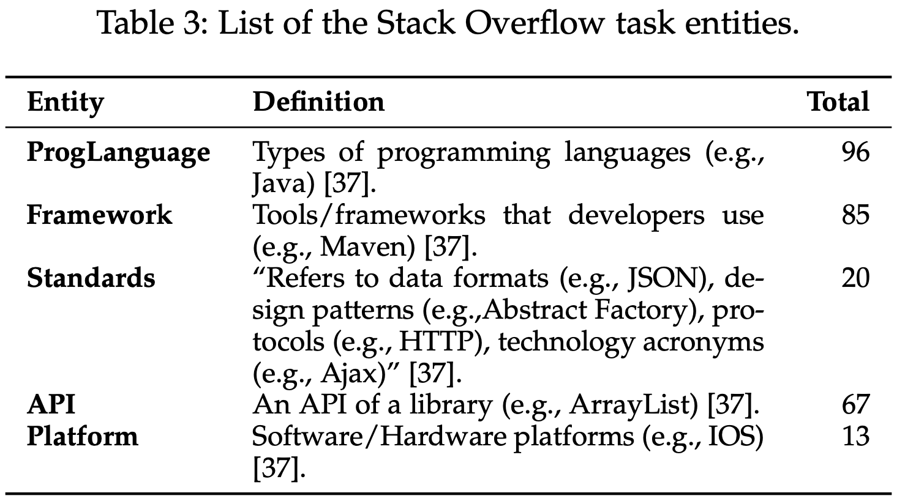
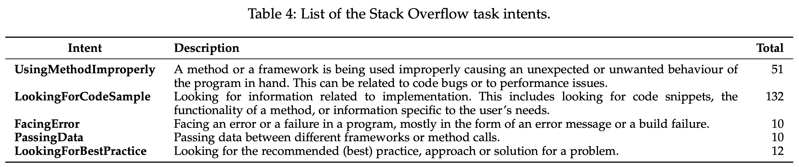
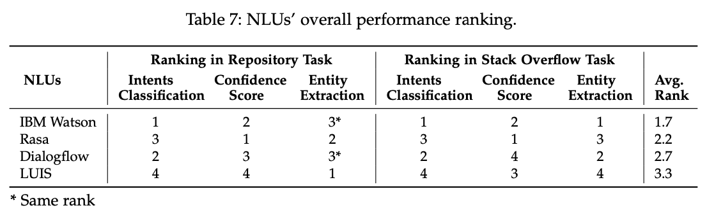

[\[arxiv\]](https://arxiv.org/abs/2012.02640) A Comparison of Natural Language Understanding Platforms for Chatbots in Software Engineering.
===

2020/12/04
+ 著者
	+ Ahmad Abdellatif
	+ Khaled Badran
	+ Diego Elias Costa
	+ Emad Shihab Senior Member, IEEE
+ 所属
	+ Concordia University, Montreal, Canada.

（まとめ：井上嵩浩 as @takinou0）

---

## どんなもの？

+ abstract
	+ SaaSとして提供されているチャットボット用の言語推定エンジンは複数あるが、質疑応答させる分野によって得意・不得意がある。
	+ 分野毎に検証結果があるが、Software Engineeringの領域では検証がされていないため、検証してみた。
	+ 比較対象は、IBM Watson, Google Dialogflow, Microsoft Luis, オープンソースRasa の4種類。
	+ 製品の精度は与えるFAQデータ次第だが、いくつかの検証方法をを試してみたら、トータルではIBM Watsonが最も良かった。

---

## どうやって有効だと検証した？

+ Intents(質問の意図を正しく分類できているか）、Entity(目的語が正しく取れているか)、Confidence Score(確信度の閾値を変更した際、F値がずっと高いままでいられるか)で比較を行なった。
+ データとしては2種類のSE系の質問を用意して、検証を行った。
	+ 実際のシステム開発プロジェクトで使われている質問などのレポジトリ
		+ 例
		+ "List me the changes done in ClassA.java"
		+ "Who has the most bug assignments?"
		
		
		
	+ stack overflow (https://stackoverflow.com) に登録されているQ&Aデータ
		+ 例
		+ "How to create an JS object from scratch using a HTML button?"
		
		

##結果

---

## 技術や手法の肝は？

+ 精度を比較してみました、だけなので、あまり肝というものはなかった。

---

## 議論はある？

- 特になし

---

## 先行研究と比べて何がすごい？

+ 論文曰く、2点ある。
	+ リスト提示や予測など、複数の観点でNLUを比較したところが珍しい。
	+ SE領域に関連したFAQのデータを使っていることが珍しい、とのこと。
---

## 私見
+ 比較してみただけの論文なので、実に読みやすかった。
- とはいえ、業務上、チャットボットの製品比較をすることが多いので、調査が既になされているのはありがたかった。

---

## 次に読むべき論文は？

+ Reference の他の論文で読んだ方が良さげなものをピックアップ
+ [Web で公開されている論文ならリンクにする](https://arxiv.org/pdf/1710.05941.pdf)
    + サブリストでそれがどんな論文か一言あるとBetter
