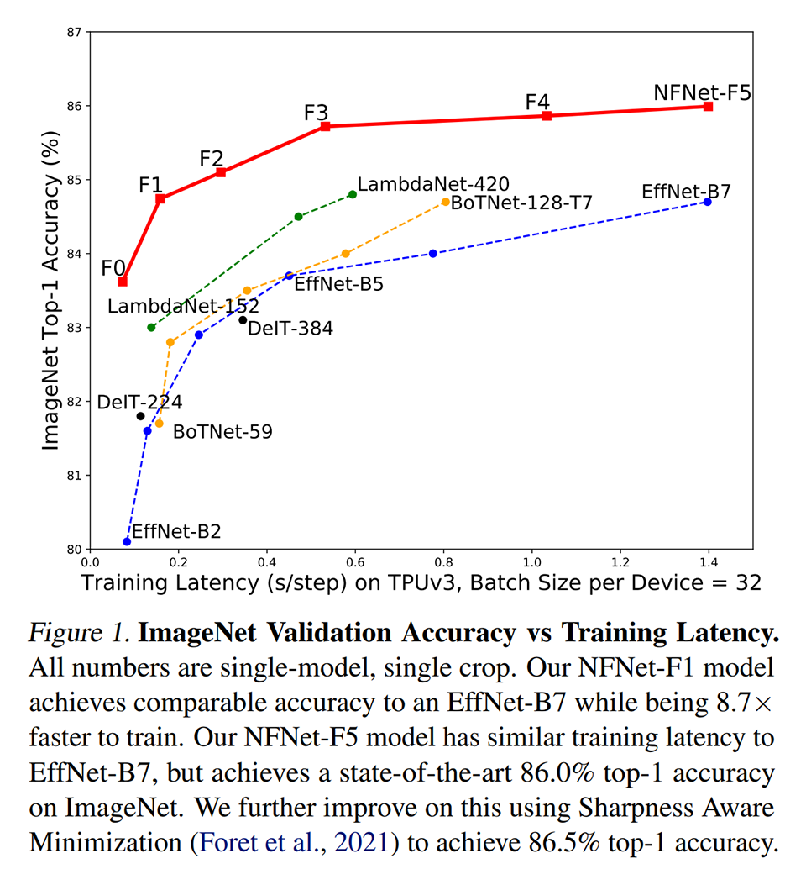
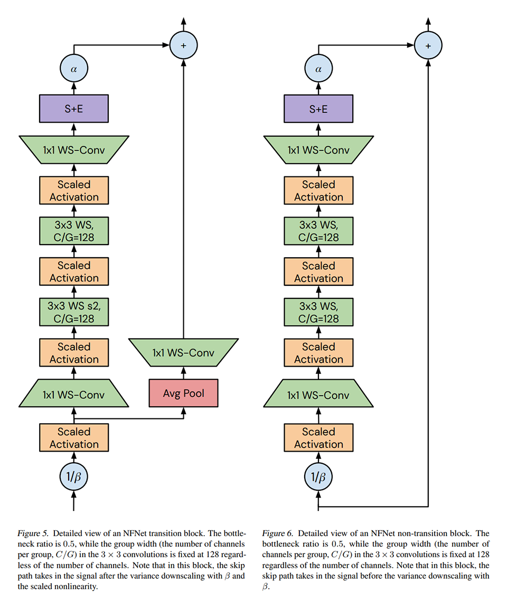
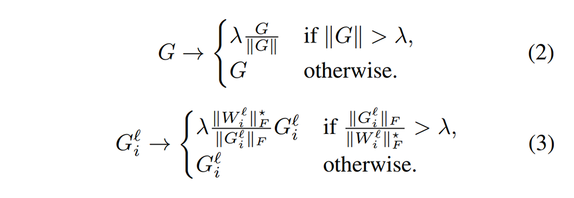
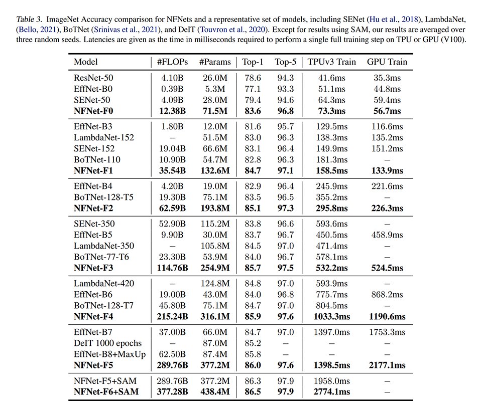
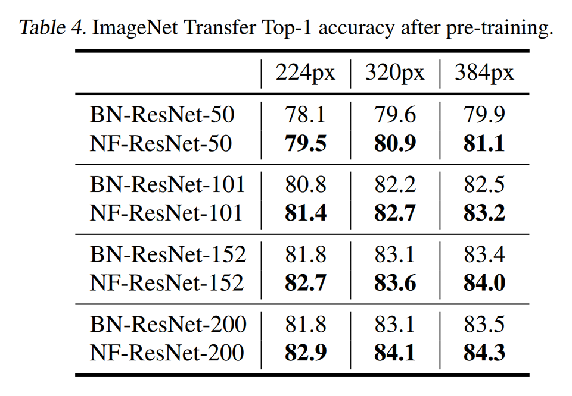

# [\[arxiv\]](https://arxiv.org/abs/2102.06171v1) High-Performance Large-Scale Image Recognition Without Normalization

- 著者
    - Andrew Brock *1
    - Soham De *1
    - Samuel L. Smith *1
    - Karen Simonyan *1
- 所属
    - 1: DeepMind

## どんなもの？
### NFNet (Normalizer-Free ResNet)
複雑なタスクにおいても Batch Normalization（やその他の Normalization）を使わずに SOTA に匹敵する性能を達成した ResNet である。

### Batch Normalization の欠点
Batch Normalization は多くの DNN で当たり前のように使われていて大きな成果を挙げているが、次の欠点がある。なので取り除きたい。

- (1) 計算量・メモリ使用量が大きい。
- (2) 訓練時と推論時の挙動に違いが生まれる。
- (3) ミニバッチ内の事例間の独立性を壊す。
- (4) 分散訓練の際に微妙なエラーを発生させる原因となり易い。
- (5) 系列データ（時間方向・空間方向に並んだ事例）をバッチ内に詰め込んで訓練する場合、他の事例の情報がリークする。対比学習においても同様のリーク対策が必要になる。
- (6) バッチサイズに対してモデルの性能が敏感になる。

## 先行研究と比べてどこがすごい？
Batch Normalization（やその他の Normalization）を使わずに深い ResNet を学習できるようにする研究はいくつもあったが、いずれも複雑なタスクでは SOTA に及ばなかった。NFNet は複雑なタスクであっても SOTA に匹敵する性能を達成した。

## 技術や手法の肝は？
### NFNet
NFNet は先行研究から次のテクニックを引継ぎ、更に AGC (Adaptive Gradient Clipping) を追加した。

- "Characterizing signal propagation to close the performance gap in unnormalized ResNets", Brock et al, 2021 由来のテクニック
    - (A) 活性化関数の変更とリスケール：活性化関数を ReLU から GeLU に変更し、出力の分散を１に保つためにリスケールする。
    - (B) 分岐直後のリスケール：分岐直後に 1/β を掛けることで分岐パスの入力の分散を１にする。
    - (C) Scaled Weight Standardization：畳み込みのパラメータ（アフィンとバイアス）を正規化することで、畳み込みの結果の分散を制御する。
- "Batch normalization biases residual blocks towards the identity function in deep networks", De & Smith, 2020 由来のテクニック
    - (D) 合流直前のスケール：合流直前に α をかける。αを 0 に初期化しておくことで、初期状態を分岐なし（パススルー）のネットワークに見せかけることができる。

### AGC (Adaptive Gradient Clipping)
通常の勾配クリッピングは勾配のノルムが一定以下になるように定数で制限している（式２）が、提案手法は勾配とパラメータの比が一定以下になるように制限している（式３）。勾配やパラメータの全要素でノルムを計算するのではなく、出力のユニットごとにノルムを計算している（出力の分散を直接的に制御できる）。

## どうやって有効だと検証した？

# 様々なスケール（パラメータ数・計算量）のモデルの比較

# 同じ構造のモデルでの比較

## 議論はある？
- とくになし

### 私見
- Normalizer-Free ResNet を長らく追っかけてきたが、ようやく完成したように見える。リカレントでも機能するのかが気になる。
- 分散をかなり精密に扱う必要があるので、ライブラリが充実しないと誰でも使えるようにはならないかもしれない。

## 次に読むべきタイトルは？

### NFNet に使われているテクニック

[\[arxiv\]](https://arxiv.org/abs/2101.08692) A. Brock, S. De, S. L. Smith, "Characterizing signal propagation to close the performance gap in unnormalized ResNets", ICLR, 2021.

[\[arxiv\]](https://arxiv.org/abs/2002.10444) S. De, S. L. Smith, "Batch Normalization Biases Residual Blocks Towards the Identity Function in Deep Networks", arxiv, 2021.
