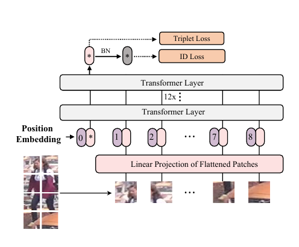
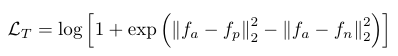
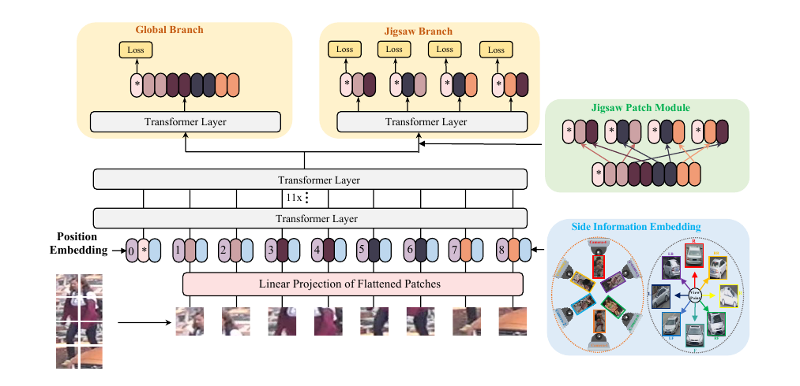
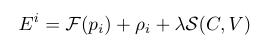
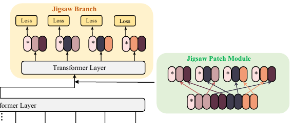
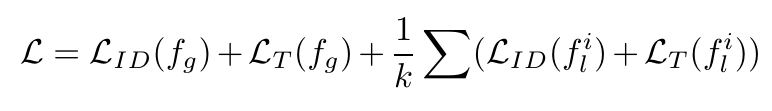
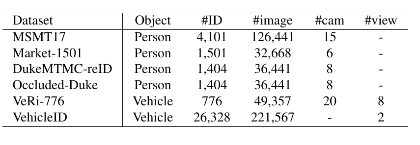
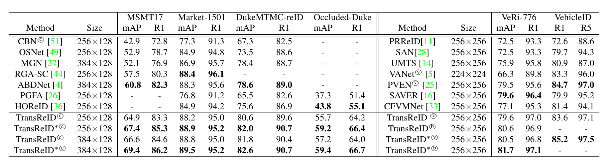
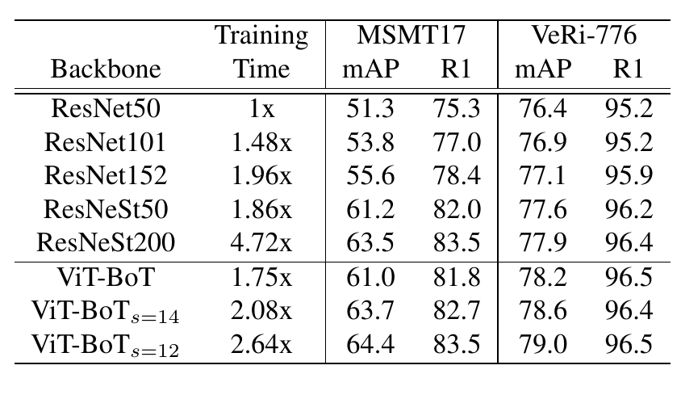
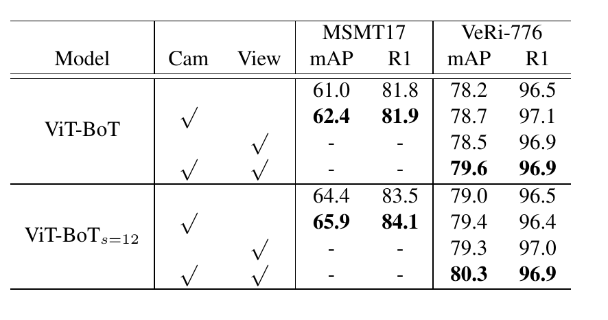

# TransReID: Transformer-based Object Re-Identification
[https://arxiv.org/abs/2102.04378](https://arxiv.org/abs/2102.04378)

(まとめ @n-kats)

著者
* Shuting He
* Hao Luo
* Pichao Wang
* Fan Wang
* Hao Li
* Wei Jiang

アリババ、浙江大学のメンバー

# どんなもの？
最近流行りのトランスフォーマーで画像処理した系論文。
この論文ではRe-Identification(ReID)というタスクを純粋なトランスフォーマーベースのモデルで取り組み、SOTAを達成している。

ReIDとは、複数カメラで撮影された物体を正しく同じと判定するタスク。

ViTのアイデアをベースにViT-BoTという手法を提案。更に機能を足し、TransReIDという手法も提案。

# 先行研究と比べてどこがすごい？
先行研究（BoT）と比べ単純に性能改善ができた。

# 技術や手法の肝は？
## ViT-BoT/メタアーキテクチャ

ViTと同じような仕組み。

1. 画像をPxPのサイズのパッチに分ける（パッチを大きめにとって重なるようにしても良い）
2. それぞれを単にベクトルと思って、全結合層を適用する
3. positional encodingと結合する（図の0の横の米印の部分はクラストークン）
4. Transformerに掛ける（12回）
5. 出力を特徴ベクトルとして学習（Triplet LossとID Loss）
6. 出力にBNNeck（BNしてからID Loss）を利用

## ViT-BoT/特徴ベクトルの学習
Transformerにかけ、得られる特徴ベクトル（図の左上の米印）がいい感じになるように訓練する。
Triplet lossとID lossを使って訓練する。

Triplet lossは次の *soft-margin* バージョンの形を使う。

（aとpは同じもの、nは別のもの、fはそれぞれの特徴ベクトル）

ID Lossの部分はBoTの論文で提案されているBNNeckを使う。BNしてFCしてN次元のベクトル（N=ものの数）にして、単にN個のマルチラベル問題と思ってcross entropyで損失関数を作る。

## ViT-BoT/pretrain
学習を速めるため、ViTの訓練済みパラメータを用いることができる。
ただし、positional encodingは、画像解像度の違いという問題がある。
バイリニアに補間をしてパラメータを用いる。

## TransReID/メタアーキテクチャ

ViT-BoTでも性能改善できたが、ReIDが扱うデータの特性を活用したい。
そこで、ViT-BoTに更にSIE（Side information embedding）とJPM（Jigsaw Patch Module）が追加された。

## TransReID/SIE
画像は、カメラの種類・設定で色合いが違ったり、そもそも別の角度からだと違う見え方をしたりする。
そういうったカメラの特性等を特徴ベクトルとしてネットワークに注入したい。

式にすると

トランスフォーマー部分に入れる直前でpositional encodingと一緒に足し合わせる。
S(C, V)がカメラ特性についてのベクトル。ここで単純にカメラ成分S(C)と視点成分S(V)に分解してS(C)+S(V)にしても良さそうに見えるが、打ち消し合う可能性があってこのようにはせず、カメラと視点のペアで1つのベクトルを用意する方法を採用。

## TransReID/JPM
単純に全体でひとつのベクトルを出力するのではなく、局所的な特徴ベクトルも出力するようにした。

局所的な特徴ベクトルは、前の層の特徴ベクトル達をk個のグループに分けて、トランスフォーマーに入れて作る。このとき、全体の特徴ベクトルに相当するものもトランスフォーマーに入れる。

（補足）この論文のトランスフォーマーの入力と出力は、[全体に関する特徴ベクトル, 1つ目のパッチの特徴ベクトル, ..., 最後のパッチの特徴ベクトル]のようになっている。

何も考えず順番に取ってしまうと、対応する画像部分が変な形（例えば画像の一番上側のパッチだけを集める）になるので、シャッフルしてからグループに分ける。

そうやって作成したグローバル・ローカル両方の特徴ベクトル達をID lossとTriplet lossで訓練する。

# どうやって有効だと検証した？
## データセット
人や車を対象にReIDの研究が行われていて、いくつかのデータがある。

## 実装について
基本的に、人は256x128、車は256x256にリサイズして処理する。ランダムフロップ・padding(10px)・ランダムクロップ・ランダムいレーシングを行う。JPMのグループの数は4とする。

## 評価方法
Cumulative Matching Characteristic（CMC,累積照合特性）とmAPを用いる。
CMCは何位以内に照合されるかを評価（R1とかR5とか）。

## 評価結果

表中のCはカメラ、Vはviewpoint、bは両方を利したことを意味する。

殆どのデータで先行研究の性能を更新している。

## ViT-BoTの性能

先行研究のBoTと比較した図。訓練時間も半分になり、精度も良くなっている。

## ViT-BoT vs TransReID

TransReIDからSIE,JPMをオンオフして評価した結果。両方共性能改善に効果が出ている。

## SIEの効果

SIEの効果を調べた図。カメラ・viewpointの片方だけでもちょっと改善する。合わせると、片方だけの改善効果より大きく改善している。（R1の方はあんまり変わらない）

## JPMの効果

グループの数を変えたり、シャッフルしなかったりしている。4つぐらいのグループにすると良さそうとかが分かる。（グループの数が1の場合に改善しているのは、これは単にネットワークが浅いということでは？？）

# 議論はある？
ReIDにトランスフォーマーベースの手法を導入（ViT-BoT）し、さらにSIEとJPMの工夫を追加し、各種データセットでSOTAを更新した。
ViTの段階ではトランスフォーマーベースの画像分類が登場しただけだったが、ReIDで性能改善できたように、大きなポテンシャルがある。より効果的なトランスフォーマーベースの画像処理方法が重要。

## 私見
単純にViT風の変更だけをしただけでなく、問題特有の工夫があって面白い手法。ReIDだけでなく、同様の工夫が他の問題でも使えそうで、今後もトランスフォーマーベースの手法の発展が楽しみ。

# 次に読むべき論文は？
* [ViT](https://arxiv.org/abs/2010.11929)  
  ViTを改めて読むと面白いかも
* [BoT](https://arxiv.org/abs/1903.07071)  
  問題独自の話（損失とか）はBoTをベースにしている
