# [\[arxiv\]](https://arxiv.org/abs/2104.02057v2) An Empirical Study of Training Self-Supervised Vision Transformers

- 著者
    - Xinlei Chen *1
    - Saining Xie *1
    - Kaiming He *1
- 所属
    - 1: Facebook AI Research (FAIR)

## どんなもの？
### MoCo v3 (Momentum Encoder v3)
MoCo v1/v2 を改善したもの（バックボーンを CNN から Vision Transformer with Batch Normalization へ切り替えたもの）である。何気に Batch as Queue を取り除かれている。

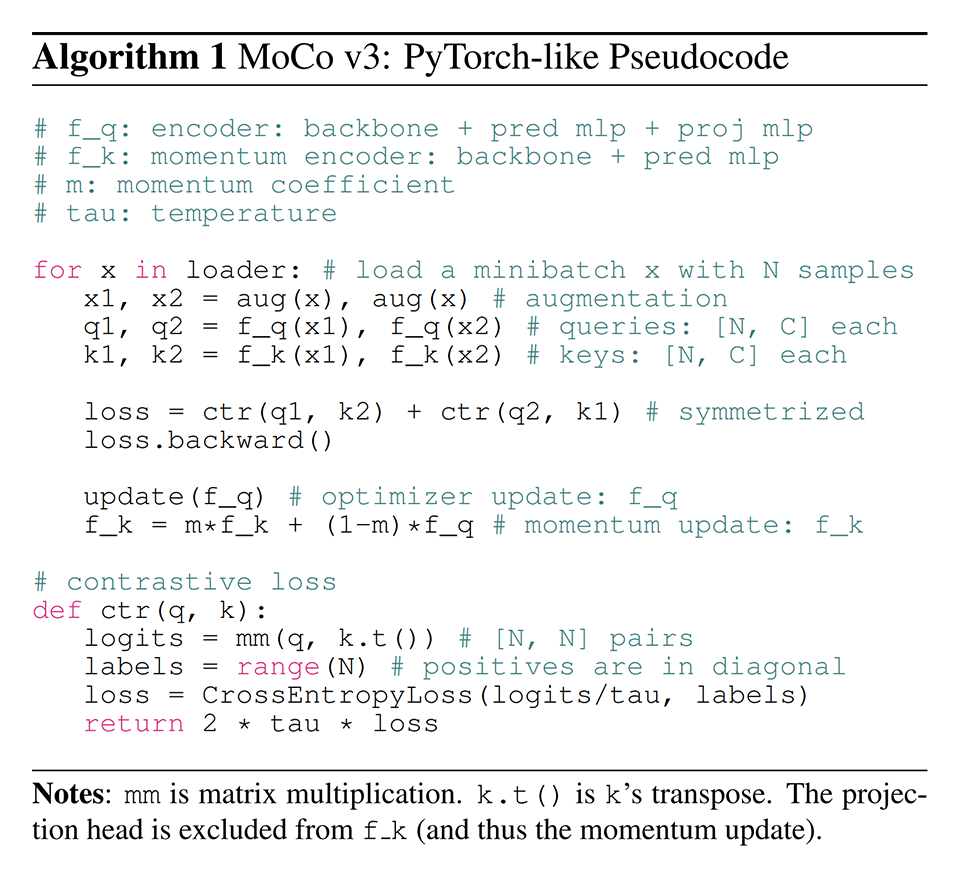
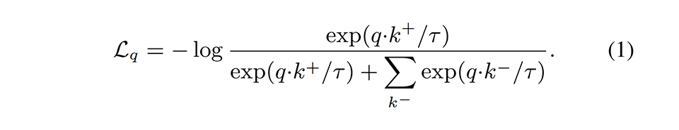

## 先行研究と比べてどこがすごい？
Vision Transformer で実装された Self-supervised Contrastive Learning を訓練すると次のように不安定になり（スパイクが発生し）、良い性能が出せなかった。これを改善したところ SOTA を更新する性能になった。

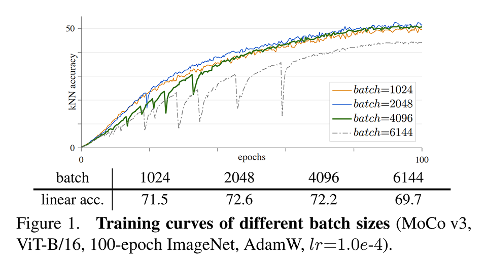

## 技術や手法の肝は？
各層の勾配のマグニチュードを観察することで、Vision Transformer で実装された Self-supervised Contrastive Learning の訓練中に発生するスパイクは最初の層（patch projection）で発生していることを突き止めた。

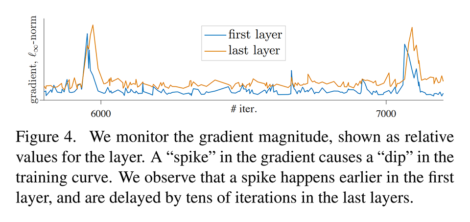

そこで patch projection を学習可能ではなくした（ランダム射影に切り替えた）ところ、学習が安定化した。学習率を小さくすることでも学習を安定化することもできるが、性能が悪化するため良くなかった。

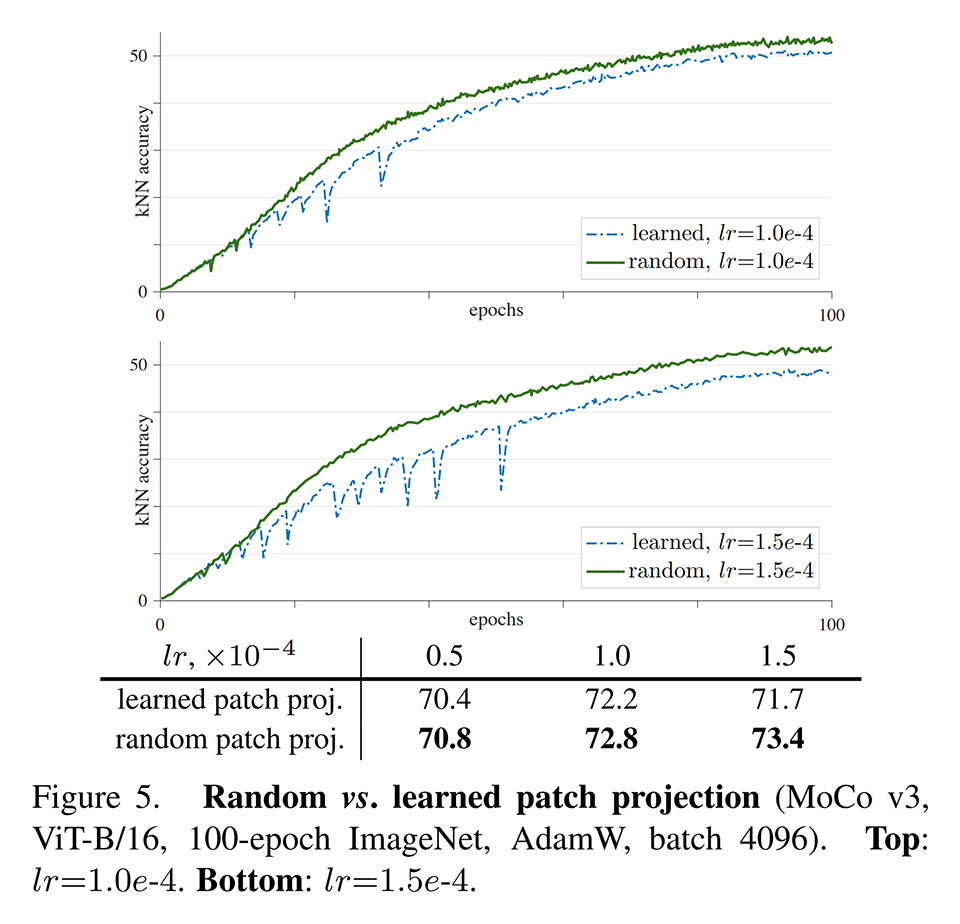

同様の現象は SimCLR や BYOL でも観察された。

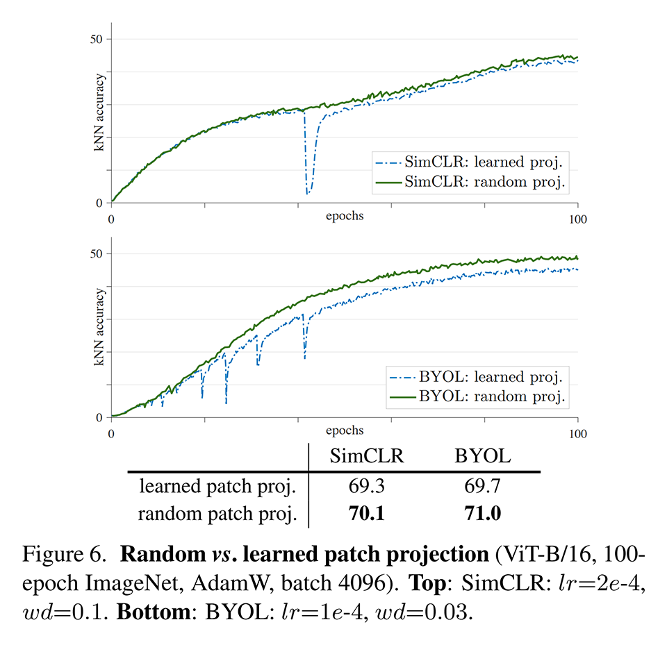

## どうやって有効だと検証した？
ImageNet で MoCo v3・SimCLR・BYOL・SwAV を訓練し、評価した。

### MoCo v3 のパラメータ数
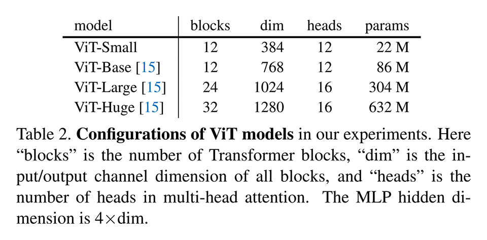

### MoCo v3 の訓練時間
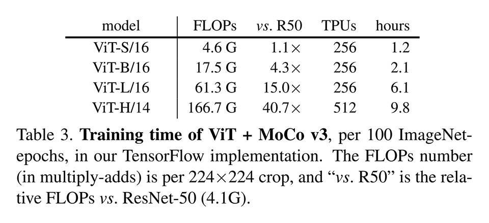

### MoCo v3 の線形識別性能（既存手法との比較）
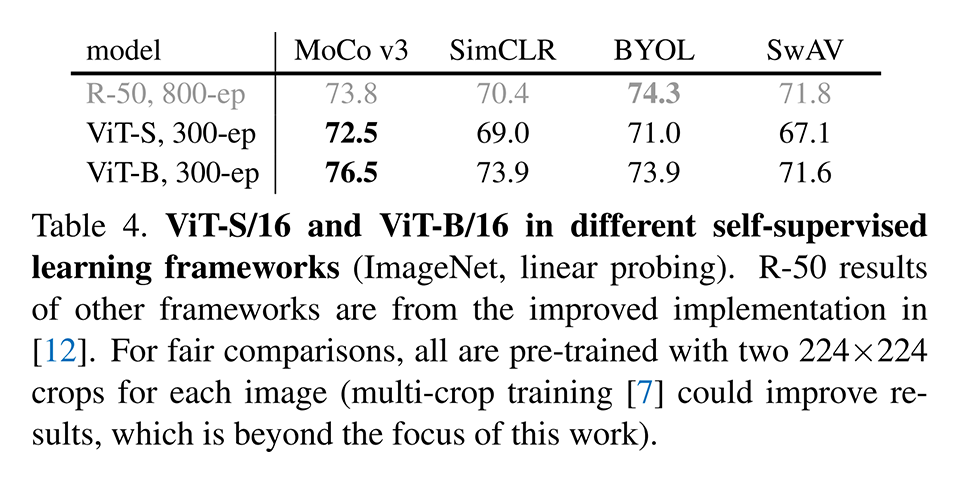
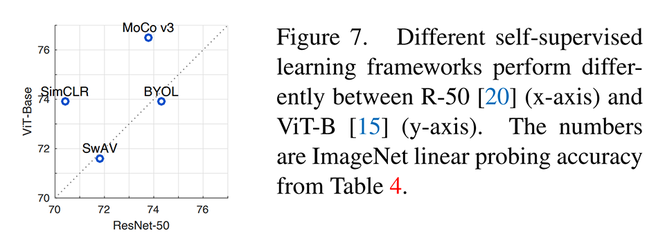

### MoCo v3 の線形識別性能とパラメータ数のトレードオフ（既存手法との比較）
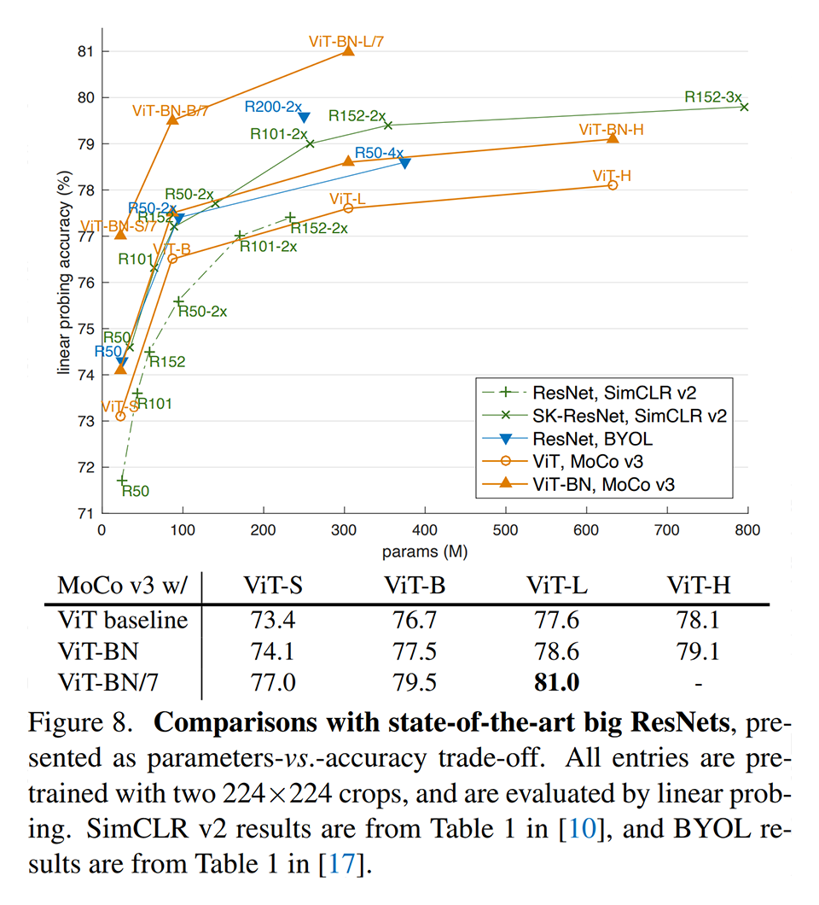

### MoCo v3 の転移学習性能（既存手法との比較）
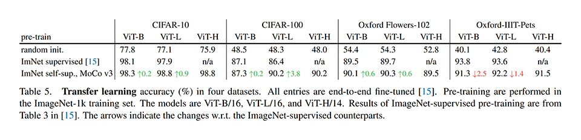

## 議論はある？
- より大きな自己教師あり Vision Transformer モデルはよりよい性能につながるが、図８では性能が飽和しているように見える。この傾向は自然言語の場合と異なる。データを増やせば改善できるが、根本の原因はインスタンス識別タスクが簡単すぎることにある（よりよい表現を獲得するのを妨げている）と考えられる。より難しいタスクに変えることで性能を改善できる可能性がある。
- Vision Transformer は CNN よりも帰納バイアスが少ないため、より強力なモデルを作れる可能性がある。
- Vision Transformer 唯一の帰納バイアスである「位置情報の埋め込み」を削除しても精度はあまり低下しないことから、Vision Transformer は CNN よりも位置情報に頼っていないことを示唆している。

## 次に読むべきタイトルは？

### Vision Transformer の論文
[\[arxiv\]](https://arxiv.org/abs/2010.11929v1) A. Dosovitskiy, L. Beyer, A. Kolesnikov, D. Weissenborn, X. Zhai, T. Unterthiner, M. Dehghani, M. Minderer, G. Heigold, S. Gelly, J. Uszkoreit, N. Houlsby, "An image is worth 16x16 words: Transformers for image recognition at scale", ICLR, 2021.
