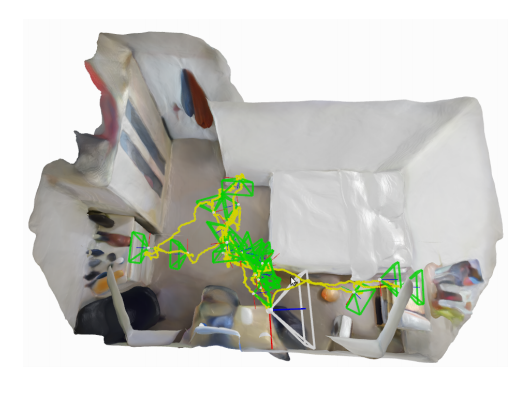
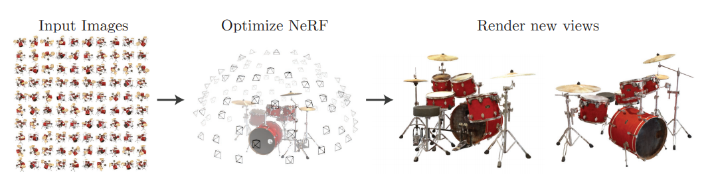
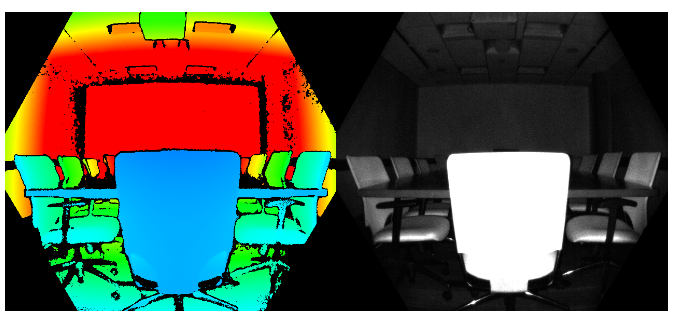
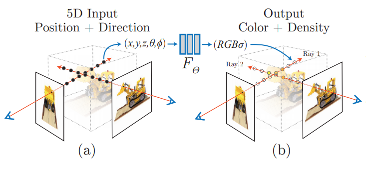
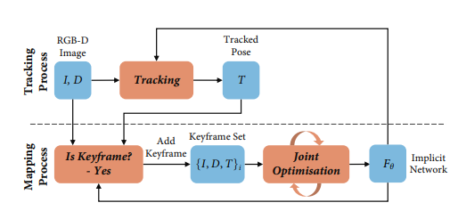

https://arxiv.org/abs/2103.12352
iMAP・・・リアルタイムで省メモリ高精度なSLAM手法
NeRF風のimplicit scence nueral network Fθで空間を表現
RGBD画像の入力 RGBD（kinectなどで取得）の動画
RGBDとFθからカメラ姿勢Tが逆算できる
RGBDTのうち良いものを選ぶ（集合{RGBDT_i}）
{RGBDT_i}からFθを更新（NeRFなどの元来の用法）
以下、ループ
# iMAP: Implicit Mapping and Positioning in Real-Time
[https://arxiv.org/abs/2103.12352](https://arxiv.org/abs/2103.12352)

(まとめ @n-kats)

著者
* Edgar Sucar
* Shikun Liu
* Joseph Ortiz
* Andrew J. Davison

Imperial College London

# どんなもの？
NeRF系のimplicit scene neural networkを用いた、リアルタイム・省メモリ・高精度なSLAM手法iMAPを提案
（事前学習不要）

これを使うと、RGBDカメラで動画を撮影しながら徐々に学習し、例えば次の図のように部屋をリアルタイムに再構成(denseに)することができる。

NeRF自体が面白い手法だったが、どう実応用させるのか謎だった。
iMAPのimplicit scene neural networkの使い方が面白く、これによってimplicit scene neural networkが一段階進化したといえる。

# 先行研究と比べてどこがすごい？

NeRFでは一つの被写体について色んな角度から撮影して立体構造を認識していた。（↓NeRFの図）

この手法は周辺（部屋とか）を認識している。

# 技術や手法の肝は？
## RGBDカメラ
この研究では、Azure Kinectを使っている。

（(https://www.microsoft.com/ja-jp/p/azure-kinect-dk/8pp5vxmd9nhq?activetab=pivot%3aoverviewtab)[https://www.microsoft.com/ja-jp/p/azure-kinect-dk/8pp5vxmd9nhq?activetab=pivot%3aoverviewtab]より。こちらからご購入できます）

（(https://docs.microsoft.com/ja-jp/azure/kinect-dk/depth-camera)[https://docs.microsoft.com/ja-jp/azure/kinect-dk/depth-camera]より）

## implicit scene representation（NeRF等）

位置に対して密度を返す関数と位置に対して色を返す関数があると、「この角度から見ると、この色に見える」という計算ができる。
NeRF等は、この2つの関数をニューラルネットで作って、その学習で空間の把握をする。

空間を微分可能な関数で表現しているのがポイント。

## メタアーキテクチャ

## 継続学習

# どうやって有効だと検証した？

# 議論はある？
# 次に読むべき論文は？
* [NeRF](https://arxiv.org/abs/2003.08934)
* [FastNeRF](https://arxiv.org/abs/2103.10380)  
  NeRFの高速化の話題が複数の論文で提案されている。その一つ（3000倍速いらしい）
* 最近のNeRF  
  * [岡之原さんのNeRF関係ツイート](https://twitter.com/search?q=NeRF%20(from%3Ahillbig)&src=typed_query)
  * [https://dellaert.github.io/NeRF/](https://dellaert.github.io/NeRF/) ・・・ NeRF関係手法のまとめ
