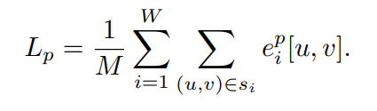
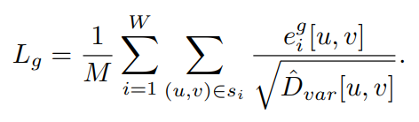
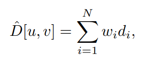
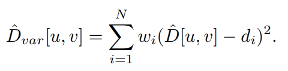
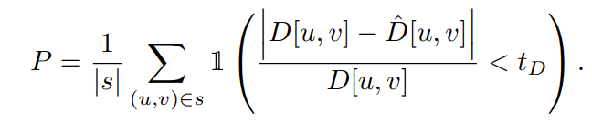
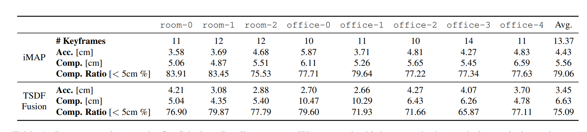
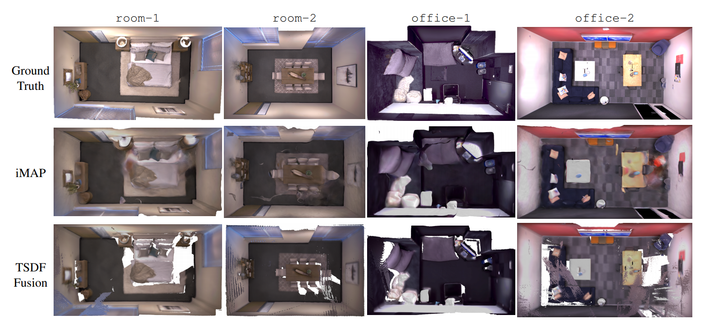
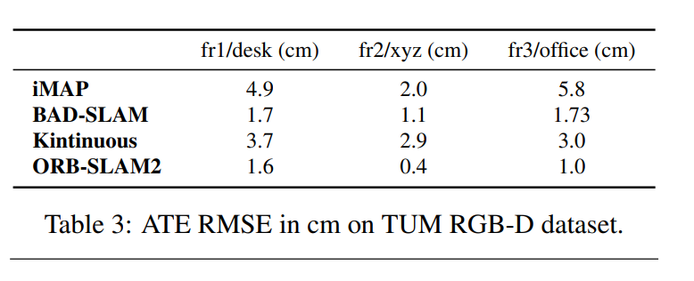

# iMAP: Implicit Mapping and Positioning in Real-Time
[https://arxiv.org/abs/2103.12352](https://arxiv.org/abs/2103.12352)

(まとめ @n-kats)

著者
* Edgar Sucar
* Shikun Liu
* Joseph Ortiz
* Andrew J. Davison

Imperial College London

# どんなもの？
NeRF系のimplicit scene neural networkを用いた、リアルタイム・省メモリ・高精度なSLAM手法iMAPを提案
（事前学習不要）

これを使うと、RGBDカメラで動画を撮影しながら徐々に学習し、例えば次の図のように部屋をリアルタイムに再構成(denseに)することができる。

# 先行研究と比べてどこがすごい？

NeRFでは一つの被写体について色んな角度から撮影して立体構造を認識していた。（↓NeRFの図）

この手法は周辺（部屋とか）を認識している。

NeRF自体が面白い手法だったが、どう実応用させるのか謎だった。
iMAPのimplicit scene neural networkの使い方が面白く、これによってimplicit scene neural networkが一段階進化したといえる。

# 技術や手法の肝は？
## RGBDカメラ
この研究では、Azure Kinectを使っている。

（[https://www.microsoft.com/ja-jp/p/azure-kinect-dk/8pp5vxmd9nhq](https://www.microsoft.com/ja-jp/p/azure-kinect-dk/8pp5vxmd9nhq)より。こちらからご購入できます）

（[https://docs.microsoft.com/ja-jp/azure/kinect-dk/depth-camera](https://docs.microsoft.com/ja-jp/azure/kinect-dk/depth-camera)より）

## implicit scene representation（NeRF等）
### 基本

位置に対して密度を返す関数と位置に対して色を返す関数があると、「この角度から見ると、この色に見える」という計算ができる。
NeRF等は、この2つの関数をニューラルネットで作って、その学習で空間の把握をする。

空間を微分可能な関数で表現しているのがポイント。

### 応用
もっと細かくいうと、scene neural network Fθ （θはネットワークのパラメータ）は、画像 I・距離 D・視点 Tを教師データとして与えて学習する（NeRFの場合はDが無いが、話を簡単にするため）。
その損失関数 L は θ, I, D, Tに対して微分可能。

*これを逆用し、θ,I,Dがある状態から、Lが小さくなるように最適化し、視点Tを算出することができる。（一番重要なポイント）*

## メタアーキテクチャ

流れは、
1. RGBD画像を入力 RGBD（I,D）
2. θ,I,Dから視点Tを算出
3. I,D,Tを記憶していくか判定する（keyframe判定）
4. 記憶したI,D,Tを使ってθを更新（この時Tも修正する）

以下ループ

## 最適化（joint optimization）
損失関数は、画像生成に関する損失Lpと距離に関する損失Lgからなる。

s_iは訓練対象のi番目の教師のピクセルの集合で、e^pは画素の値の差の絶対値、e^gは距離の差の絶対値。

Lgの分母はFθで距離を出すときに密度を使う関係で出てくる分散。

1. Fθで密度を出す
2. N点の密度を用意する
3. 密度を使って距離算出の重み（w_i）を出す
4. 重みをかけて距離を足す→距離の算出
5. N点の距離の値の分散を出す→Lgの分母

## キーフレーム選択
さすがに全フレームを使うのは無理。価値のあるものを残したい。

距離の誤差が大きいものを次の式を使って選ぶ。（0.1以上に設定）

撮影の中でキーフレームが増えていくが、損失を用いた重みで数枚サンプリングする。

# どうやって有効だと検証した？
## Replica dataset
* Accuracy（再構成した点をいくつか選び、それぞれから最短の教師の点への距離を出し、その平均） 誤検出の評価
* Completion（教師から点を選んで、再構成した点で最短のものまでの距離を出し、その平均）見逃しの評価
* Completion Ratio（教師の点からX cm以内に点を検出できた割合, X=5でやっている）

## TUM RGB-D dataset
3つのシーンで評価したが、既存手法を超えることはできなかった。（それでも良い数値）

# 議論はある？
この手法で、RGB-Dカメラから、歯抜けがなく、正確なvolumetricモデルが作れる。
現状は部屋程度の大きさの範囲。広い範囲にするには
* なんらかのparallelな方法でトラッキング・マッピングをつくる
* 高速な最適化のためのピクセルのサンプリング方法
* より賢いキーフレーム選択

が必要。

# 次に読むべき論文は？
* [NeRF](https://arxiv.org/abs/2003.08934)
* [FastNeRF](https://arxiv.org/abs/2103.10380)  
  NeRFの高速化の話題が複数の論文で提案されている。その一つ（3000倍速いらしい）
* 最近のNeRF  
  * [岡之原さんのNeRF関係ツイート](https://twitter.com/search?q=NeRF%20(from%3Ahillbig)&src=typed_query)
  * [https://dellaert.github.io/NeRF/](https://dellaert.github.io/NeRF/) ・・・ NeRF関係手法のまとめ
