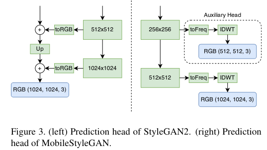
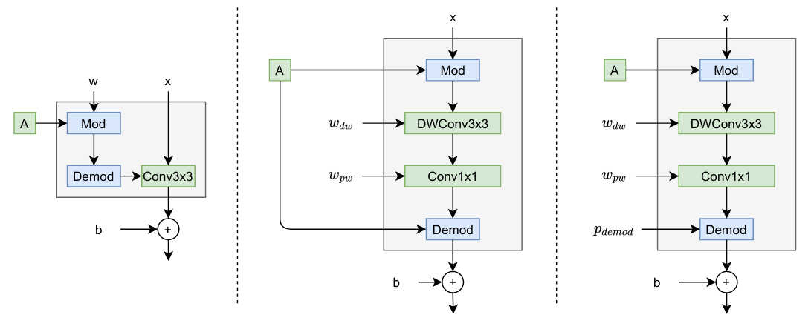
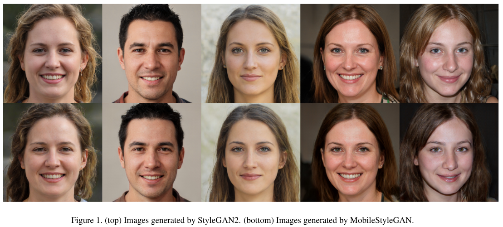
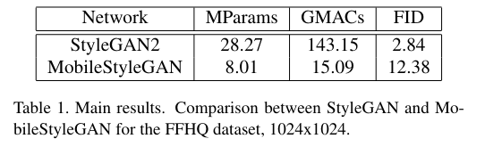
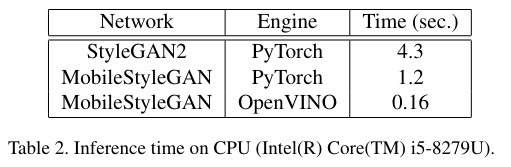

MobileStyleGAN: A Lightweight Convolutional Neural Network forHigh-Fidelity Image Synthesis
===
Sergei Belousov

https://arxiv.org/abs/2104.04767v1

@cohama

## どんなもの?

- StyleGAN2 を魔改造して軽量に推論できるようにした
  - パラメータ数 1/3、計算量 (MAC) 約 1/9

## 先行研究と比べて何がすごい？

- 特に推論時間を早くするための最適化を工夫している

## 技術や手法の肝は？

- Wavelet-based CNN
- Depthwise Separable Modulated Convolution
- Pipeline based on knowledge distillation

### Wavelet-based CNN

普通の RGB 画像を解像度ごとに生成するのではなく、Wavelet 変換後の周波数領域のまま畳み込み

以下のメリットがある。
- 低解像度から高解像度にする操作がロスレスでできる。
- Haar wavelets を基底に使うと逆変換が足し算だけで計算できる
- latent space が高周波領域でも滑らか？

#### Depthwise Separable Modulated Convolution

- 畳み込みを MobileNet のように Depthwise Separable Conv に置き換え

#### Knowledge distillation

- (あまり読めていない)
- TinyGAN など軽量なモデルを学習させるときの常套手段っぽい？

## どうやって有効だと検証した？

## 議論はある?

- Ablation Study みたいなのがないのでどの施策がどの程度高速化に寄与したかは謎
- Reddit に議論があり、歯並びの画質が悪いらしい

## 次に読むべき論文

- Lightweight GAN: 学習がすごく軽い GAN (https://openreview.net/forum?id=1Fqg133qRaI)
- TinyGAN: 似たような試み (https://arxiv.org/abs/2009.13829)
- Not-So-Big-GAN: Wavelet を使った GAN (https://arxiv.org/abs/2009.04433)
